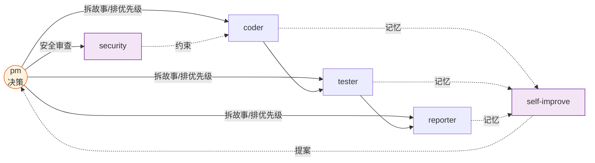
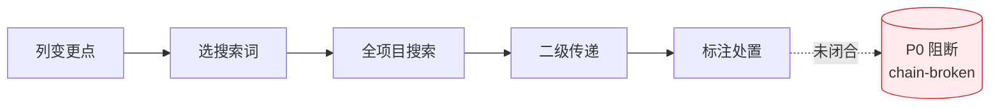

# Agents

> 每条决策必有人负责，每个结论必有证据，每个变更必收闭环。

哲学源头 [CLAUDE.md](../CLAUDE.md)：信模型、惜注意、验现实。本文件是角色总览与共用底线，专项契约见各 agent 文件。

## 角色拓扑

| Agent | 一句话 | 触发 |
|-------|------|--------|------|
| [pm](./pm.md) | 决定做/不做/延期，串起所有 Agent | rui 入口、自适应规划、反思钩子、init |
| [coder](./coder.md) | 逐模块实现，P0 清零方过模块 | rui 预检/实现/影响分析 |
| [tester](./tester.md) | 测试先行，Gate A 阻编码、Gate B 阻交付 | rui 测试先行/验证 |
| [reporter](./reporter.md) | 写发生过的事，三报告交叉闭合 | rui 验证/交付/策展 |
| [security](./security.md) | 威胁建模 → 写入 §3 → P0 卡发布 | pm 安全审查委派 |
| [self-improve](./self-improve.md) | 采数据 → 出诊断 → 写提案 | rui 自改进阶段 |

---

## 共用底线

### 证据等级（反幻觉，写入 docs/ 必遵守）

| Level | 含义 | 写法 |
|-------|------|------|
| **A** 已验证 | Read/Grep/Glob 可复核 | 直接陈述，附路径 |
| **B** 可推导 | 从 A 推出一步 | "由……可得" |
| **C** 未验证 | 用户口述、未抓取 | `> 待补充` |
| **D** 禁止 | 无 A/B 支撑且非 C 标注 | 视为幻觉，不得出现 |

### 影响分析（每变更追闭合）

闭合前禁止：生成设计结论、删/改公共接口、声称影响链已闭合。

### 生效标志（自定验）

每个 agent 在自身文件末尾定义"何时算交接成功"。中心不统一规定，但定义后必须可被下游验证。
