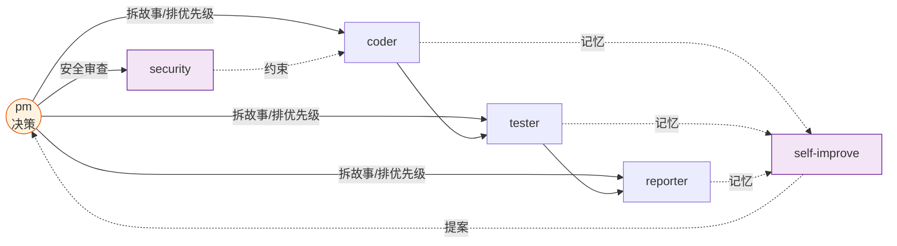

# Agents

> **口诀：指人、给据、收口。** 每条决策必有人负责，每个结论必有证据，每个变更必收闭环。

哲学源头 [CLAUDE.md](../../CLAUDE.md)：信模型、惜注意、验现实。

## 项目上下文

- **项目**: YrY · 元项目(插件/配置) · plugin
- **Coder 公式**: 模块 → 接口 → 数据流
- **安全面**: 认证授权 · 第三方调用
- **测试**: 未配置 · `无`

## 角色拓扑

| Agent | 口诀 | 一句话 |
|-------|------|--------|
| pm | 拆·排·收 | 决定做/不做/延期 |
| coder | 分·清·追 | 逐模块实现，P0 清零 |
| tester | 先·覆·断 | 测试先行，Gate 阻断 |
| reporter | 记·引·串 | 三报告交叉闭合 |
| security | 建·注·卡 | 威胁建模 → P0 卡发布 |
| self-improve | 采·断·出 | 数据驱动改进提案 |

## 共用底线

### 证据等级

| Level | 含义 | 写法 |
|-------|------|------|
| **A** 已验证 | Read/Grep/Glob 可复核 | 直接陈述，附路径 |
| **B** 可推导 | 从 A 推出一步 | "由……可得" |
| **C** 未验证 | 用户口述、未抓取 | `> 待补充` |
| **D** 禁止 | 无 A/B 支撑且非 C 标注 | 视为幻觉，不得出现 |

### 影响分析

闭合前禁止：生成设计结论、删/改公共接口、声称影响链已闭合。

### 生效标志

每个 agent 在自身文件末尾定义"何时算交接成功"。
