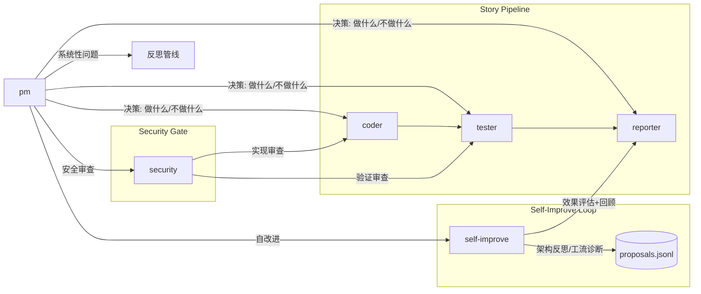
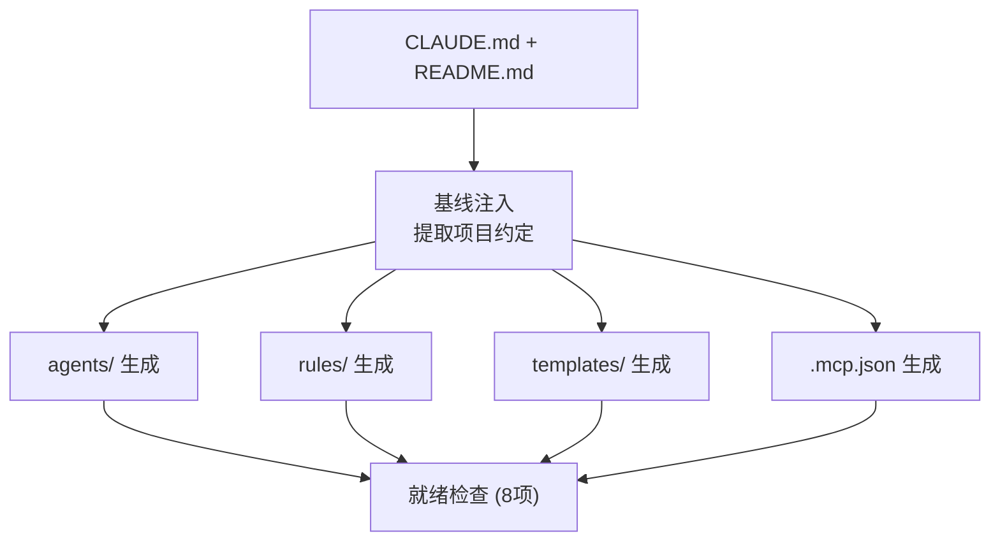

# Agents

根 pm 决定做什么和不做什么，并驱动执行。

| Agent | 文件 | 触发 |
|-------|------|------|
| pm | [pm.md](pm.md) | rui 全流程入口，反思钩子，架构漂移信号，自适应规划→策展 / init 基线注入→配置生成 |
| coder | [coder.md](coder.md) | pm 调度，rui 预检/实现/影响分析/架构设计，rui fix |
| tester | [tester.md](tester.md) | pm 调度，rui 测试先行/实现/验证/文档生成，rui fix，rui check |
| reporter | [reporter.md](reporter.md) | pm 调度，rui 交付/策展 |
| security | [security.md](security.md) | pm 安全审查委派，rui 预检/实现/验证 |
| self-improve | [self-improve.md](self-improve.md) | rui 自改进阶段，loop.js run |

---

## Init 管线

`/rui init` 的 Agent 生成管线：项目基线 → 基线注入 → Agent & Rule & Template & MCP → 就绪检查。

### 基线注入映射

| 提取项 | 来源 | 注入目标 |
|--------|------|---------|
| 技术栈与版本 | README.md 技术栈表 | coder.md、security.md |
| 编码规范 | CLAUDE.md 编码规范 | coder.md、tester.md |
| 禁止事项 | CLAUDE.md 禁止事项 | rules/code-pipeline.md、coder.md |
| 目录结构 | CLAUDE.md + README.md | rules/ paths、AGENT.md 影响分析范围 |
| 关键文件 | CLAUDE.md 关键文件 | coder.md、security.md |
| 构建与运行 | README.md 快速开始 | coder.md、tester.md |
| 核心架构 | README.md 核心架构 | coder.md、tester.md |

### 就绪检查 (8 项)

`node skills/rui/scripts/init.js` 执行。全部通过方可进入 `/rui doc` 或 `/rui code`。

| # | 检查项 | 验证内容 | 失败阻断 |
|---|--------|---------|---------|
| 1 | CLAUDE.md | 三公理 + 六原则 + 七准则 + 退化对策 | 是 |
| 2 | README.md | 系统能力 + 项目结构 + 快速开始 + /rui init 入口 | 是 |
| 3 | agents/ | AGENT.md 概览 + 6 角色文件（含有效 frontmatter） | 是 |
| 4 | rules/ | 6 规则文件（code-pipeline / doc-generation / gate-rules / import-docs / rui-claude / self-improve） | 是 |
| 5 | templates/ | 8 基线文档模板（01~08）内容非空 | 是 |
| 6 | .mcp.json | 有效 JSON + mcpServers 字段 | 否 |
| 7 | settings.json | 有效 JSON + permissions 非空 | 是 |
| 8 | .claude/ | agents/ + rules/ + templates/ + settings.json + .mcp.json + settings.local.json | 是 |

阻断项未通过时 `/rui` 全管线不可用。`.mcp.json` 可降级（MCP 服务非必需）。

完整 `.claude/` 目录结构见 [README.md](../README.md#项目结构)。

---

## 证据标准（反幻觉）

所有写入 `docs/` 或影响实现决策的陈述必须可验证或标注为未知。

| Level | 含义 | 如何撰写 |
|-------|------|---------|
| A 已验证 | 可通过 Read/Grep/Glob 验证 | 直接陈述，附路径 |
| B 可推导 | 通过明确规则从 A 推导一步 | "由……可得" |
| C 未验证 | 用户口述、未抓取网页 | `> 待补充` |
| D 禁止 | 无 A/B 支撑且非 C | 视为幻觉 |

---

## 全项目影响分析

每个变更点追踪上下游到闭合。删除/重命名/修改公共接口前证明所有调用方已覆盖。

**步骤**: 列出变更点 → 搜索词 → 全项目搜索 → 二级传递 → 标注处置。

**P0 门禁**: 搜索完成前不生成设计结论；影响链未闭合不删/改公共接口。