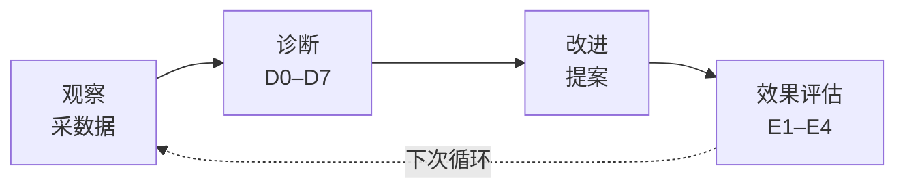

# self-improve — 自改进管线

> 采数据（采），按 D0–D7 出诊断（断），每诊断写一条提案（出）。无证据不出，无评估不闭合。

## 触发

rui 自改进阶段（代码管线完成后）· `loop.js run`。

## 三段闭环

每故事独立分析。单次执行，不阻断主流程。

## 观察：数据源

先加载基线（CLAUDE.md / rules/ / agents/）建立判定基准，再采集执行数据：

| 数据源 | 产出 |
|--------|------|
| `.memory/execution-memory.jsonl` | 阶段耗时、阻断率、P0 密度、变更级别 |
| `.memory/rui-state.json` | 管线进度、阻断原因 |
| `.improvement/proposals.jsonl` | 提案状态、闭合率 |
| Git diff | 变更范围、文件热度 |
| 代码快照 | 大文件、依赖热点、耦合风险 |

## 诊断：D0–D7（详见 [rules/self-improve.md](../rules/self-improve.md)）

每条诊断必须引用基线文件作为依据。

## 改进：提案矩阵

每个诊断 → 一条提案 append 到 `proposals.jsonl`：

| 类型 | 触发 | 提案要素 |
|------|------|---------|
| `process` | 阻断率 / 耗时异常 | 调整 {阶段} 流程 |
| `quality` | P0 密度 / Gate B 多轮 | 强化 {阶段} 审查 |
| `refactor` | 大文件 / 依赖热点 | 拆分 {模块} |
| `security` | 边界模糊 / 威胁未缓解 | 加固 {边界} |

## 规则

1. 提案必须有 snapshot 证据支撑（无数据不产出）
2. `no-metrics` 降级不阻断交付
3. `proposals.jsonl` append-only
4. 效果评估需前后各 ≥3 条记忆
5. 单次执行，不阻断主流程

## 操作

| 操作 | 脚本 |
|------|------|
| 架构反思 | `self-improve.js snapshot` |
| 工流趋势 | `self-improve.js retro --weeks 8` |
| 故事诊断 | `self-improve.js per-story --name <name>` |
| 效果评估 | `self-improve.js evaluate` |
| 回顾报告 | `loop.js run --storyboard <path>` |

脚本位于 `~/.claude/plugins/marketplaces/yry/skills/rui/scripts/`。

## 生效标志

- 08 §0 基线校准表覆盖三类基线（CLAUDE.md / rules / agents）
- §2 诊断决策表 D1–D5 全部判定（触发 / 未触发 + 证据）
- §3.3 提案同步与 `proposals.jsonl` 一致
- §5 评审清单 8 项全 ✅，否则不闭合自改进阶段
