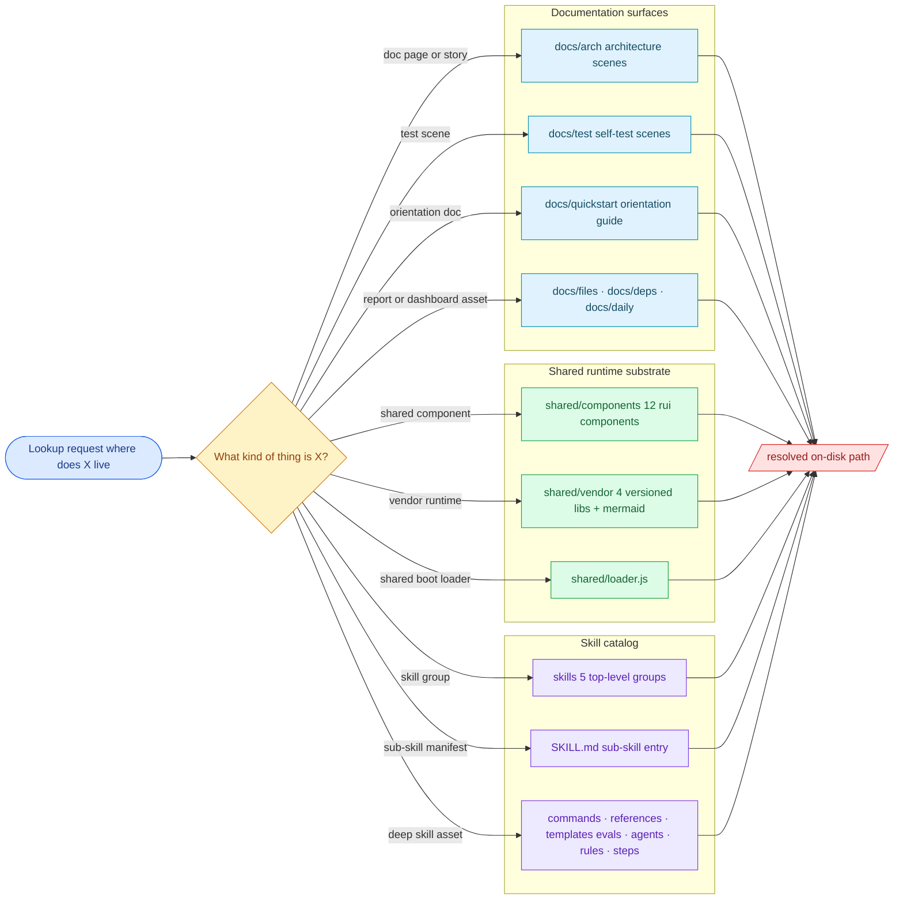

# Scene 1 — Module Location

> **Story**: Architecture · **Slug**: `module-location` · **Index**: 1 / 5
> **Source**: `docs/.pipeline-state/exploration.json` (01-detect + 02-explore
> artifacts) · **Generated**: 2026-07-15 by `rui-init` step 04-arch.

## §0 — Effect sketch

### Chart-first summary
- **Focus**: This chart treats module location as a real catalog map, not just a lookup pipeline.
- **Why**: The `.claude` tree now spans docs, shared runtime assets, and five skill groups, so path-first orientation matters more than abstract dependency talk.
- **How to read**: Classify the thing you want first, then jump to the matching stratum: `docs/`, `shared/`, or `skills/`.

## §1 — Test design

| Acceptance Criterion (AC) | Success Condition (SC) |
|---------------------------|------------------------|
| AC-1 · Locate a story scene | SC-1 · Path resolves under `docs/<story>/<scene>/index.md` |
| AC-2 · Locate a shared component | SC-2 · Path resolves under `shared/components/<name>/` |
| AC-3 · Locate a vendored library | SC-3 · Path resolves under `shared/vendor/<name>/` |
| AC-4 · Locate a top-level skill group | SC-4 · Path resolves under `skills/<group>/` where `<group>` is one of the five catalog groups |
| AC-5 · Locate a sub-skill manifest | SC-5 · Path resolves to `skills/<group>/<sub-skill>/SKILL.md` |
| AC-6 · Locate deeper skill assets | SC-6 · The sub-skill path reveals adjacent `commands/`, `references/`, `templates/`, `evals/`, `agents/`, `rules/`, or `steps/` directories |
| AC-7 · Look up a non-existent module | SC-7 · Returns no matching path rather than an invented location |

## §2 — Output inventory + architecture decisions

### Top-level strata

| Stratum | Where it lives | What it answers |
|---------|----------------|-----------------|
| Docs center | `docs/` | Where generated stories, report pages, quickstart material, and dependency dashboards live |
| Shared substrate | `shared/` | Where cross-skill runtime assets live: `loader.js`, `components/`, `vendor/`, and fonts |
| Skill catalog | `skills/` | Where the five skill groups and every sub-skill manifest live |

### Lookup anchors

| Lookup target | Canonical path shape | Why it matters |
|---------------|----------------------|----------------|
| Story scene | `docs/<story>/<scene>/index.md` | Fastest way to open a specific architecture or test scene |
| Shared component | `shared/components/<name>/` | Reusable runtime UI belongs here, not under per-doc pages |
| Vendored runtime library | `shared/vendor/<name>/` | Versioned browser bundles live in one predictable place |
| Skill group root | `skills/<group>/` | First jump when the user names a capability family |
| Sub-skill entry point | `skills/<group>/<sub-skill>/SKILL.md` | Every skill still resolves through its manifest first |
| Deep skill assets | sibling folders under the sub-skill | `commands/`, `references/`, `templates/`, `evals/`, `agents/`, `rules/`, and `steps/` explain how the skill actually works |

### Architecture decisions

- **D-1** · Module location is **path-first**. The primary answer is the literal on-disk path, not a prose summary.
- **D-2** · The `.claude` catalog resolves in **three strata**: `docs/`, `shared/`, and `skills/`. Skill discovery then splits into the **five** top-level groups recorded in quickstart material.
- **D-3** · Shared runtime assets live only under `shared/`. Report-local assets under `docs/files/`, `docs/deps/`, or `docs/quickstart/` should not be mistaken for cross-catalog shared components.
- **D-4** · A sub-skill is entered through `SKILL.md`; everything deeper is a sibling concern (`commands/`, `references/`, `templates/`, `evals/`, `agents/`, `rules/`, `steps/`).
- **D-5** · Generated pipeline snapshots may inform location, but stable navigation should never depend on inventing paths that are not present on disk.

## §3 — Test report

| AC | Status | Note |
|----|--------|------|
| AC-1 | PASS | Architecture and test scenes both resolve under `docs/<story>/<scene>/index.md` (including this file) |
| AC-2 | PASS | 12 reusable components resolve under `shared/components/` including `rui-panel-hub`, `rui-stats-grid`, and `rui-toast` |
| AC-3 | PASS | Vendored browser assets resolve under `shared/vendor/` as 4 versioned libraries plus `mermaid.min.js` |
| AC-4 | PASS | The docs quickstart inventory records 5 top-level skill groups: `rui-code`, `rui-init`, `rui-reports`, `rui-test`, `rui-tools` |
| AC-5 | PASS | Sub-skill manifests resolve at concrete paths such as `skills/rui-tools/mermaid/SKILL.md` and `skills/rui-code/vue/SKILL.md` |
| AC-6 | PASS | Deep assets are discoverable next to the manifest, e.g. `skills/rui-reports/quickstart/templates/` and `skills/rui-init/steps/04-arch/STEP.md` |
| AC-7 | PASS | Unknown names still produce no trustworthy path and therefore must be treated as unresolved |

## §4 — Self-improvement

| Diagnosis | Action |
|-----------|--------|
| D-0 · The prior version over-emphasized an abstract lookup pipeline | Keep scene 1 focused on the physical catalog map; leave dependency tracing to scene 2 |
| D-1 · Counts in older docs drifted from the current quickstart inventory | Generate scene counts from one shared source so `module-location` and `quickstart` never disagree |
| D-2 · The line between `shared/` and doc-local assets is easy to misread | Add a generated “shared vs local” legend in the next run so contributors stop misplacing components |
| D-3 · There is still no fuzzy locator for queries like “badge component” or “PDF export code” | Expose a searchable path index in the docs dashboard, backed by the same location map |
| D-4 · Missing pipeline snapshots make some generated references feel more authoritative than they are | Fall back to on-disk path checks whenever generated state files are absent |
| D-5 · No automated path-contract check exists today | Add a verify script that asserts all documented path patterns still exist on disk |
