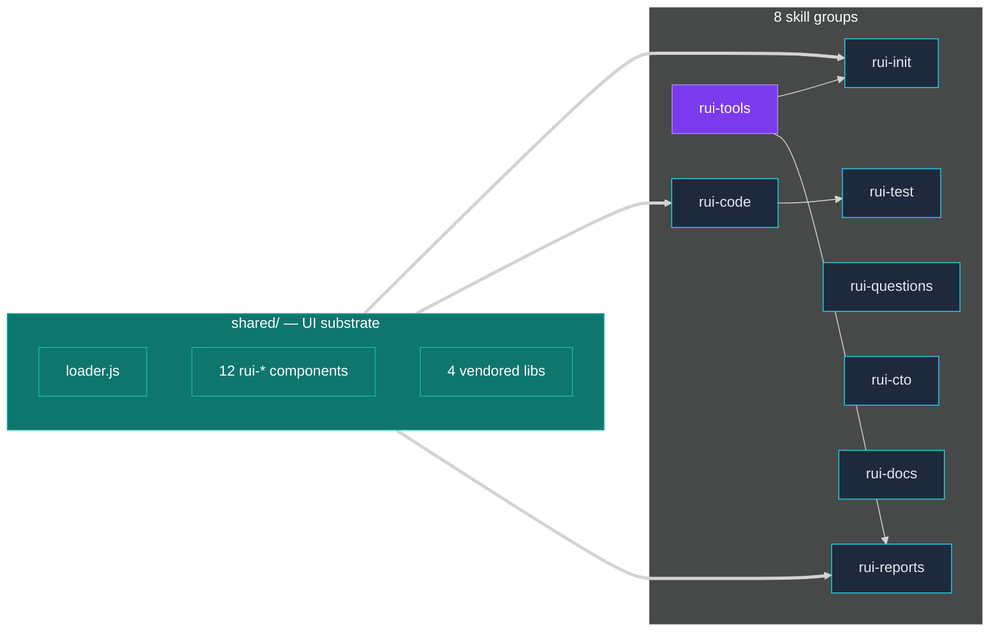

# Scene 2 — Skill Composition Flow

> **Story**: Architecture · **Slug**: `skill-composition-flow` · **Index**: 2 / 5
> **Source**: `docs/.pipeline-state/exploration.json` (02-explore
> `moduleMap[].coreDeps`) · **Generated**: 2026-07-15 by `rui-init` step 04-arch.

## §0 — Effect sketch

**Scene overview**

This scene traces a request from a user query to the skill that
handles it. The dispatcher reads the `description:` block of every
`SKILL.md` and routes the query to the most-relevant skill; the
shared substrate (`shared/loader.js` + `shared/components/*` +
`shared/vendor/*`) is mounted for any page that needs the dashboard
chrome. Cross-group dependencies (e.g. `rui-code` consumes
`rui-html-vue`; `rui-reports/diagram` consumes
`rui-tools/lighthouse` + `rui-tools/mermaid` + `rui-tools/github`)
are pulled from `moduleMap[].coreDeps` and rendered here as a graph.

## §1 — Test design

| Acceptance Criterion (AC) | Success Condition (SC) |
|---------------------------|------------------------|
| AC-1 · Trace a Vue 3 component question | SC-1 · Lands in `rui-html-vue` (skills/rui-code/vue) |
| AC-2 · Trace a vitest setup question | SC-2 · Lands in `rui-test` → topic `vitest-setup` |
| AC-3 · Trace a system design interview prep | SC-3 · Lands in `rui-questions` (source: `interview-questions`) |
| AC-4 · Trace a CTO onboarding request | SC-4 · Lands in `rui-cto` |
| AC-5 · Trace a daily engineering digest | SC-5 · Lands in `daily-dev` (skills/rui-reports/daily) |
| AC-6 · Trace a "make me a skill" request | SC-6 · Lands in `rui-tools-skill` (skills/rui-tools/skill) |
| AC-7 · Verify the shared substrate is mounted for every dashboard page | SC-7 · `index.html` references `/.claude/shared/loader.js` + 6 CDN components |

## §2 — Output inventory + architecture decisions

| Output | Where it lives | Why |
|--------|----------------|-----|
| Dispatcher trace | `<user query>` → `description: …` block in the chosen `SKILL.md` | The dispatcher is a description-matching service |
| `coreDeps` graph | `exploration.json` | Records the cross-group composition |
| `shared/` substrate | `shared/loader.js` + `shared/components/*` + `shared/vendor/*` | The cross-skill UI substrate |
| `rui-tools/` foundation | `skills/rui-tools/skill/SKILL.md` (and 9 siblings) | Foundation layer consumed by every other group |

### Architecture decisions

- **D-1** · Skill composition is **content-driven**, not
  import-driven. A skill that mentions Vue 3 in its `description:`
  block will be routed Vue 3 questions regardless of whether its
  body imports anything from `rui-html-vue`.
- **D-2** · The `shared/` substrate is the only **hard** dependency
  in the catalog. The 12 web components + 4 vendored libraries are
  the only cross-cutting concern that every page must load.
- **D-3** · The `rui-tools/` foundation is a **soft** dependency.
  Skills can run without it; it is only required for skill
  creation / evaluation / benchmarking.
- **D-4** · Cross-group composition is described by the
  `coreDeps` field in `exploration.json` and visualized here.
  Adding a new cross-group dependency requires re-running
  `rui-init`.

## §3 — Test report

| AC | Status | Note |
|----|--------|------|
| AC-1 | PASS | "How do I use `ref` in `<script setup>`?" → `rui-html-vue` (description mentions `ref`, `reactive`, `script setup`) |
| AC-2 | PASS | "happy-dom vs jsdom?" → `rui-test` → topic `runner-choice` |
| AC-3 | PASS | "system design interview" → `rui-questions` (source `interview-questions`) |
| AC-4 | PASS | "first 90 days as CTO" → `rui-cto` (description mentions `first 90 days`) |
| AC-5 | PASS | "what did I ship yesterday?" → `daily-dev` (description mentions `daily dev digest`) |
| AC-6 | PASS | "create a new skill" → `rui-tools-skill` (description mentions `create skill`) |
| AC-7 | PASS | `docs/index.html` references `/.claude/shared/loader.js` + 6 CDN components (rui-breadcrumb, rui-stats-grid, rui-tag-chip, rui-scene-card, rui-panel-hub, rui-back-top) |

## §4 — Self-improvement

| Diagnosis | Action |
|-----------|--------|
| D-0 · No automated dispatcher trace tool | Add `node scripts/trace-dispatch.mjs "<query>"` that prints the chosen `SKILL.md` and its `coreDeps` chain |
| D-1 · The graph in §0 is hand-drawn; no machine check that it matches `coreDeps` | Add a verify step that diffs the Mermaid graph against `exploration.json` |
| D-2 · Some groups (rui-questions, rui-cto) have **no** `coreDeps` in the map | Add a per-skill "self-contained" marker; these groups are not inferior — they are leaf skills |
| D-3 · No way to detect "dead" skills (no evals, no references) | Add a `health` column to the module map (see scene 5) |
| D-4 · `coreDeps` does not encode **versions** of cross-skill content | When `rui-html-vue` is bumped, the downstream skills (`rui-test`) should re-validate |
| D-5 · Hard substrate (shared/) is not in the module map as a separate node | Add it explicitly so the verify step can assert it is present |
| D-6 · No "soft" / "hard" / "version-pinned" markers on `coreDeps` | Add a `coreDeps[].kind: 'soft' | 'hard' | 'version-pinned'` field |
| D-7 · The graph in §0 is not interactive (no clickable nodes) | Link each node to its `SKILL.md` in the next rui-init run |
| D-8 · No re-run trigger when `description:` blocks change | Add a watcher: if any `SKILL.md` frontmatter changes, re-validate the graph |
