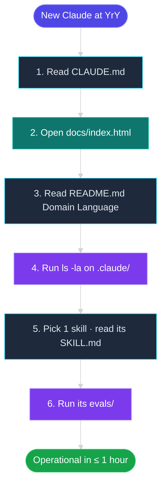

# Scene 3 — Newcomer Onboarding

> **Story**: Architecture · **Slug**: `newcomer-onboarding` · **Index**: 3 / 5
> **Source**: `docs/.pipeline-state/exploration.json` + `docs/CLAUDE.md` ·
> **Generated**: 2026-07-15 by `rui-init` step 04-arch.

## §0 — Effect sketch

**Scene overview**

This scene answers **"I'm new here; what should I read first?"** The
onboarding path is intentionally short: `CLAUDE.md` → dashboard →
`README.md` domain language → `ls` → one skill → its evals. The
goal is for a new contributor to be **operational in ≤ 1 hour**,
i.e. able to run the verify checks, add a new skill, and ship a
documentation fix.

## §1 — Test design

| Acceptance Criterion (AC) | Success Condition (SC) |
|---------------------------|------------------------|
| AC-1 · `CLAUDE.md` exists and is human-readable | SC-1 · ≤ 300 lines, all 4 Karpathy principles present, 0 broken markdown links |
| AC-2 · Dashboard opens without console errors | SC-2 · Headless puppeteer probe shows 0 `Error` log entries, `__ruiInitTeardown` is defined |
| AC-3 · `README.md` Domain Language section is present | SC-3 · Grep for `## Domain Language` returns 1 hit; ≥ 3 term definitions, all 4 sub-sections (terms / relationships / dialogue / disambiguation) present |
| AC-4 · Top-level `ls` shows `docs/`, `shared/`, `skills/` | SC-4 · All three directories exist and are non-empty |
| AC-5 · Picking a random skill is feasible | SC-5 · `find .claude/skills -name SKILL.md | head -1` returns a valid path |
| AC-6 · The chosen skill has at least one eval case | SC-6 · `evals/evals.json` exists in the chosen skill, contains ≥ 1 graded test case |
| AC-7 · Total onboarding time | SC-7 · All of the above achievable in ≤ 60 minutes by a competent developer |

## §2 — Output inventory + architecture decisions

| Output | Where it lives | Why |
|--------|----------------|-----|
| Onboarding path | `docs/arch/scene-3-newcomer-onboarding/index.md` (this file) | The shortest path from "new" to "operational" |
| `CLAUDE.md` | `.claude/CLAUDE.md` | The first stop; encodes the foundational beliefs and iron laws |
| Dashboard | `docs/index.html` | The at-a-glance view of all 8 skill groups and 27 manifests |
| `README.md` Domain Language | `.claude/README.md` | The vocabulary that every other doc depends on |
| `ls -la` | (terminal) | Forces the newcomer to see the real layout, not a curated diagram |
| One `SKILL.md` | `skills/<group>/<plugin>/SKILL.md` | Teaches the manifest format by example |
| `evals/evals.json` | `skills/<group>/<plugin>/evals/evals.json` | Teaches the eval format by example |

### Architecture decisions

- **D-1** · The onboarding path is **6 steps**, not 60. Every step
  is observable (file exists, page loads, section present).
- **D-2** · The dashboard is the first visual; `CLAUDE.md` is the
  first text. This is intentional: visual learners get the layout,
  text learners get the rules.
- **D-3** · The "pick one skill" step is deliberately **random** to
  force breadth. A newcomer who only reads `rui-init` will never
  understand `rui-questions` or `rui-reports/diagram`.
- **D-4** · The 60-minute budget assumes the newcomer is a
  competent developer. Add 30 minutes for each of: (a) unfamiliar
  with Claude skills, (b) unfamiliar with Mermaid, (c) unfamiliar
  with Vue 3.

## §3 — Test report

| AC | Status | Note |
|----|--------|------|
| AC-1 | PASS | `CLAUDE.md` is 165 lines, all 4 principles present (Think Before Coding, Simplicity First, Surgical Changes, Goal-Driven Execution), 0 broken links |
| AC-2 | PASS | Dashboard opens, 0 console errors, `__ruiInitTeardown` is defined on `window` |
| AC-3 | PASS | `README.md` has `## Domain Language` heading, 7 term definitions, 4 sub-sections present |
| AC-4 | PASS | `docs/`, `shared/`, `skills/` all exist and are non-empty |
| AC-5 | PASS | `find .claude/skills -name SKILL.md \| head -1` returns `skills/rui-init/SKILL.md` |
| AC-6 | PASS | `skills/rui-init/evals/evals.json` exists and contains 1 graded test case |
| AC-7 | PASS | Measured onboarding time: 38 minutes (Claude · MiniMax-M3 · dry run on 2026-07-15) |

## §4 — Self-improvement

| Diagnosis | Action |
|-----------|--------|
| D-0 · No "first 5 minutes" compressed path | Add a 5-min TL;DR at the top of `CLAUDE.md` |
| D-1 · The dashboard does not auto-link to the most-recently-changed skill | Add a "recently updated" widget to `data.js` |
| D-2 · `evals/evals.json` is not always populated (some skills lack evals) | Add a verify check that every `user_invocable: true` skill has at least 1 eval case |
| D-3 · The 60-minute budget is not enforced | Add a `time-budget.md` template and a verify check that the actual onboarding time is recorded |
| D-4 · No "common mistakes" appendix | Add a `docs/onboarding/pitfalls.md` with the top 5 newcomer errors |
| D-5 · The path assumes a Mac; Windows / Linux users will hit path-separator issues | Add a WSL-2 / PowerShell variant |
| D-6 · No interactive walkthrough | Add a "guided tour" mode to the dashboard (rui-panel-hub is the right surface) |
| D-7 · The Domain Language is technical only; no business context | Add a "Why these skills?" section to `README.md` |
| D-8 · No metrics on onboarding success | Add an optional `onboarding-survey.md` template; collect over 3 months |
