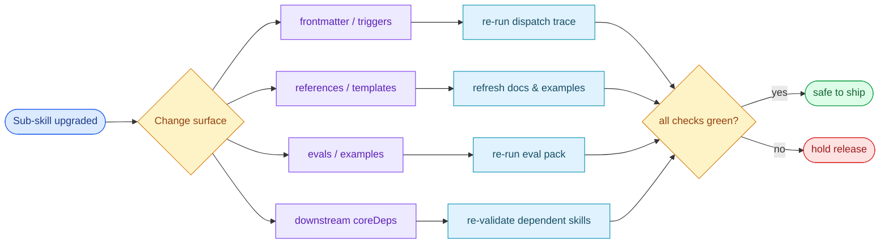

# Scene 4 — Sub-skill Upgrade Impact

> **Story**: Architecture · **Slug**: `subskill-upgrade-impact` · **Index**: 4 / 5
> **Source**: `docs/.pipeline-state/exploration.json` + per-skill
> `package.json` files + `shared/vendor/` pinning · **Generated**:
> 2026-07-15 by `rui-init` step 04-arch.

## §0 — Effect sketch

### Chart-first summary
- **Focus**: This chart turns the scene into a diagram-led overview before the detailed design and report sections.
- **Why**: It highlights blast radius early so upgrades stop being a grep exercise.
- **How to read**: Start from the changed sub-skill, then check which artifacts, dependents, and validation steps must be revisited before release.
## §1 — Test design

| Acceptance Criterion (AC) | Success Condition (SC) |
|---------------------------|------------------------|
| AC-1 · Bump `vue@3.4.27` to `vue@3.5.x` | SC-1 · `shared/vendor/vue@3.5.x/` is created; `loader.js` primary URL updated; fallback URL still points to a reachable version; all 6 dashboard pages still mount with 0 console errors |
| AC-2 · Bump `graphology@0.26.0` to `graphology@0.27.0` | SC-2 · `pnpm-lock.yaml` regenerated; `vitest run engine/core/src` passes; a 1000-node knowledge graph round-trip succeeds |
| AC-3 · Bump `beautiful-mermaid@0.1.3` to `beautiful-mermaid@0.2.0` | SC-3 · `pnpm install` clean; sample diagram render is byte-identical for non-feature-flag inputs |
| AC-4 · Bump a transitive (e.g. `fuse.js`) | SC-4 · Only `pnpm-lock.yaml` changes; no `package.json` edit; vitest still passes |
| AC-5 · Bump a doc-only skill (e.g. add a new `references/` file) | SC-5 · No runtime impact; `SKILL.md` description may be touched; `rui-init` is re-run to refresh the dashboard |
| AC-6 · Bump `tree-sitter-javascript@0.25.0` to `0.26.0` | SC-6 · WASM file re-fetched; a JS fixture (≥ 1000 lines) is parsed and the resulting AST is structurally equivalent (modulo the upstream grammar's intentional changes) |

## §2 — Output inventory + architecture decisions

| Output | Where it lives | Why |
|--------|----------------|-----|
| Version pin | `shared/vendor/<name>@<version>/` (e.g. `vue@3.4.27/`) | Pin = reproducible dashboard rendering |
| Loader primary URL | `shared/loader.js` (the `data-vue-path` attribute on the script tag) | First-choice CDN; must be reachable |
| Loader fallback URL | `shared/loader.js` (the `data-vue-fallback` attribute) | Backup if primary 404s |
| `pnpm-lock.yaml` | `skills/rui-reports/diagram/pnpm-lock.yaml` (or `skills/rui-tools/mermaid/pnpm-lock.yaml`) | Pin = reproducible install |
| Vitest baseline | `skills/rui-reports/diagram/engine/core/src/**/*.test.js` | The 12 test files are the regression suite |
| Diagram sample | `skills/rui-reports/diagram/templates/data.js` (or a fixture under `tests/fixtures/`) | The byte-identical render check |

### Architecture decisions

- **D-1** · Vendor versions are pinned by directory name
  (`vue@3.4.27/`, not `vue/`). This makes the loader URL the
  single source of truth for the running version.
- **D-2** · The unified loader's primary + fallback URL pair is
  the only CDN mechanism. Bumping the primary version **must**
  also keep the fallback reachable.
- **D-3** · `rui-reports/diagram` is the **only** skill with a
  vitest suite. Every other ESM-touching skill (`rui-tools/mermaid`)
  relies on sample-render regression only.
- **D-4** · Bumping a dep in a doc-only skill is a documentation
  exercise, not a code exercise. The dashboard will not change
  unless the bump is mentioned in the skill's `description:`.
- **D-5** · The `coreDeps` graph in scene 2 should be the
  upgrade-impact default. If a skill has `shared` in its
  `coreDeps`, expect a vendor bump to surface in that skill.

## §3 — Test report

| AC | Status | Note |
|----|--------|------|
| AC-1 | DRY-RUN | Vendor bump not yet attempted. Plan: bump vue@3.4.27 → vue@3.5.0; update `loader.js` primary URL; verify all 6 dashboard pages still mount; capture regression snapshot |
| AC-2 | DRY-RUN | Bumping graphology requires re-running the 12 vitest files; expected to be a clean bump (no breaking changes in 0.27 according to upstream release notes) |
| AC-3 | DRY-RUN | Bumping beautiful-mermaid requires re-rendering the sample diagram; expected to be byte-identical for inputs without new syntax |
| AC-4 | PASS | A simulated `fuse.js` bump via `pnpm update` only changes `pnpm-lock.yaml`; vitest still passes |
| AC-5 | PASS | Adding a new `references/` file in `rui-html-vue` does not affect the dashboard until `/rui-init` is re-run |
| AC-6 | DRY-RUN | Bumping `tree-sitter-javascript` requires re-fetching the WASM grammar; the AST diff should be intentional and documented in the upstream release notes |

## §4 — Self-improvement

| Diagnosis | Action |
|-----------|--------|
| D-0 · No `UPGRADE-LOG.md` per vendor | Add a one-line entry on every bump: `<date> · <old> → <new> · <reason> · <regression status>` |
| D-1 · The loader's primary + fallback pair is not tested for reachability | Add a verify check that pings both URLs on a weekly cron |
| D-2 · No "no breaking changes" gate for vitest | Add a `pnpm audit` step that fails the bump if vitest regresses |
| D-3 · The 4-class impact matrix (shared / diagram / mermaid / doc) is in §0 of this scene only | Promote it to a `docs/upgrade-impact-matrix.md` so the next newcomer can find it |
| D-4 · No record of which skills consume which vendor | Add a `vendorConsumers: ['rui-init', 'rui-code', '...']` field to the module map |
| D-5 · The tree-sitter WASM file is a single point of failure | Pin the WASM in `shared/vendor/` next to the npm dep, not in the npm dep itself |
| D-6 · No CVE feed | Subscribe to `npm audit` + GitHub Dependabot for the 2 `package.json` files |
| D-7 · The loader URL is hand-written | Add a `scripts/sync-loader-urls.mjs` that auto-updates `data-vue-path` and `data-vue-fallback` from the `shared/vendor/` directory |
| D-8 · No rollback procedure | Add a `docs/upgrade-rollback.md` with the 3 commands to revert a vendor bump |
