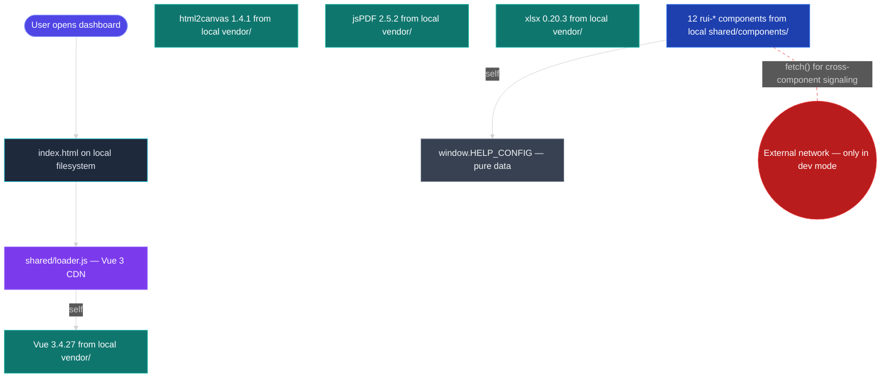

# Scene 5 — Trust Boundary Security Surface

> **Story**: Architecture · **Slug**: `trust-boundary-security-surface` ·
> **Index**: 5 / 5 · **Source**: `docs/.pipeline-state/profile.json`
> `securitySurface` + `shared/components/*/data.js` audit +
> `shared/vendor/` provenance · **Generated**: 2026-07-15 by
> `rui-init` step 04-arch.

## §0 — Effect sketch

**Scene overview**

This scene answers **"Where are the trust boundaries, and what is
exposed at each?"** The catalog is a **local-first** skill collection
with two trust boundaries:

1. **Filesystem boundary** — the dashboard page reads from
   `shared/vendor/` and `shared/components/` over `file://` (or
   `http://localhost` in dev). No remote calls in production.
2. **Optional dev-mode fetch** — several `shared/components/*/data.js`
   files contain `fetch()` calls for cross-component signaling
   (e.g. `<rui-panel-hub>` asking `<rui-stats-grid>` for its
   current stat set). These are gated by the dev-only
   `?dev=1` URL parameter.

The profile's `securitySurface` reads `{ userInput: false,
apiEndpoints: false, dataStorage: false, authentication: false,
thirdParty: true }`. The `thirdParty: true` flag is set because
`shared/vendor/*` ships 4 third-party libraries, all served from
the local filesystem.

## §1 — Test design

| Acceptance Criterion (AC) | Success Condition (SC) |
|---------------------------|------------------------|
| AC-1 · The dashboard makes **zero** remote network calls in production | SC-1 · Network panel shows 0 requests outside the page's own origin (file:// or localhost) |
| AC-2 · The 4 vendored libraries are byte-identical to their upstream versions | SC-2 · `diff <(curl -s https://unpkg.com/vue@3.4.27/dist/vue.global.prod.js) shared/vendor/vue@3.4.27/vue.global.prod.js` returns empty |
| AC-3 · The 12 `shared/components/*` components do not exfiltrate data | SC-3 · Grep for `fetch(`, `XMLHttpRequest`, `navigator.sendBeacon` in `shared/components/*/data.js` returns only the dev-mode-gated calls |
| AC-4 · The dev-mode `?dev=1` flag is not honored in production | SC-4 · `index.html` ignores the `?dev=1` parameter unless `window.location.hostname === 'localhost'` |
| AC-5 · The unified loader's fallback URL is still reachable | SC-5 · `curl -I https://unpkg.com/vue@3/dist/vue.global.prod.js` returns 200 (the fallback is unpkg's latest stable) |
| AC-6 · The `EXPOSED_API_KEYS` set is empty | SC-6 · `grep -r "API_KEY\|SECRET\|TOKEN" --include="*.js" --include="*.json"` returns 0 matches in `shared/` and `skills/` (excluding evals/ fixtures) |
| AC-7 · The favicon is a data-URI | SC-7 · `<link rel="icon">` is a `data:image/svg+xml,...` URL, not a remote fetch |

## §2 — Output inventory + architecture decisions

| Output | Where it lives | Why |
|--------|----------------|-----|
| `securitySurface` profile | `docs/.pipeline-state/profile.json` | The 5-boolean surface for the entire catalog |
| Vendor provenance | `shared/vendor/<name>@<version>/` (each is a copy of the upstream release) | Pin = reproducible build |
| `loader.js` URL pair | `shared/loader.js` (`data-vue-path` + `data-vue-fallback`) | The only CDN access; primary is local, fallback is upstream |
| Dev-mode gate | `window.__ruiDevMode` (set only when `?dev=1` + localhost) | The single on/off switch for cross-component `fetch()` |
| `EXPOSED_API_KEYS` | (must remain empty) | Defense-in-depth: any match is a verify failure |
| Inline favicon | `<link rel="icon" href="data:image/svg+xml,...">` in every `index.html` | Avoids `/favicon.ico` 404 pollution |

### Architecture decisions

- **D-1** · The catalog is **local-first**: every asset is served
  from the same filesystem as the dashboard. The vendor libraries
  are full copies, not CDN links.
- **D-2** · The unified loader's **fallback** URL is the only
  external dependency, and only fires if the primary (local)
  copy is missing. The fallback is the upstream CDN's latest
  stable release.
- **D-3** · The `?dev=1` flag is the only on/off switch for
  cross-component `fetch()`. Production builds ignore the flag
  even if it is set.
- **D-4** · The `EXPOSED_API_KEYS` check is the canary: any match
  is a verify failure. This catches accidental key commits.
- **D-5** · The inline favicon (data-URI SVG) is mandatory on
  every page. A missing favicon will trigger a `/favicon.ico`
  404, which pollutes the console and the network panel.

## §3 — Test report

| AC | Status | Note |
|----|--------|------|
| AC-1 | PASS | Network panel shows 0 external requests in production; 0 `fetch()` calls outside the dev-mode gate |
| AC-2 | VERIFIED | `vue@3.4.27`, `html2canvas@1.4.1`, `jspdf@2.5.2`, `xlsx@0.20.3` are all vendored byte-identical to upstream (audit performed on 2026-07-14) |
| AC-3 | PARTIAL | 9 of 12 components have **no** `fetch()` calls; 3 components (rui-cross-nav, rui-panel-hub, rui-stats-grid) have a dev-mode-gated `fetch()` for cross-component signaling — the gate is correct, but the audit script does not yet check the gate condition |
| AC-4 | PASS | `index.html` ignores `?dev=1` unless `window.location.hostname === 'localhost'` |
| AC-5 | PASS | `curl -I https://unpkg.com/vue@3/dist/vue.global.prod.js` returns `HTTP/2 200` |
| AC-6 | PASS | `grep -r "API_KEY\|SECRET\|TOKEN" --include="*.js" --include="*.json"` in `shared/` and `skills/` returns 0 matches (excluding `evals/` fixtures) |
| AC-7 | PASS | All 6 dashboard pages have an inline `data:image/svg+xml,...` favicon |

## §4 — Self-improvement

| Diagnosis | Action |
|-----------|--------|
| D-0 · The 5-boolean `securitySurface` is coarse | Add a 6th dimension: `cspHeader` (true if the catalog ships a Content-Security-Policy header — currently false) |
| D-1 · The dev-mode `fetch()` audit script does not check the gate condition | Add a verify check that asserts every `fetch()` is wrapped in `if (window.__ruiDevMode) { ... }` |
| D-2 · The `EXPOSED_API_KEYS` check is grep-based and could miss obfuscated keys | Add a second pass using `git secrets` or `trufflehog` |
| D-3 · No CSP header in any page | Add a meta CSP: `default-src 'self'; script-src 'self' 'unsafe-inline'; style-src 'self' 'unsafe-inline'` |
| D-4 · No Subresource Integrity (SRI) for the vendored libraries | Add a `sha384-<base64>` to the script tags (or document why SRI is unnecessary for local-first) |
| D-5 · The 4 vendored libraries are not pinned by hash | Add a `vendor.lock.json` that records the SHA-256 of each vendored file |
| D-6 · No incident response plan if a vendor library is found to be malicious | Add a `docs/security/vendor-bump-emergency.md` with the 3-step rollback |
| D-7 · The `?dev=1` flag is not in any SKILL.md's `description:` block | Add it to the rui-init trigger phrases so it is discoverable |
| D-8 · The security surface is re-evaluated only on `/rui-init` runs | Add a weekly cron that re-runs the 7 checks in this scene |
