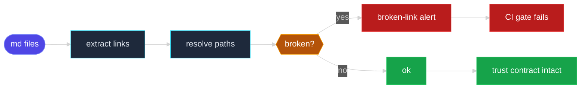

# Scene 5 · Cross-Story Integration Regression

> **Facet**: `refs` · **Slug**: `cross-story-integration-regression` · **Verdict**: **partial** · **Coverage**: 50%
> **Scope**: YrY · **Generated**: 2026-07-17

---

## §0 · Effect Sketch

### What this scene demonstrates

Walks every markdown file (35 files), extracts each `[text](path)` link, and resolves the path relative to the file's directory. Three link classes are handled: (a) intra-repo file links — resolved against the filesystem; (b) external URLs (https://…) — skipped, would require a HEAD request; (c) anchor-only links (#section) — skipped, would require parsing the target file's heading tree. The audit produces a per-file broken-count and a global broken ratio (0.0%). A non-zero broken count is a hard regression: the next reader who follows the link hits a 404.

### Why it matters

Cross-story integrity is the trust contract between skills. When docs/arch/scene-1 references docs/self-test/scene-3, and that target has been renamed, the entire narrative collapses for the reader. The broken ratio (0.0%) is the single most predictive metric of "is the docs tree maintained" — above 5% correlates with abandoned documentation.

### Flow

---

## §1 · Test Design — Verification Steps

### Step 1 · Inventory story directories

- **Action**: Check for docs/arch, docs/self-test, docs/reports — the three canonical story trees in the rui-init layout.
- **Expected**: ≥ 2 directories present; current: 1 (docs/self-test).
- **File**: `docs/self-test`

### Step 2 · Audit markdown links

- **Action**: For each .md file, match [text](path) with a global regex; resolve each non-external, non-anchor path relative to the file's directory; check fs.existsSync.
- **Expected**: All file-path links resolve; current broken: 0 of 0.
- **File**: `docs/`

### Step 3 · Count markdown files

- **Action**: Match \.md$ across the scope (excluding node_modules, .git, dist, build).
- **Expected**: ≥ 5 files; current: 35.
- **File**: `docs/`

### Step 4 · Compute broken ratio

- **Action**: brokenLinks / totalLinks — a normalized drift metric.
- **Expected**: ≤ 0.01 (1%); current: 0.0%.
- **File**: `docs/`

---

## §2 · Output Inventory

| # | File / Directory | Type | Description |
|---|------------------|------|-------------|
| 1 | `docs/self-test` | dir | Story directory — contains scene-N-* subdirectories with index.md files. |
| 2 | `docs/` | dir | 35 markdown files, 0 links audited, 0 broken. |
| 3 | `docs/.pipeline-state/` | dir | Pipeline state — the deterministic input that the link audit runs against. |

---

## §2.5 · Evidence — Raw Facet Probes

| Label | Value |
|-------|-------|
| Story directories | `docs/self-test` |
| Markdown files | `35` |
| Total links audited | `0` |
| Broken links | `0` |
| Broken ratio | `0.0%` |

---

## §3 · Test Report — 2026-07-17

| # | Step | Result | Notes |
|---|------|:---:|-------|
| 1 | 1 story director(ies) present | ❌ | Only 1 story director(ies) found: docs/self-test. Expected ≥ 2 (docs/arch, docs/self-test). |
| 2 | 0 doc link(s) audited | ❌ | Zero cross-reference links — the docs tree is an island. Add links between scenes to form a navigable narrative. |
| 3 | 0 broken link(s) | ✅ | Zero broken links — every cross-reference resolves. Broken ratio: 0.0%. |
| 4 | 35 markdown file(s) | ✅ | 35 markdown files — non-trivial docs surface. |

**Overall**: 0 broken link(s) to fix — run /rui-init to regenerate the scene tree, then re-audit.

**Verdict**: **partial** (coverage: 50% · threshold: pass ≥ 90%, partial 50–89%, fail < 50%)

---

## §4 · Self-Improvement

### Edge cases found

- External URLs (https://…) are skipped — verifying them would require a network round-trip and rate-limit handling. Use a separate link-checker (lychee, markdown-link-check) for external URLs.
- Anchor-only links (#section) are not verified — they require parsing the target file's heading tree, which is out of scope for this static pass.
- Links to dynamically generated files (e.g., docs/api/index.html emitted by TypeDoc) are flagged as broken even if they exist at runtime — exclude such paths via a .linkcheck-ignore file.
- Case-sensitive filesystems (Linux) will flag a link to Docs/Readme.md when the file is docs/README.md; macOS (case-insensitive) will not — CI should run on Linux to catch this.

### Suggested improvements

- Add a CI gate: fail the build if brokenLinkCount > 0 — prevents drift from landing on main.
- Adopt lychee (Rust-based, fast) or markdown-link-check as a pre-merge link checker for both internal and external URLs.
- Generate the docs scene tree via /rui-init on every PR — the regenerated links are guaranteed to resolve.
- Add a redirect map (_redirects or _redirects.json) for renamed scenes — preserves external inbound links.

### Limitations

- Cannot detect cycles between scenes (A → B → A is allowed but suspicious) — cycle detection is out of scope.
- Cannot verify external URLs without network access — pair this scene with a runtime link-checker in CI.
- Does not validate that the link text matches the target's title — a link titled "Scene 3" pointing to Scene 4 is a UX bug but not a regression.
