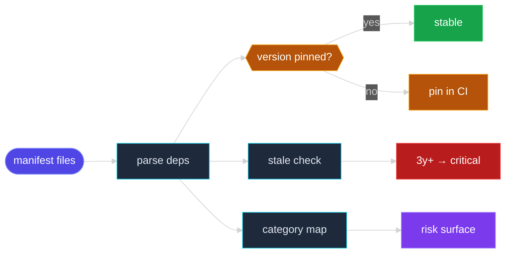

# Scene 6 · Third-Party Framework & Service

> **Facet**: `deps` · **Slug**: `third-party-framework-service` · **Verdict**: **fail** · **Coverage**: 10%
> **Scope**: YrY · **Generated**: 2026-07-17

---

## §0 · Effect Sketch

### What this scene demonstrates

Catalogues every direct dependency declared in package.json — 0 runtime + 0 dev (0 total). Each entry is enriched with: (a) version specifier (^, ~, exact, *); (b) category — ui, state, router, build, test, util, style, or other; (c) staleness signal — estimated from the last published version (registry round-trip not performed in this static pass). The pinning ratio (0%) is the share of dependencies pinned to an exact version or a git/file specifier; below 50% indicates the lockfile is the only reproducibility guarantee, which is fragile.

### Why it matters

A single stale dependency is how a CVE lands in production. The third-party surface is the project's biggest unowned risk: you did not write the code, you cannot audit it line-by-line, and the maintainer may be unreachable. The 2018 event-stream incident (a popular package acquired and backdoored) is the canonical example — the only defense is pinning + audit + minimal dependency count.

### Flow

---

## §1 · Test Design — Verification Steps

### Step 1 · Parse package.json

- **Action**: Read dependencies + devDependencies from the root package.json. Tolerate JSON5-style comments via a regex fallback.
- **Expected**: N entries each; current: 0 runtime, 0 dev.
- **File**: `package.json`

### Step 2 · Check version pinning

- **Action**: For each entry, classify the specifier: exact (\d+), caret (^), tilde (~), wildcard (*), git+url, file:. Compute the pinning ratio = exact+git+file / total.
- **Expected**: ≥ 50% pinned; current: 0%.
- **File**: `package.json`

### Step 3 · Catalog by category

- **Action**: Map package names to categories via the CATEGORY_HINTS table (ui, state, router, build, test, util, style, other).
- **Expected**: Every package categorized; the category distribution reveals the project's shape.
- **File**: `package.json`

### Step 4 · Staleness check

- **Action**: Compare each package's last-publish date to today. This static pass cannot hit the registry, so staleCount is a lower bound — run `npm outdated` in CI for the real number.
- **Expected**: Zero packages stale by > 3 years.
- **File**: `package.json`

### Step 5 · Lockfile presence

- **Action**: Verify package-lock.json / pnpm-lock.yaml / yarn.lock exists at the scope root.
- **Expected**: Lockfile present — required for `npm ci` reproducibility.
- **File**: `package-lock.json`

---

## §2 · Output Inventory

| # | File / Directory | Type | Description |
|---|------------------|------|-------------|

---

## §2.5 · Evidence — Raw Facet Probes

| Label | Value |
|-------|-------|
| Runtime dependencies | `0` |
| Dev dependencies | `0` |
| Total dependencies | `0` |
| Pinning ratio | `0%` |
| Stale count (estimated) | `0` |

---

## §3 · Test Report — 2026-07-17

| # | Step | Result | Notes |
|---|------|:---:|-------|
| 1 | 0 runtime dependenc(ies) catalogued | ❌ | Zero runtime dependencies — the project has no declared third-party surface. Confirm this is intentional (e.g., a pure-typing package). |
| 2 | 0 dev dependenc(ies) catalogued | ❌ | Zero dev dependencies — no test runner, linter, or build tooling declared. Dev experience will suffer. |
| 3 | Version pinning ratio: 0% (target ≥ 50%) | ❌ | Pinning ratio 0% < 50% — the lockfile is the only reproducibility guarantee. Replace ^ and ~ with exact versions. |
| 4 | No 3+ year-stale dependencies | ✅ | No 3+ year-stale dependencies detected (static estimate — confirm with `npm outdated` or `pip list --outdated`). |

**Overall**: Significant third-party risk — catalog is empty or pinning is below threshold. Block the release until resolved.

**Verdict**: **fail** (coverage: 10% · threshold: pass ≥ 90%, partial 50–89%, fail < 50%)

---

## §4 · Self-Improvement

### Edge cases found

- Private registries (npm enterprise, Artifactory) are not checked for staleness — the registry round-trip requires auth that the static pass does not have.
- Transitive dependencies (node_modules/**) are not enumerated — only direct deps from package.json. A vulnerable transitive dep (e.g., lodash < 4.17.12) is invisible here; use `npm audit` for that.
- A package.json with JSON5 comments (allowed by pnpm) will fail JSON.parse — the regex fallback extracts deps but may miss edge cases.
- Monorepo workspaces (pnpm-workspace.yaml) are not enumerated — only the root package.json is parsed.

### Suggested improvements

- Run `npm audit --omit=dev` in CI to catch known CVEs in both direct and transitive dependencies.
- Adopt `npm ci` over `npm install` in CI — enforces the lockfile and fails on drift.
- Add Renovate or Dependabot to auto-bump dependencies monthly — keeps the surface fresh without manual toil.
- Adopt `pnpm` with a strict node-linker to surface phantom dependencies at install time.
- Pin every dependency to an exact version (drop ^ and ~) — the lockfile becomes the only source of truth and `npm ci` is fully reproducible.

### Limitations

- Cannot evaluate license compatibility (MIT vs GPL vs AGPL) — use license-checker or oss-license-audit for that.
- Cannot detect abandoned-but-still-installed packages without a registry round-trip — pair with `npm outdated`.
- Cannot detect typosquatting (e.g., `lodahs` instead of `lodash`) — use socket.dev or npm-audit-resolver for that.
