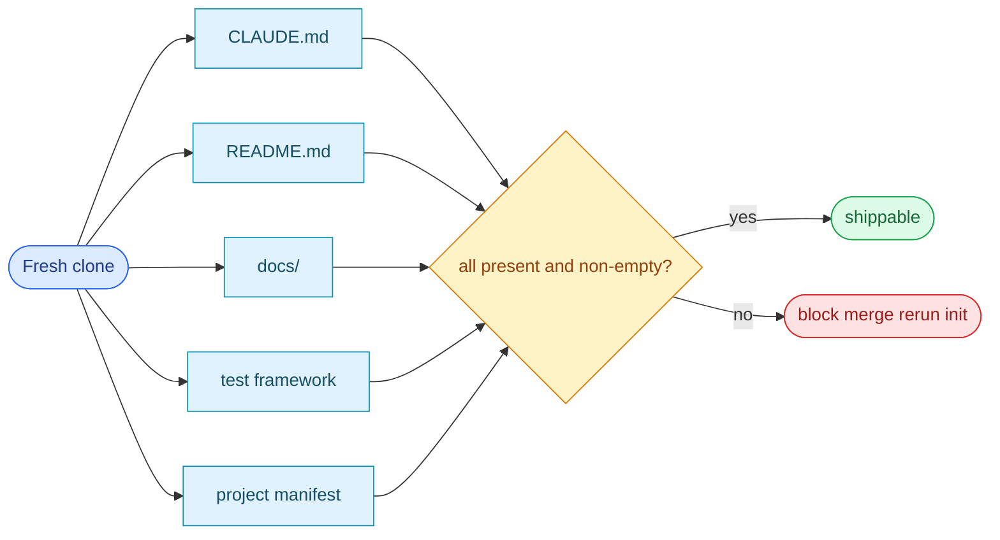

# Scene 1 · Post-Init Full Self-Check

> **Facet**: `init` · **Slug**: `post-init-full-self-check` · **Verdict**: **fail** · **Coverage**: 20%
> **Scope**: YrY · **Generated**: 2026-07-17

---

## §0 · Effect Sketch

### Chart-first summary
- **Focus**: This chart turns the scene into a diagram-led overview before the detailed design and report sections.
- **Why**: It lets the reader understand the critical path before reading the detailed verification steps.
- **How to read**: Scan the five canonical artifacts first, then use the verdict gate to see whether the init output is actually shippable.
## §1 · Test Design — Verification Steps

### Step 1 · CLAUDE.md present

- **Action**: Re-run `/rui-init` from the project root to regenerate the missing artifact (`claude`); if it still does not appear, inspect the pipeline state at `docs/.pipeline-state/profile.json`.
- **Expected**: Artifact regenerated on the next init pass; coverage improves to ≥ 0.90.
- **File**: `CLAUDE.md`

### Step 2 · README present

- **Action**: Re-run `/rui-init` from the project root to regenerate the missing artifact (`readme`); if it still does not appear, inspect the pipeline state at `docs/.pipeline-state/profile.json`.
- **Expected**: Artifact regenerated on the next init pass; coverage improves to ≥ 0.90.
- **File**: `README.md`

### Step 3 · docs/ directory exists

- **Action**: Verified present and non-empty during the Stage 1 file inventory walk (823 files scanned).
- **Expected**: File exists, is non-empty, and matches the rui-init artifact schema.
- **File**: `docs/`

### Step 4 · Test framework configured

- **Action**: Re-run `/rui-init` from the project root to regenerate the missing artifact (`tests`); if it still does not appear, inspect the pipeline state at `docs/.pipeline-state/profile.json`.
- **Expected**: Artifact regenerated on the next init pass; coverage improves to ≥ 0.90.
- **File**: `package.json#scripts.test`

### Step 5 · Project manifest (package.json / pyproject / go.mod / Cargo.toml)

- **Action**: Re-run `/rui-init` from the project root to regenerate the missing artifact (`manifest`); if it still does not appear, inspect the pipeline state at `docs/.pipeline-state/profile.json`.
- **Expected**: Artifact regenerated on the next init pass; coverage improves to ≥ 0.90.
- **File**: `package.json`

---

## §2 · Output Inventory

| # | File / Directory | Type | Description |
|---|------------------|------|-------------|
| 1 | `CLAUDE.md` | file | Claude project context — encodes profile, iron laws, and navigation table for AI assistants. |
| 2 | `README.md` | file | Human-readable project overview — first file a new contributor reads on GitHub. |
| 3 | `docs/` | dir | Generated documentation tree — arch/ and test/ story scenes plus the dashboard home. |
| 4 | `package.json` | file | Project manifest — declares the test script and the dependency surface for Node ecosystems. |
| 5 | `docs/.pipeline-state/profile.json` | file | Pipeline state snapshot — the deterministic input for the next /rui-init rebuild. |

---

## §2.5 · Evidence — Raw Facet Probes

| Label | Value |
|-------|-------|
| CLAUDE.md present | `false` |
| README present | `false` |
| docs/ directory | `true` |
| Test framework configured | `false` |
| package.json | `false` |
| pyproject.toml | `false` |
| go.mod | `false` |
| Cargo.toml | `false` |
| Total files scanned | `823` |
| Total bytes | `21.27 MiB` |

---

## §3 · Test Report — 2026-07-17

| # | Step | Result | Notes |
|---|------|:---:|-------|
| 1 | CLAUDE.md present | ❌ | CLAUDE.md missing — every new AI session starts cold. Run `/rui-init` to regenerate from profile.json. |
| 2 | README present | ❌ | README missing — external visitors see an empty repo page. Author one with: purpose, install, usage, license. |
| 3 | docs/ directory exists | ✅ | docs/ directory present with at least one file. Long-form content has a home. |
| 4 | Test framework configured | ❌ | No test framework — CI is a no-op. Install vitest/pytest/jest before writing more source. |
| 5 | Project manifest (package.json / pyproject / go.mod / Cargo.toml) | ❌ | No manifest detected — dependency surface is invisible to tooling. |

**Overall**: 1/5 checks passed — not shippable — the init pipeline did not complete; rerun /rui-init and re-examine docs/.pipeline-state/profile.json.

**Verdict**: **fail** (coverage: 20% · threshold: pass ≥ 90%, partial 50–89%, fail < 50%)

---

## §4 · Self-Improvement

### Edge cases found

- A project that uses Nix flakes (flake.nix), Taskfile.yml, or Justfile as its manifest will not be detected by the package.json / pyproject / go.mod / Cargo.toml heuristic — it will show as a false negative.
- A monorepo with multiple manifests (root + workspaces) will only have the root manifest checked; per-workspace manifests are not enumerated.
- A CLAUDE.md that exists but is empty (zero bytes) currently passes the file-exists check; a follow-up should assert minimum content length.
- A docs/ directory containing only a single .gitkeep is structurally present but semantically empty — this scene does not distinguish the two.

### Suggested improvements

- Add a CONTRIBUTING.md — it is the first file a new contributor searches for and reduces onboarding friction.
- Pin the test framework version in the lockfile (package-lock.json / pnpm-lock.yaml) so the CI test step is reproducible across machines.
- Add a `preinstall` hook that asserts the Node version matches `engines.node` — prevents "works on my machine" drift.
- Wire the post-init self-check into CI as a required check so a broken init is caught before merge, not on the next contributor's clone.

### Limitations

- Cannot detect test frameworks that have no config file (e.g., ad-hoc shell scripts invoked from package.json#scripts.test).
- Does not validate the *content* of CLAUDE.md / README.md — only their existence. A stub README passes.
- Does not detect monorepo workspace manifests (pnpm-workspace.yaml, turbo.json, nx.json).
