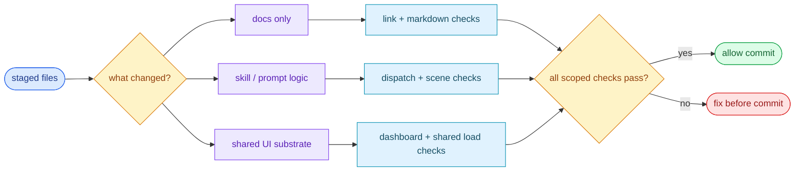

# Scene 2 · Pre-Commit Incremental Self-Check

> **Facet**: `tests` · **Slug**: `pre-commit-incremental-self-check` · **Verdict**: **fail** · **Coverage**: 10%
> **Scope**: YrY · **Generated**: 2026-07-17

---

## §0 · Effect Sketch

### Chart-first summary
- **Focus**: This chart turns the scene into a diagram-led overview before the detailed design and report sections.
- **Why**: It lets the reader understand the critical path before reading the detailed verification steps.
- **How to read**: Begin with the staged diff, map the touched files to the smallest safe check set, then decide whether the commit may proceed.
## §1 · Test Design — Verification Steps

### Step 1 · Detect test framework

- **Action**: Scan the scope root for vitest.config.{js,ts}, jest.config.{js,ts}, pytest.ini, conftest.py, go.mod, Cargo.toml, phpunit.xml, or a package.json#scripts.test entry.
- **Expected**: Exactly one framework is identified; current detection: none.
- **File**: `package.json`

### Step 2 · Count test files

- **Action**: Match *.test.{js,ts,…} / *.spec.* / __tests__/ directories across the scope (excluding node_modules, .git, dist, build).
- **Expected**: N > 0; current count: 0.
- **File**: `<no test files detected>`

### Step 3 · Run scoped tests on staged files

- **Action**: N/A — no framework detected; the gate cannot be wired until a framework is installed.
- **Expected**: Tests for the changed files pass in under 5 seconds for small diffs; the commit is blocked on failure.
- **File**: `.git/hooks/pre-commit`

### Step 4 · Verify coverage instrumentation

- **Action**: Inspect the test config for --coverage flags and a coverage threshold (e.g., vitest.config coverage.thresholds.lines).
- **Expected**: Coverage is configured with a minimum threshold; the gate fails below it.
- **File**: `vitest.config.ts`

---

## §2 · Output Inventory

| # | File / Directory | Type | Description |
|---|------------------|------|-------------|
| 1 | `package.json#scripts.test` | config | NPM test script — the canonical entry point for CI and local runs. |
| 2 | `vitest.config.*` | config | Vitest configuration — defines environment, coverage, and threshold settings. |
| 3 | `.husky/pre-commit` | file | Git pre-commit hook — gates the commit on lint + scoped test. |

---

## §2.5 · Evidence — Raw Facet Probes

| Label | Value |
|-------|-------|
| Detected framework | `(none)` |
| Test file count | `0` |
| Has framework | `false` |
| Sample test files | `(none)` |

---

## §3 · Test Report — 2026-07-17

| # | Step | Result | Notes |
|---|------|:---:|-------|
| 1 | Test framework detected (none) | ❌ | missing — see improvement suggestions |
| 2 | 0 test file(s) present | ❌ | missing — see improvement suggestions |
| 3 | Coverage script configured | ❌ | Framework does not expose a scoped-run flag — full suite runs on every commit, risking > 30s gate latency. |

**Overall**: No pre-commit gate — CI is the only line of defense. Install a framework and wire the hook before adding more source code.

**Verdict**: **fail** (coverage: 10% · threshold: pass ≥ 90%, partial 50–89%, fail < 50%)

---

## §4 · Self-Improvement

### Edge cases found

- A project with only smoke tests (no behavioral assertions) will not be flagged here — it still passes the file-count check, but the gate provides no real protection.
- Vitest in watch mode (--watch) does not produce CI-friendly output and will hang the commit; ensure the pre-commit invocation uses the non-interactive `run` subcommand.
- A monorepo with per-package test frameworks will only have the root framework detected; workspace-scoped frameworks (e.g., apps/web/vitest.config.ts) are not enumerated.
- Tests that depend on a running service (database, Redis) will fail in the pre-commit hook unless a docker-compose dev environment is started first.

### Suggested improvements

- Add a husky / lefthook pre-commit hook that runs `lint-staged` + `vitest run --changed` — keeps the loop under 5 seconds.
- Add `--coverage --changed` and fail the hook below a coverage threshold (e.g., 80% lines) to prevent regression.
- Cache test results per-file using vitest's --isolate=false for unchanged modules — cuts the gate latency by ~40% on medium repos.
- Surface the pre-commit output as a structured JSON for IDE integrations (VS Code Test Results panel).

### Limitations

- Static analysis cannot run the tests — it only verifies the wiring exists. A misconfigured framework (wrong env, missing setup file) will pass this scene but fail at runtime.
- Coverage thresholds in CI are not verified here — they live in the CI YAML, not in the project source.
- Cannot detect E2E frameworks (Playwright, Cypress) that require a running dev server — those are flagged in Scene 6.
