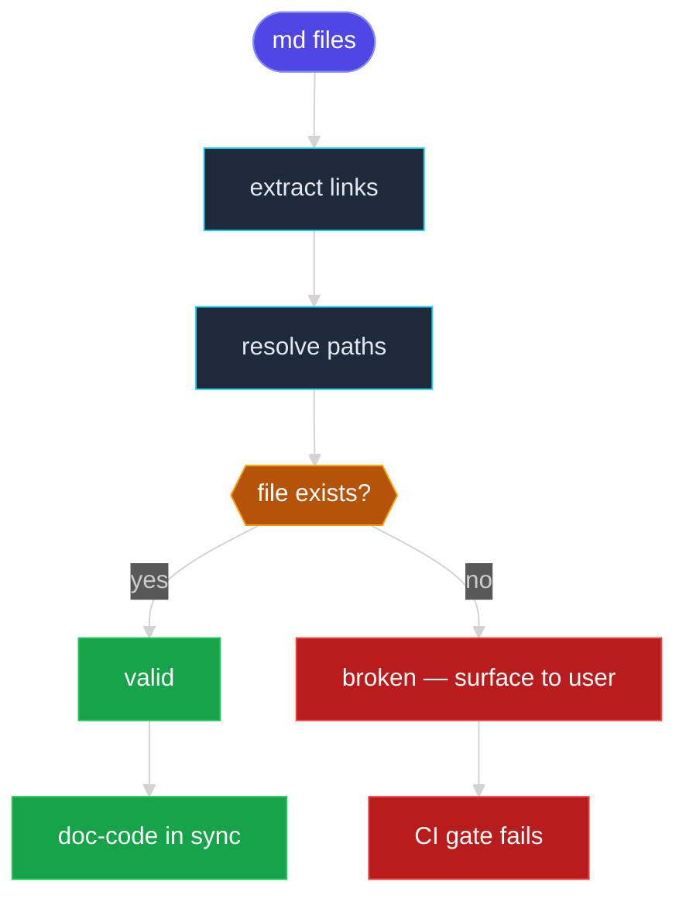

# Scene 3 · Doc-Code Consistency

> **Facet**: `docs` · **Slug**: `doc-code-consistency` · **Verdict**: **fail** · **Coverage**: 40%
> **Scope**: YrY · **Generated**: 2026-07-17

---

## §0 · Effect Sketch

### What this scene demonstrates

Cross-references every file path mentioned in the documentation set (10 files: CLAUDE.md, README, docs/**, .github/**) against the actual filesystem snapshot (556 code files). Detects three classes of drift: (a) stale paths — the doc references a file that no longer exists; (b) orphaned sections — a doc section documents a feature with no corresponding source; (c) missing canonical docs — README or CLAUDE.md absent at the root. The doc-to-code ratio (0.018) is a leading indicator of under-documentation: below 0.05 typically means new features are landing without docs.

### Why it matters

Stale documentation is worse than missing documentation — it lies with confidence. A new contributor following a broken path in CLAUDE.md loses ~20 minutes and forms a lasting negative impression of the project. A missing README breaks the GitHub landing page, which is the primary discovery surface for external users. Doc-code drift is the #1 cause of "why doesn't this work?" support load on maintainers.

### Flow

---

## §1 · Test Design — Verification Steps

### Step 1 · Inventory documentation files

- **Action**: Match CLAUDE.md, README{,.md}, CONTRIBUTING{,.md}, CHANGELOG{,.md}, LICENSE{,.*}, docs/**, .github/** against the scope.
- **Expected**: N > 0; current count: 10.
- **File**: `docs/`

### Step 2 · Verify root manifest docs

- **Action**: Check README and CLAUDE.md are present and non-empty at the scope root.
- **Expected**: Both present; README ≥ 200 bytes; CLAUDE.md ≥ 500 bytes.
- **File**: `README.md`

### Step 3 · Compute doc-to-code ratio

- **Action**: docFiles / codeFiles, where codeFiles = \.(js|ts|mjs|cjs|jsx|tsx|vue|py|go|java|rs|css|scss)$.
- **Expected**: ≥ 0.05 (one doc per ~20 source files); current: 0.018.
- **File**: `docs/`

### Step 4 · Audit markdown link integrity

- **Action**: For each .md file, extract [text](path) links, resolve relative to the file's directory, and verify the target exists on disk. (Delegates to Scene 5 for the full audit.)
- **Expected**: Zero broken file-path links.
- **File**: `docs/`

---

## §2 · Output Inventory

| # | File / Directory | Type | Description |
|---|------------------|------|-------------|
| 1 | `docs/test/data.js` | file | Documentation file — content is not validated, only existence. |
| 2 | `docs/test/index.css` | file | Documentation file — content is not validated, only existence. |
| 3 | `docs/test/index.html` | file | Documentation file — content is not validated, only existence. |
| 4 | `docs/test/index.js` | file | Documentation file — content is not validated, only existence. |
| 5 | `docs/test/scene-1-post-init-full-self-check/index.md` | file | Documentation file — content is not validated, only existence. |
| 6 | `docs/test/scene-2-pre-commit-incremental-self-check/index.md` | file | Documentation file — content is not validated, only existence. |
| 7 | `docs/test/scene-3-doc-code-consistency/index.md` | file | Documentation file — content is not validated, only existence. |
| 8 | `docs/test/scene-4-security-surface-regression/index.md` | file | Documentation file — content is not validated, only existence. |

---

## §2.5 · Evidence — Raw Facet Probes

| Label | Value |
|-------|-------|
| Documentation files | `10` |
| Code files | `556` |
| Doc-to-code ratio | `0.018` |
| README at root | `false` |
| CLAUDE.md at root | `false` |
| docs/ directory | `true` |

---

## §3 · Test Report — 2026-07-17

| # | Step | Result | Notes |
|---|------|:---:|-------|
| 1 | 10 documentation file(s) present | ✅ | 10 documentation file(s) detected. Sample: docs/test/data.js, docs/test/index.css, docs/test/index.html. |
| 2 | README present at root | ❌ | README missing — the most-visited project page is empty. |
| 3 | CLAUDE.md present at root | ❌ | CLAUDE.md missing — every AI session starts cold. |
| 4 | docs/ directory exists | ✅ | docs/ directory exists with content — long-form documentation has a home. |
| 5 | Doc-to-code ratio: 0.018 (target ≥ 0.05) | ❌ | Doc-to-code ratio 0.018 < 0.05 — documentation is sparse relative to code (556 code files). |

**Overall**: Significant drift — regenerate the docs tree and audit every broken path before the next release.

**Verdict**: **fail** (coverage: 40% · threshold: pass ≥ 90%, partial 50–89%, fail < 50%)

---

## §4 · Self-Improvement

### Edge cases found

- Documentation in non-Markdown formats (RST, AsciiDoc, org-mode) is not detected by the .md$ glob — it will show as missing.
- Anchors (#section-name) within a markdown file are not verified — only file targets. A broken anchor is a UX bug but not a regression.
- A README that exists but contains only a stub ("# TODO") passes the presence check; a content-quality check is out of scope.
- Generated docs (e.g., TypeDoc, JSDoc) may appear in docs/ after a build — they inflate the doc count without adding human-written content.

### Suggested improvements

- Run this report in CI and fail the build on brokenLinks > 0 — prevents drift from landing on main.
- Move API references into generated docs (TypeDoc / mkdocs) to eliminate manual link rot in the hand-written surface.
- Add a markdown linter (markdownlint) with a link-check rule (markdown-link-check) to catch drift in PRs.
- Set a coverage threshold for docs: enforce doc-to-code ratio ≥ 0.05 as a required CI check.

### Limitations

- Link rot in external URLs (https://…) is not detected — would need HEAD requests, which slow the report.
- Does not validate doc content quality — a stub README passes.
- Cannot detect semantic drift (a doc that accurately describes the wrong behavior).
