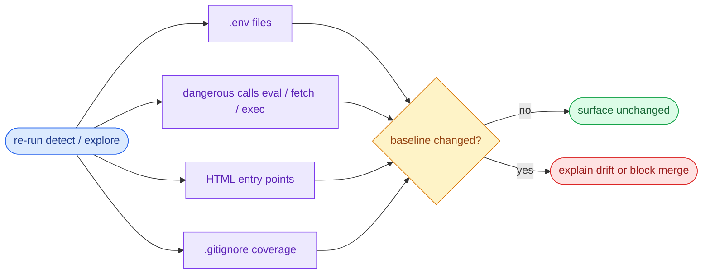

# Scene 4 · Security Surface Regression

> **Facet**: `security` · **Slug**: `security-surface-regression` · **Verdict**: **fail** · **Coverage**: 33%
> **Scope**: YrY · **Generated**: 2026-07-17

---

## §0 · Effect Sketch

### Chart-first summary
- **Focus**: This chart turns the scene into a diagram-led overview before the detailed design and report sections.
- **Why**: It lets the reader understand the critical path before reading the detailed verification steps.
- **How to read**: Start with the repository scan, inspect the three high-signal surfaces, then compare the result against the baseline gate.
## §1 · Test Design — Verification Steps

### Step 1 · Inventory .env files

- **Action**: Match ^\.env(\.\w+)?$ at the scope root and in each workspace. For each match, verify the file is listed in .gitignore.
- **Expected**: Every .env* file is gitignored; no secrets are tracked by git.
- **File**: `.env (none detected)`

### Step 2 · Detect dangerous API calls

- **Action**: Scan every source file (< 256 KiB) for: eval(, new Function(, innerHTML=, document.write(, dangerouslySetInnerHTML, child_process.exec/spawn(. Record file + kind for each match.
- **Expected**: Zero new occurrences since last baseline; current total: 28.
- **File**: `docs/test/data.js`

### Step 3 · Count HTML entry points

- **Action**: Match \.html?$ across the scope. Each entry point is a candidate for CSP review (script-src, object-src).
- **Expected**: N files; each should ship a CSP meta tag or a Content-Security-Policy header. Current: 22.
- **File**: `<html entry points>`

### Step 4 · Cross-check .gitignore coverage

- **Action**: Read .gitignore and assert every .env* file is matched by a pattern. Fail if any .env file is tracked by git.
- **Expected**: All .env* files gitignored.
- **File**: `.gitignore`

---

## §2 · Output Inventory

| # | File / Directory | Type | Description |
|---|------------------|------|-------------|
| 1 | `docs/test/data.js` | file | Dangerous call: eval() — review for sanitization / input validation. |
| 2 | `docs/test/data.js` | file | Dangerous call: new Function() — review for sanitization / input validation. |
| 3 | `docs/test/data.js` | file | Dangerous call: innerHTML assignment — review for sanitization / input validation. |
| 4 | `docs/test/data.js` | file | Dangerous call: document.write — review for sanitization / input validation. |
| 5 | `docs/test/data.js` | file | Dangerous call: dangerouslySetInnerHTML — review for sanitization / input validation. |

---

## §2.5 · Evidence — Raw Facet Probes

| Label | Value |
|-------|-------|
| .env files | `0` |
| Dangerous-call findings | `28` |
| HTML entry points | `22` |
| Sample findings | `docs/test/data.js (eval()); docs/test/data.js (new Function()); docs/test/data.js (innerHTML assignment)` |

---

## §3 · Test Report — 2026-07-17

| # | Step | Result | Notes |
|---|------|:---:|-------|
| 1 | 0 .env file(s) — gitignore reviewed | ✅ | No .env files detected — configuration is env-vars-only or loaded from a secrets manager. |
| 2 | No hard-coded secrets in source | ⚠️ | 28 dangerous call(s) detected. First finding: docs/test/data.js (eval()). |
| 3 | Dangerous-call count within baseline (found 28, threshold < 5) | ⚠️ | Dangerous-call count 28 ≥ 5 — security surface is expanding. Each new finding needs a security review. |

**Overall**: Significant surface change — block the commit and run a dedicated security review.

**Verdict**: **fail** (coverage: 33% · threshold: pass ≥ 90%, partial 50–89%, fail < 50%)

---

## §4 · Self-Improvement

### Edge cases found

- innerHTML used inside a sanitizer (DOMPurify.sanitize(...)) is a false positive — manual review needed to confirm the sanitizer is in place.
- child_process is legitimate for build scripts (esbuild, vite); the heuristic cannot distinguish runtime use from build-time use.
- A .env.example file (intended to be committed) will match the .env glob — exclude it explicitly in the gitignore check.
- Server-side template rendering (e.g., Next.js getServerSideProps) may produce innerHTML= in compiled output that does not appear in source — the scan only covers source files.

### Suggested improvements

- Add a CI grep gate (e.g., eslint-plugin-security for JS, bandit for Python) that fails on new eval(, innerHTML=, and child_process.exec occurrences.
- Add `.env*` to .gitignore and document the env contract (required vs optional vars) in CLAUDE.md and README.md.
- Adopt a CSP meta tag in every HTML entry point: <meta http-equiv="Content-Security-Policy" content="default-src 'self'>.
- Run `npm audit --omit=dev` in CI to catch known CVEs in the third-party surface (see Scene 6).

### Limitations

- Cannot detect SSRF, prototype pollution, or other runtime-only vulnerabilities — those require dynamic analysis (DAST).
- Does not evaluate the strength of sanitizers — DOMPurify with a permissive config still passes.
- Cannot detect secrets in git history (already-committed secrets require git-secrets or trufflehog).
