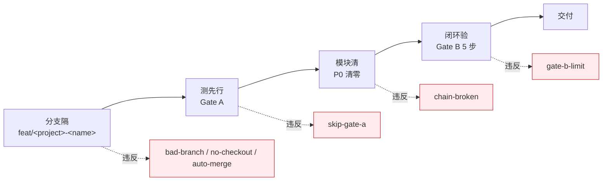

---
paths:
  - "**/*.{js,ts,jsx,tsx,vue,py,go,rs,java,rb,php}"
---

# code-pipeline

> 源码改动只走 `/rui code`，分支独立、测试在前、逐模块清零、Gate B 收口。

## 适用

源代码改动（含配置代码）。文档变更见 [doc-generation.md](./doc-generation.md)。

## 规则

### 分支隔（源码唯一入口）

1. 功能分支必须从 `main` 创建，命名 `feat/<project>-<name>`
2. 改动源码前必须已切到该分支（`no-checkout`），分支独立禁止派生（`bad-branch`）
3. 功能分支禁止自动合并到主干（`auto-merge`），git 操作由开发者手动执行
4. 源码修改唯一入口是 `/rui code` 管线，反推命令（`--from-code` / `--from-doc`）只读不写

### 测先行（Gate A）

5. `04-测试用例评审.md` 不存在，不得编码（`skip-gate-a`）
6. 例外：单行 CSS/文案变更可跳过 Gate A
7. 测试方案与原型未就绪即视为未通过

### 模块清（实现）

8. 逐模块编码：每模块完成后审查 P0/P1/P2，**P0 不清零不进下一模块**
9. 影响链未闭合不声称闭合（`chain-broken`），影响分析见 [agents/AGENT.md](../agents/AGENT.md)
10. 不创建设计文档外的文件；fix 模式预检仅查目标文件存在
11. P0 = 阻塞发布必修；P1 = 当轮修复；P2 = 记录不阻断

### 闭环验（Gate B）

12. 五步：环境快照 → 静态预检 → 设计/实现对齐 → 单次执行 → 三报告（05/06/07-实施与测试报告）
13. 三报告交叉引用闭合，评审清单全 ✅ 方过
14. 修复 ≤ 2 轮，超过阻断（`gate-b-limit`）
15. 自改进必须产出 08-自改进复盘，`no-metrics` 降级不阻断交付

### 产出收口

16. 关键产出限定在故事目录或对应参考文档目录，目录命名见 [doc-generation.md](./doc-generation.md)

## 例外

- 单行 CSS/文案：跳过 Gate A，仍走分支隔离
- 反推命令：分支隔离 + 只读源码（不触发 Gate A/B）

## 阻断标识汇总

| 标识 | 触发 |
|------|------|
| `bad-branch` | 分支非从 main 创建或混入非本故事代码 |
| `no-checkout` | 未切换故事分支即改源码 |
| `auto-merge` | 功能分支被自动合并到 main |
| `skip-gate-a` | Gate A 未通过即编码 |
| `chain-broken` | 影响链未闭合 |
| `gate-b-limit` | Gate B > 2 轮 |
| `no-metrics` | self-improve 数据采集失败（降级，不阻断） |
