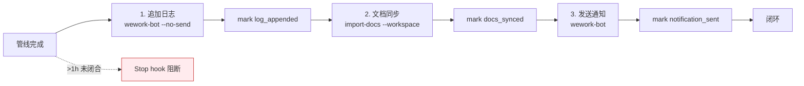

---
paths:
  - "docs/故事任务面板/**/.memory/rui-state.json"
---

# Delivery Gate Rules

> **口诀：标记即证据。** 每个 `/rui` 末端三步交付按序执行，每步必标记。未标记 = 未执行。

| Step | 操作 | 标记 |
|------|------|------|
| 1 | `Skill(wework-bot, --no-send)` 追加日志 | `log_appended` |
| 2 | `Skill(import-docs, --workspace)` 同步 | `docs_synced` |
| 3 | `Skill(wework-bot)` 发送通知 | `notification_sent` |

每步完成后必须调用 `delivery-gate.js mark --step <step>` 写入 `rui-state.json`。

## 规则

1. **标记即证据**：未标记视为未执行，"看起来调用了"不等于"已标记"
2. **Stop hook**：近期 rui 活动（1h 内）且管线未闭合 → 阻断停止
3. **恢复**：按提示执行缺失步骤并标记，闭合后自动放行
4. **`no-token` 降级**：仅 `API_X_TOKEN` 缺失时 import-docs 可跳过，但仍需标记（降级完成）
