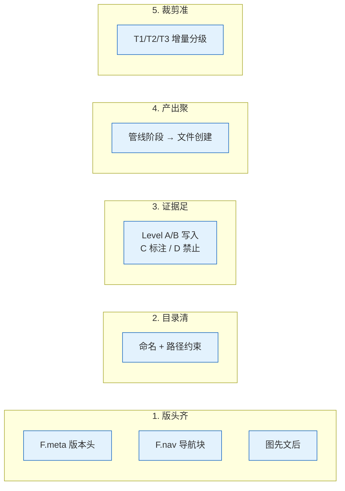

---
paths:
  - "docs/**/*.md"
  - ".claude/formulas.md"
---

# doc-generation

> 文档生成的五条强制约束。图先文后；编号即顺序；不可提前创建。

故事文档公式见 [formulas.md](../skills/rui/formulas.md)；目录与数据契约见 [coder.md](../skills/rui/coder.md)。

## 适用

`docs/故事任务面板/` 下的故事文档产出。参考文档公式（F.ref.\*）不受此约束。

## 规则

### 1. 版头齐

1. 版本行必填，占位符 `{...}` 留空即偏差
2. 主体章节首尾含导航块（F.nav），索引文件除外
3. 先图后文——架构/流程/关系优先 mermaid，文字补充细节

### 2. 目录清

故事文档按项目独立子目录组织，缺项目级目录阻断。

| 文档类 | 路径模式 | 文件编号 | 用途 |
|--------|---------|---------|------|
| 故事 | `docs/故事任务面板/<Project>/<name>/` | 编号前缀 + 补充 | 执行 |

命名约束：`<Project>` 大驼峰；`<name>` kebab-case；CLI 输入 `<Project>-<name>`。

### 3. 证据足

4. 证据 Level A/B 可直接写入；C 标注 `> 待补充`；D 禁止出现（见 [agents/AGENT.md](../agents/AGENT.md)）
5. 不编造未验证的模块名/接口/路径/文件名
6. 跨文档引用先指向索引文件，再按需深入章节

### 4. 产出聚

文件按管线阶段创建，不可提前。

| 阶段 | 创建 | 条件 |
|------|------|------|
| 文档生成 | 故事任务 + 技术评审 + 测试评审 + 补充 | 故事任务必创建；技术评审按项目类型 |
| 验证 | 后端实施/前端实施/测试报告 | 有对应技术评审时 |
| 自改进 | 自改进复盘 | 必创建 |
| 交付 | 消息通知列表 | 自动追加 |

### 5. 裁剪准

增量更新按变更范围自动裁剪管线。

| 级别 | 范围 | 影响分析 | 架构设计 | 文档刷新 |
|------|------|---------|---------|---------|
| T1 | 措辞/格式修正 | 跳过 | 跳过 | 仅变更章节 |
| T2 | 增删/接口变更 | 裁剪 | 裁剪 | 目标 + 下游 |
| T3 | 边界变化/跨故事重构 | 完整重跑 | 完整重跑 | 全级联刷新 |

### 补充文档

pm 主导，按需生成。触发条件与完整公式见 [formulas.md §补充文档公式](../skills/rui/formulas.md#补充文档公式)。

| 触发 | 文档 |
|------|------|
| UI 改造 | 页面设计.md |
| API 变更 | API契约.md |
| 数据存储变更 | 数据迁移.md |
| 第三方集成 | 集成方案.md |
| 新权限控制 | 权限模型.md |
| 性能敏感 | 性能基准.md |

### 策展

7. 策展阶段必须 git commit
8. `--from-code` 两模式，输出均落故事任务面板：
    8a. req 空：pm 扫描源码推荐列表，用户选择后生成（探索模式）
    8b. req 有值：pm 从源码反推故事文档基线，证据 Level B，标注源码路径（反推模式）

## 例外

- T1 级变更可跳过影响分析与架构设计
- 反推命令只读源码，不触发 Gate A/B（见 [code-pipeline.md](./code-pipeline.md)）
