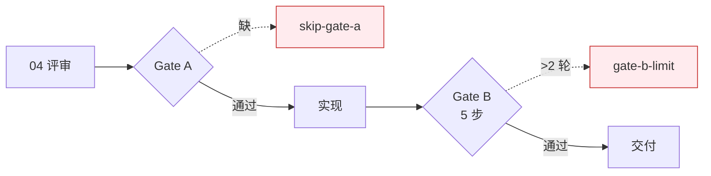

---
paths:
  - "docs/故事任务面板/**/*.md"
---

# Gate Rules

> **口诀：先则编、闭则交。** Gate A 通过才能编码，Gate B 闭合才能交付。P0 不清零、引用不闭合，一律阻断。

## Gate A — 测试先行

| 条件 | 结果 | 标识 |
|------|------|------|
| 04-测试用例评审.md 不存在 | 阻断编码 | `skip-gate-a` |
| 单行 CSS 变更 | 可跳过 | — |
| 测试方案 + 原型就绪 | 通过 | — |

## Gate B — 验证（5 步）

| 步骤 | 内容 | 失败处理 |
|------|------|---------|
| 1 | 环境快照 | 记录 |
| 2 | 静态预检 | P0 阻断 |
| 3 | 对齐（设计 vs 实现） | 偏差记录到 05/06 §2 |
| 4 | 单次执行 | 记录用例结果 |
| 5 | 产出三报告（05/06/07） | 缺一不通过 |

约束：
- 三报告交叉引用闭合，评审清单全 ✅ 方过
- 修复 ≤ 2 轮，超过阻断（`gate-b-limit`）

## P0 审查标准

| 级别 | 含义 | 处理 |
|------|------|------|
| P0 | 阻塞发布 | 必修，清零后方可继续 |
| P1 | 建议修复 | 当轮修复 |
| P2 | 可选优化 | 记录，不阻断 |
