# 文档生成技能

---

> ## ⚠️ 强制最终步骤——每次调用完成前必须执行，禁止省略
>
> 无论文档生成是否成功，在保存文档后都必须**按顺序**完成以下两步，才算本次调用交付完成：
>
> **步骤 A：执行 import-docs 文档同步**
> 读取 `.claude/skills/import-docs/SKILL.md`，执行 `docs` 标准导入：
> ```bash
> node .claude/skills/import-docs/scripts/import-docs.js --dir docs --exts md
> ```
> - `docs` 不存在时跳过，并记录为 `☁️ 文档同步：docs 不存在，跳过导入`
> - 失败不阻断交付，但必须记录失败文件数和错误摘要
>
> **步骤 B：发送 wework-bot 完成通知**
> 读取 `.claude/skills/wework-bot/SKILL.md`，选择对应模板发送完成通知，并把步骤 A 的真实同步结果写入 `☁️ 文档同步` 行；通知**必须**含本次会话 `⏱️ 用时` 与 `🪙 会话用量`（可用 `--duration` / `--token-usage` 或脚本缺省说明，见 wework-bot 技能）：
> - P0 全部通过 → 使用 "generate-document 完成（成功）" 模板（📄✅）
> - P0 有失败项 → 使用 "generate-document 完成（含 P0 失败）" 模板（⚠️❌）
> - 每条信息独占一行，使用 `━━━` 分隔线，数字填写实际值（禁止发含 `<占位符>` 的消息）
>
> **⛔ 无例外：未完成 import-docs 与 wework-bot 两步，即视为本次 `generate-document` 未结束、不得宣告交付。**

---

## 核心原则

1. **规范优先，模板为辅**：`rules/<类型>.md` 是唯一的"契约"（强约束），`templates/<类型>.md` 只在适用时作为"起手骨架"。
2. **设计文档 与 动态检查清单 不使用模板**：它们必须 **完全基于规范 + 上游文档 + 实际代码** 动态生成，以避免模板槽位诱导模型编造内容。
3. **Grounding 防幻觉**：任何技术事实（模块、路径、接口、行为、场景）都必须可追溯到 **已读取的上游文档或代码**；无据可依时 **宁缺毋滥**，需在文档中显式标注"待补充（原因：未找到来源）"。细则与禁止类陈述见 `../../shared/evidence-and-uncertainty.md`。
4. **结构即契约**：文档结构严格以 `rules/<类型>.md` 为准，不得新增未约定章节，也不得省略 P0 章节。
5. **使用 find-skills / find-agents 扩展能力**：关键节点（搜索参考、专家审查、E2E 验证）显式调用，不做"凭感觉"。
6. **共享约定集中维护**：文档类型矩阵见 `../../shared/document-contracts.md`，路径写法见 `../../shared/path-conventions.md`，Skill / Agent 分工见 `../../shared/agent-skill-boundaries.md`。
7. **每次调用必须落盘**：无论成功、缺参、阻断或自检失败，本 skill 每次被调用都必须在 `docs/` 下创建或更新至少一个 Markdown 文件（标交付为 `docs/<功能名>/` 下全文档；无法继续时，写入 `docs/99_agent-runs/<YYYYMMDD-HHMMSS>_generate-document.md`）。
8. **影响分析必须覆盖全项目依赖链**：需求任务与设计文档生成前必须按 `../../shared/impact-analysis-contract.md` 执行全项目搜索，覆盖上游依赖、反向依赖、传递依赖、导出链、注册链、数据流、类型契约、测试、文档、配置与外部依赖影响。
9. **证据与不确定性共享规范**：`../../shared/evidence-and-uncertainty.md` 定义真值层级、禁止类陈述、可采纳性与和 `implement-code` 的衔接；生成正文、检查清单与「下一步」时 **必须** 遵守，不得仅依赖本节摘要。

## 提升文档采纳率（面向人类读者）

> 目标：让产物可被快速核对、补全与落地实施，**降低因虚构细节导致的返工**。

1. **开放问题与假设集中化**：在需求/设计类文档中增设或沿用规范要求的章节，将「待读者确认」「依赖产品决策」集中列出；与正文事实混写时，每条假设须标注 C 类（见 `evidence-and-uncertainty.md`）或链回 A 类来源。
2. **决策与取舍显式化**：对可选方案（库、目录结构、API 形态）只写**已** `search-first` 或已读代码支持的选项；未做检索的写 `> 待补充（原因：未执行选型检索）`，禁止编造假选型对比表。
3. **可验证的「读者自检」**：在适用文档的尾部或 P1 区增加短列表：如何用 `Grep`/打开路径核对本文关键断言（不要求读者运行业务代码，但须给出**仓库内**可执行动作）。
4. **与实施衔接的完整性**：全文档或需求任务+设计产线应使 `02` 中场景在 `05` 中有可映射检查项；若无法映射，在 `05` 或备忘中显式写「缺口：场景 X 无对应用例」，避免 `implement-code` 阶段 0 场景—检查项覆盖预检缺项。
5. **P0 自检与证据一致**：`checklists/通用文档.md` 中「证据与可采纳性」P0 未通过时，不得宣称生成完成；宁可顶部标注未通过项与回修说明。

## 何时使用

- **仅**为某一功能在 `docs/<功能名>/` 下生成或更新**完整全文档**（各编号 `01`…`05`、`07` 等，按 `rules` 与依赖顺序产出；`06_实施总结.md` 仍由 `implement-code` 写入，本技能不创建）。
- 若用户只要求单份需求/单份设计等：应说明本技能以**全文档**为标交付形态，并引导按全文档一次生成/更新，**不提供**「只生成其中某一个编号文件」作为推荐用法（README / 本节的示例亦不再展示单文档命令）。

## 全文档包含的类型（落盘于 `docs/<功能名>/`）

本技能**只**向 `docs/<功能名>/` 交付下列编号文件（不写入 `docs/01_需求文档/` 等平铺单路径）。

| 类型 | 模板 | 规范 | 文件名 | 依赖文档 | 生成方式 |
|------|------|------|--------|---------|---------|
| 需求文档 | ✅ | ✅ | `01_需求文档.md` | - | 模板骨架 + 规范约束 |
| 需求任务 | ✅ | ✅ | `02_需求任务.md` | 需求文档 | 模板骨架 + 规范约束 |
| 设计文档 | ❌（禁用） | ✅ | `03_设计文档.md` | 需求任务 | **仅规范驱动**（基于上游 + 代码） |
| 使用文档 | ❌ | ✅ | `04_使用文档.md` | 设计文档 | 规范驱动 |
| 动态检查清单 | ❌（禁用） | ✅ | `05_动态检查清单.md` | 需求任务、设计文档 | **仅规范驱动**（从上游场景抽取） |
| 实施总结 | — | — | `06_实施总结.md` | — | **仅** `implement-code` 写入，本技能不创建 |
| 项目报告 | ❌ | ✅ | `07_项目报告.md` | 设计文档 | 规范驱动 + 真实变更数据 |

> 说明：**"禁用模板"** 意味着即使 `templates/` 目录下存在同名文件，也不作为生成输入；改为仅读取 `rules/<类型>.md` 并从上游文档/代码中提取事实。各子类型在实现时仍按对应 `rules/`、`checklists/` 执行，只是**对外唯一交付形态**为全文档目录。

## 快速开始

```bash
/generate-document 简洁功能名-用户故事简短描述
```

- 保存位置：`docs/简洁功能名/`
- 目录内需包含的编号文件见上文「全文档包含的类型」表（`01`…`05`、`07`；`06` 不由本技能创建）。

## 强制保存契约

每次调用 `generate-document` 都必须完成一次文件写入（**标交付**为全文档目录下文件；失败或阻断时仍须落盘见下行）。

| 场景 | 必须写入的文件 |
|------|---------------|
| 全文档生成成功 | `docs/<功能名>/` 下本技能负责的各编号文档（`01`…`05`、`07`） |
| P0 自检失败但已生成正文 | 已产出的目标编号文档，顶部标注未通过项和待补充原因 |
| 缺少功能名或关键上游材料、无法按全文档继续 | `docs/99_agent-runs/<YYYYMMDD-HHMMSS>_generate-document.md` |

兜底运行记录必须包含：原始用户请求、已解析参数、阻断原因、缺失输入、建议下一步。若 `docs/99_agent-runs/` 不存在，必须先创建目录。禁止只口头询问用户而不写入任何 `docs/` 文件。

## 核心工作流

### 阶段划分（9 步）

1. **解析请求** → 识别 `{功能名, 参考文档}`，按**全文档**子阶段在内部映射各 `rules/<类型>.md`；缺失必填参数时，先写入兜底运行记录，再向用户澄清。
2. **发现相关技能（find-skills）** → 按全文档将涉及的子类型预检相关技能，显式列出将调用的技能。
3. **加载规范** → 读取 `rules/<类型>.md`（以及 `rules/通用文档.md`、`rules/编码规范.md` 等项目通用规范）。
4. **模板决策**：
   - **设计文档 / 动态检查清单** → **跳过模板**，进入"规范驱动模式"。
   - 其他类型 → 若 `templates/<类型>.md` 存在，读取作为结构骨架；否则退回"规范驱动模式"。
5. **读取上游文档（Grounding）** → 按依赖关系读取前一阶段文档；若是设计文档/项目报告，同时阅读相关源码（路径取自需求任务或用户输入）。
  - **需求任务 / 设计文档专项——全项目影响分析（必须执行）**：
    0. **先读取共享契约**：执行前必须读取 `../../shared/impact-analysis-contract.md`，以其中的适用阶段、搜索范围、必查维度、输出格式和 P0 门禁为准。
    1. **搜索词来源**：
        - 需求任务：从需求文档中提取核心模块名、组件名、事件名、Store key、路由路径、CSS 类名、公用工具函数名、配置项、依赖包名等。
        - 设计文档：从需求任务文档中提取上述标识符及函数名、文件路径、导出名、数据契约和测试 / 文档引用。
    2. **建立改动点清单**：按 component / store / route / event / css / config / dependency 等类型整理搜索词，先搜索实现点，再搜索导出入口、注册入口和公共聚合入口。
    3. **按契约全项目搜索**：覆盖上游依赖、反向依赖、传递依赖、导出链、注册链、数据流、类型契约、样式、测试、文档、配置、外部依赖；不得只搜索当前目录或 `src/`。
    4. **追踪依赖链闭合**：对每个命中点继续检查“它依赖谁、谁依赖它、是否继续导出 / 注册 / 转发 / 封装 / 被测试或文档依赖”，直到闭合或明确记录停止原因。
    5. **输出四个部分**：搜索词与改动点清单、改动点影响链、依赖闭合摘要、未覆盖风险，写入对应章节（需求任务第 6 章 / 设计文档第 5 章）。**未完成此步骤禁止进入第 7 步生成文档正文**。
6. **专家分派（find-agents）** → 按类型选择并行代理：
   - 设计文档 → `planner` + `architect`
   - 项目报告 → `code-reviewer` + `docs-lookup`
   - 含 E2E 场景的检查清单 → `e2e-tester`
7. **生成文档** → 严格按 `rules/<类型>.md` 的章节顺序产出；**每个技术断言必须在文中关联到来源**（上游文档链接或代码路径）；无据可依的章节标注"待补充"。
   - **版本信息头部必须填写实际值**（不得保留占位符）：
     - `{大模型名称}` → 当前会话使用的大模型名称，如 `Claude Sonnet 4.6`、`Claude Opus 4`、`GPT-4o` 等
     - `{Claude Code / Cursor}` → 实际使用的 AI 工具，运行在 Cursor IDE 内填 `Cursor`，通过 Claude Code CLI 运行填 `Claude Code`
8. **质量自检** → 加载 `checklists/<类型>.md`：**P0 全部通过**才能保存为通过状态；未通过则回到第 7 步修复（最多自修复 1 轮），仍未通过也必须保存目标文档并显式标注问题。
9. **保存 + 审查（可选）** → 保存后可触发 `doc-reviewer` / `code-reviewer` / `doc-updater` 并行审查；记录未修复问题。
10. **文档同步 + 完成通知**（每次必须执行，不得省略）：
    - **import-docs**：读取 `import-docs` 技能，执行 `docs` 标准导入（见 `import-docs/SKILL.md §docs 标准导入`）；目录不存在时记录 `☁️ 文档同步：docs 不存在，跳过导入`；失败不阻断但须记录失败文件数和错误摘要。
    - **wework-bot**：读取 `wework-bot` 技能，**严格按照** `wework-bot/SKILL.md §生动总结格式规范` 中的对应模板发送完成通知，并把 import-docs 的真实结果写入 `☁️ 文档同步` 行；**须含** `⏱️ 用时` 与 `🪙 会话用量`（与 wework-bot 技能、脚本约定一致）：
      - P0 全部通过 → 使用 "generate-document 完成（成功）" 模板（📄✅）
      - P0 有失败项 → 使用 "generate-document 完成（含 P0 失败）" 模板（⚠️❌）
      - 每条信息独占一行，使用 `━━━` 分隔线，数字填写实际结果
    - 两步均完成后才算本次调用交付完成；import-docs 失败不阻断交付，但必须在通知中注明。

### 流程图

```mermaid
flowchart TD
    Start([接收请求]) --> Parse["1 解析：类型 / 功能名 / 参考文档\n必填参数缺失 → 先写 docs/99_agent-runs 兜底记录\n再向用户澄清"]

    Parse --> FS["2 find-skills\n按类型枚举候选技能\nsearch-first / e2e-testing\nverification-loop / code-review"]

    FS --> LoadRules["3 加载规范\nrules/类型.md\nrules/通用文档.md\nrules/编码规范.md（若涉及代码）"]

    LoadRules --> TplGate{"4 模板决策\n设计文档 或 动态检查清单?"}

    TplGate -->|是| RulesOnly["规范驱动模式\n禁用模板\n章节顺序完全来自 rules\n每个事实必须来自上游文档或代码"]
    TplGate -->|否| TplCheck{"templates/类型.md 存在?"}
    TplCheck -->|是| ReadTpl["读取模板作为骨架\n仅作结构提示\n内容仍依据规范与上游"]
    TplCheck -->|否| RulesOnly
    ReadTpl --> Upstream

    RulesOnly --> Upstream["5 读取上游 + Grounding\n按依赖读 docs/前一阶段/功能名.md\n设计文档或项目报告：读取相关源码\n建立事实-来源映射表"]

    Upstream --> ImpactAnalysis{"是需求任务\n或设计文档?"}
    ImpactAnalysis -->|是| GrepSearch["5a 全项目影响分析（强制）\n先读取 shared/impact-analysis-contract.md\n建立搜索词与改动点清单\n全仓库搜索：上游依赖 / 反向依赖 / 传递依赖\n导出链 / 注册链 / 数据流 / 类型契约\nCSS / 测试 / 文档 / 配置 / 外部依赖\n追踪到影响链闭合或记录停止原因\n产出：改动点清单 + 影响链 + 依赖闭合摘要 + 未覆盖风险\n⛔ 未完成禁止进入生成步骤"]
    ImpactAnalysis -->|否| FA
    GrepSearch --> FA

    FA["6 find-agents\n分派并行代理\n设计文档：planner + architect\n项目报告：code-reviewer + docs-lookup\n含 E2E 场景：e2e-tester"]

    FA --> Gen["7 生成文档\n严格按 rules 章节顺序\n每条技术断言关联来源\n无来源时写 待补充\n禁止虚构模块/接口/路径"]

    Gen --> SelfCheck["8 质量自检\n加载 checklists/类型.md\n统计 P0 / P1 / P2"]

    SelfCheck --> P0{"P0 全部通过?"}
    P0 -->|否| FixOnce{"已自修复?"}
    FixOnce -->|否| Fix["按 P0 问题回修\n重跑自检"]
    Fix --> SelfCheck
    FixOnce -->|是| Record["记录未解决 P0\n在文档顶部显式标注"]
    P0 -->|是| Save
    Record --> Save

    Save["9 保存\ndocs/功能名/ 下 01~05、07\n（06 不创建）"] --> DynCL["生成动态检查清单\n从需求任务抽取场景\n从设计文档抽取实现路径\n使用 find-skills 映射验证技能\n完全基于规范 不使用模板\n文件名：05_动态检查清单.md"]

    DynCL --> ReviewGate{"进入 Agents 审查?"}
    ReviewGate -->|否| Notify
    ReviewGate -->|是| Reviewers["并行审查\ndoc-reviewer / code-reviewer / doc-updater"]
    Reviewers --> Notify

    Notify["10 文档同步 + 完成通知（必须执行）\nimport-docs：docs 标准导入\n目录不存在→记录跳过\n失败→不阻断但记录失败摘要\nwework-bot：按生动总结格式规范发送完成通知\n成功→📄✅模板 / P0失败→⚠️❌模板\n☁️行必须填写 import-docs 真实结果"]
    Notify --> End([交付])

    classDef skill fill:#e1f5ff,stroke:#0066cc,stroke-width:2
    classDef rules fill:#ffe6cc,stroke:#e67300,stroke-width:2
    classDef guard fill:#ffcccc,stroke:#cc0000,stroke-width:2
    classDef impact fill:#fff0f0,stroke:#cc0000,stroke-width:3,stroke-dasharray:5 5
    class FS,FA,DynCL skill
    class LoadRules,RulesOnly,Upstream rules
    class P0,SelfCheck guard
    class GrepSearch impact
```



### 防幻觉约束（强制）

- **规范驱动模式下**（设计文档 / 动态检查清单）：
  - **不得读取** `templates/<类型>.md`，即便存在。
  - 章节顺序、命名、图表要求严格来自 `rules/<类型>.md`。
  - 禁止从模板占位符反推内容（例如"因为模板有'架构设计'章节，就虚构一套架构"）。
- **事实-来源映射**：生成文档前在内部维护一张表 `事实 → {上游文档章节 | 代码路径:行}`；写作时逐条核对。
- **未知处理**：若某 P1/P2 章节无来源，写入 `> 待补充（原因：未在 <上游文档名> 中找到相关描述）`，**不虚构**。若缺失内容属于 P0，则 **拒绝输出**，要求用户补齐前置材料。
- **代码路径真实性**：任何引用的文件路径必须 **实际存在于仓库**；生成设计文档时先用文件搜索校验路径。
- **Mermaid 图真实性**：节点/模块必须对应真实模块或已规划模块，不得为"让图好看"而编造节点。

## 关键要求

### 项目报告（强制要求）

必须包含：
1. **交付摘要** - 说明交付目标、核心结果、变更规模、验证结论和当前状态，所有结论必须可追溯
2. **报告范围** - 明确纳入范围、排除范围和不确定项，避免混入工作区无关变更
3. **变更概览与影响评估** - 从功能、文档、配置、测试等变更域说明改前改后、价值、影响面与处置建议
4. **验证结果** - 如实记录已执行、未执行、失败的验证项及证据
5. **风险与遗留项** - 明确仍需关注的问题；无风险时也必须写明依据
6. **变更文件列表** - 所有修改文件的完整列表、路径、变更类型、变更域
7. **变更前后内容对比** - 每个变更文件的"变更前"和"变更后"内容对比，长文件可截取关键段落并说明依据
8. **变更汇总表** - 文件路径、变更类型、变更域、影响评估、关键变更说明、验证覆盖

### 动态检查清单（规范驱动，不使用模板）

完全基于规范和上游文档生成，**禁止读取** `templates/动态检查清单.md`：

1. **抽取主要操作场景**：读取 `docs/<功能名>/02_需求任务.md`（全文档落盘路径），按"场景名 / 前置条件 / 操作步骤 / 预期结果"结构化抽取；抽不到则中止并告知用户需求任务缺失信息。
2. **抽取实现细节**：读取 `docs/<功能名>/03_设计文档.md`，对每个场景定位"主要操作场景实现"章节，提取"涉及模块 / 关键代码路径 / 验证要点"。
3. **映射验证技能**：用 `find-skills`（见下文）对每个场景选出最合适的验证技能，禁止臆造能力：
   - UI / 用户流程 → `e2e-testing` + Playwright
   - 代码实现 → `code-review`
   - 安全相关 → 通过 `find-agents` 选择 `security-reviewer`
   - 构建 / 集成 → `verification-loop`
4. **结构按规范生成**：章节骨架来自 `rules/动态检查清单.md`（若不存在，以 `rules/通用文档.md` 的通用头部 + 每场景一节的固定结构合成），**不得** 凭记忆套用历史模板。
5. **来源标注**：每条检查项必须标注来源（需求任务章节锚点 / 设计文档章节锚点 / 代码路径）。

### 检查清单优先级

- **P0 - 必须通过**：文档头部完整、必需章节存在、无断链、引用的代码路径真实存在、无事实-来源缺失
- **P1 - 应该通过**：段落结构、章节命名清晰、代码块标注语言
- **P2 - 可以有**：Mermaid 节点样式、图标使用一致性

## 相关技能与代理（使用契约）

### 技能：find-skills

**触发条件**：
- 解析请求后立即运行（流程第 2 步），用于 **预声明** 本次会用到的技能。
- 生成动态检查清单时，**每个场景** 都调用一次，用于映射验证技能。
- 遇到生成过程中出现的未知领域（如"需要做 E2E 验证"）时即时调用。

**输入**：
- 文档类型与功能描述摘要（≤ 100 字）
- 关键词列表（如 `["E2E", "Store 架构", "加密", ...]`）

**期望输出**：
- 候选技能列表 `[{name, 适用场景, 置信度}]`
- 至少一条"推荐技能"与一条"备选技能"

**使用规则**：
- 若 find-skills 未找到匹配技能，**不要编造** 一个不存在的技能名；在文档中标注"未找到合适验证技能，建议人工复核"。
- 候选技能的名称必须与 find-skills 返回值一致，不做大小写 / 别名变换。

### 技能：find-agents

**触发条件**（按文档类型）：
- **设计文档**（生成前）：获取 `planner` + `architect`
- **项目报告**（生成前）：获取 `code-reviewer` + `docs-lookup`
- **含 E2E 场景的检查清单**：获取 `e2e-tester`
- **保存后审查阶段**（可选）：获取 `doc-reviewer` + `code-reviewer` + `doc-updater`

**输入**：
- 当前文档类型
- 当前任务目标（"生成设计文档" / "审查刚生成的设计文档" 等）
- 可用的上游上下文摘要（上游文档路径 + 关键事实 3-5 条）

**期望输出**：
- 可并行调用的代理列表 `[{name, 角色, 输入契约, 输出契约}]`
- 每个代理的"必答问题"（供生成时填充到对应章节）

**使用规则**：
- 代理调用必须并行发起（独立任务），不等一个完成再起下一个。
- 代理返回内容只作为 **候选输入**，最终是否写入文档由本技能依据 `rules/<类型>.md` 决定。
- 代理声明未覆盖的领域不得由本技能"脑补"补齐。

### 其他相关技能

| 技能 | 用途 | 何时用 |
|------|------|--------|
| `search-first` | 并行搜索 npm / PyPI / MCP / GitHub / Web | 写设计文档时选型、引用外部库 |
| `e2e-testing` | E2E 测试方案与用例 | 动态检查清单中 UI 场景 |
| `verification-loop` | 构建 / 集成全面验证 | 动态检查清单中构建场景 |
| `code-review` | 代码审查 | 项目报告 / 动态检查清单中代码实现场景 |
| `import-docs` | 文档同步到 YiAi | **每次调用结束必须先执行（第 10 步）**：执行 `docs` 标准导入（见 `import-docs/SKILL.md §docs 标准导入`）；目录不存在时记录跳过；失败不阻断但须保留失败摘要 |
| `wework-bot` | 企业微信机器人通知 | **import-docs 后执行（第 10 步）**：严格按 `wework-bot/SKILL.md §生动总结格式规范` 发送完成通知；成功用 📄✅ 模板，P0 失败用 ⚠️❌ 模板；`☁️ 文档同步` 行必须填写 import-docs 真实结果 |

### 代理清单

| 代理 | 用途 | 触发阶段 |
|------|------|---------|
| `docs-lookup` | 查询项目文档结构与上游定位 | 第 5 步（Grounding） |
| `planner` | 需求任务 → 实施策略与风险 | 设计文档生成前 |
| `architect` | 系统架构 / 接口 / 数据流 | 设计文档生成前 |
| `e2e-tester` | UI / 流程场景测试方案 | 动态检查清单 E2E 场景 |
| `code-reviewer` | 代码示例 / 架构一致性审查 | 项目报告生成 + 保存后审查 |
| `security-reviewer` | 安全与敏感内容 | 涉及鉴权 / 数据安全时 |
| `doc-reviewer` | 结构 / 规范 / 可读性审查 | 保存后审查 |
| `doc-updater` | 时效性 / 链接有效性 / codemap 同步 | 保存后审查 |

## 支持文件结构

```
.claude/skills/generate-document/
├── SKILL.md                 # 本文件
├── README.md                # 快速开始
├── checklist.md             # 主检查清单入口
├── checklists/              # 各文档类型检查清单
├── rules/                   # 各文档类型规范（唯一契约）
└── templates/               # 模板（设计文档、动态检查清单 不使用）
```

共享说明文档位于：

```
.claude/
├── README.md
└── shared/
    ├── document-contracts.md
    ├── evidence-and-uncertainty.md
    ├── agent-skill-boundaries.md
    └── path-conventions.md
```
