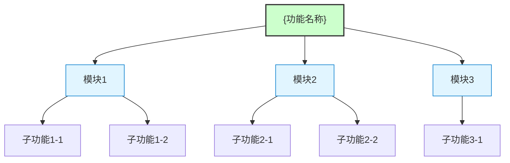
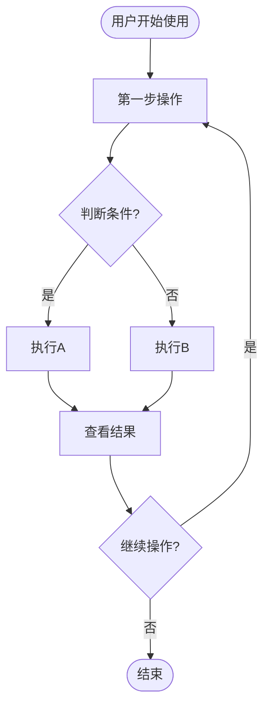
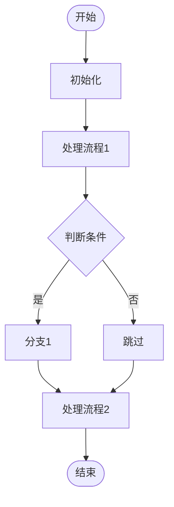
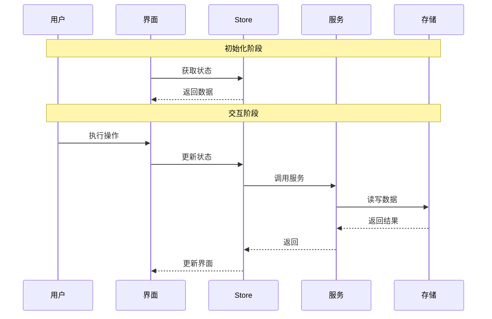
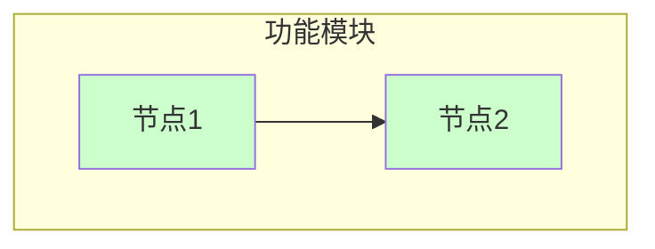

# {功能名称}

> **文档版本**: v1.0 | **最后更新**: {日期} | **维护者**: {大模型名称} | **工具**: {Claude Code / Cursor}
>
> **关联文档**: [需求文档](../01_需求文档/{文件名}.md) | [设计文档](../03_设计文档/{文件名}.md) | [使用文档](../04_使用文档/{文件名}.md)
>

[功能概述](#功能概述) | [功能分析](#功能分析) | [主要操作场景](#主要操作场景) | [功能详情](#功能详情) | [验收标准](#验收标准) | [使用场景示例](#使用场景示例)

---

## 功能概述

{简要说明功能的目标和范围，100-200字。说明这个功能解决什么问题，带来什么好处。}

**核心价值**
- 🎯 {价值点1描述}
- ⚡ {价值点2描述}
- 📖 {价值点3描述}

---

## 功能分析

[功能分解图](#功能分解图) | [用户流程图](#用户流程图) | [功能流程图](#功能流程图) | [完整时序图](#完整时序图)

### 功能分解图

**功能分解图说明**：{简要说明功能分解的逻辑和层次结构}

### 用户流程图

**用户流程图说明**：{简要说明用户操作的完整流程}

### 功能流程图

**功能流程图说明**：{简要说明系统功能的处理流程}

### 完整时序图

**时序图说明**：{简要说明各组件间的交互流程}

---

## 用户故事与验收标准

**优先级图标说明**：🔴 P0 - 必须有 | 🟡 P1 - 应该有 | 🟢 P2 - 可以有

| 用户故事 | 验收标准 | 过程生成文档 | 产出智能文档 |
|----------|----------|--------|----------|
| 🔴 作为[角色]，我想要[功能]，以便[价值] | 1. {验收标准1} 2. {验收标准2} | [{功能名称}-{用户故事简短描述}](../02_需求任务/{功能名称}-{用户故事简短描述}.md) [{功能名称}-{用户故事简短描述}](../03_设计文档/{功能名称}-{用户故事简短描述}.md) [项目报告](../05_项目报告/{功能名称}-{用户故事简短描述}.md) | [生成文档 Skill](../../.claude/skills/generate-document/SKILL.md) [需求任务规范](../../.claude/skills/generate-document/rules/需求任务.md) [需求任务模板](../../.claude/skills/generate-document/templates/需求任务.md) [需求任务检查清单](../../.claude/skills/generate-document/checklists/需求任务.md) |
| 🟡 作为[角色]，我想要[功能]，以便[价值] | 1. {验收标准1} 2. {验收标准2} | [{功能名称}-{用户故事简短描述}](../02_需求任务/{功能名称}-{用户故事简短描述}.md) [{功能名称}-{用户故事简短描述}](../03_设计文档/{功能名称}-{用户故事简短描述}.md) [项目报告](../05_项目报告/{功能名称}-{用户故事简短描述}.md) | [生成文档 Skill](../../.claude/skills/generate-document/SKILL.md) [需求任务规范](../../.claude/skills/generate-document/rules/需求任务.md) [需求任务模板](../../.claude/skills/generate-document/templates/需求任务.md) [需求任务检查清单](../../.claude/skills/generate-document/checklists/需求任务.md) |
| 🟢 作为[角色]，我想要[功能]，以便[价值] | 1. {验收标准1} 2. {验收标准2} | [{功能名称}-{用户故事简短描述}](../02_需求任务/{功能名称}-{用户故事简短描述}.md) [{功能名称}-{用户故事简短描述}](../03_设计文档/{功能名称}-{用户故事简短描述}.md) [项目报告](../05_项目报告/{功能名称}-{用户故事简短描述}.md) | [生成文档 Skill](../../.claude/skills/generate-document/SKILL.md) [需求任务规范](../../.claude/skills/generate-document/rules/需求任务.md) [需求任务模板](../../.claude/skills/generate-document/templates/需求任务.md) [需求任务检查清单](../../.claude/skills/generate-document/checklists/需求任务.md) |

---

## 主要操作场景

为每个用户故事定义主要操作场景，用于后续动态生成检查清单和验证方案。

---

#### 🎯 场景：{主要操作场景名称（对应用户故事1）

**关联用户故事**：🔴 {用户故事简短描述

**场景描述**：{简要描述这个操作场景，说明用户要完成什么目标}

**前置条件**：
- {条件1}
- {条件2}

**操作步骤**：
1. {步骤1：用户执行的具体操作}
2. {步骤2}
3. {步骤3}

**预期结果**：{描述操作完成后的预期结果，用户能看到什么、能做什么}

**验证关注点**：
- {关注点1：需要验证的关键点}
- {关注点2}
- {关注点3}

**相关设计文档章节**：{指向设计文档中对应的实现章节，如[架构设计](#架构设计)、[实现方案](#实现方案)等}

---

#### 🎯 场景：{主要操作场景名称（对应用户故事2）}

**关联用户故事**：🟡 {用户故事简短描述}

**场景描述**：{简要描述这个操作场景}

**前置条件**：
- {条件1}
- {条件2}

**操作步骤**：
1. {步骤1}
2. {步骤2}

**预期结果**：{描述预期结果}

**验证关注点**：
- {关注点1}
- {关注点2}

**相关设计文档章节**：{设计文档对应章节}

---

## 功能详情

#### {功能点1标题}

**功能说明**：{详细描述该功能点的具体需求和实现要求}

**价值**：{描述该功能带来的价值}

**解决的痛点**：{描述解决的问题}

**收益**：{描述具体收益，可量化}

---

#### {功能点2标题}

**功能说明**：{详细描述该功能点的具体需求和实现要求}

**价值**：{描述该功能带来的价值}

**解决的痛点**：{描述解决的问题}

**收益**：{描述具体收益}

---

## 验收标准

### P0 - 必须通过
- [ ] **验收项1**：{清晰可测试的验收标准描述}
- [ ] **验收项2**：{清晰可测试的验收标准描述}

### P1 - 应该通过
- [ ] **验收项3**：{清晰可测试的验收标准描述}

### P2 - 可以有
- [ ] **验收项4**：{清晰可测试的验收标准描述}

---

## 使用场景示例

#### 📋 场景一：{场景标题}

> **背景**：{场景背景描述，1-2句话}
>
> **操作**：{用户的具体操作步骤，分点描述}
>
> **结果**：{预期的结果和价值，用户能看到什么或能做什么}

---

#### 🎨 场景二：{场景标题}

> **背景**：{场景背景描述}
>
> **操作**：{用户的具体操作步骤}
>
> **结果**：{预期的结果和价值}
