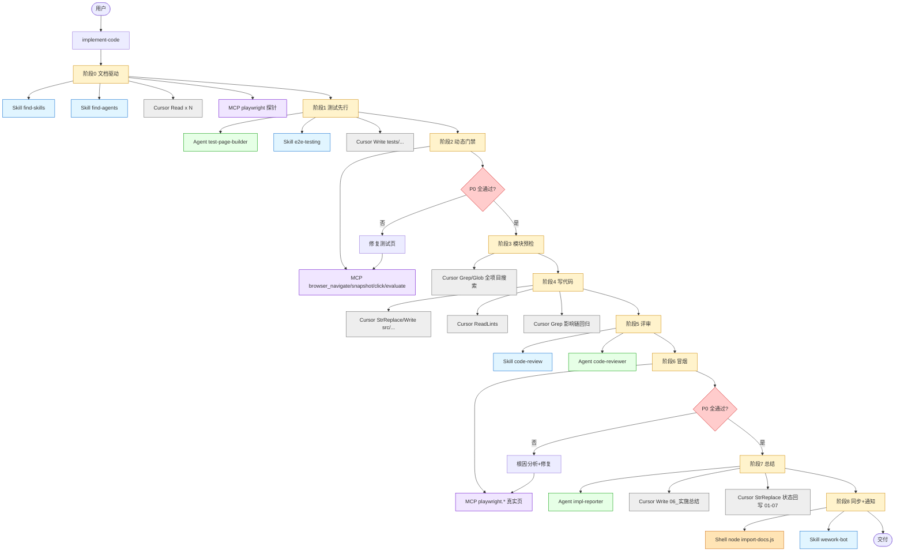
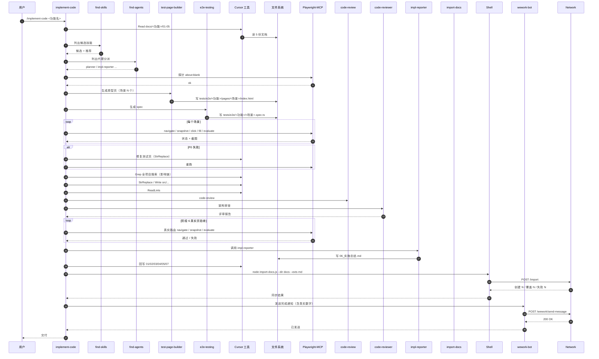

# 过程总结规范

> 本规范约束 implement-code 技能在**阶段 7（过程总结）**以及**任何阶段因阻断停止时**生成的总结文档内容与格式。
> 总结文档的目的：**让任何人都能通过这份文档重现整个 AI 调用过程，看到每一次 Skill / Agent / MCP / Cursor 工具 / Shell 命令 / 文件读写 / 文档同步 / 通知推送的真实路径与产物**。

---

## 1. 核心约束（P0）

| 编号 | 约束 |
|------|------|
| S0-1 | 总结文档 **必须** 保存到 `docs/<功能名>/06_实施总结.md`。 |
| S0-2 | 必须包含 Mermaid **AI 调用流程图**：完整覆盖本次任务所有实际调用过的 **Skills / Agents / MCP 工具 / Cursor 工具 / Shell 命令 / 文件读写 / Git 操作 / 第三方服务**；不得只画阶段名称，每个阶段必须有具体调用节点。 |
| S0-3 | 必须包含 Mermaid **AI 调用时序图**：参与者覆盖用户、所有调用过的 Skill、Agent、MCP、Cursor 工具、文件系统、Playwright、import-docs、wework-bot 等；只记录实际发生的消息往返，不得画理想路径。 |
| S0-4 | 必须包含**变更文件清单**：路径 + 变更类型 + 关联模块 + 说明；测试相关文件必须全部位于 `tests/` 下，存在逸出文件即视为 P0 阻断（按 `artifact-contracts.md §2` 处理）。 |
| S0-5 | 必须包含**验证门禁结果归档**：原文引用阶段 2 动态检查门禁报告 + 阶段 4 逐模块验证汇总 + 阶段 6 冒烟测试报告 + 动态检查清单状态回写记录 + 测试路径门禁扫描记录。 |
| S0-6 | 图表中的节点 / 参与者 **必须** 与「AI 调用记录」表一一对应；表中出现但图中缺失，或图中出现但表中无记录，均视为 S0 不通过。 |
| S0-7 | **任何阶段因阻断停止时，必须生成停止时实施总结**（保存至同一文件），记录已执行阶段、已产生产物、阻断原因和建议操作。禁止在未生成实施总结的情况下终止流程。 |
| S0-8 | 阶段 7 必须包含**功能文档状态回写记录**：列出 `01/02/03/04/05/07` 的回写结果、最终状态和跳过 / 失败原因。 |
| S0-9 | 阻断、门禁失败或门禁失效时，必须包含**通知记录**：wework-bot 发送状态、脱敏机器人路由、模型、工具、最后更新时间（精确到秒）和失败原因（若有）。 |
| S0-10 | 必须完整列出**任务级 AI 调用清单**：以表格形式给出每一次 Skills / Agents / MCP / Cursor 工具 / Shell 命令 / Git 操作 / 文档同步 / 通知调用的顺序、阶段、输入摘要、输出 / 证据、耗时（可估计）、是否阻断 / 是否进入流程图 / 是否进入时序图。 |
| S0-11 | 正常完成总结必须包含**动态检查清单最终完成复查**：P0 / P1 / P2 统计、未完成项、需人工确认项、检查总结同步结果和最终结论。 |
| S0-12 | 必须包含**测试路径门禁扫描记录**：阶段 1 / 2 / 6 三次扫描的命令、命中清单、处置结果、最终结论；任一次未执行视为 S0 不通过。 |
| S0-13 | 必须包含**资源与耗时摘要**：本次任务的开始 / 结束时间（精确到秒）、总耗时、每阶段耗时估计、AI 调用累计次数（按 Skill / Agent / MCP / 工具分类）。 |
| S0-14 | **正常完成**时，`## 9. 未解决问题与后续建议` 下**必须**包含 `### 9.4`「技能与流程自我改进（证据驱动）」与 `### 9.5`「可执行下一步建议（可验证）」；内容须符合 `../../shared/evidence-and-uncertainty.md`，**禁止**无证据的泛化建议（如仅写「加强测试」而不给出文件/命令/清单项）。**阻断**型总结使用 `7.2` 模板的 `### 8.3` / `### 8.4` 承载**同一套要素**（可写「无」并述原因，不得虚构）。 |
| S0-15 | `9.5`（或阻断模板 `8.4`）中每条下一步须含：**依据**（引用 §5/§7/§8/阶段报告中的路径、检查项或命令输出）与**验证方式**（可重复命令、`05` 项号、或文档锚点），缺一不可则改列「待人类定义」或移出正文。 |

---

## 2. 文档结构（章节顺序不可变）

**章节速查（与正文 `##` 编号一致；禁止与「第 4 节」混指）**

| 节号 | 标题 | 说明 |
|------|------|------|
| §0 | 任务概览 | 时间、模型、分支、最终状态 |
| §1 | AI 调用流程图 | Mermaid flowchart，含 skills / agents / MCP / 工具实际节点 |
| §2 | AI 调用时序图 | Mermaid sequenceDiagram，真实消息往返 |
| §3 | 阶段执行摘要 | 阶段 0～8 状态与耗时 |
| §4 | 资源与耗时摘要 | 按类型汇总的调用次数（**不是**动态检查清单复查） |
| §5 | 验证门禁结果归档 | 含 **§5.4 测试路径门禁**、**§5.5 动态检查清单最终完成复查** |
| §6 | 状态回写记录 | `01/02/03/04/05/07` |
| §7 | 变更文件清单 | **所有测试类路径必须列在 `tests/` 下** |
| §8 | AI 调用记录 | 与 §1 / §2 一一对应 |
| §9 | 未解决问题与后续建议 | P1 / P2 / 已知限制 / **9.4 自我改进** / **9.5 可验证下一步** |
| §10 | 通知记录 | wework-bot、import-docs |

```markdown
# 实施总结：<功能名>

> 生成时间：<YYYY-MM-DD HH:mm:ss>  
> 关联文档：[需求任务](../02_需求任务.md) | [设计文档](../03_设计文档.md) | [动态检查清单](../05_动态检查清单.md)

## 0. 任务概览

| 项目 | 内容 |
|------|------|
| 功能名 | <功能名> |
| 触发方式 | `/implement-code <参数>` 或 自然语言 |
| 开始时间 | <YYYY-MM-DD HH:mm:ss> |
| 结束时间 | <YYYY-MM-DD HH:mm:ss> |
| 总耗时 | <Hh Mm Ss>（≈ <N> 分钟） |
| 模型 | <Claude Sonnet 4.6 / Claude Opus 4.7 / GPT-5.5 / ...> |
| 主要工具 | <Cursor Agent / Playwright-MCP / Shell / Git / ...> |
| 最终状态 | ✅ 全部通过 / 🟡 部分通过 / ⛔ 阻断 |
| Git 分支 | <branch-name> |
| Git Commit | <short-sha>（若有） |

## 1. AI 调用流程图

```mermaid
flowchart TD
  ...（实际调用路径：User → implement-code → skills / agents / MCP / Cursor 工具 / Shell / 文件系统 / Git / import-docs / wework-bot；含分支、循环、阻断节点；每个阶段至少有一个具体调用节点）
```

## 2. AI 调用时序图

```mermaid
sequenceDiagram
  ...（完整交互时序：用户 → implement-code → 各 Skill / Agent / MCP / Cursor 工具 / 文件系统 / import-docs / wework-bot 的真实消息往返；每次降级、阻断、修复循环都要在图中表现）
```

## 3. 阶段执行摘要

| 阶段 | 状态 | 关键结果 | 起止时间 | 耗时（估计） |
|------|------|---------|---------|-------------|
| 阶段 0：文档驱动 | ✅ | ... | <hh:mm:ss → hh:mm:ss> | <m 分 s 秒> |
| 阶段 1：测试先行 | ✅ | ... | ... | ... |
| 阶段 2：动态检查门禁 | ✅ | ... | ... | ... |
| 阶段 3：模块预检（全项目） | ✅ | ... | ... | ... |
| 阶段 4：写项目代码 | ✅ | ... | ... | ... |
| 阶段 5：代码评审 | ✅ | ... | ... | ... |
| 阶段 6：冒烟测试 | ✅ | ... | ... | ... |
| 阶段 7：过程总结 | ✅ | ... | ... | ... |
| 阶段 8：文档同步 + 通知 | ✅ | ... | ... | ... |

## 4. 资源与耗时摘要

| 维度 | 数量 | 说明 |
|------|------|------|
| Skills 调用次数 | <N> | find-skills / e2e-testing / verification-loop / code-review / search-first / import-docs / wework-bot |
| Agents 调用次数 | <N> | test-page-builder / code-reviewer / impl-reporter / architect / security-reviewer / docs-lookup |
| MCP 调用次数 | <N> | playwright (browser_navigate / snapshot / click / fill / evaluate) / 其他 |
| Cursor 工具调用 | <N> | Read / Write / StrReplace / Grep / Glob / SemanticSearch / ReadLints |
| Shell 命令次数 | <N> | npm / git / node / rg / find / cp / mv / rm |
| 文件读 | <N> | 区分代码 / 测试 / 文档 / 配置 |
| 文件写 | <N> | 区分新增 / 修改 / 删除 |
| 修复轮次 | 阶段 2: <N> 轮 / 阶段 6: <N> 轮 | 每轮列出修复项数 |
| 测试用例数 | spec <N> 个 / case <N> 个 | 通过 <N> / 失败 <N> / 跳过 <N> |

## 5. 验证门禁结果归档

<!-- 5.1 阶段 2 动态检查门禁报告（原文引用） -->

<!-- 5.2 阶段 4 逐模块验证结果汇总（按模块逐项） -->

<!-- 5.3 阶段 6 冒烟测试逐场景验收明细（含 MCP 操作序列与截图路径） -->

### 5.4 测试路径门禁扫描记录

| 阶段 | 扫描时间 | 命令命中数 | 处置 | 最终结论 |
|------|---------|-----------|------|---------|
| 阶段 1 退出前 | <YYYY-MM-DD HH:mm:ss> | <N> | <迁移 / 删除 / 例外说明> | ✅ 无逸出 / ⛔ 仍存在 N 个 |
| 阶段 2 退出前 | ... | ... | ... | ... |
| 阶段 6 退出前 | ... | ... | ... | ... |

> 命中清单：原样列出每个非合规路径文件、文件类型、处置方式与处置后路径。
> 命令版本以 `artifact-contracts.md §2.2` 为准。

### 5.5 动态检查清单最终完成复查

| 优先级 | 总数 | 已完成 | 未完成 | 需人工确认 | 结论 |
|------|------|--------|--------|------------|------|
| P0 | <N> | <N> | 0 | 0 | ✅ 全部完成 |
| P1 | <N> | <N> | <N> | <N> | <说明> |
| P2 | <N> | <N> | <N> | <N> | <说明> |

- 检查总结同步：已同步 / 未同步（原因：<说明>）
- 最终结论：`05_动态检查清单.md` 全部应完成项已完成，可结束 / 未完成，已转阻断

## 6. 状态回写记录

| 文件 | 回写结果 | 状态 | 说明 |
|------|----------|------|------|
| `01_需求文档.md` | 已更新 / 跳过 / 失败 | ✅ / 🟡 / ⛔ | ... |
| `02_需求任务.md` | 已更新 / 跳过 / 失败 | ✅ / 🟡 / ⛔ | ... |
| `03_设计文档.md` | 已更新 / 跳过 / 失败 | ✅ / 🟡 / ⛔ | ... |
| `04_使用文档.md` | 已更新 / 跳过 / 失败 | ✅ / 🟡 / ⛔ | ... |
| `05_动态检查清单.md` | 已更新 / 跳过 / 失败 | ✅ / 🟡 / ⛔ | ... |
| `07_项目报告.md` | 已更新 / 跳过 / 失败 | ✅ / 🟡 / ⛔ | ... |

## 7. 变更文件清单

| 文件路径 | 变更类型 | 关联模块 | 说明 | 是否在 `tests/` 下 |
|---------|---------|---------|------|-------------------|
| `src/stores/<x>.js` | 新增 | Store | ... | 否（生产代码） |
| `src/components/<x>.vue` | 修改 | UI | ... | 否（生产代码） |
| `tests/e2e/<功能>/<场景>.spec.ts` | 新增 | E2E | ... | 是 |
| `tests/e2e/<功能>/pages/<场景>/index.html` | 新增 | 原型页 | ... | 是 |
| `tests/e2e/<功能>/fixtures/<x>-mock-data.ts` | 新增 | mock | ... | 是 |
| `docs/<功能>/06_实施总结.md` | 新增 | 总结 | 本文件 | 否 |
| ... | | | | |

> 校验项：所有 spec / 原型页 / fixtures / 截图 / 下载 / 快照 / trace 必须在 `tests/` 下。如出现 `tests/` 外测试文件，视为 P0 阻断。

## 8. AI 调用记录

> 本表是「AI 调用流程图」与「AI 调用时序图」的真源；二者必须与本表一一对应。
> 若同一调用出现多次（如 ReadLints 多模块），合并为一行并在「次数」列标注。

| # | 类型 | 名称 | 阶段 | 输入摘要 | 输出 / 证据 | 次数 | 耗时（≈） | 是否进入流程图 | 是否进入时序图 |
|---|------|------|------|---------|------------|------|----------|---------------|----------------|
| 1 | Skill | find-skills | 阶段 0 | 文档类型 + 关键词 | 候选技能列表 | 1 | <Ns> | 是 | 是 |
| 2 | Skill | find-agents | 阶段 0 | 文档类型 + 上下文 | 代理分派结果 | 1 | <Ns> | 是 | 是 |
| 3 | Agent | test-page-builder | 阶段 1 | 场景列表 | 原型页路径 | <N> | <Ns> | 是 | 是 |
| 4 | Skill | e2e-testing | 阶段 1 | 场景 + 锚点 | spec 文件路径 | 1 | <Ns> | 是 | 是 |
| 5 | MCP | playwright.browser_navigate | 阶段 2 | 原型页 URL | 状态码 | <N> | <Ns> | 是 | 是 |
| 6 | MCP | playwright.browser_snapshot | 阶段 2 | DOM | 截图路径 | <N> | <Ns> | 是 | 是 |
| 7 | MCP | playwright.browser_click | 阶段 2 | testid | 操作结果 | <N> | <Ns> | 是 | 是 |
| 8 | MCP | playwright.browser_evaluate | 阶段 2 | 断言代码 | 通过 / 失败 | <N> | <Ns> | 是 | 是 |
| 9 | Cursor | Read | 阶段 3 / 4 | 文件路径 | 文件内容 | <N> | <Ns> | 否（量大可省） | 否 |
| 10 | Cursor | StrReplace / Write | 阶段 4 | 路径 + diff 摘要 | 文件落盘 | <N> | <Ns> | 是 | 是 |
| 11 | Cursor | Grep / Glob | 阶段 3 / 4 | 搜索词 | 命中文件 | <N> | <Ns> | 是（影响分析） | 是 |
| 12 | Cursor | ReadLints | 阶段 4 / 5 | 路径 | 错误数 | <N> | <Ns> | 是 | 是 |
| 13 | Skill | code-review | 阶段 5 | 变更清单 | 评审结论 | 1 | <Ns> | 是 | 是 |
| 14 | Agent | code-reviewer | 阶段 5 | 变更清单 | 评审结论 | 1 | <Ns> | 是 | 是 |
| 15 | MCP | playwright.* | 阶段 6 | 真实页面 | 验收结果 | <N> | <Ns> | 是 | 是 |
| 16 | Shell | `node import-docs.js --dir docs --exts md` | 阶段 8 | 命令行 | 创建 N / 覆盖 N / 失败 N | 1 | <Ns> | 是 | 是 |
| 17 | Skill | wework-bot | 阶段 8 | 通知正文 + 字段 | HTTP 状态 + 响应摘要 | 1 | <Ns> | 是 | 是 |
| 18 | Agent | impl-reporter | 阶段 7 | 阶段记录 | 总结文件路径 | 1 | <Ns> | 是 | 是 |
| 19 | Shell | `git status` / `git diff` | 阶段 4 / 7 | 命令行 | 输出摘要 | <N> | <Ns> | 是 | 是 |
| ... | | | | | | | | | |

## 9. 未解决问题与后续建议

### 9.1 P1 问题
- <文件>:<行> — <问题描述>（建议：<操作>）

### 9.2 P2 优化建议
- <建议描述>

### 9.3 已知限制
- <说明>

### 9.4 技能与流程自我改进（证据驱动）

> 目的：在**不杜撰**的前提下，从本次**真实**执行记录中提取可证伪的改进点，供后续会话或 human 调整 `.claude` 技能/规则时参考。若无足够证据，写「无」并说明（例如：首次运行、或日志不足）。

| 观察（来自本总结 §3/§5/§7/§8 的可引用处） | 可改进目标（skill/rule/阶段门禁） | 建议动作（可指向 PR/章节草案，禁止空泛） | 风险若不做 |
|---------------------------------------------|-----------------------------------|------------------------------------------|------------|
| 例：阶段 2 第 2 轮才通过 `05` 中项 #3 | `verification-gate` 或原型页 | 在 `e2e-testing` 中提前声明该项选择器 | 项 #3 反复返工 |
| <…> | <…> | <…> | <…> |

- **禁止**：编造「本仓库从不存在的失败」、虚构对话或工具名；仅允许引用本文件前文已出现过的名称与路径。

### 9.5 可执行下一步建议（可验证）

> 目的：为读者提供**能动手核对**的后续动作；每条与 `../../shared/evidence-and-uncertainty.md` §3 一致。若仅有意图无可验证方式，移入 9.3 或 9.4 的「待确认」。

| # | 动作 | 依据（§/文件/检查项） | 验证方式（命令 / 打开路径 / 清单号） | 责任方（AI / 人类 / 成对） |
|---|------|------------------------|--------------------------------------|--------------------------|
| 1 | 例：补跑 `05` 中 P0 项 #4 在真机路由上的截图 | §5.3 场景 A | 运行 `npx playwright test tests/e2e/<x>/y.spec.ts` 并附 trace 路径 | 人类 |
| 2 | <…> | <…> | <…> | <…> |

## 10. 通知记录

| 通知类型 | 发送状态 | 机器人路由 | 模型 | 工具 | 最后更新时间 | HTTP / 错误摘要 | 说明 |
|---------|----------|------------|------|------|--------------|----------------|------|
| 阶段 X 通知 | 已发送 / 失败 / 跳过 | <脱敏路由> | <模型名> | <工具清单> | <YYYY-MM-DD HH:mm:ss> | 200 / OK | ... |
| 完成 / 阻断 / 门禁异常 | 已发送 / 失败 / 跳过 | <脱敏路由> | <模型名> | <工具清单> | <YYYY-MM-DD HH:mm:ss> | <HTTP 状态或错误摘要> | ... |
```

---

## 3. 流程图要求（必须达成）

AI 调用流程图必须：

- 展示**实际执行路径**（包括决策分支、循环次数、阻断节点）
- 用不同颜色区分节点类型：
  - 蓝色 (`fill:#e1f5ff`)：Skill 调用（find-skills / find-agents / e2e-testing / verification-loop / code-review / search-first / import-docs / wework-bot）
  - 绿色 (`fill:#e6ffe6`)：Agent 调用（test-page-builder / code-reviewer / impl-reporter / architect / security-reviewer / docs-lookup）
  - 黄色 (`fill:#fff3cc`)：实施阶段（阶段 0 ~ 阶段 8）
  - 红色 (`fill:#ffcccc`)：决策 / 门禁 / 阻断节点
  - 紫色 (`fill:#f0e6ff`)：MCP 工具调用（playwright.browser_*、其他 MCP）
  - 灰色 (`fill:#eeeeee`)：Cursor 工具（Read / Write / StrReplace / Grep / Glob / SemanticSearch / ReadLints）、Shell 命令（git / npm / node / rg / find）、文件系统写入
  - 橙色 (`fill:#ffe4b5`)：第三方服务（import-docs API / wework-bot webhook）
  - 青色 (`fill:#e0ffff`)：Git 操作（git status / git diff / git log / git branch）
- 标注每个门禁的**实际通过轮次**（如「门禁通过（第 2 轮）」），无修复时写「一次通过」
- 若有阻断后重新开始，展示循环路径与循环次数
- 阶段 6（冒烟测试）必须作为独立节点出现，不得与其他阶段合并或省略
- 每个场景的验收结果必须标注在流程图中（如「场景A ✅ / 场景B ❌→修复→✅」）
- 必须覆盖收尾链路：`06_实施总结.md` 写入 → 状态回写 → `import-docs` → `wework-bot`，并标注真实结果
- 禁止只画阶段名称；每个阶段至少要有一个实际调用节点或明确标注「未执行 / 阻断」

### 3.1 流程图骨架参考



> 这只是骨架；具体节点必须根据实际调用替换或补充，未发生的调用必须删除。

---

## 4. 时序图要求（必须达成）

完整时序图的参与者（Participants）至少包含以下中实际**被调用过**的：

```text
participant User as 用户
participant Skill as implement-code Skill
participant FindSkills as find-skills Skill
participant FindAgents as find-agents Skill
participant E2ETesting as e2e-testing Skill
participant VerLoop as verification-loop Skill
participant CodeReview as code-review Skill
participant SearchFirst as search-first Skill（若调用）
participant TestPageBuilder as test-page-builder Agent
participant CodeReviewer as code-reviewer Agent
participant Architect as architect Agent（若调用）
participant SecurityReviewer as security-reviewer Agent（若调用）
participant DocsLookup as docs-lookup Agent（若调用）
participant ImplReporter as impl-reporter Agent
participant ImportDocs as import-docs Skill
participant WeWork as wework-bot Skill
participant Cursor as Cursor 工具（Read/Write/StrReplace/Grep/Glob/ReadLints）
participant Shell as Shell（git/npm/node/rg）
participant FS as 文件系统
participant Git as Git
participant MCP as Playwright-MCP
participant Network as 第三方服务（import API / wework webhook）
```

时序图必须覆盖：

1. 技能初始化与文档读取（Cursor.Read → FS）
2. 每个 Agent 的调用与响应（含 `architect` / `security-reviewer` / `docs-lookup` 若实际触发）
3. 每个 Skill 的调用时机与返回
4. Cursor 工具的关键调用（StrReplace / Write 落盘、Grep / Glob 影响链搜索、ReadLints 静态检查）
5. Shell 命令（git status / git diff、npm test、rg 全仓搜索、node import-docs.js）
6. 文件写入（测试页、spec、fixture、源码、index.js 注册、状态回写、总结文档）
7. 验证门禁的判断与修复循环（含每次循环的轮次编号）
8. Playwright 测试与 Playwright-MCP 的逐场景交互（navigate → snapshot → click → fill → evaluate → 记录结果）
9. 阶段 6 冒烟测试的真实页面验收（与阶段 2 区分清楚）
10. 状态回写、文档同步与消息推送的收尾链路（写入总结 → 回写 01-07 → import-docs → wework-bot），并把 import-docs 的真实「创建 N / 覆盖 N」回填到 wework-bot 消息
11. 每次降级、跳过、失败或阻断的原因与恢复动作
12. 通知发送的真实 HTTP 状态与响应摘要（不得只画「发送」而省略「响应」）

参与者必须与实际调用一致：未调用的 skill、agent、MCP 或工具不得出现在图中；已调用的必须出现在图中和「AI 调用记录」表中。

### 4.1 时序图骨架参考



> 这是骨架；实际时序图必须按真实调用增删消息行，未发生的消息禁止出现。

---

## 5. 变更清单要求

变更类型定义：

- `新增`：全新创建的文件
- `修改`：在现有文件上增加 / 变更内容
- `删除`：测试原型页面（若在阶段 6 后清理）或不再使用的文件

必须包含的文件类型：

- 测试原型页面（`tests/e2e/<功能名>/pages/`）
- Playwright 测试文件（`tests/e2e/`）
- 共享 mock / fixtures（`tests/e2e/<功能名>/fixtures/`）
- 截图 / 下载 / 快照 / trace（`tests/screenshots/`、`tests/downloads/`、`tests/snapshots/`、`tests/traces/`）
- Store 文件（`src/stores/`）
- Composable 文件（`src/composables/`）
- 组件文件（`src/components/`）
- 注册文件（`src/stores/index.js`、`src/components/index.js`）
- 路由（`src/router/index.js`）
- 状态回写涉及的功能文档（`docs/<功能名>/01_需求文档.md` 至 `07_项目报告.md`）
- 总结文档本身

必须包含的验收记录：

- 阶段 6 冒烟测试的逐场景验收记录（每个场景的 MCP 操作序列和 P0 检查项结果）
- `05_动态检查清单.md` 最终完成复查记录（P0 / P1 / P2 统计、未完成项、检查总结同步结论）
- 测试路径门禁三次扫描记录（阶段 1 / 2 / 6）

必须校验的隔离规则：

- 所有 spec、原型页、fixture、截图、下载、trace 必须在 `tests/` 下（变更清单第 6 列「是否在 `tests/` 下」必须为「是」）
- `src/` 中不得 import `tests/` 下文件
- 任何在 `tests/` 外发现的测试文件必须迁移到 `tests/` 后再写入清单

---

## 6. 禁止事项

- ❌ 在流程图中添加实际未调用的 skill / agent / MCP / Cursor 工具 / Shell 命令节点
- ❌ 简化时序图（省略 Agent ↔ Skill 的往返消息、省略 import-docs / wework-bot 的请求与响应）
- ❌ 只写「使用了 AI 工具」而不列出具体 skill / agent / MCP / Cursor 工具 / Shell 命令名称和证据
- ❌ 变更清单遗漏任何写入 / 修改的文件
- ❌ 测试相关文件出现在 `tests/` 外仍然写入清单且不阻断流程
- ❌ 将门禁阻断报告替换为「成功通过」（必须如实记录实际轮次）
- ❌ 使用「待补充」占位未解决问题（必须写明已知问题或明确说明「无」）
- ❌ 在任何阶段因阻断停止时未生成实施总结直接终止流程
- ❌ 停止时总结中未标注阻断原因和建议操作
- ❌ 阶段 7 完成后未回写同功能目录其他文档的实施状态
- ❌ 状态回写失败但未在实施总结中记录失败原因
- ❌ 阻断、门禁失败或门禁失效时未记录 wework-bot 通知结果
- ❌ 通知记录缺少模型、工具或精确到秒的最后更新时间
- ❌ 正常完成总结缺少 `05_动态检查清单.md` 最终完成复查结果
- ❌ 动态检查清单仍有未完成或未说明原因的检查项时写成「已完成」
- ❌ 「AI 调用记录」表与流程图 / 时序图不一致
- ❌ 「资源与耗时摘要」中的次数与「AI 调用记录」表中累计次数不一致
- ❌ 正常完成时 `## 9` 缺少 `### 9.4` / `### 9.5`，或阻断型 `## 8` 缺少 `### 8.3` / `### 8.4`；或上述小节违反 `evidence-and-uncertainty.md`（无证据的泛化「优化」「加强」等）
- ❌ `9.5` 或阻断模板 `8.4` 表格行缺少有效「依据」或「验证方式」（留占位或写「TBD」且未在 §5/§7/§8 中出现）

---

## 7. 停止时实施总结生成规范

> 本规范约束 implement-code 技能在任何阶段因阻断而停止时生成的实施总结。
> **核心意图**：即使流程被阻断，也必须留下完整的实施轨迹，便于人工介入后快速定位问题、延续工作。

### 7.1 适用场景

以下停止点必须生成停止时实施总结：

| 阶段 | 停止条件 | 总结类型标记 |
|------|---------|------------|
| 阶段 0 | P0 文档缺失 | `⛔ 阶段 0 阻断 — 文档缺失` |
| 阶段 2 | 动态检查门禁 2 轮自修复仍失败 | `⛔ 阶段 2 阻断 — 动态检查门禁未通过` |
| 阶段 4 | 所有模块均有阻断且无法继续 | `⛔ 阶段 4 阻断 — 模块验证全阻断` |
| 阶段 6 | 冒烟测试 1 轮自修复仍失败 | `⛔ 阶段 6 阻断 — 冒烟测试未通过` |

### 7.2 停止时总结文档结构

```markdown
# 实施总结：<功能名>

> 生成时间：<YYYY-MM-DD HH:mm:ss>
> 总结类型：<⛔ 阶段 X 阻断 — 阻断原因>
> 关联文档：[需求任务](../02_需求任务.md) | [设计文档](../03_设计文档.md) | [动态检查清单](../05_动态检查清单.md)

## 0. 阻断概要

| 项目 | 内容 |
|------|------|
| 阻断阶段 | 阶段 <N>：<阶段名> |
| 阻断原因 | <具体阻断原因描述> |
| 已耗时 | <Hh Mm Ss>（开始 <YYYY-MM-DD HH:mm:ss> → 阻断 <YYYY-MM-DD HH:mm:ss>） |
| 建议操作 | <建议人工介入的方向和具体步骤> |
| 恢复起点 | 从阶段 <N> 重新开始 |

## 1. AI 调用流程图

```mermaid
flowchart TD
  ...（仅记录实际执行到的 skills / agents / MCP / Cursor 工具 / Shell 命令路径，标注在哪个节点阻断；用红色高亮阻断点）
```

## 2. AI 调用时序图

```mermaid
sequenceDiagram
  ...（仅记录实际发生的交互，标注阻断点；不得画未发生的消息）
```

## 3. 阶段执行摘要

| 阶段 | 状态 | 关键结果 | 耗时（估计） |
|------|------|---------|-------------|
| 阶段 0：文档驱动 | ✅ / ⛔ 阻断 | ... | <m 分 s 秒> |
| 阶段 1：测试先行 | ✅ / ⏭ 跳过（未执行） | ... | ... |
| 阶段 2：动态检查门禁 | ✅ / ⏭ 跳过（未执行） | ... | ... |
| 阶段 3：模块预检（全项目） | ⛔ 阻断 | <阻断报告摘要> | ... |
| 阶段 4：写项目代码 | ⏭ 跳过（未执行） | ... | ... |
| 阶段 5：代码评审 | ⏭ 跳过（未执行） | ... | ... |
| 阶段 6：冒烟测试 | ⏭ 跳过（未执行） | ... | ... |
| 阶段 7：过程总结 | 当前正在生成 | ... | ... |
| 阶段 8：文档同步 + 通知 | ... | ... | ... |

## 4. 已产生产物清单

| 产物类型 | 文件路径 | 说明 | 是否在 `tests/` 下 |
|---------|---------|------|-------------------|
| 测试原型页面 | tests/e2e/<功能名>/pages/... | <若已生成> | 是 |
| Playwright 测试 | tests/e2e/... | <若已生成> | 是 |
| Store 文件 | src/stores/... | <若已实施> | 否 |
| 组件文件 | src/components/... | <若已实施> | 否 |
| ... | ... | ... | ... |

## 5. 状态回写记录

| 文件 | 回写结果 | 状态 | 说明 |
|------|----------|------|------|
| `01_需求文档.md` | 已更新 / 跳过 / 失败 | ⛔ | <阻断状态说明> |
| `02_需求任务.md` | 已更新 / 跳过 / 失败 | ⛔ | <阻断状态说明> |
| `03_设计文档.md` | 已更新 / 跳过 / 失败 | ⛔ | <阻断状态说明> |
| `04_使用文档.md` | 已更新 / 跳过 / 失败 | ⛔ | <阻断状态说明> |
| `05_动态检查清单.md` | 已更新 / 跳过 / 失败 | ⛔ | <阻断检查项说明> |
| `07_项目报告.md` | 已更新 / 跳过 / 失败 | ⛔ | <跳过或更新说明> |

## 6. 阻断详情

<!-- 原文引用对应阶段的阻断报告（验证门禁阻断报告 / 代码验证阻断报告 / 文档缺失说明） -->

### 6.1 测试路径门禁扫描记录（已完成的阶段）

| 阶段 | 扫描时间 | 命令命中数 | 处置 | 最终结论 |
|------|---------|-----------|------|---------|
| 阶段 1 退出前 | ... | ... | ... | ... |
| 阶段 2 退出前 | ... | ... | ... | ... |
| 阶段 6 退出前 | （未执行） | - | - | - |

## 7. AI 调用记录

| # | 类型 | 名称 | 阶段 | 输入摘要 | 输出 / 证据 | 次数 | 阻断影响 |
|---|------|------|------|---------|------------|------|----------|
| ... | | | | | | | |

## 8. 未解决问题与后续建议

### 8.1 阻断问题（P0）
- <阻断原因详细描述>

### 8.2 建议恢复操作
1. <具体操作步骤 1>（每步绑定：路径 / 命令 / `05` 项号之一）
2. <具体操作步骤 2>
3. 修复后从阶段 <N> 重新开始，重新运行 `/implement-code <功能名>`

### 8.3 技能与流程自我改进（证据驱动）

> 同正常完成版 `### 9.4` 要求：仅记本次真实执行中可证伪的点；可写「无—原因：…」。

| 观察（引自上文 §3/§5/§6/§7） | 可改进目标 | 建议动作 | 风险若不做 |
|-----------------------------|------------|----------|------------|
| <…> | <…> | <…> | <…> |

### 8.4 可执行下一步建议（可验证）

> 同正常完成版 `### 9.5`；优先写**恢复**与**验证**动作。

| # | 动作 | 依据 | 验证方式 | 责任方 |
|---|------|------|----------|--------|
| 1 | <…> | <§/文件/项> | <命令或清单号> | 人类/AI |

## 9. 通知记录

| 通知类型 | 发送状态 | 机器人路由 | 模型 | 工具 | 最后更新时间 | HTTP / 错误摘要 | 说明 |
|---------|----------|------------|------|------|--------------|----------------|------|
| 阻断 / 门禁异常 | 已发送 / 失败 | <脱敏路由> | <模型名> | <工具清单> | <YYYY-MM-DD HH:mm:ss> | <HTTP 状态、响应摘要或发送失败原因> | ... |
```

### 7.3 停止时总结与阶段 7 完整总结的关系

- 停止时总结保存到**同一文件路径** `docs/<功能名>/06_实施总结.md`
- 当流程恢复并最终成功通过阶段 7 时，阶段 7 的完整总结将**覆盖**停止时总结文件
- 停止时总结中的「阶段执行摘要」必须如实标注未执行的阶段为「⏭ 跳过（未执行）」，不得填充虚构内容
- 流程图中必须标注实际执行到的路径和阻断节点，不得绘制未执行的理想路径

### 7.4 停止时总结的流程图要求

停止时总结的流程图必须：

- 仅展示**实际执行到的阶段和路径**
- 在阻断节点处用红色标注阻断原因（如 `⛔ 阶段 3 阻断：P0 项 <N>/<M> 未通过`）
- 未执行的阶段**不得**出现在流程图中（或用虚线标注为「未执行」）
- 若有修复循环，展示实际执行的循环轮次
- 覆盖已发生的 AI 调用链路：skills、agents、MCP、Cursor 工具、Shell 命令、文件系统写入、文档同步和消息推送；未发生的调用不得补画

### 7.5 停止时总结的时序图要求

停止时总结的时序图必须：

- 仅包含**实际发生**的工具交互
- 在阻断点处标注停止原因
- 未调用的 Skill / Agent **不得**出现在参与者列表中
- 已调用的 MCP、Shell 命令、文件读写工具、`import-docs`、`wework-bot` 必须出现在参与者列表和「AI 调用记录」表中
