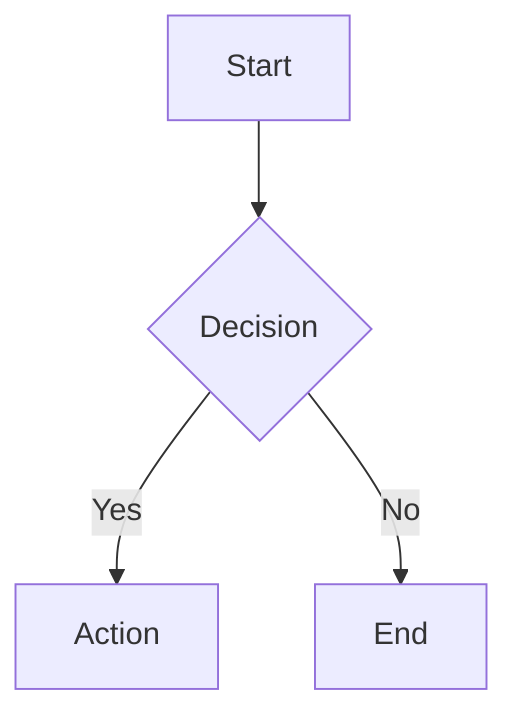

# Beautiful-Mermaid Theme Reference

Beautiful-Mermaid provides 15 carefully designed built-in themes, covering both light and dark schemes. Each theme is based on two core colors (background `bg` and foreground `fg`) and can be enhanced with optional rich colors.

## Quick Selection Guide

### Light Themes
| Theme | Background | Foreground | Use Case |
|------|------|------|------|
| `zinc-light` | #FFFFFF | auto-derived | General-purpose light theme |
| `tokyo-night-light` | #d5d6db | #34548a | Soft light |
| `catppuccin-latte` | #eff1f5 | #8839ef | Clean light |
| `nord-light` | #eceff4 | #5e81ac | Ice-blue light |
| `github-light` | #ffffff | #0969da | GitHub light style |
| `solarized-light` | #fdf6e3 | #268bd2 | Solarized light |

### Dark Themes
| Theme | Background | Foreground | Use Case |
|------|------|------|------|
| `zinc-dark` | #18181B | auto-derived | General-purpose dark theme |
| `tokyo-night` | #1a1b26 | #a9b1d6 | Modern Japanese style |
| `tokyo-night-storm` | #24283b | #a9b1d6 | Tokyo Night variant |
| `catppuccin-mocha` | #1e1e2e | #cba6f7 | Warm dark |
| `nord` | #2e3440 | auto-derived | Nordic ice-blue style |
| `dracula` | #282a36 | #f8f8f2 | Classic dark theme |
| `github-dark` | #0d1117 | #4493f8 | GitHub dark style |
| `solarized-dark` | #002b36 | #268bd2 | Solarized dark |
| `one-dark` | #282c34 | auto-derived | Atom One Dark style |

---

## Theme Details

### `zinc-light` (Light)
**Features:** Clean, general-purpose light theme, suitable for print and high-contrast scenarios.

**Config:**
```javascript
{
  bg: '#FFFFFF',
  fg: '#27272A'
}
```

**Best for:**
- Formal documents and reports
- Print output
- Presentation slides

**Example:**


---

### `zinc-dark` (Dark)
**Features:** Pure dark theme, foreground color derived by the system. Minimalist style.

**Config:**
```javascript
{
  bg: '#18181B',
  fg: 'auto-derived'
}
```

**Best for:**
- Terminal apps
- Dark UI integration
- Code editors

---

### `tokyo-night` (Dark) ⭐ Recommended
**Features:** Modern Japanese style, soft blue tones, designed for developers.

**Config:**
```javascript
{
  bg: '#1a1b26',
  fg: '#a9b1d6',
  accent: '#7aa2f7'
}
```

**Best for:**
- Modern developer docs
- AI-assisted programming
- Code examples and tutorials

**Visual properties:**
- Deep blue background (#1a1b26)
- Soft purple text (#a9b1d6)
- Bright blue accent (#7aa2f7)

---

### `tokyo-night-storm` (Dark)
**Features:** Darker variant of Tokyo Night, deeper background color.

**Config:**
```javascript
{
  bg: '#24283b',
  fg: '#a9b1d6',
  accent: '#7aa2f7'
}
```

**Best for:**
- Very low-light environments
- OLED screen optimization
- Long reading sessions

---

### `tokyo-night-light` (Light)
**Features:** Light version of Tokyo Night, keeping the same color philosophy.

**Config:**
```javascript
{
  bg: '#d5d6db',
  fg: '#34548a'
}
```

**Best for:**
- Daytime use
- High-contrast needs
- Print-friendly

---

### `catppuccin-mocha` (Dark)
**Features:** Warm, comfortable dark theme with red-purple accents.

**Config:**
```javascript
{
  bg: '#1e1e2e',
  fg: '#cba6f7'
}
```

**Best for:**
- Long reading sessions (eye-friendly)
- Creative projects
- Design documents

---

### `catppuccin-latte` (Light)
**Features:** Light variant of Catppuccin, warm and soft.

**Config:**
```javascript
{
  bg: '#eff1f5',
  fg: '#8839ef'
}
```

**Best for:**
- Daytime light environments
- Purple lovers
- Design-oriented docs

---

### `nord` (Dark)
**Features:** Nordic-inspired ice-blue tones, professional and calm.

**Config:**
```javascript
{
  bg: '#2e3440',
  fg: 'auto-derived'
}
```

**Best for:**
- Enterprise documentation
- Technical specs
- System architecture diagrams

**Visual properties:**
- Dark gray-blue background
- High-contrast text
- Overall cool tone

---

### `nord-light` (Light)
**Features:** Light version of Nord.

**Config:**
```javascript
{
  bg: '#eceff4',
  fg: '#5e81ac'
}
```

**Best for:**
- Daytime light use
- Print
- Nordic-style projects

---

### `dracula` (Dark) ⭐ Recommended
**Features:** Classic deep dark theme, high contrast.

**Config:**
```javascript
{
  bg: '#282a36',
  fg: '#f8f8f2'
}
```

**Best for:**
- Code editor integration
- Developer documentation
- Command-line tools

**Visual properties:**
- Extremely deep background
- Bright text
- Purple and pink accents

---

### `github-light` (Light)
**Features:** GitHub light theme, web-friendly.

**Config:**
```javascript
{
  bg: '#ffffff',
  fg: '#0969da'
}
```

**Best for:**
- GitHub README
- Web docs
- Online tutorials

---

### `github-dark` (Dark)
**Features:** GitHub dark theme, familiar to GitHub users.

**Config:**
```javascript
{
  bg: '#0d1117',
  fg: '#4493f8'
}
```

**Best for:**
- GitHub documentation
- GitHub Issues and Discussions
- Open-source projects

---

### `solarized-light` (Light)
**Features:** Classic light theme designed by Ethan Schoonover.

**Config:**
```javascript
{
  bg: '#fdf6e3',
  fg: '#268bd2'
}
```

**Best for:**
- Research papers
- Academic documents
- Precise color work

---

### `solarized-dark` (Dark)
**Features:** Dark version of Solarized, carefully tuned contrast.

**Config:**
```javascript
{
  bg: '#002b36',
  fg: '#268bd2'
}
```

**Best for:**
- Long-form document reading
- Scientific papers
- Programming textbooks

---

### `one-dark` (Dark)
**Features:** The classic One Dark theme from the Atom editor.

**Config:**
```javascript
{
  bg: '#282c34',
  fg: 'auto-derived'
}
```

**Best for:**
- Atom users
- JavaScript projects
- Web development docs

---

## Custom Themes

### Basic Customization (Mono Mode)

Only two colors are needed to create a beautiful theme:

```python
python render_mermaid.py \
  --input diagram.mmd \
  --output output.svg \
  --bg '#0f0f0f' \
  --fg '#e0e0e0'
```

The system auto-derives all other colors.

### Advanced Customization (Enriched Mode)

For a richer color scheme, provide optional accent colors:

```python
python render_mermaid.py \
  --input diagram.mmd \
  --output output.svg \
  --bg '#0f0f0f' \
  --fg '#e0e0e0' \
  --accent '#ff6b6b' \
  --muted '#666666' \
  --line '#4a90e2' \
  --surface '#1a1a1a' \
  --border '#2a2a2a'
```

### Color Selection Guide

| Parameter | Purpose | Example |
|------|------|------|
| `--bg` | Background color (required) | `#1a1a1a` |
| `--fg` | Text color (required) | `#e0e0e0` |
| `--accent` | Arrowheads and emphasis | `#7aa2f7` |
| `--muted` | Secondary text and labels | `#666666` |
| `--line` | Edges / connecting lines | `#3d59a1` |
| `--surface` | Node fill | `#292e42` |
| `--border` | Node borders | `#3d59a1` |

---

## Theme Selection Decision Tree

```
What theme style do you want?
├── Light
│   ├── Minimalist / clean? → zinc-light
│   ├── GitHub style? → github-light
│   ├── Solarized? → solarized-light
│   ├── Ice-blue? → nord-light
│   ├── Purple? → catppuccin-latte
│   └── Soft Japanese? → tokyo-night-light
│
└── Dark
    ├── Recommended general? → tokyo-night ⭐
    ├── Classic dark? → dracula ⭐
    ├── Minimalist / pure? → zinc-dark
    ├── Nordic style? → nord
    ├── Warm and comfortable? → catppuccin-mocha
    ├── GitHub style? → github-dark
    ├── Very deep background? → tokyo-night-storm
    ├── Academic / precise? → solarized-dark
    └── Atom style? → one-dark
```

---

## Practical Examples

### Example 1: Using Tokyo Night in Documentation

```bash
python render_mermaid.py \
  --input architecture-diagram.mmd \
  --output architecture-diagram.svg \
  --theme tokyo-night
```

### Example 2: Creating a Print-Friendly Chart

```bash
python render_mermaid.py \
  --input diagram.mmd \
  --output diagram.svg \
  --theme zinc-light
```

### Example 3: Batch Applying a Theme

```bash
python batch_render.py \
  --input-dir ./diagrams \
  --output-dir ./output \
  --format svg \
  --theme dracula
```

### Example 4: Custom Enterprise Theme

```bash
python render_mermaid.py \
  --input diagram.mmd \
  --output output.svg \
  --bg '#1a1a1a' \
  --fg '#ffffff' \
  --accent '#0066cc' \
  --border '#333333'
```

---

## Color Value Cheat Sheet

### Common Hex Colors
| Color Name | Hex | Use |
|--------|---------|------|
| Pure white | #FFFFFF | Light background |
| Pure black | #000000 | Dark background |
| Dark gray | #1a1a1a | Friendly dark |
| Light gray | #f0f0f0 | Friendly light |
| Blue | #0066cc | Accent color |
| Green | #00cc00 | Success color |
| Red | #cc0000 | Warning / error |
| Purple | #9966cc | Creative projects |

---

## FAQ

**Q: Which theme should I use?**
A: If unsure, use `tokyo-night` (dark) or `zinc-light` (light).

**Q: How do I pick a theme for a GitHub README?**
A: Use `github-light` or `github-dark` to match GitHub's theme.

**Q: Can I mix colors from multiple themes?**
A: Yes, use Enriched Mode to customize any color combination.

**Q: Do themes support transparent backgrounds?**
A: Yes, add the `--transparent` flag.

**Q: How do I recommend a theme to a user in an AI chat?**
A: By project type: development project -> Tokyo Night, enterprise -> Nord, print -> Zinc Light.
