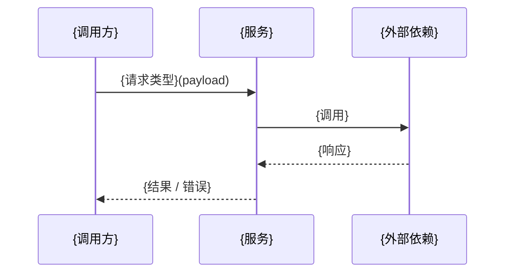
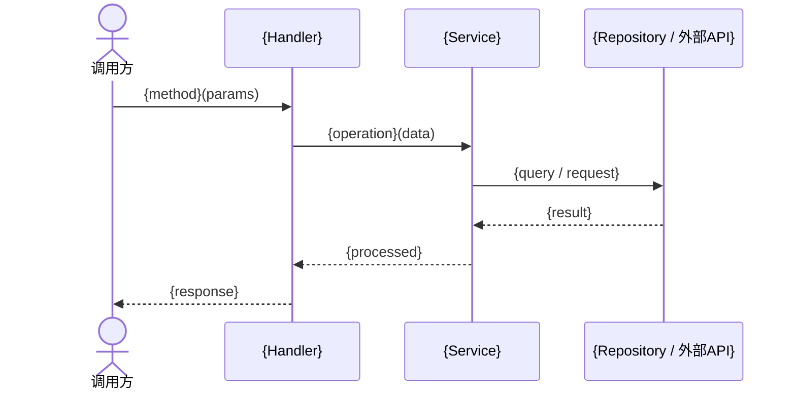

# 后端技术评审: {故事名称}

> | v{version} | {YYYY-MM-DD} | {模型} | 🌿 {branch} |
> 关联: [01-故事任务.md](./01-故事任务.md) · [03-前端技术评审.md](./03-前端技术评审.md)

> **Coder 公式**: 模块 → 接口 → 数据流。先拆模块，再定接口契约，最后追踪数据流向。
> **Security 公式**: 威胁 → 信任边界 → 缓解。识别风险、划定边界、给出对策。

---

## 1. 服务架构

### 1.1 服务/进程

| 变更类型 | 模块/文件 | 职责 |
|----------|----------|------|
| 新增 / 修改 / 复用 | `{path}` | {职责描述} |

> 说明服务的生命周期特征：常驻 / 按需唤醒 / 无状态。长连接、定时器、持久状态需明确标注。

### 1.2 通信通道设计

| 通道 | 方向 | 协议/方式 | Payload 结构 | 错误处理 |
|------|------|---------|-------------|---------|
| `{CHANNEL_NAME}` | A → B | {RPC / 消息队列 / HTTP / ...} | `{schema}` | {重试/降级/熔断} |

> 通信通道需明确：协议选型、序列化格式、超时策略、错误重试机制。

---

## 2. API 接口设计

### 2.1 接口清单

| 接口 | 方法 | 路径 | 请求体 | 响应体 | 错误码 |
|------|------|------|--------|--------|--------|
| {接口名} | GET / POST / PUT / DELETE | `/api/...` | `{schema}` | `{schema}` | {codes} |

### 2.2 请求流程

> **Coder 公式**：每个接口标注 输入 → 处理 → 输出。处理链路中标注各层职责。

### 2.3 服务实现

| 服务/模块 | 依赖 | 文件路径 | 核心方法 |
|----------|------|---------|---------|
| `{ServiceName}` | `{依赖接口}` | `{path}` | `{method signatures}` |

---

## 3. 数据模型

### 3.1 存储结构

| Key / 表 / 集合 | 类型 | 默认值 | 读频率 | 写频率 | 说明 |
|-----|------|--------|--------|--------|------|
| `{key}` | {object / string / ...} | `{default}` | {高/中/低} | {高/中/低} | {用途} |

> 标注持久化方式：数据库 / 文件 / 缓存 / KV 存储。说明容量上限和清理策略。

### 3.2 数据迁移

| 版本 | 变更 | 迁移策略 |
|------|------|---------|
| v{N} → v{N+1} | {变更描述} | {迁移逻辑：新增字段默认值、重命名映射、废弃字段清理} |

> 迁移在服务初始化时执行。确保旧版本数据可自动升级，不丢失。

---

## 4. 安全约束

> **Security 公式**: 威胁 → 信任边界 → 缓解

| # | 威胁 | 信任边界 | 缓解措施 | 优先级 |
|---|------|---------|---------|--------|
| 1 | {威胁描述} | {用户输入 / 外部API / 通信通道 / 存储} | {缓解措施} | P0/P1/P2 |

> 安全审查必查项：输入校验（注入/XSS）、认证授权（越权）、敏感数据（明文存储/日志泄露）、通信安全（中间人/重放）。

---

## 5. 性能与限制

| 维度 | 约束 | 应对 |
|------|------|------|
| {服务生命周期/连接池/...} | {具体限制} | {应对策略} |
| {请求/消息大小限制} | {具体限制} | {应对策略} |
| {存储配额} | {具体限制} | {应对策略} |
| {外部依赖限流} | {具体限制} | {重试 + 退避 / 降级 / ...} |

> 标注项目实际面临的约束，非通用模板。

---

## 6. 评审清单

| # | 检查项 | 结果 |
|---|--------|------|
| 1 | 权限/配置已最小化，无多余权限 | ✅ / ❌ |
| 2 | 通信通道已对齐发送/接收方，错误处理完整 | ✅ / ❌ |
| 3 | 存储结构向后兼容，迁移策略已覆盖 | ✅ / ❌ |
| 4 | API 请求统一管理，认证/鉴权已覆盖 | ✅ / ❌ |
| 5 | 无硬编码密钥或敏感信息 | ✅ / ❌ |
| 6 | 后台服务无不当的长连接/定时器依赖 | ✅ / ❌ |
| 7 | 输入校验覆盖所有信任边界 | ✅ / ❌ |
