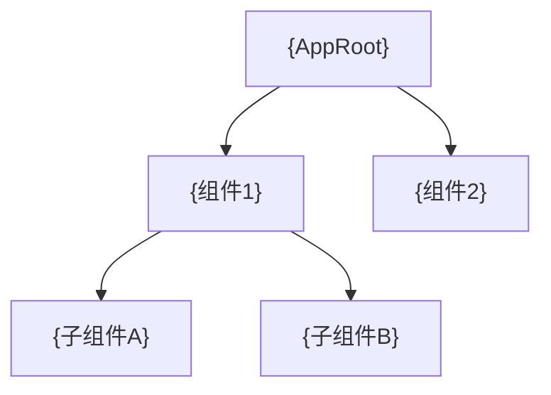
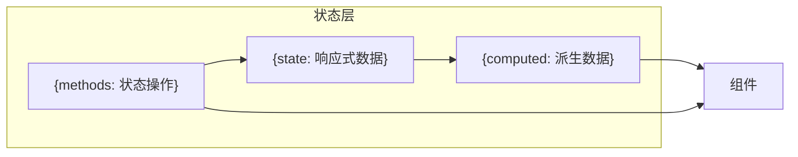
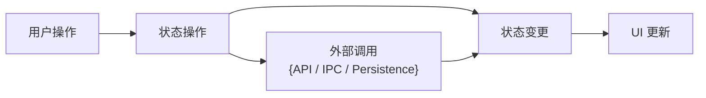
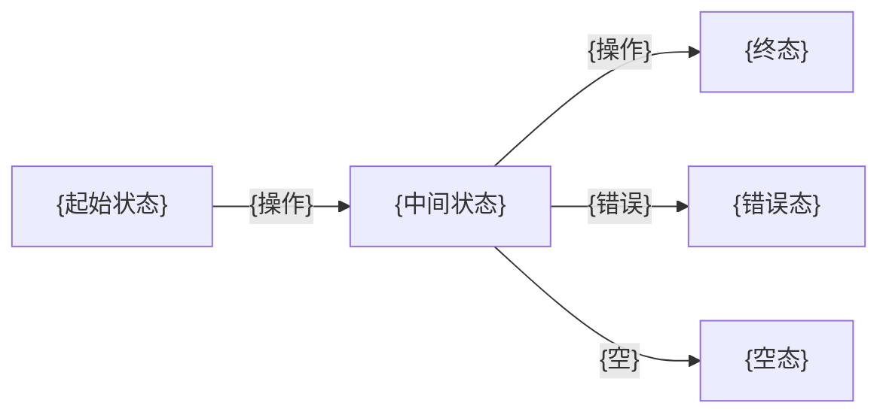

# 前端技术评审: {故事名称}

> | v{version} | {YYYY-MM-DD} | {模型} | 🌿 {branch} |
> 关联: [01-故事任务.md](./01-故事任务.md) · [02-后端技术评审.md](./02-后端技术评审.md)

> **Coder 公式**: 模块 → 接口 → 数据流。先拆组件树，再定 Props/Events 接口，最后追踪状态流向。

---

## 1. 组件架构

### 1.1 组件树



> 标注组件注册路径：`{Namespace}.{Module}.{ComponentName}`。说明命名空间约定。

### 1.2 新增/变更组件

| 组件 | 类型 | 文件 | 注册路径 | 变更 |
|------|------|------|-------------|------|
| `{ComponentName}` | {组件 / 模块} | `{path}` | `{Namespace}.{Name}` | 新增 / 修改 / 复用 |

> 说明组件文件组织约定（单文件 / index.js+template+style / 其他）。说明模块封装方式（IIFE / ES module / CommonJS）。

### 1.3 组件接口

> **Coder 公式**: 每个组件标注 Props(输入) → Events(输出) → Expose(暴露方法)

| 组件 | Props (输入) | Events (输出) | Expose (暴露) |
|------|-------------|--------------|---------------|
| `{ComponentName}` | `{prop: Type}` | `{eventName(params)}` | `{method()}` |

---

## 2. 状态管理

### 2.1 状态定义

| Store / State | 文件 | 状态字段 | 使用组件 |
|-------|------|---------|---------|
| `{storeName}` | `{path}` | `{field: Type, ...}` | `{components}` |



> 说明状态管理方案：响应式原语 / 状态库 / Context。状态通过什么机制与外部（后端API、持久化）交互。

### 2.2 状态流向



| 数据流 | 触发源 | 状态变更 | 消费方 |
|--------|------|---------|--------|
| {流名称} | {用户操作 / 外部事件} | {哪些字段变更} | {哪些组件} |

---

## 3. 交互设计

### 3.1 用户操作流



### 3.2 视图状态矩阵

| 视图 | 正常 | 加载 | 空 | 错误 | 禁用 |
|------|------|------|----|------|------|
| {视图A} | {正常态} | {loading 方式} | {空态文案+引导} | {错误提示+恢复} | — |
| {视图B} | {正常态} | {loading 方式} | {空态文案} | {错误消息} | {禁用条件} |

### 3.3 动画与过渡

| 元素 | 动画类型 | 时长 | 触发条件 |
|------|---------|------|---------|
| {元素} | {CSS transition / JS animation} | {ms} | {条件} |

---

## 4. 样式方案

### 4.1 样式策略

| 场景 | 方案 | 说明 |
|------|------|------|
| 布局 | {Flexbox / Grid / ...} | {布局策略} |
| 主题/变量 | {CSS 变量 / 预处理} | 遵循 `{design token 路径}` |
| 动画 | {CSS / JS 动画库} | 优先内置能力 |
| 样式隔离 | {CSS Modules / Scoped / Shadow DOM / 前缀} | 防止样式污染 |

> 说明样式隔离策略。若运行在宿主环境中（嵌入/插件），所有样式必须通过作用域前缀隔离，禁止全局 reset 或裸标签选择器。

### 4.2 新增样式文件

| 文件 | 用途 | 加载方式 |
|------|------|---------|
| `{path}.css` | {用途} | {构建/动态注入/注册表} |

---

## 5. DOM 与事件

### 5.1 挂载点

| 组件 | 挂载容器 | 创建方式 | 生命周期 |
|------|---------|---------|---------|
| `{ComponentName}` | `{selector}` | `{createElement / mount}` | {挂载/卸载时机} |

> 说明样式隔离方式（Shadow DOM / Scoped Style / BEM）。若组件需与外部交互，说明事件代理或桥接模式。

### 5.2 事件处理

| 事件 | 监听方式 | 处理逻辑 | 清理时机 |
|------|---------|---------|---------|
| `{eventType}` | `{target}` | {处理逻辑} | {组件卸载时 / 路由切换时} |

> 事件监听器必须在对应生命周期阶段移除，避免内存泄漏和重复绑定。

---

## 6. 依赖与加载

### 6.1 加载顺序

```
{上游公共依赖}
{新增工具/模块}       ← 依赖: {上游依赖列表}
{核心模块}            ← 初始化入口
{新增组件/模块}       ← 依赖: {上游依赖列表}
{启动入口}
```

| 新增文件 | 插入位置 | 依赖上游 |
|----------|---------|---------|
| `{path}` | {在哪些文件之后} | `{dependency list}` |

> 加载顺序 = 依赖顺序。新增文件必须在其所有依赖之后、消费方之前加载。在模块注册表（如 manifest / config）中声明。

### 6.2 命名空间注册

| 文件 | 注册到 | 类型 |
|------|--------|------|
| `{path}` | `{Namespace}.{Module}` | 组件 / 工具 / 模块 |

---

## 7. 评审清单

| # | 检查项 | 结果 |
|---|--------|------|
| 1 | 组件封装方式一致，注册到正确命名空间 | ✅ / ❌ |
| 2 | 资源文件已加入注册表/构建配置 | ✅ / ❌ |
| 3 | 状态管理遵循约定模式，状态流向清晰 | ✅ / ❌ |
| 4 | 样式使用作用域隔离，不存在全局污染风险 | ✅ / ❌ |
| 5 | 事件监听器在对应生命周期阶段清理 | ✅ / ❌ |
| 6 | 模块注册表按依赖顺序排列 | ✅ / ❌ |
| 7 | 模块系统约束一致（无不匹配的 import/export 语法） | ✅ / ❌ |
| 8 | 新增样式文件已在注册表中声明 | ✅ / ❌ |
