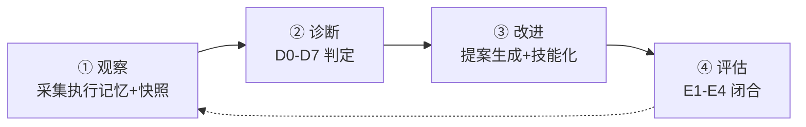

# 自改进系统设计

## 数据文件

| 文件 | 模式 | 用途 |
|------|------|------|
| .memory/execution-memory.jsonl | append | 每次管线执行记录 |
| .memory/rui-state.json | overwrite | 当前管线状态 |
| .memory/status-history.jsonl | append | 状态变更历史 |
| .memory/tool-audit.jsonl | append | 工具调用审计 |
| .memory/delivery-tracking.jsonl | append | 交付事件追踪 |
| .improvement/proposals.jsonl | append | 自改进提案 |

## 关键工具

- `skills/rui/proposals.mjs` — D0-D7 诊断引擎 + 提案生成 + E1-E4 评估
- `skills/rui/record.mjs` — 执行记忆记录器
- `skills/rui-story/collect.mjs` — 指标采集 + 异常检测

## 生效标志

1. 每条提案有 snapshot 证据支撑
2. D0-D7 诊断引用基线文件
3. proposals.jsonl append-only
4. E1-E4 闭合或标注退化/降级
