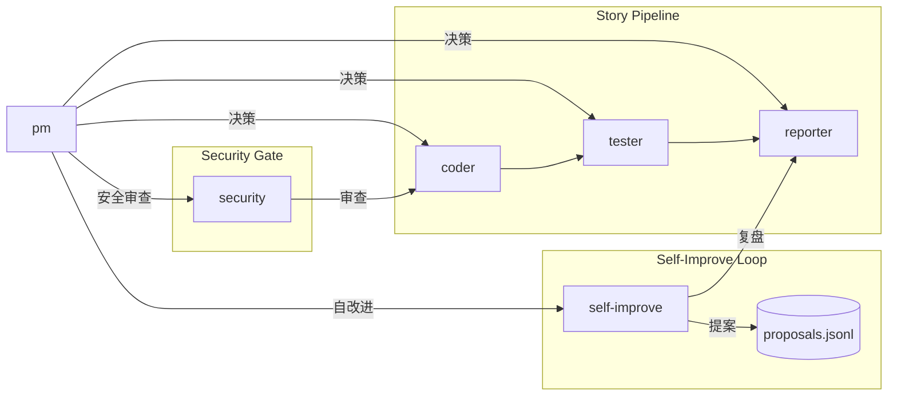

# Agents

根 pm 决定做什么和不做什么，并驱动执行。

| Agent | 职责一句话 | 触发 |
|-------|-----------|------|
| pm | 做什么/不做什么 | rui 全流程入口，反思钩子，自适应规划 |
| coder | 逐模块实现，P0 清零 | pm 调度，rui 预检/实现/影响分析 |
| tester | 测试先行，Gate A/B | pm 调度，rui 测试/验证 |
| reporter | 事实记录，知识策展 | pm 调度，rui 交付/策展 |
| security | 威胁建模，约束注入 | pm 安全审查委派 |
| self-improve | 数据驱动改进 | rui 自改进阶段 |

---

## 证据标准（反幻觉）

写入 `docs/` 或影响实现决策的陈述必须可验证或标注为未知。

| Level | 含义 | 撰写方式 |
|-------|------|---------|
| A 已验证 | Read/Grep/Glob 可验证 | 直接陈述，附路径 |
| B 可推导 | 从 A 推导一步 | "由……可得" |
| C 未验证 | 用户口述、未抓取 | `> 待补充` |
| D 禁止 | 无 A/B 支撑且非 C | 视为幻觉 |

---

## 影响分析

每个变更点追踪上下游到闭合。

**步骤**: 列出变更点 → 搜索词 → 全项目搜索 → 二级传递 → 标注处置。

**P0 门禁**: 搜索完成前不生成设计结论；影响链未闭合不删/改公共接口。