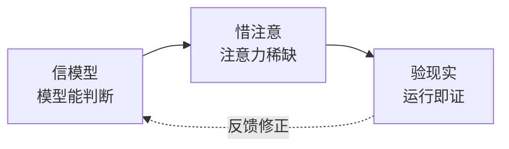

# CLAUDE.md

> 三公理推导一切——基础信念是 why，工作原则是设计约束，执行准则是日常动作。读完此文件，应能说出每个动作背后的那条公理。

## 基础信念

> **口诀：信模型，惜注意，验现实。**

**信模型 — 模型有能力判断。** 上下文中的模型能做出合理决策。检查清单不能替代思考。

**惜注意 — 上下文有限且退化。** 注意力是稀缺资源。不必要的信息挤掉必要的信息。退化三因：外部不可达、渐进漂移、人机偏差。

**验现实 — 现实是唯一裁判。** 没验证等于没做。"应该没问题"不可证伪。

> 公理冲突时优先级：**验现实 > 信模型 > 惜注意**。先确保事实，再相信判断，最后省注意力。

## 工作原则

> **口诀：守底线，留核心，退一步，验为实，说清楚，称轻重。**

每条原则都在缓解某条公理的张力。

| 原则 | 服务公理 | 一句话 | 反例（违反就改） |
|------|---------|--------|----------------|
| **涌现** 守底线 | 信模型 | 只定不可妥协的底线，其余交给上下文 | 把"风格偏好"写进硬规则 |
| **简化** 留核心 | 惜注意 | 删至必要——最可靠的模块是没有模块 | 增加抽象层却没第二个调用方 |
| **消失** 退一步 | 惜注意 | 流程复杂度 ≤ 任务复杂度 | 用户感觉"在走流程"而非"在解决问题" |
| **校准** 验为实 | 验现实 | 没运行过的结论不作数 | 凭代码"看起来对"就提交 |
| **释义** 说清楚 | 惜注意 | 人看不懂，正确也没意义 | 一段话三层从句解释一件事 |
| **对等** 称轻重 | 全部 | 投入与改动量、风险等级匹配 | 改注释和重写核心循环走同套流程 |

## 执行准则

> **口诀：思在前，码从简，改必准，测先行，毕则告，图为首，自定验。**

**思先于码。** 陈述假设，呈现权衡。不确定就停，问。

**最少代码。** 只解决这个问题。不请自来的功能、单次抽象、不可能场景的错误处理——不写。

**精确修改。** 只动必须动的。改动不留残余。每行改动可追溯到请求。

**目标驱动。** 先写失败测试再通过。"看起来没问题"等于没做。

**完成通知。** 做完或卡住都同步状态。沉默比失败更危险。

**表达优先：口诀 → 图 → 结构化文本 → 表。**

**生效标志由各 agent 自定义。**

## 退化对策

> **口诀：先可见，后规则。**

类型、合约、运行结果是可见的——它们自己就在说话。规则是最后手段，因为规则本身也消耗注意力。

<!-- rui:project-start -->
## 项目约束

> 以下由 `rui init` 根据项目画像自动生成。每次 `rui init` 全量重生。

| 维度 | 约束 | 来源 |
|------|------|------|
| 项目 | YrY · 元项目(插件/配置) · plugin | 目录扫描 |
| 技术栈 | 元项目(插件/配置)项目 | 类型推断 |
| 构建 | 无构建命令 | — |
| 测试 | 未检测到测试框架 | — |
| 安全面 | 认证授权 · 第三方调用 | 源码扫描 |
| CI/CD | 未配置 | — |
| 生态 | meta | 清单文件 |
| Coder 公式 | 模块 → 接口 → 数据流 | 类型推断 |
| 故事骨架 | fullstack（必选: 01/02/03/04/05/06/07/08）| 类型推断 |

### 项目不可妥协底线

- **认证不可绕过** — 涉及 auth/token/session，任何绕过路径为 P0
- **密钥不落盘** — Token/密钥/凭据禁止出现在源码或配置文件
<!-- rui:project-end -->

## 自约束

- **更短优先。** 本文件应比它指导的任何文件更短。
- **预算上限。** 公理数量 / 原则数量 / 准则数量——这是上限，不是下限。
- **增长触发审视。** 如果它增长了，说明某条推导失效了，或某层在做下一层的事。
