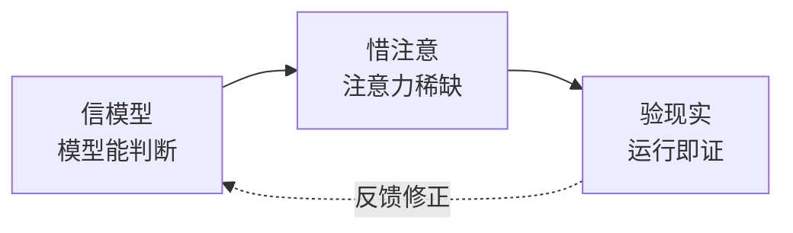

# CLAUDE.md

> 基础信念是 why。YrY 是故事驱动的 SDLC 编排系统，用自身管线管理自身演进。
> [领域语言](./README.md#领域语言) · [系统全景](./README.md) · [外部参考](./README.md#外部参考)

## 基础信念



**信模型** — 模型有能力判断。上下文中的模型能做出合理决策。检查清单不能替代思考。

**惜注意** — 上下文有限且退化。不必要的信息挤掉必要的信息。退化三因：外部不可达、渐进漂移、人机偏差。

**验现实** — 现实是唯一裁判。没验证等于没做。"应该没问题"不可证伪。

公理冲突时优先级：**验现实 > 信模型 > 惜注意**。先确保事实，再相信判断，最后省注意力。

## 铁律

> 违反字母即是违反精神。以下四条不可妥协：

```
NO COMPLETION CLAIMS WITHOUT FRESH VERIFICATION EVIDENCE  ← 验现实
NO FIXES WITHOUT ROOT CAUSE INVESTIGATION FIRST           ← 验现实
NO P0 LEFT UNCLEARED BEFORE NEXT MODULE                   ← 信模型
EXPRESSION PRIORITY: DIAGRAM → TEXT → TABLE               ← 惜注意
```

| 铁律 | 源于 | 含义 | 违反信号 |
|------|------|------|---------|
| **验先于称** | 验现实 | 未运行验证命令不得声称完成/通过/修复 | "上次通过了"、"应该没问题" |
| **溯先于修** | 验现实 | 未找到根因不得提出修复方案 | "先试一个修复看看" |
| **清先于进** | 信模型 | 模块 P0 未清零不得进入下一模块 | "P0 太难修，标 P1 吧" |
| **表达优先** | 惜注意 | rui 生成文档必须图 → 结构化文本 → 表，不可降级 | 无图文档、架构用大段文字描述 |

<!-- rui:project-start -->
## 项目约束

### 项目不可妥协底线

- **认证不可绕过** — 涉及 auth/token/session，任何绕过路径为 P0
- **密钥不落盘** — Token/密钥/凭据禁止出现在源码或配置文件
- **输入必校验** — 用户输入必须经过验证/转义，XSS/注入为 P0
<!-- rui:project-end -->

## 引导

| 想了解 | 去 |
|--------|-----|
| 管线全流程（分支隔离 · Gate A/B · 逐模块清零 · 支撑技术） | [rules/code-pipeline.md](./rules/code-pipeline.md) |
| 交付收口（三步 hook） | [rules/delivery-gate.md](./rules/delivery-gate.md) |
| 文档生成约束 | [rules/doc-generation.md](./rules/doc-generation.md) |
| 角色拓扑 · 行为纪律 · 设计原则 · 执行准则 · ADR | [agents/AGENT.md](./agents/AGENT.md) |
| 领域语言（术语定义） | [领域语言](./README.md#领域语言) |
| 外部参考（自改进生态资源） | [外部参考](./README.md#外部参考) |
