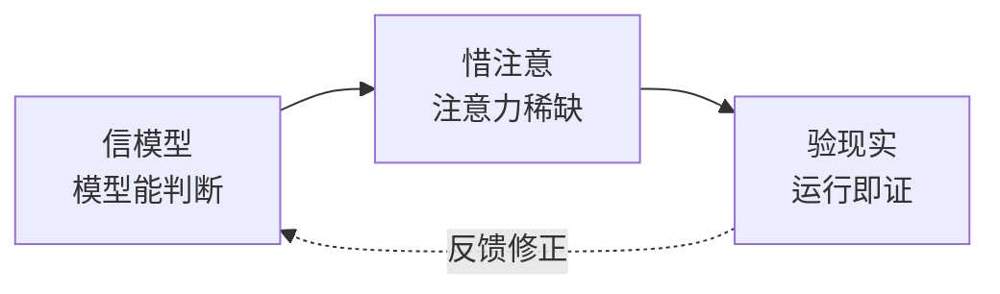
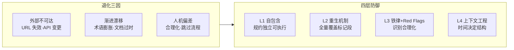

# CLAUDE.md

> 基础信念是 why。YrY 是故事驱动的 SDLC 编排系统，用自身管线管理自身演进。
> [领域语言](./README.md#领域语言) · [系统全景](./README.md)

[基础信念](#基础信念) · [铁律](#铁律) · [项目约束](#项目约束) · [项目不可妥协底线](#项目不可妥协底线) · [退化对策](#退化对策) · [自约束](#自约束) · [引导](#引导)

## 基础信念

**信模型** — 模型有能力判断。上下文中的模型能做出合理决策。检查清单不能替代思考。

**惜注意** — 上下文有限且退化。不必要的信息挤掉必要的信息。退化三因：外部不可达、渐进漂移、人机偏差。上下文工程四原则：时间决定结构（先发生的先写）、相关先于完整（割舍无关细节）、可验优于可读（Grep/Glob 路径优于自然语言）、行动优于解释（代码优于注释）。

**验现实** — 现实是唯一裁判。没验证等于没做。"应该没问题"不可证伪。

公理冲突时优先级：**验现实 > 信模型 > 惜注意**。先确保事实，再相信判断，最后省注意力。

**执行模式**：研究优先开发（research-first development）— 动手前先探。不确定时不猜，查。涉及外部依赖/API/不熟悉模块时，先 Read/Grep/Glob 建立事实基线，再行动。

## 铁律

> 四条铁律对应三个基础信念。每条不可妥协 —— 违反形式即是违反精神。

| # | 铁律 | 规则 | 源于 | 违反信号 |
|---|------|------|------|---------|
| 1 | **验先于称** | 未执行验证命令不得声称完成/通过/修复 | 验现实 | "上次通过了"、"应该没问题"、"看起来没问题" |
| 2 | **溯先于修** | 未定位根因不得提出修复方案 | 验现实 | "先试一个修复看看"、"改一下试试"、"可能是 X，先改再说" |
| 3 | **清先于进** | 当前模块 P0 未清零不得进入下一模块 | 信模型 | "P0 太难修，标 P1 吧"、"先跳过去，回头再说" |
| 4 | **表达优先** | 生成文档必须 图 → 结构化文本 → 表，不可降级 | 惜注意 | 架构用大段文字、流程无 mermaid、关键关系用表格凑合 |

> 铁律间优先级：**验先于称 = 溯先于修 > 清先于进 > 表达优先**。先确事实，再守流程，最后省注意力。

<!-- rui:project-start -->

## 项目约束

### 项目不可妥协底线

- **认证不可绕过** — 涉及 auth/token/session，任何绕过路径为 P0
- **密钥不落盘** — Token/密钥/凭据禁止出现在源码或配置文件；`API_X_TOKEN` 仅通过环境变量传入
- **输入必校验** — 用户输入必须经过验证/转义，XSS/注入为 P0
- **规约完整性** — 每 skill 必须有完整 SKILL.md；Agent 交接信号必须可被下游验证
- **自托管一致性** — plugin.json 版本号必须与实际 skills/agents/rules 内容一致；自身管线不得降级
- **禁止魔法数字** — 所有数字字面量必须赋予语义化常量名；仅 `0`、`1`、`-1`（循环/索引/初始化惯用值）可豁免
- **分支隔离不可绕过** — 本地状态文件禁止跨分支共享管线状态，不得用于削弱或绕过 `feat/<name>` 分支隔离策略
- **README 故事联动** — README.md `<!-- rui:story-list-start -->` 标记段内必须列出全部故事任务；故事目录增删改后 README 必须同步更新，不允许未联动的故事

### 退化对策

| 退化因 | 对策 | 具体战术 |
|--------|------|---------|
| 外部不可达 | 外部 URL/资源不可达时，技能规约仍独立可执行 | 规约内联关键模式摘要，不依赖外链可达性 |
| 渐进漂移 | 每轮 init 全量重生 rui 标记段；领域语言 Avoid 列标注禁用别名 | 术语变更同步更新 Avoid 列表，防止旧名复用 |
| 人机偏差 | 铁律 + 行为纪律 Red Flags + 验证门禁五步法 | 合理化的 8 类借口 -> 速查表对照；每个声称 -> 五步验证 |

### 自约束

YrY 用自身管线管理自身演进 —— 这是信模型的核心实践，也是验现实的最终检验。

| 约束 | 规则 | 为什么 |
|------|------|--------|
| **管线自托管** | YrY 自身演进走 `/rui` 管线，不得绕过 | 自己不用等于不信自己的方法论；每次 `/rui` 执行都是对管线的冒烟测试 |
| **配置自管理** | 自身 `.claude/` 配置通过 `/rui-claude` 管理，不手动编辑 | 配置变更需要可追溯、可审计、可回滚 |
| **规约需验证** | 技能规约修改后必须重跑 init 验证标记段完整性 | 规约是管线的骨骼，修改后不验证 = 渐进漂移的起点 |
| **版本需一致** | plugin.json 版本号必须与 skills/agents/rules 实际内容同步 | 版本号是外部世界判断兼容性的唯一依据 |
| **分支必隔离** | YrY 自身的变更走 `feat/<name>` 分支，不直接在 main 上操作 | 自身 dogfooding 分支隔离策略，验证其有效性 |
| **交付必通知** | 每次交付完成必须通过 rui-bot 发出企微通知，附带详细统计 | 交付不可见等于未交付；通知是交付流水线的收口 |

> 违反任何一条自约束，等同于违反"清先于进"铁律 —— 因为管线的正确性是其核心 P0。
<!-- rui:project-end -->

## 引导

| 想了解 | 去 |
|--------|-----|
| 管线全流程（分支隔离 · Gate A/B · 逐模块清零 · 支撑技术 · 研究优先开发） | [rules/code-pipeline.md](./rules/code-pipeline.md) |
| 交付收口（三步 hook） | [rules/delivery-gate.md](./rules/delivery-gate.md) |
| 文档生成约束 · 表达优先 | [rules/doc-generation.md](./rules/doc-generation.md) |
| 角色拓扑 · 行为纪律 · 设计原则 · 执行准则 · ADR · 多 Agent 协作模式 | [agents/AGENT.md](./agents/AGENT.md) |
| 领域语言（术语定义） | [领域语言](./README.md#领域语言) |
| 文档生成约束 · 表达优先 | [rules/doc-generation.md](./rules/doc-generation.md) |
