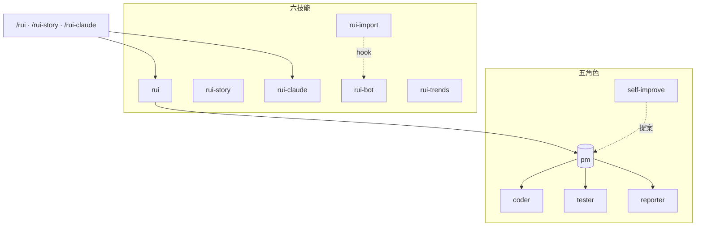
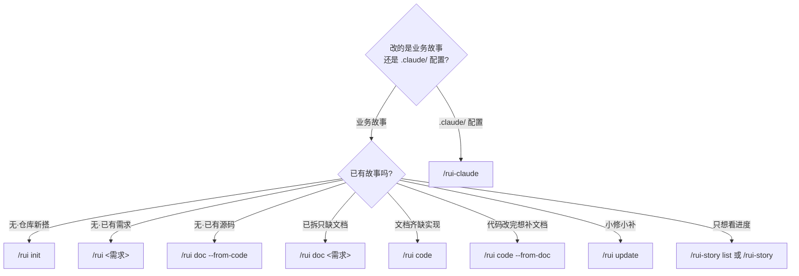
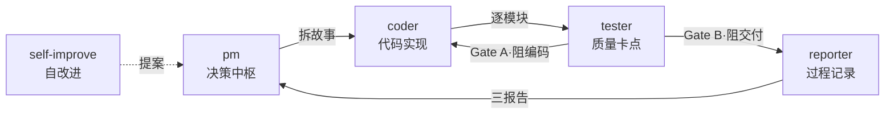

# YrY <sub>v2.0.2</sub>

> 故事驱动的 SDLC 编排系统 — 需求 → 文档 → 代码 → 交付。YrY 用自身管线管理自身演进。

[系统全景](#系统全景) · [管线](#管线) · [快速开始](#快速开始) · [命令](#命令) · [/rui](#rui---业务故事-sdlc) · [/rui-story](#rui-story---故事任务面板管理) · [/rui-claude](#rui-claude---claude-配置管理) · [Agent 角色](#agent-角色) · [规则](#规则) · [技能](#技能) · [目录结构](#目录结构) · [领域语言](#领域语言) · [技术趋势](#技术趋势)

## 系统全景



## 管线


每阶段产出对应编号文档（01–09），交付时三步 hook 按序执行。详见 [rules/code-pipeline.md](./rules/code-pipeline.md)、[rules/delivery-gate.md](./rules/delivery-gate.md)。

## 快速开始

```bash
# 1. 建立项目基线（首次必做）
/rui init

# 2. 从源码反推文档（存量项目）
/rui doc --from-code

# 3. 端到端交付（新需求）
/rui 用户登录功能支持手机号+验证码

# 4. 查看进度
/rui-story list
```

> init 生成 CLAUDE.md 项目约束 + README 领域语言 + 故事面板目录。存量项目用 `doc --from-code` 反推文档基线。

## 命令

只读命令不触发末端 hook，写入命令末端自动执行交付三步。



### /rui — 业务故事 SDLC

| 命令 | 类型 | 作用 |
|------|------|------|
| `/rui` | 只读 | 5 层管线评分排序，推荐下一步任务 |
| `/rui init` | 写入 | 建立基线：detect → explore → generate → setup → verify → trigger |
| `/rui <需求>` | 写入 | 端到端：doc + code 自动串联，逐故事串行 |
| `/rui doc <需求>` | 写入 | 拆需求出文档：生成 01/02/03/04，不改源码 |
| `/rui code <name>` | 写入 | 实现故事：Gate A → 逐模块 → Gate B → 复盘 → 交付 |
| `/rui update <name> [ctx]` | 写入 | 增量更新：T1/T2/T3 自动裁剪 |
| `/rui yry [--depth N]` | 写入 | 自改进闭环：全自主扫描→诊断→实现→验证→版本升级，循环至无改进空间或达到深度上限（默认 3） |
| `/rui version --up` | 写入 | 版本升级：自主判定 → 更新文件 → git commit → 合并 main → 推送 + tag |
| `/rui doc --from-code 需求` | 写入 | 从源码反推完整 5 文档基线到故事目录（源码只读） |
| `/rui code --from-doc <name>` | 只读 | 从文档反推码：禁止改源码 |

### /rui-story — 故事任务面板管理

| 命令 | 类型 | 数据源 | 作用 |
|------|------|--------|------|
| `/rui-story` | 只读 | 远端 API | 状态概览：按 6 种状态统计 + 最近活动 |
| `/rui-story list` | 只读 | 远端 API | 进度全景：所有故事详情表格（状态/文件数/类型/分支） |
| `/rui-story health` | 只读 | 远端 API + 本地 | 健康检查：凭据/API 可达性/配置/数据完整性 |
| `/rui-story sync [<name>]` | 写入 | 远端 API | 委托 rui-import 从远端拉取文档覆盖本地 |
| `/rui-story remove <name>` | 写入 | 本地文件系统 | 删除指定故事整个本地目录（需确认） |
| `/rui-story --help` | 只读 | 本地 | 完整命令用法 + 场景示例 |

### /rui-claude — .claude/ 配置管理

| 命令 | 类型 | 作用 |
|------|------|------|
| `/rui-claude` | 只读 | 按 5 层管线评分推荐 5~10 条任务 |
| `/rui-claude retro` | 写入 | 健康度分析：分析 .claude/ 结构产出复盘报告 |
| `/rui-claude sync` | 写入 | 远端同步：API pull 覆盖本地 `.claude/`（需确认意图） |
| `/rui-claude <需求>` | 写入 | 需求管线：仅限 `.claude/` 内的 doc+code→交付 |

## Agent 角色



## 规则

| 规则 | 作用域 | 核心 |
|------|--------|------|
| [code-pipeline.md](./rules/code-pipeline.md) | `**/*.{js,ts,py,...}` | 管线全流程：分支隔离 · Gate A/B · 逐模块 P0 清零 · 研究优先开发 |
| [delivery-gate.md](./rules/delivery-gate.md) | `docs/故事任务面板/**/*.md` | 交付收口：三步 hook 按序执行 |
| [doc-generation.md](./rules/doc-generation.md) | `docs/**/*.md` | 文档生成约束：表达优先 — 图 → 结构化文本 → 表 |
| [rui-claude.md](./rules/rui-claude.md) | `.claude/**` | .claude/ 配置管理规则 |
| [self-improve.md](./rules/self-improve.md) | `docs/故事任务面板/**/.improvement/**` | 自改进管线：提案 · 评估 · 回溯 |

## 技能

| 技能 | 入口 | 职责 |
|------|------|------|
| rui | `/rui` | SDLC 编排中枢：需求 → 文档 → 代码 → 交付 |
| rui-story | `/rui-story` | 故事任务面板管理 + 远端同步 |
| rui-claude | `/rui-claude` | .claude/ 配置全周期管理 |
| rui-import | hook | 文档同步至远端 API；每文档即时导入 + 批量安全网 |
| rui-bot | hook | 企微通知：rui 完成/阻塞/门禁失败时强制发送 |
| rui-trends | `/rui-trends` | 技术趋势探测：GitHub Trending · OSS Insight · TrendShift |

## 目录结构

```
YrY/
├── agents/          # 5 角色定义（pm · coder · tester · reporter · self-improve）
├── rules/           # 5 规则（管线 · 交付 · 文档 · claude 配置 · 自改进）
├── skills/          # 6 技能（rui · rui-story · rui-claude · rui-import · rui-bot · rui-trends）
├── templates/       # 文档模板（aicr-story）
├── CLAUDE.md        # 项目指令 + 铁律 + 约束
└── README.md        # 项目说明（本文件）
```

## 领域语言

| 术语 | 含义 | 禁用别名 |
|------|------|---------|
| 故事 | 业务需求单元，对应 docs/故事任务面板/ 下一个目录 | 需求 / requirement |
| 管线 | SDLC 全流程：需求解析 → 自适应规划 → ... → 交付 | 流水线 |
| 门禁 | 质量卡点，Gate A（测试先行）· Gate B（验证通过）方可进入下一阶段 | 关卡 / checkpoint |
| 模块 | 故事实现的最小交付单元，逐模块推进并 P0 清零 | 组件 |
| P0 | 阻塞性最高优先级问题，不清理不进下一模块 | blocker / critical |
| 铁律 | 4 条不可妥协规则：验先于称 · 溯先于修 · 清先于进 · 表达优先 | — |
| 退化 | 信息质量随时间下降：外部不可达 · 渐进漂移 · 人机偏差 | 熵增 / decay |
| 基线 | 文档快照基线，每故事 5 文档（01–05），可作为后续增量更新锚点 | baseline |
| 自改进 | AI 自主诊断 → 提案 → 实现 → 验证闭环，持续提升项目质量 | self-improve |

## 技术趋势

通过 `/rui-trends` 自动探测技术趋势辅助架构决策。

| 数据源 | 作用 |
|--------|------|
| GitHub Trending | 日/周热门仓库，语言过滤 |
| OSS Insight | 中国区/全球仓库热度、生态位分析 |
| TrendShift | 技术关键词升降趋势 |
| Top-Starred | 全时段高星仓库参考 |
