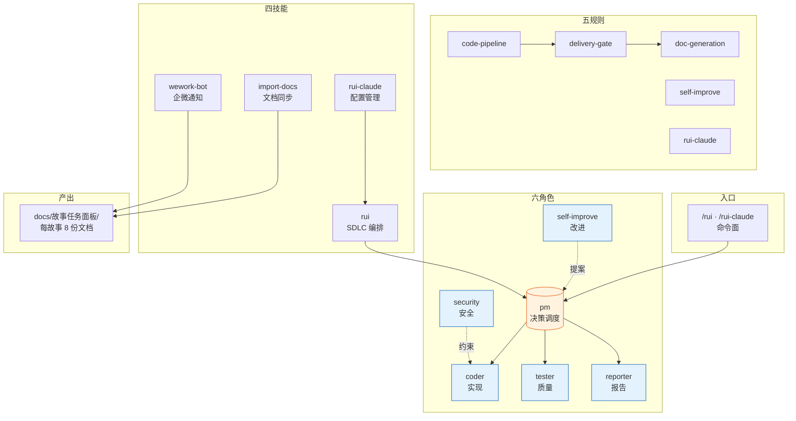
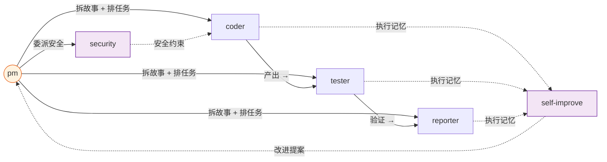
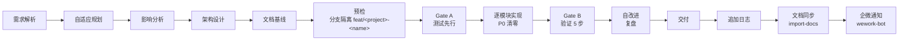
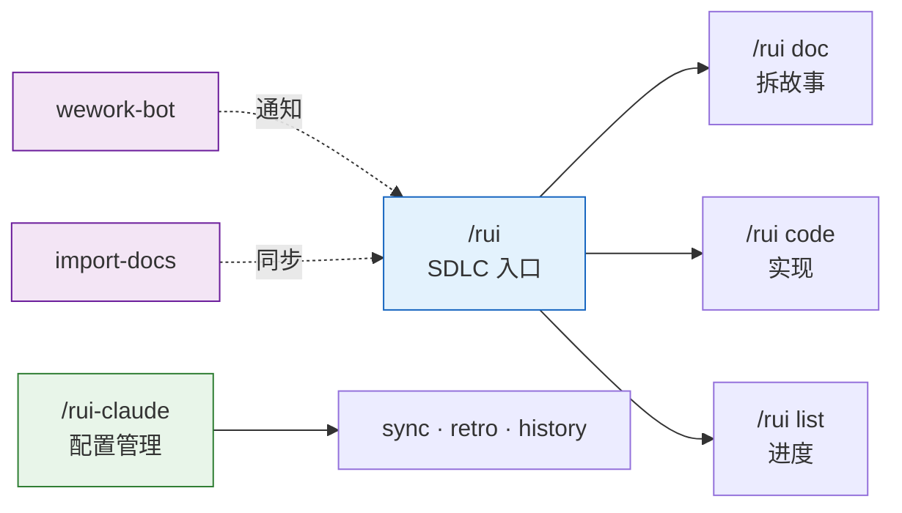
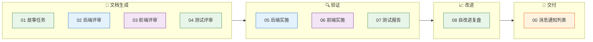
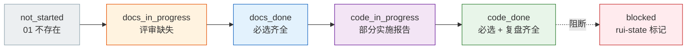
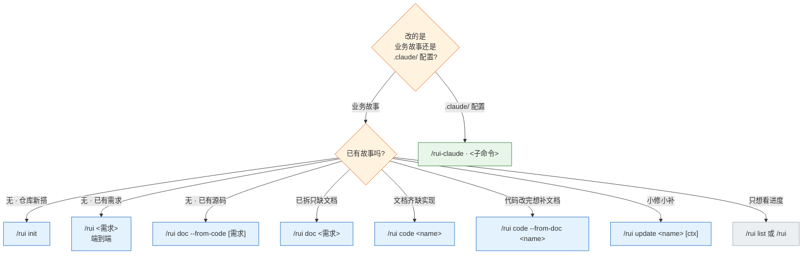
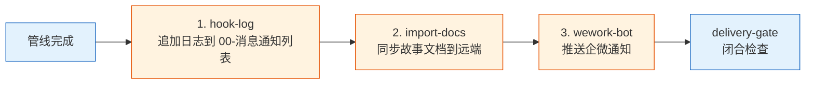

# YrY

> 故事驱动的 SDLC 编排系统 — 需求拆分 → 文档管线 → 代码管线 → 交付。

## 系统全景



**YrY** 是 Claude Code 的元插件项目，将软件交付流程固化为 6 个 Agent 协同、5 组规则约束、4 项技能支撑的自动化管线。

## Agent 角色



| Agent | 职责 | 一句话 |
|-------|------|--------|
| `pm` | 决策中枢 | 决定做/不做/延期，串起全部 Agent |
| `coder` | 代码实现 | 逐模块编码，P0 清零方进下一模块 |
| `tester` | 质量卡点 | Gate A 阻编码、Gate B 阻交付 |
| `reporter` | 过程记录 | 三报告（实施 ×2 + 测试）交叉闭合 |
| `security` | 威胁建模 | 安全审查写入 §3，P0 卡发布 |
| `self-improve` | 持续改进 | 采集执行数据，生成改进提案 |

## SDLC 管线



每阶段产出对应编号文件（01–08），交付时三步 hook 按序执行。

## 规则约束

| 规则 | 适用场景 | 核心约束 |
|------|---------|---------|
| `code-pipeline` | 源码改动 | 分支隔离 · Gate A 先行 · 逐模块清零 · Gate B 收口 · 修复 ≤ 2 轮 |
| `delivery-gate` | 交付阶段 | 三步按序：日志 → 同步 → 通知，缺一不可 |
| `doc-generation` | 文档产出 | 目录命名 · 骨架模板 · 附属数据存放 |
| `self-improve` | 复盘改进 | 数据采集 → 诊断 → 提案，`no-metrics` 降级不阻断 |
| `rui-claude` | .claude/ 管理 | 仅限 `.claude/` 目录 · 禁自动 commit/push |

## 技能



| 技能 | 命令 | 用途 |
|------|------|------|
| `rui` | `/rui init` · `/rui doc` · `/rui code` · `/rui list` · `/rui update` | 故事驱动 SDLC 主线 |
| `rui-claude` | `/rui-claude sync` · `retro` · `history` | .claude/ 配置远端同步与复盘 |
| `import-docs` | 自动（hook 触发） | 批量同步故事文档到远端 API |
| `wework-bot` | 自动（hook 触发） | 企微机器人推送管线状态通知 |

## 目录结构

```
YrY/
├── agents/                     # 6 个 Agent 角色契约（各含行为准则 + 阻断标识）
│   ├── AGENT.md                #   角色拓扑总览
│   ├── pm.md                   #   决策中枢
│   ├── coder.md                #   代码实现
│   ├── tester.md               #   质量卡点
│   ├── reporter.md             #   过程记录
│   ├── security.md             #   威胁建模
│   └── self-improve.md         #   持续改进
├── rules/                      # 5 组跨场景约束规则
│   ├── code-pipeline.md        #   编码管线（分支隔离 · Gate A/B）
│   ├── delivery-gate.md        #   交付门（三步 hook）
│   ├── doc-generation.md       #   文档生成规范
│   ├── self-improve.md         #   自改进流程
│   └── rui-claude.md           #   .claude/ 管理约束
├── skills/
│   ├── rui/                    # SDLC 编排技能
│   │   ├── SKILL.md            #   命令面定义
│   │   ├── formulas.md         #   故事文档公式
│   │   ├── coder.md            #   目录 + 数据契约
│   │   └── scripts/            #   init · list · recommend · state · loop …
│   ├── rui-claude/             # .claude/ 配置管理技能
│   │   ├── SKILL.md
│   │   └── scripts/            #   sync · retro · history · fix
│   ├── import-docs/            # 文档远端同步技能
│   │   ├── SKILL.md
│   │   └── scripts/            #   hook-sync · import-docs
│   └── wework-bot/             # 企微通知技能
│       ├── SKILL.md
│       ├── config.json         #   机器人 + webhook 配置
│       └── scripts/            #   hook-log · hook-notify · send-message
├── docs/故事任务面板/           # 故事产出目录（详见下文「故事任务面板」）
│   └── <Project>/<name>/        #   每故事独立子目录 · 00–08 编号文档 + .memory/ + .improvement/
├── .claude-plugin/             # 插件注册信息
│   ├── plugin.json
│   └── marketplace.json
├── CLAUDE.md                   # AI 协作指令
└── README.md                   # 本文件
```

## 故事任务面板

> 所有交付的唯一落地点。一个故事一个子目录，文件名编号即管线阶段顺序，跨阶段不可提前。



### 布局与命名

```
docs/故事任务面板/
└── <Project>/<name>/                 # <Project> 大驼峰 · <name> kebab-case
    ├── 01-故事任务.md                # 唯一真相源 · 必选
    ├── 02-后端技术评审.md             # 后端 / 全栈
    ├── 03-前端技术评审.md             # 前端 / 全栈
    ├── 04-测试用例评审.md             # 必选 · Gate A 前置
    ├── 05-后端实施报告.md             # 后端 / 全栈 · 验证阶段创建
    ├── 06-前端实施报告.md             # 前端 / 全栈 · 验证阶段创建
    ├── 07-测试用例报告.md             # 必选 · 验证阶段创建
    ├── 08-自改进复盘.md               # 必选 · 改进阶段创建
    ├── 00-消息通知列表.md             # 交付 hook 自动追加
    ├── {专题}.md                      # 按需补充（页面设计 / API 契约 / 数据迁移 …）
    ├── .memory/
    │   ├── rui-state.json            # 管线状态（覆盖写）
    │   └── execution-memory.jsonl    # 执行记忆（追加）
    └── .improvement/
        └── proposals.jsonl           # 自改进提案（追加）
```

CLI 用 `<Project>-<name>`（如 `YiWeb-user-login`），脚本内分解为路径 `<Project>/<name>`。

### 文件矩阵

| 编号 | 文件 | 阶段 | 必选 | 前端 | 后端 | 全栈 | 负责人 |
|:---:|------|------|:---:|:---:|:---:|:---:|--------|
| 01 | 故事任务.md | 文档生成 | ✓ | ✓ | ✓ | ✓ | pm |
| 02 | 后端技术评审.md | 文档生成 | | — | ✓ | ✓ | coder + security |
| 03 | 前端技术评审.md | 文档生成 | | ✓ | — | ✓ | coder |
| 04 | 测试用例评审.md | 文档生成 | ✓ | ✓ | ✓ | ✓ | tester |
| 05 | 后端实施报告.md | 验证 | | — | ✓ | ✓ | coder |
| 06 | 前端实施报告.md | 验证 | | ✓ | — | ✓ | coder |
| 07 | 测试用例报告.md | 验证 | ✓ | ✓ | ✓ | ✓ | tester |
| 08 | 自改进复盘.md | 改进 | ✓ | ✓ | ✓ | ✓ | pm + reporter |
| 00 | 消息通知列表.md | 交付 | 自动 | ✓ | ✓ | ✓ | wework-bot hook |

> **编号即顺序**：技术/测试评审（02/03/04）在文档生成阶段创建，实施与测试报告（05/06/07）必须等到验证阶段——不可提前。

### 补充文档

| 触发 | 文件 | 公式 |
|------|------|------|
| §1.1 涉及 UI 改造 | `页面设计.md` | F.supp.page-design |
| §2 新增/修改 API | `API契约.md` | F.supp.api-contract |
| §2 数据存储变更 | `数据迁移.md` | F.supp.data-migration |
| 第三方集成 | `集成方案.md` | F.supp.integration |
| 新权限控制 | `权限模型.md` | F.supp.permission-model |
| 性能敏感路径 | `性能基准.md` | F.supp.performance-baseline |
| 新增/变更消息队列 | `消息通道.md` | F.supp.message-channel |
| 跨故事共享模块 | `模块接口.md` | F.supp.module-interface |
| 其他专题 | `{专题}.md` | F.supp 自定义 |

公式细节见 [skills/rui/formulas.md](./skills/rui/formulas.md)，决策树见 [skills/rui/coder.md](./skills/rui/coder.md)。

### 附属元数据

`.memory/` 与 `.improvement/` 由脚本管理，人工不编辑、不入库审查。

| 文件 | 写入方式 | 维护方 | 用途 |
|------|---------|--------|------|
| `.memory/rui-state.json` | 覆盖 | `rui-state.js` | 当前阶段 · 阻断标识 · 三步交付状态 |
| `.memory/execution-memory.jsonl` | 追加 | `rui-state.js` | 阶段切换轨迹 · 质量问题 · bad cases |
| `.improvement/proposals.jsonl` | 追加 | `self-improve.js` | 自改进提案 · 效果评估 |

字段契约见 [skills/rui/coder.md §数据契约](./skills/rui/coder.md)。

### 完整度状态机



`/rui list` 按文件存在性判定状态，`/rui` 按 5 层管线评分排序推荐下一步。

## 命令速览

> 两条命令族：`/rui` 管业务故事的 SDLC 主线，`/rui-claude` 管 `.claude/` 配置自身的演进。所有写入命令末端自动触发三步 Hook：追加日志 → 文档同步（import-docs）→ 企微通知（wework-bot），未触发即视为管线未闭合。

### 选哪条命令



### /rui — 业务故事 SDLC

| 场景 | 命令 | 输入 | 末端 Hook | 说明 |
|------|------|------|:--------:|------|
| 任务推荐 | `/rui` | — | ✗ | 只读，5 层管线评分排序 |
| 进度全景 | `/rui list` | — | ✗ | 只读，扫描故事面板按文件存在性判定状态 |
| 建立基线 | `/rui init` | — | ✓ | detect → explore → generate → setup → verify → trigger |
| 端到端 | `/rui <req>` | text · `@file` · URL | ✓ | doc + code 自动串联，逐故事串行 |
| 拆需求出文档 | `/rui doc <req>` | text · `@file` · URL | ✓ | 拆故事 + 生成 01/02/03/04，不改源码 |
| 实现故事 | `/rui code <name>` | `<Project>-<name>` | ✓ | Gate A → 逐模块（P0 清零）→ Gate B → 复盘 → 交付 |
| 增量更新 | `/rui update <name> [ctx]` | `<Project>-<name>` + 上下文 | ✓ | T1 措辞 / T2 接口 / T3 重构 自动裁剪 |
| 只更文档 | `/rui update <name> --no-code` | 同上 | ✓ | 跳过编码阶段，仅刷新文档 |
| 从源码反推文档 | `/rui doc --from-code [req]` | 可空（pm 推荐）或 text | ✓ | 只读源码，补缺失文档不覆盖已有 |
| 从文档反推码 | `/rui code --from-doc <name>` | `<Project>-<name>` | ✓ | 只读源码补文档，禁止改源码 |

**输入约定**

| 形式 | 用法 | 示例 |
|------|------|------|
| 文本 | 直接写 | `/rui doc 实现用户登录` |
| 本地文件 | `@` 引用 | `/rui doc @specs/login.md` |
| 远端 URL | 直接贴 | `/rui doc https://example.com/spec` |
| 故事名 | `<Project>-<name>`（脚本拆为 `<Project>/<name>` 路径） | `YiWeb-user-login` |

### /rui-claude — `.claude/` 配置管理

操作边界硬限制为 `.claude/`，源码改动仍走 rui code 管线，分支隔离 `feat/<project>-<name>`，禁止自动 commit/push。

| 场景 | 命令 | 末端 Hook | 说明 |
|------|------|:--------:|------|
| 任务推荐 | `/rui-claude` | ✗ | 只读，推荐 5~10 条 `.claude/` 相关任务 |
| 操作历史 | `/rui-claude history [--limit N]` | ✗ | 列出最近操作记录（append-only，不入库） |
| 历史统计 | `/rui-claude history stats [--json]` | ✗ | 操作统计摘要 |
| 健康复盘 | `/rui-claude retro [--name <story>] [--json]` | ✓ | 本地分析，写 `docs/自改进故事面板/<project>-<date>.md` |
| 远端同步 | `/rui-claude sync` | ✓ | 覆盖式更新（rm -rf → rsync），需 SSH 授权，前置确认 |
| 需求管线 | `/rui-claude <req>` | ✓ | 仅限 `.claude/`，复用 rui code 管线（Gate A/B + 三步交付） |

> ⚠️ `sync` 是覆盖式操作，会先 `rm -rf .claude/` 再从远端拉取。执行前必须确认意图，本地未提交改动会丢失。

### 末端 Hook 三步骤



| 步骤 | 脚本 | 降级 |
|------|------|------|
| 追加日志 | `skills/wework-bot/scripts/hook-log.js` | 不降级 |
| 文档同步 | `skills/import-docs/scripts/hook-sync.js` | `no-token` 缺 `API_X_TOKEN` 跳过推送，仍标记 |
| 企微通知 | `skills/wework-bot/scripts/hook-notify.js` | 缺 webhook 跳过，仍标记 |
| 闭合检查 | `skills/rui/scripts/delivery-gate.js check-all` | 任一步未标记 → 阻断 |

## 不可妥协底线

| 底线 | 触发条件 |
|------|---------|
| 认证不可绕过 | 涉及 auth/token/session — P0 |
| 密钥不落盘 | Token/密钥/凭据禁止出现在源码或配置 |
| 输入必校验 | 用户输入必须验证/转义，XSS/注入为 P0 |
