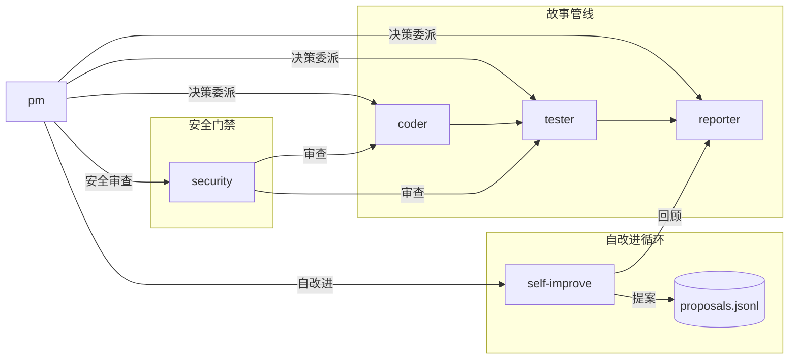

# YrY

故事驱动的 AI SDLC 项目。通过 `/rui` 编排器 + 6 个 Agent 协同，实现从需求到交付的完整管线。

## 核心概念

```
需求 → 故事拆分 → 文档管线 → 代码管线 → 自改进 → 交付
```

| 概念 | 说明 |
|------|------|
| **故事** | 最小可交付的功能单元，每个故事独立走完管线 |
| **Agent** | 6 个角色分工：pm 决策、coder 实现、tester 质量、reporter 报告、security 安全、self-improve 改进 |
| **管线** | 文档管线（规划→分析→设计→生成）+ 代码管线（预检→测试先行→实现→验证→自改进） |
| **门禁** | Gate A（测试先行，阻断实现）+ Gate B（验证，>2 轮修复阻断交付） |
| **阻断** | H1~H12 共 12 个阻断场景，仅 H9/H11 可降级 |

### Agent 协作



## 项目结构

```
YrY/
├── CLAUDE.md              # AI 上下文入口（哲学 + 原则 + 行为准则）
├── README.md              # 本文件
├── agents/                # Agent 身份与决策边界
│   ├── AGENT.md           # Agent 总览 + 证据标准 + 影响分析规范
│   ├── pm.md              # 产品决策者
│   ├── coder.md           # 编码实现（逐模块审查 + P0 清零）
│   ├── tester.md          # 测试验证（测试先行 + 门禁把守）
│   ├── reporter.md        # 报告交付（过程报告 + 知识策展）
│   ├── security.md        # 安全审查（威胁建模 + 约束注入）
│   └── self-improve.md    # 自改进引擎（数据驱动 + 效果评估）
├── rules/                 # 规则库
│   ├── code-pipeline.md   # 代码管线规则（分支隔离、逐模块审查、禁止自动合并等 14 条）
│   ├── doc-generation.md  # 文档生成规则（版本信息、证据标准、增量裁剪等 5 条）
│   ├── gate-rules.md      # 门禁规则（Gate A/B + P0 审查标准）
│   ├── self-improve.md    # 自改进规则（数据驱动、H11 降级、append-only 等 5 条）
│   └── rui-docs.md        # 文档管理规则（操作范围、增量合并、分支隔离等 8 条）
└── skills/                # 技能定义
    ├── rui/               # SDLC 编排器（全流程定义 + 命令体系）
    │   ├── SKILL.md       # 完整管线文档
    │   ├── templates/     # 8 份模板（故事任务 + 技术评审 ×3 + 实施报告 ×3 + 自改进复盘）
    │   └── scripts/       # 6 个脚本（self-improve, execution-memory, loop, rui-state, natural-week, list）
    ├── wework-bot/        # 企业微信通知（管线末端强制推送）
    │   ├── SKILL.md
    │   ├── config.json
    │   └── scripts/send-message.js
    ├── import-docs/       # 文档远程同步（管线强制步骤）
    │   ├── SKILL.md
    │   └── scripts/import-docs.js
    └── rui-docs/          # 文档目录管理（sync / retro / 健康度扫描）
        ├── SKILL.md
        └── scripts/
            ├── sync.js
            └── retro.js
```

## 命令

### `/rui` — SDLC 编排器

| 命令 | 流程 | 产出 |
|------|------|------|
| `/rui init` | 项目基线 → 基线注入 → Agent/Rule/Template/MCP 生成 → 就绪检查 | CLAUDE.md + README.md + `.claude/` |
| `/rui init --all` | init + 项目模块分析 → 逐模块端到端故事覆盖 | 全项目故事目录 + 全 8 份文档 |
| `/rui doc <req>` | 需求拆分 → 逐故事：规划→分析→设计→生成 | 01~04 文档 + §6 §7 |
| `/rui code <name>` | 预检→测试先行→实现→验证→自改进 | 01~08 全 8 份文档 + `.improvement/` + `.memory/` |
| `/rui <req>` | doc + code 全自动串联 | 每个故事 8 份文档 + 数据存储 |
| `/rui update <name> [ctx]` | 结构检测→补齐→变更分级→增量更新 | 补齐/更新的故事文档 |
| `/rui list` | 扫描故事面板 → 输出进度表 | 未完成故事列表 |
| `/rui claude-sync` | rsync 远端 `.claude` 到本地 | 最新配置 |
| `/rui`（空输入） | 扫描项目+故事状态 → 推荐 5~10 条任务 | 任务推荐列表 |

### `/wework-bot` — 企业微信通知

管线末端强制步骤，推送完成/阻断/门禁失败通知。支持 `--agent` 路由到不同机器人，`--name` 追加消息日志。

### `/import-docs` — 文档同步

递归扫描项目目录（`.claude` 内全部文件，其余仅 `.md`），批量 POST 到远端文档 API。rui 交付管线自动触发。

### `/rui-docs` — 文档目录管理

| 命令 | 流程 | 产出 |
|------|------|------|
| `/rui-docs sync` | fetch 远端 → diff 对比 → 增量合并本地 `docs/` | 补齐缺失文档 |
| `/rui-docs retro` | 采集 `docs/` 结构 → 健康度分析 → 生成复盘 | `${PROJECT}-docs-<date>.md` |
| `/rui-docs`（空输入） | 扫描 `docs/` 状态 → 推荐 5~10 条任务 | 任务推荐列表 |

对称 `rui-claude`（管理 `.claude/`）而 `rui-docs` 管理 `docs/`。互补 `import-docs`（推送本地→远端）而 `rui-docs sync`（拉取远端→本地）。

## 故事管线详解

```
故事目录: docs/故事任务面板/<name>/

文档管线                    代码管线
─────────                   ─────────
自适应规划 → 影响分析       预检（分支隔离 + 文档补齐）
     ↓                         ↓
  架构设计                  测试先行（Gate A）
     ↓                         ↓
  文档生成                  逐模块实现（P0 清零）
     ↓                         ↓
  产出:                     验证（Gate B，三报告交叉验证）
  01-故事任务.md               ↓
  02-后端技术评审.md         自改进（08-自改进复盘.md）
  03-前端技术评审.md            ↓
  04-测试用例评审.md         交付（import-docs → wework-bot）
                          产出:
                          05-后端实施报告.md
                          06-前端实施报告.md
                          07-测试用例报告.md
                          08-自改进复盘.md
```

每个故事独立走完管线，产出 8 份文档 + `.improvement/proposals.jsonl` + `.memory/`（execution-memory.jsonl + rui-state.json）。

## 开始

```bash
# 1. 建立项目基线（生成 CLAUDE.md + README.md + .claude/ 配置）
/rui init

# 2. 从需求创建故事
/rui doc "用户登录功能，支持密码和 OAuth"

# 3. 实现故事
/rui code user-login

# 4. 查看进度
/rui list

# 5. 无参数获取推荐
/rui
```

## 集成

| 集成点 | 脚本 | 触发 |
|--------|------|------|
| 自改进分析 | `node skills/rui/scripts/self-improve.js` | rui 自改进阶段 |
| 自改进循环 | `node skills/rui/scripts/loop.js run --all` | 自改进阶段 |
| 执行记忆 | `node skills/rui/scripts/execution-memory.js` | 每次 rui 执行 |
| 管线状态 | `node skills/rui/scripts/rui-state.js` | 断点保存/恢复 |
| 故事列表 | `node skills/rui/scripts/list.js` | `/rui list` |
| 文档同步 | `Skill(import-docs, --workspace)` | rui 交付自动触发 |
| 企微通知 | `Skill(wework-bot, --name <name>)` | rui 交付自动触发 |
| 文档健康度 | `node skills/rui-docs/scripts/retro.js` | `/rui-docs retro` |
| 文档远端同步 | `node skills/rui-docs/scripts/sync.js` | `/rui-docs sync` |
