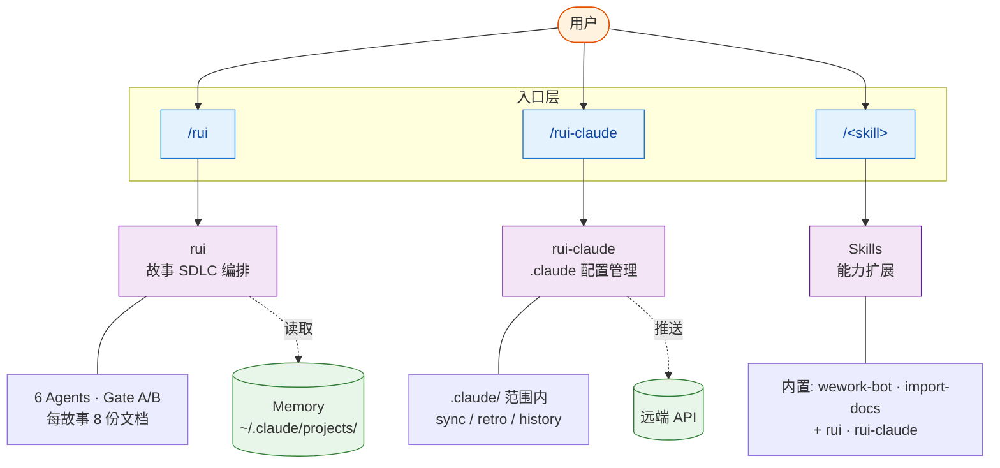

# YrY

> 故事驱动的 SDLC 编排系统，运行于 Claude Code。把模糊的需求变成可交付的代码，每一步留下可追溯的证据。

- **谁用** — 用 Claude Code 且希望工程化协同的开发者与团队
- **能做** — 需求拆故事 → 文档基线 → 测试先行 → 实现 → 验证 → 复盘 全链路
- **不做** — 不替代思考；不追求零交互全自动；不替代跨工具的项目管理
- **基础** — 三条公理推导全部行为准则，详见 [CLAUDE.md](./CLAUDE.md)

**版本 1.13.0** · [系统能力](#系统能力) · [安装](#安装) · [快速开始](#快速开始) · [项目结构](#项目结构) · [进一步](#进一步)

## 系统能力

四个能力层。**rui** 是核心编排器，**rui-claude** 管理配置，**Memory** 跨会话沉淀偏好，**Skills** 提供可插拔扩展。



| 能力 | 入口 | 一句话 | 关键机制 |
|------|------|--------|---------|
| **rui** | `/rui [doc\|code\|update] <args>` | 故事驱动的 SDLC 端到端编排 | pm·coder·tester·reporter·security·self-improve 6 Agent 协同；Gate A 测试先行 + Gate B 验证闭合；每故事八份主线文档（故事任务 / 评审三件 / 实施报告两件 / 测试报告 / 自改进复盘） |
| **rui-claude** | `/rui-claude [sync\|retro\|history]` | `.claude/` 配置的生命周期管理 | 所有变更限定在 `.claude/` 范围；sync 拉取远端、retro 健康复盘、history 操作回溯、`<req>` 端到端 |
| **Memory** | 自动加载 | 跨会话沉淀的偏好与上下文 | 启动时读 `MEMORY.md` 索引；记忆是指针不是内容，引用前必须验证时效 |
| **Skills** | `/<name>` 或任务匹配 | 可插拔的能力扩展 | 项目 4 项: rui · rui-claude · wework-bot · import-docs；系统内置见 `<skills>` 块 |

> **关系**: rui 是主编排引擎，调用 Skills 完成专项任务（如 wework-bot 通知、import-docs 同步）；rui-claude 与 rui 同级但范围限定在 `.claude/`；Memory 在所有命令启动时被读取一次，用作偏好指针。

## 安装

```bash
/plugin marketplace add https://github.com/effiy/YrY
/plugin install yry@yry
```

> 也可在本仓库目录下直接运行 `/plugin` 以本地模式加载。脚本路径：`~/.claude/plugins/marketplaces/yry/skills/<skill>/scripts/`，各 skill 独立维护。

## 快速开始

按使用场景组织。先 `init` 建立基线，再选一种方式驱动 SDLC。

### 1. 初始化

```bash
/rui init                    # 建立项目基线（CLAUDE.md + README.md + .claude/）
```

### 2. 故事驱动开发（推荐）

```bash
/rui doc "需求描述"           # 拆需求为故事，走文档管线（故事任务 + 评审三件）
/rui code <story-name>       # 实现故事，走代码管线（实施报告 + 测试报告 + 自改进复盘）
/rui <requirement>           # 端到端：文档 + 代码全自动串联
```

### 3. 反向工程（已有代码或文档）

```bash
/rui doc --from-code <req>   # 从源码反推故事，生成全套八份主线文档
/rui code --from-doc <name>  # 从已有故事任务（01-故事任务.md）补全后续七份
/rui update <name> [ctx]     # 增量更新已有故事的文档与实现
```

### 4. 配置管理 (.claude/)

```bash
/rui-claude sync             # 拉取远端最新 .claude/
/rui-claude retro            # 配置健康复盘
/rui-claude history          # 操作历史回溯
/rui-claude <requirement>    # .claude/ 范围内的端到端变更
```

### 5. 推荐与状态

```bash
/rui                         # 看下一步该做什么（任务推荐）
/rui-claude                  # .claude/ 维度的任务推荐
/rui list                    # 故事进度全景
```

## 项目结构

四个顶层目录承担四类职责，其余为元数据。

| 目录 | 职责 | 文件数 | 详细 |
|------|------|--------|------|
| `agents/` | 6 个角色身份 + 1 份总览 | 7 | pm · coder · tester · reporter · security · self-improve · AGENT |
| `rules/` | 跨场景共享约束 | 6 | code-pipeline · delivery-gate · doc-generation · self-improve · rui-claude · no-magic-number |
| `skills/` | 可调用能力 | 4 | rui · rui-claude · wework-bot · import-docs |
| `.claude/` | `rui init` 生成的项目副本 | 自动 | agents/rules/formulas/coder 副本 + project-profile + settings + .mcp.json + .history |

<details>
<summary>展开完整目录树</summary>

```
YrY/
├── CLAUDE.md              # 哲学：公理 → 推导 → 推论
├── README.md              # 本文件
├── .mcp.json              # MCP 服务配置
├── settings.json          # 项目级 Claude Code 权限
├── agents/
│   ├── AGENT.md           # 总览 + 证据标准 + 影响分析规范
│   ├── pm.md              # 产品决策：做什么 / 不做什么
│   ├── coder.md           # 编码实现：逐模块审查，P0 清零
│   ├── tester.md          # 测试验证：测试先行，Gate A/B
│   ├── reporter.md        # 报告交付：过程报告 + 知识策展
│   ├── security.md        # 安全审查：威胁建模 + 约束注入
│   └── self-improve.md    # 自改进：数据驱动 + 效果评估
├── rules/
│   ├── code-pipeline.md   # 分支隔离 + Gate A/B + 逐模块审查
│   ├── delivery-gate.md   # 三步交付（追加日志 / 同步 / 通知）+ Stop hook
│   ├── doc-generation.md  # 版本信息 + 证据等级 + 增量裁剪
│   ├── self-improve.md    # 诊断 D0–D7 + 评估 E1–E4
│   ├── rui-claude.md      # 操作范围限定 .claude/
│   └── no-magic-number.md # 数字必须绑定语义
├── skills/
│   ├── rui/               # SDLC 编排器：SKILL.md + formulas.md + coder.md
│   ├── rui-claude/        # .claude 配置管理：SKILL.md
│   ├── wework-bot/        # 企业微信通知：SKILL.md + config.json
│   └── import-docs/       # 文档远程同步：SKILL.md
└── .claude/               # rui init 生成（同步至远端）
    ├── agents/  rules/  formulas.md  coder.md
    ├── project-profile.json  settings.json  settings.local.json  .mcp.json
    └── .history/
```

</details>

## 进一步

- **了解哲学** — [CLAUDE.md](./CLAUDE.md)：三条公理（信模型、惜注意、验现实）和七条执行准则
- **规则细节** — [rules/](./rules/)：code-pipeline、delivery-gate、doc-generation 等共享约束
- **角色边界** — [agents/](./agents/)：每个 Agent 的决策范围与不该做的事
- **Skill 内幕** — [skills/rui/SKILL.md](./skills/rui/SKILL.md)：rui 命令的完整管线说明
- **故事文档公式** — [skills/rui/formulas.md](./skills/rui/formulas.md)：故事主线（F.story.\*）+ 补充文档（F.supp.\*）结构公式
- **Coder 工作手册** — [skills/rui/coder.md](./skills/rui/coder.md)：目录生命周期 + 参考文档公式（F.ref.\*）+ 数据契约
