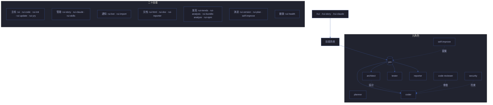
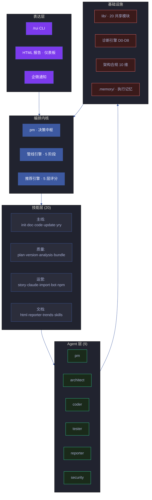
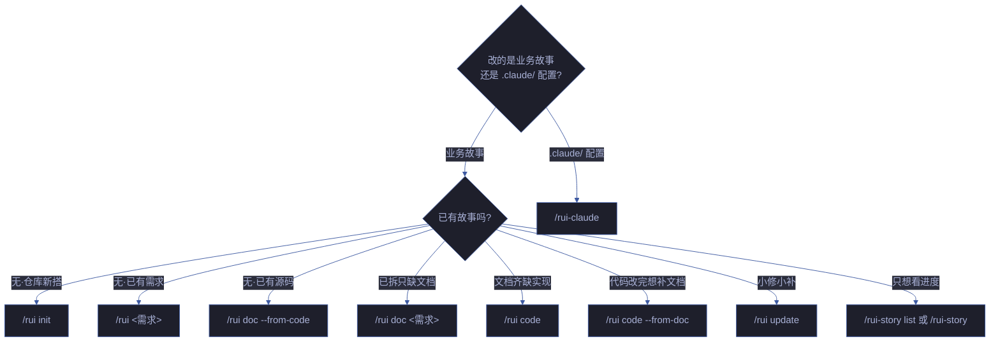
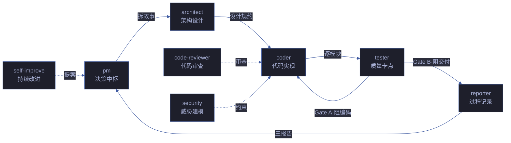
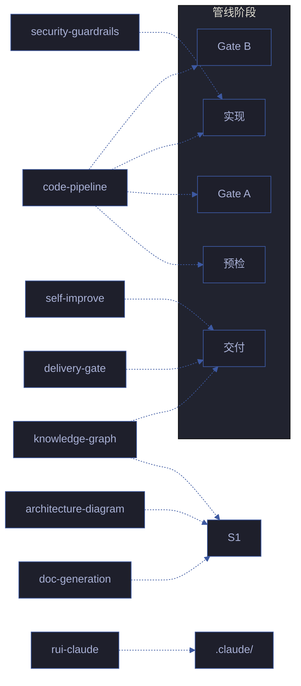
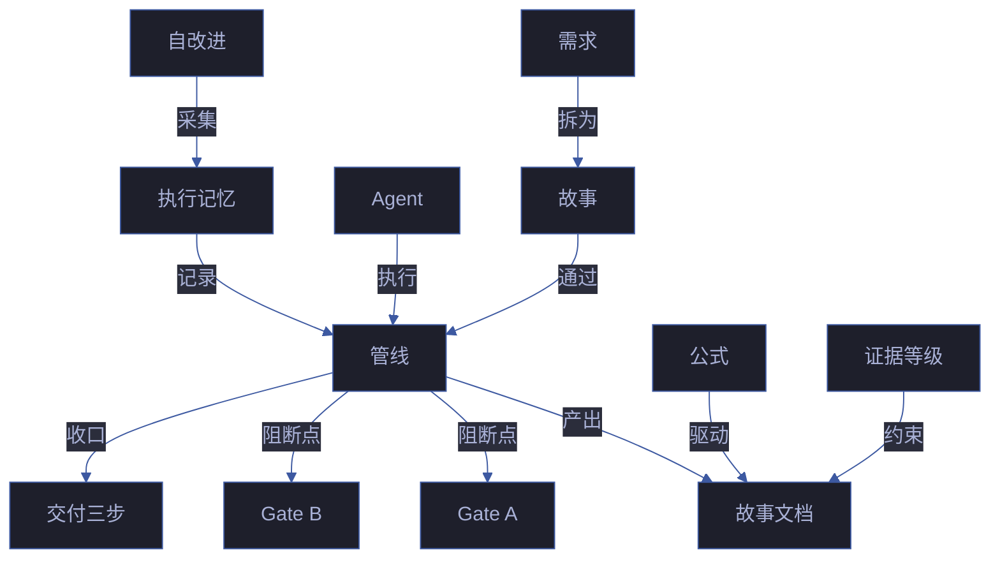

# YrY <sub>v5.4.0</sub>

> 故事驱动的 SDLC 编排系统 — 需求 → 文档 → 代码 → 交付。YrY 用自身管线管理自身演进。20 技能 + 9 Agent + 16 跨 skill 规则 + 20 共享库 + 9 维度健康检查 + 4 实时监控面板。

[系统全景](#系统全景) · [管线](#管线) · [快速开始](#快速开始) · [命令](#命令) · [/rui](#rui) · [/rui-story](#rui-story) · [/rui-claude](#rui-claude) · [/rui-npm](#rui-npm) · [Agent 角色](#agent-角色) · [规则](#规则) · [技能](#技能) · [目录结构](#目录结构) · [领域语言](#领域语言) · [技术趋势](#技术趋势)

## 系统全景



## 管线


每阶段产出对应编号文档（01–09），交付时三步 hook 按序执行。详见 [rules/code-pipeline.md](./skills/rui-code/rules/code-pipeline.md)、[rules/delivery-gate.md](./skills/rui/rules/delivery-gate.md)。

## 快速开始

```bash
# 1. 建立项目基线（首次必做）
/rui init

# 2. 从源码反推文档（存量项目）
/rui doc --from-code

# 3. 端到端交付（新需求）
/rui 用户登录功能支持手机号+验证码

# 4. 查看进度
/rui-story list
```

> init 生成 CLAUDE.md 项目约束 + README 领域语言 + 故事面板目录。存量项目用 `doc --from-code` 反推文档基线。

## 架构深潜

### 分层架构



### 数据流


### 扩展机制

YrY 采用**内核轻量、扩展丰富**的架构宪法。新增技能无需修改编排器：

1. 在 `skills/` 下创建 `rui-<name>/` 目录
2. 编写 `SKILL.md`（含 frontmatter：name/description/user_invocable/lifecycle）
3. 编排器自动发现并集成到管线和推荐引擎
4. 架构合规检查 (`node lib/arch-check.mjs`) 自动验证范式合规

### 插件系统

YrY 本身是 Claude Code 插件，通过 `CLAUDE.md` 项目约束 + `skills/` 目录驱动（纯规约形式，无 `.claude-plugin/plugin.json`）。技能市场 (`/rui-skills`) 支持发现和安装第三方技能包，所有技能遵循统一的 Agent 交接契约。

## 命令

只读命令不触发末端 hook，写入命令末端自动执行交付三步。



<a id="rui"></a>

### /rui — 业务故事 SDLC

| 命令 | 类型 | 作用 |
|------|------|------|
| `/rui` | 只读 | 5 层管线评分排序，推荐下一步任务 |
| `/rui doc <需求>` | 写入 | 拆需求出文档：生成故事文档基线，不改源码 |
| `/rui doc --from-code 需求` | 写入 | 从源码反推完整文档基线到故事目录（源码只读） |
| `/rui version --up` | 写入 | 版本升级：自主判定 → 更新文件 → git commit → 推送 + tag |
| `/rui version --rollback <name>` | 写入 | 版本回退：基于 git 版本链回退故事文档到历史版本 |
| `/rui-code <name>` | 写入 | 源码实现：Gate A → 逐模块 P0 清零 → Gate B → 复盘 → 交付 |
| `/rui-init` | 写入 | 项目初始化：detect → explore → generate → architect → setup → verify → trigger |
| `/rui-update <name> [ctx]` | 写入 | 增量更新：T1/T2/T3 自动裁剪管线 |
| `/rui-yry [--depth N]` | 写入 | 自主自改进：全扫描→诊断→实现→验证→版本升级，循环至无改进空间 |
| `/rui-skills` | 只读 | 技能市场：发现和安装 Claude/Agent 技能包 |

<a id="rui-story"></a>

### /rui-story — 故事任务面板管理

| 命令 | 类型 | 数据源 | 作用 |
|------|------|--------|------|
| `/rui-story` | 只读 | 远端 API | 状态概览：按 6 种状态统计 + 最近活动 |
| `/rui-story list` | 只读 | 远端 API | 进度全景：所有故事详情表格（状态/文件数/类型/分支） |
| `/rui-story health` | 只读 | 远端 API + 本地 | 健康检查：凭据/API 可达性/配置/数据完整性 |
| `/rui-story sync [<name>]` | 写入 | 远端 API | 委托 rui-import 从远端拉取文档覆盖本地 |
| `/rui-story remove <name>` | 写入 | 本地文件系统 | 删除指定故事整个本地目录（需确认） |
| `/rui-story --help` | 只读 | 本地 | 完整命令用法 + 场景示例 |

<a id="rui-claude"></a>

### /rui-claude — .claude/ 配置管理

| 命令 | 类型 | 作用 |
|------|------|------|
| `/rui-claude` | 只读 | 按 5 层管线评分推荐 5~10 条任务 |
| `/rui-claude history [list\|stats]` | 只读 | 操作历史：list 列出最近操作，stats 统计摘要 |
| `/rui-claude retro` | 写入 | 健康度分析：分析 .claude/ 结构产出复盘报告 |
| `/rui-claude sync` | 写入 | 远端同步：API pull 覆盖本地 `.claude/`（需确认意图） |
| `/rui-claude <需求>` | 写入 | 需求管线：仅限 `.claude/` 内的 doc+code→交付 |

<a id="rui-npm"></a>

### /rui-npm — 个人 npm 包管理

| 命令 | 类型 | 作用 |
|------|------|------|
| `/rui-npm search <keyword>` | 只读 | 按关键词搜索 npm registry，结构化展示结果 |
| `/rui-npm install <pkg>[@version]` | 写入 | 安装包到当前项目 |
| `/rui-npm update <pkg>` | 写入 | 更新指定包到兼容最新版本 |
| `/rui-npm list [--depth N]` | 只读 | 列出当前项目已安装的依赖 |
| `/rui-npm info <pkg>` | 只读 | 查看包的完整元数据（版本/许可证/维护者） |
| `/rui-npm uninstall <pkg>` | 写入 | 从当前项目卸载包 |
| `/rui-npm publish <path>` | 写入 | 发布本地文件或目录为 npm 包，即刻可用 |
| `/rui-npm npx <pkg>[@version]` | 执行 | 通过 npx 直接运行包，无需安装 |
| `/rui-npm audit` | 只读 | 审计已安装依赖的安全漏洞 |
| `/rui-npm --help` | 只读 | 完整命令用法 + 场景示例 |

## Agent 角色



- **pm** — 决策中枢：决定做/不做/延期，串起全部 Agent
- **planner** — 实施规划：从设计出实施计划，拆任务、排顺序、审查交接 coder
- **architect** — 系统架构设计：设计系统级架构、评估权衡、创建 ADR
- **coder** — 代码实现：逐模块编码，P0 清零方进下一模块
- **code-reviewer** — 代码审查：审查代码正确性、模式、反模式、简化机会（只读）
- **tester** — 质量卡点：Gate A 阻编码、Gate B 阻交付
- **reporter** — 过程记录：三报告交叉闭合
- **security** — 威胁建模：§3 安全约束注入，P0 卡发布
- **self-improve** — 持续改进：采集执行数据，生成改进提案

共用契约见 [skills/rui/AGENT.md](./skills/rui/AGENT.md)，专项规约集成在各 skill 目录内。

## 规则



- **code-pipeline** — 源码改动：分支隔离 · Gate A/B · 逐模块清零
- **code-pipeline-techniques** — 10 项支撑技术：根因追溯/纵深防御/反馈回路/深度模块/垂直切片
- **code-paradigm** — 代码编程范式：模块范式/函数范式/错误处理/导入/常量，含正反例
- **delivery-gate** — 交付收口：日志 → 同步 → 通知，手动触发
- **doc-generation** — 文档产出：目录命名 · 骨架模板 · 附属数据存放
- **doc-generation-lifecycle** — 补充文档触发器和策展步骤
- **doc-quality** — 文档质量：A/B/C/D 证据等级 · 统一模版 · 退化检测
- **architecture-diagram** — 架构图约束：自包含 HTML+SVG 深色主题
- **knowledge-graph** — 知识图谱：三层 schema（story → scene → source）
- **knowledge-graph-ownership** — KG 所有权：单点写入 · pm/coder/reporter 三方解耦
- **mermaid-theme** — Mermaid 统一配色：项目唯一色板真相源
- **plan-execution** — 计划执行：创建→审查→执行→验证管线
- **security-guardrails** — 安全护栏：防线在信任边界处，输入必校验
- **self-improve** — 自改进闭环：D0-D8 诊断 · E1-E4 评估
- **rui-claude** — .claude/ 管理：仅限 `.claude/` · 禁自动 commit/push
- **architecture-principles** — 架构宪法：内核轻量/扩展丰富/配置 API/代码范式/健康检测架构
- **design-principles** — 十一条设计原则：SRP/高内聚/低耦合/DIP/OCP/ISP/DRY/YAGNI/组合/扩展至上/可健康检测
- **agent-handoff** — Agent 交接规范：5 对契约 · 交接信号格式 · 阻断条件

详见各 skill 目录下的 `rules/` 子目录。

## 技能

### 主线

- **rui** (`/rui doc · version --up · --rollback · --from-code`) — 故事驱动 SDLC 编排入口。需求解析、文档生成、版本管理
- **rui-code** (`/rui-code <name>`) — 源码实现管线：Gate A → 逐模块 P0 清零 → Gate B → 复盘 → 交付
- **rui-init** (`/rui-init`) — 项目初始化：detect → explore → generate → architect → setup → verify → trigger
- **rui-update** (`/rui-update <name> [ctx]`) — 增量更新：T1/T2/T3 自动裁剪管线
- **rui-yry** (`/rui-yry [--depth N]`) — 自主自改进循环：全扫描 → 诊断 → 实现 → 验证 → 版本升级，循环至无改进空间
- **rui-story** (`/rui-story list · health · sync · remove`) — 故事面板远端查询、进度管理、同步、删除
- **rui-claude** (`/rui-claude sync · retro · history`) — .claude/ 配置远端同步与复盘
- **rui-skills** (`/rui-skills`) — 技能市场：发现和安装 Claude/Agent 技能包

### 自动化与通知

- **rui-bot** — 企微通知推送（3 场景：完成/阻断/门禁失败）+ Rich/Verbose 格式 + Dry-Run 预览 + 失败队列自动重试 + 自循环报告系统

### 文档与报告

- **rui-html** — 场景 HTML 文档生成：markdown → 7 类标准 HTML（计划清单/架构图/知识图谱/源码/测试面板/演示/审查）
- **rui-doc** — 文档新鲜度检查，自动检测过期文档
- **rui-reporter** — 知识策展与过程报告：故事进度/知识图谱一致性/交付摘要/跨故事趋势

### 分析与发现

- **rui-trends** — 技术趋势监控：GitHub Trending / OSS Insight / TrendShift 结构化报告
- **rui-analysis** — 代码健康看门狗：复杂度/耦合/文件膨胀/依赖健康/架构边界检测
- **rui-npm** (`/rui-npm search · install · update · list · info · uninstall · publish · npx · audit`) — npm 包管理全生命周期

### 健康与监控

- **rui-health** — 系统健康诊断（从 rui-bot 按 SRP 拆分）：9 维度评分 + HTML 报告 + D0-D8 诊断 + 趋势持久化
- **rui-bundle-analyze** — 打包产物分析：CDN 组件体积/依赖/覆盖率检测

### 质量与演进

- **rui-version** — 版本漂移检测与自动升级
- **rui-plan** — 计划新鲜度检查与执行追踪
- **rui-import** — 文档远端同步（per-document instant + batch safety-net）
- **self-improve** — 持续自改进闭环：D0-D8 诊断 → 提案生成 → 物化为故事 → 效果评估 (E1-E4)

详见 [`skills/`](./skills/)。所有脚本通过 [`lib/`](./lib/)（20 文件含 `lib/engine/` 诊断/评估/物化/升级引擎及 `lib/arch-dimensions/` 架构检测）共享 TTY 格式化、项目工具、诊断引擎和常量定义。

## 安全模型

### 信任边界

```mermaid
%%{init: {'theme': 'base', 'themeVariables': {
  'primaryColor': '#1e1f2b',
  'primaryTextColor': '#a9b1d6',
  'primaryBorderColor': '#3d59a1',
  'lineColor': '#3d59a1',
  'secondaryColor': '#2b2d3b',
  'tertiaryColor': '#21232f'
}}}%%
flowchart LR
    subgraph External["外部不可信"]
        USER["用户输入"]:::untrusted
        API["远端 API"]:::untrusted
        URL["外部 URL"]:::untrusted
    end

    subgraph Boundary["信任边界"]
        VALIDATE["输入校验层"]:::boundary
        SANITIZE["XSS/注入防护"]:::boundary
        AUTH["Token 验证"]:::boundary
    end

    subgraph Internal["内部可信域"]
        SKILLS["技能执行"]:::trusted
        AGENTS["Agent 协作"]:::trusted
        LIB["共享库"]:::trusted
    end

    External --> Boundary
    Boundary --> Internal

    classDef untrusted fill:#3a1a1a,stroke:#f87171,color:#f87171
    classDef boundary fill:#3a2a1a,stroke:#fbbf24,color:#fbbf24
    classDef trusted fill:#1a2a1a,stroke:#34d399,color:#34d399
```



### 安全原则

| 原则 | 实现 | 验证 |
|------|------|------|
| **认证不可绕过** | 所有 API 调用强制 `X-Token` 头 | `API_X_TOKEN` 仅从环境变量注入 |
| **密钥不落盘** | Token/密钥/凭据禁止出现在源码或配置文件 | arch-check 自动扫描敏感模式 |
| **输入必校验** | 用户输入经过验证/转义后再进入管线 | XSS/注入检测为 P0 阻断项 |
| **最小权限** | Agent 工具集最小化，仅授予完成职责所需工具 | ISP 合规检查 |
| **纵深防御** | 多层校验：输入层 → 业务层 → 输出层 | 安全护栏规则注入各阶段 |
| **分支隔离** | 任何写入操作前强制验证 `feat/<name>` 分支 | `lib/branch-check.mjs` 门禁 |

### 威胁模型

| 威胁 | 影响 | 缓解措施 |
|------|------|---------|
| 恶意输入注入 | 管线执行非预期命令 | 输入校验 + 参数化命令 |
| Token 泄露 | 远端 API 被未授权访问 | 环境变量隔离 + 禁止落盘 |
| 供应链攻击 | 恶意技能包 | 技能市场元数据验证 + 依赖审计 |
| 分支混淆 | 代码写入错误分支 | 分支隔离强制门禁 |
| 文档注入 | XSS 通过文档渲染 | HTML 输出转义 + CSP 头 |

详见 [security-guardrails.md](./skills/rui/rules/security-guardrails.md)。

## 架构决策记录 (ADR)

关键架构决策，记录设计上下文与权衡：

| ADR | 决策 | 理由 | 影响 |
|-----|------|------|------|
| **ADR-001** | 正则解析 import 而非 AST | 零依赖 · 5-10× 性能 · 容错 | 边界 case 覆盖率 ~95% |
| **ADR-002** | 力导向图而非分层图 | 对任意图结构无假设 · 自然交互 | 布局非确定性 |
| **ADR-003** | 文件级分析而非模块级 | 文件是开发者原子操作单元 | 不展开到导出/函数级 |
| **ADR-004** | HTML 自包含（除 D3 CDN） | CDN 可缓存 · 报告体积可控 | 离线需预加载 D3 |
| **ADR-005** | 规约驱动而非配置驱动 | 规约是唯一真相源 · 可被 Agent 解析 | 需要严格的规约完整性 |
| **ADR-006** | 内核轻量 · 扩展丰富 | 技能独立演进 · 编排器不膨胀 | 扩展间需严格契约 |
| **ADR-007** | 故事驱动 SDLC | 每个变更是独立故事 · 完整可追溯 | 小变更开销略高 |

## 性能特征

| 操作 | 典型耗时 | 瓶颈 |
|------|---------|------|
| 项目初始化 (`/rui init`) | 30-60s | 远端 API 调用 + 文件生成 |
| 文档生成 (`/rui doc`) | 10-30s | Agent 推理 + 文件写入 |
| 源码实现 (`/rui code`) | 按模块规模 | Agent 推理 + 测试执行 |
| 架构合规检查 | < 500ms | 纯本地文件扫描 |
| 健康检查 (9 维度) | 2-5s | 文件系统扫描 + API 探测 |
| 打包分析 (56 维度) | < 300ms | 客户端 D3 渲染 |
| 趋势报告生成 | 5-15s | 多源网络采集 |
| 企微通知 | < 2s | 网络延迟 |

## 贡献指南

### 开发工作流

1. **创建故事**：`/rui <需求描述>` — 自动拆分为故事任务
2. **分支隔离**：确保在 `feat/<name>` 分支上工作
3. **逐模块实现**：Gate A（测试先行）→ 逐模块 P0 清零 → Gate B（验证）
4. **交付收口**：`rui-import` 同步文档 + `rui-bot` 推送通知
5. **自改进**：`/rui-yry` 运行诊断并生成改进提案

### 代码规范

- **范式**：纯函数 + 具名导出，禁止 `class`/`extends`/`export default`/空 `catch`
- **常量**：魔法数字禁止，共享常量统一定义在 `lib/constants.mjs`
- **导入**：技能间禁止直接 import，共享代码放 `lib/`
- **验证**：`node lib/arch-check.mjs` 自动检查 10 维度架构合规
- **Lint**：`npx eslint lib/ skills/ --max-warnings 0` — 0 errors + 0 warnings（CI 阻断）
- **测试**：`npm test` — vitest run，含 coverage 阈值强制（lines 8% / funcs 10% 基线）

### 工程化基线

| 工具 | 配置 | 阻断 CI |
|------|------|---------|
| ESLint | `eslint.config.mjs`（flat config，含项目范式约束） | 是 |
| TypeScript checkJs | `tsconfig.json`（`strict: false` + `strictNullChecks: true`，依赖 `types/node-shim.d.ts`） | 是（0 errors） |
| Vitest | `vitest.config.mjs`（含 coverage 阈值） | 是 |
| 架构合规 | `lib/arch-check.mjs`（10 维度 A 级 + `--fix`） | 是 |
| Prettier | `printWidth 120, 2-space, semicolon, double-quote` | 否 |

详见 [CONTRIBUTING.md](./CONTRIBUTING.md) — 开发环境、CI 流程、版本管理、PR 模板。

### 文档规范

- **表达优先**：图 → 结构化文本 → 表，不可降级
- **证据等级**：A=已验证(附路径) B=可推导(附推导链) C=未验证(标"待补充") D=幻觉(视为错误)
- **Mermaid 主题**：统一使用项目色板，见 [mermaid-theme.md](./skills/rui/rules/mermaid-theme.md)

## 目录结构

```
YrY/
├── skills/                  # 20 个技能（含 Agent 角色 + 规则）
│   ├── rui/                 #   核心编排（含 pm/coder/tester/security agents + 6 规则）
│   │   ├── SKILL.md
│   │   ├── pm.md · coder.md · tester.md · security.md · AGENT.md
│   │   └── rules/           #   delivery-gate · agent-handoff · security-guardrails · design-principles · architecture-principles · mermaid-theme
│   ├── rui-code/            #   源码实现（含 code-reviewer agent + code-pipeline 规则）
│   ├── rui-plan/            #   实施计划（含 planner/architect agents + plan-execution 规则）
│   ├── rui-reporter/        #   报告策展（含 reporter agent）
│   ├── rui-html/            #   文档生成（含 doc-generation · architecture-diagram 规则）
│   ├── rui-story/           #   故事管理（含 knowledge-graph 规则）
│   ├── rui-yry/             #   自改进（含 self-improve agent + 规则）
│   ├── rui-claude/          #   Claude 配置（含 rui-claude 规则）
│   ├── ...                  #   其他 12 项技能
├── docs/
│   ├── index.html           #   文档中心着陆页 + 4 面板 (通知/调度/自改进/FAQ)
│   ├── css/index.css        #   面板样式
│   ├── js/                  #   4 面板 JS 模块（健康/自循环/自我改进/趋势）
│   ├── 健康报告/             #   9 维度健康仪表板 + 历史趋势
│   ├── 自循环报告/           #   12 技能定期巡检报告
│   ├── 自我改进/             #   健康趋势摘要和聚合数据
│   └── 故事任务面板/         #   故事产出目录
│       └── <name>/
│           ├── 故事任务.md  #     故事定义与 AC
│           └── 场景-<N>-<slug>/
│               ├── 计划清单.html  # 实施清单
│               ├── 架构图.html    # SVG 架构图
│               ├── 知识图谱.html  # 知识图谱可视化
│               ├── 源码.html      # 源码交叉引用
│               ├── 测试面板.html  # 测试仪表盘
│               ├── 演示.html      # 交互演示
│               └── 审查.html      # D0-D8 审查报告
├── lib/                     # 20 文件共享库（消除跨文件重复）
│   ├── constants.mjs        #   共享常量（超时/并发/阈值/路径）
│   ├── tty.mjs / fs.mjs     #   TTY 格式化 / 文件系统工具
│   ├── network.mjs          #   网络请求封装
│   ├── audit.mjs            #   工具调用审计
│   ├── branch-check.mjs     #   分支隔离强制
│   ├── proposals.mjs        #   改进提案编排
│   ├── scoring.mjs          #   管线评分引擎
│   ├── recommend.mjs        #   任务推荐引擎
│   ├── concurrency.mjs      #   并发控制
│   ├── record.mjs           #   执行记录
│   ├── arch-check.mjs       #   架构合规自动验证
│   ├── arch-helpers.mjs     #   架构辅助工具
│   ├── arch-dimensions/     #   架构维度检测（kernel·paradigm·solid·quality）
│   ├── engine/              #   诊断引擎
│   │   ├── diagnostics.mjs  #     D0-D8 诊断（纯逻辑）
│   │   ├── evaluate.mjs     #     E1-E4 效果评估
│   │   ├── materialize.mjs  #     提案→故事物化
│   │   └── upgrade.mjs      #     经验→规则升级检测
│   └── tests/               #   lib 自检测试
├── skills/*/tests/          # 分布式自检测试套件（每个 skill 自包含）
│   ├── run.mjs              #   测试运行器 (skills/rui/tests/)
│   └── ...
├── .claude/                 # Claude Code 本地配置
├── CLAUDE.md
└── README.md
```

## 领域语言

> 理解术语再动手。每术语含 _Avoid_ 别名防止漂移。



| 术语 | 含义 | Avoid |
|------|------|-------|
| **管线** | 端到端 SDLC 流程，需求→交付，每阶段有进入/退出条件。区别于"交付三步"（仅末端收口动作）。 | workflow, process, 流程 |
| **故事** | 管线中单一、独立、可完成的作业单元。一个需求可拆为多个故事串行通过管线，各产出一组 01–09 文档。故事内 §4 的工作拆分称"任务"，非管线单元。 | task, ticket, issue |
| **故事任务面板** | `docs/故事任务面板/<name>/` 目录。每个故事的所有产物内聚在此。 | output directory, doc folder |
| **Gate A** | 编码前的强制性阻断点。`测试设计.md` 不存在或未就绪→编码不得开始。单行 CSS/文案为唯一例外。 | test gate, pre-code check |
| **Gate B** | 编码后的闭合验证。五步检查（环境快照→静态预检→设计对齐→单次执行→三报告）。修复 > 2 轮→阻断。 | verification gate, post-code check |
| **P0 / P1 / P2** | P0 = 阻塞发布必修项；P1 = 当轮修复项；P2 = 记录不阻断项。P0 不清零不进下一模块。 | critical / major / minor |
| **阻断** | 管线在当前阶段停止，状态写入 `.memory/rui-state.json`。阻断≠失败，重跑同命令从中断点续。区别于"降级"（记录标记但不停止前进）。 | stop, halt, fail |
| **铁律** | 四条不可妥协的规则：验先于称、溯先于修、清先于进、表达优先（图→文本→表）。 | rule, constraint |
| **影响链** | 变更点的完整传递依赖图。五步闭合：列变更→选搜索词→全项目搜索→二级传递→标注处置。未闭合 = `chain-broken` 阻断。 | dependency graph, impact analysis |
| **分支隔离** | **强制门禁**。任何 Edit/Write 前须验证 `git branch --show-current` 为 `feat/<name>`。未通过 = `no-branch-isolation` 阻断。 | feature branch |
| **反推** | 只读模式。`--from-code` 从源码反推文档；`--from-doc` 从文档反推源码补充。 | reverse engineering, backfill |
| **证据等级** | A=已验证(附路径) B=可推导(附推导链) C=未验证(标"待补充") D=幻觉(视为错误)。 | confidence level |
| **Agent** | 六大协作角色：pm coder tester reporter security self-improve。每角色有交接信号和验证方式。 | bot, worker, role |
| **公式** | 结构化文档产出规范。分为通用元素 (F.meta/F.nav/F.evidence)、故事主线 (F.story.*)、补充文档 (F.supp.*)。区别于"模板"——公式是规约 (what)，模板是文件 (how)；本系统只用公式。 | template, format |
| **交付收口** | rui-import + rui-bot 手动触发。 | delivery pipeline, post-steps |
| **自改进** | D0-D8 诊断循环。采集执行数据→六维评估→生成改进提案→提案闭合。 | retrospective, post-mortem |
| **执行记忆** | `.memory/execution-memory.jsonl`（追加）+ `.memory/rui-state.json`（覆盖写）。 | state, log |
| **项目类型** | frontend / backend / fullstack / meta / unknown。决定技术评审章节裁剪（纯前端跳过 API/数据/后端性能，纯后端跳过组件/状态/交互/样式/DOM）。 | stack type |
| **需求** | `/rui` 的输入：纯文本、`@` 文件引用、或 URL。pm 解析后拆为一组故事。 | input, spec, feature request |
| **插件** | YrY 本身是 Claude Code 插件，用自身管线管理自身演进。 | extension, addon |

> 项目约束见 [CLAUDE.md](./CLAUDE.md#项目约束)。

## 技术趋势

> 技术趋势通过 `/rui-trends` 实时查询；架构模式与方法论内联于各技能规约（自包含原则）。

### 趋势分类与权重

| 分类 | 权重 | 代表技术 | 数据源 |
|------|:---:|------|------|
| 前端框架 | 0.25 | React/Vue/Svelte/Angular | GitHub Trending |
| 构建工具 | 0.15 | Vite/Webpack/Turbopack | OSS Insight |
| 运行时 | 0.20 | Deno/Bun/Node.js/Edge | TrendShift |
| CSS 方案 | 0.10 | Tailwind/UnoCSS | State of JS |
| 测试框架 | 0.10 | Vitest/Jest/Playwright | GitHub |
| AI 工具 | 0.20 | Claude/Copilot/Cursor | OSS Insight |

### 信噪比与行动矩阵

| SNR 范围 | 等级 | 含义 | 行动 |
|:---:|:---:|------|------|
| > 3.0 | 强信号 | 趋势明确 | 立即响应 |
| 2.0-3.0 | 中信号 | 趋势可信 | 评估采纳 |
| 1.0-2.0 | 弱信号 | 趋势存疑 | 持续观察 |
| < 1.0 | 噪声 | 无明确趋势 | 不响应 |

### 趋势刷新机制

| 属性 | 值 |
|------|-----|
| 刷新频率 | 每周一 09:00 CST |
| 数据源 | 4 (GitHub/OSS/TrendShift/State of JS) |
| 生成命令 | `/rui-trends` |
| 持久化 | `.memory/health-trend.jsonl` |
| 通知 | 企微 Webhook |
| 降级策略 | 缓存上次数据 |
