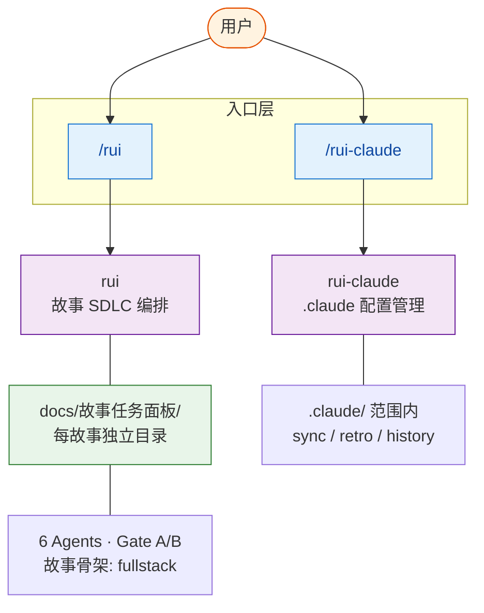

# YrY

> 故事驱动的 SDLC 编排系统。插件/配置系统开发，规则完整性与集成契约。

- **项目类型** — 元项目(插件/配置)（plugin）
- **技术栈** — 元项目(插件/配置)
- **生态** — meta
- **基础** — 三条公理推导全部行为准则，详见 [CLAUDE.md](./CLAUDE.md)

## 系统能力



| 能力 | 入口 | 一句话 |
|------|------|--------|
| **rui** | `/rui [doc\|code\|update] <args>` | 故事驱动的 SDLC 端到端编排 |
| **rui-claude** | `/rui-claude [sync\|retro\|history]` | `.claude/` 配置的生命周期管理 |

## 快速开始

```bash
/rui init                    # 建立项目基线（CLAUDE.md + README.md + 故事面板目录）
/rui doc "需求描述"           # 拆需求为故事
/rui code <story-name>       # 实现故事
/rui                         # 任务推荐
```

## 项目结构

| 目录/文件 | 职责 | 生成方式 |
|-----------|------|---------|
| `CLAUDE.md` | 哲学基础 + 项目约束 | rui init 全量重生 |
| `README.md` | 系统视图 + 项目画像 | rui init 全量重生 |
| `docs/故事任务面板/<Project>/<name>/` | 故事产出（每故事独立目录） | rui doc/code 生成 |
| `agents/` | 角色契约 | 手动维护 |
| `rules/` | 跨场景约束 | 手动维护 |
| `skills/` | 技能定义 + 脚本 | 手动维护 |

### 故事目录结构（单个故事）

```
docs/故事任务面板/<Project>/<name>/
├── 01-故事任务.md              ← 唯一真相源（pm）
├── 02-后端技术评审.md          ← 后端/全栈项目（coder + security）
├── 03-前端技术评审.md          ← 前端/全栈项目（coder）
├── 04-测试用例评审.md          ← 必选（tester）
├── 05-后端实施报告.md          ← 验证阶段（coder）
├── 06-前端实施报告.md          ← 验证阶段（coder）
├── 07-测试用例报告.md          ← 验证阶段（tester）
├── 08-自改进复盘.md            ← 必选（pm + reporter）
├── 00-消息通知列表.md          ← 自动追加（hook）
├── {领域专题}.md               ← 按需（pm 决策）
├── .memory/
│   ├── execution-memory.jsonl  ← 执行记忆（追加）
│   └── rui-state.json          ← 管线状态（覆盖）
└── .improvement/
    └── proposals.jsonl          ← 自改进提案（追加）
```

## 项目画像

| 维度 | 值 |
|------|-----|
| 类型 | 元项目(插件/配置) |
| 架构 | plugin |
| Coder 公式 | 模块 → 接口 → 数据流 |
| 安全面 | 认证授权 · 第三方调用 |
| 测试 | 未配置 |
| CI/CD | 未配置 |
| 构建 | 无 |
| 测试命令 | 无 |

## 进一步

- **了解哲学** — [CLAUDE.md](./CLAUDE.md)
- **规则细节** — [rules/](./rules/)
- **角色边界** — [agents/](./agents/)
- **技能定义** — [skills/](./skills/)
- **文档公式** — [skills/rui/formulas.md](./skills/rui/formulas.md)
- **Coder 手册** — [skills/rui/coder.md](./skills/rui/coder.md)
