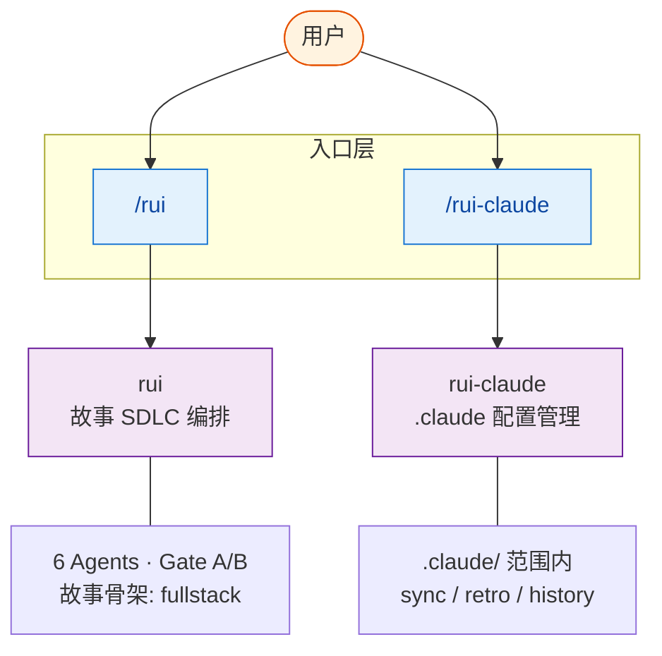

# YrY

> 故事驱动的 SDLC 编排系统。插件/配置系统开发，规则完整性与集成契约。

- **项目类型** — 元项目(插件/配置)（plugin）
- **技术栈** — 元项目(插件/配置)
- **生态** — meta
- **基础** — 三条公理推导全部行为准则，详见 [CLAUDE.md](./CLAUDE.md)

## 系统能力



| 能力 | 入口 | 一句话 |
|------|------|--------|
| **rui** | `/rui [doc\|code\|update] <args>` | 故事驱动的 SDLC 端到端编排 |
| **rui-claude** | `/rui-claude [sync\|retro\|history]` | `.claude/` 配置的生命周期管理 |

## 快速开始

```bash
/rui init                    # 建立项目基线（生成全部产物）
/rui doc "需求描述"           # 拆需求为故事
/rui code <story-name>       # 实现故事
/rui                         # 任务推荐
```

## 项目结构

| 目录/文件 | 职责 | 生成方式 |
|-----------|------|---------|
| `CLAUDE.md` | 哲学基础 + 项目约束 | rui init 生成 |
| `README.md` | 系统视图 | rui init 生成 |
| `.claude/agents/` | 7 个角色（按 元项目(插件/配置) 裁剪） | rui init 生成 |
| `.claude/rules/` | 6 个规则（按 元项目(插件/配置) 裁剪） | rui init 生成 |
| `.claude/project-profile.json` | 项目画像（事实层） | rui init 生成 |
| `.claude/formulas.md` | 故事文档公式 | rui init 生成 |
| `.claude/coder.md` | coder 工作手册 | rui init 生成 |
| `docs/故事任务面板/` | 故事产出 | rui doc/code 生成 |

## 项目画像

| 维度 | 值 |
|------|-----|
| 类型 | 元项目(插件/配置) |
| 架构 | plugin |
| Coder 公式 | 模块 → 接口 → 数据流 |
| 安全面 | 认证授权 · 第三方调用 |
| 测试 | 未配置 |
| CI/CD | 未配置 |
| 构建 | 无 |
| 测试命令 | 无 |

## 进一步

- **了解哲学** — [CLAUDE.md](./CLAUDE.md)
- **规则细节** — `.claude/rules/`
- **角色边界** — `.claude/agents/`
- **文档公式** — `.claude/formulas.md`
- **Coder 手册** — `.claude/coder.md`
