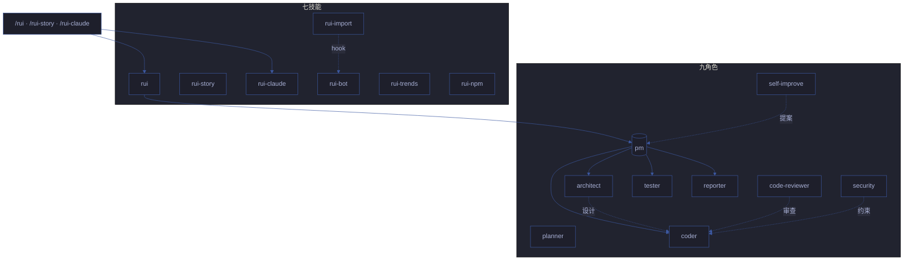
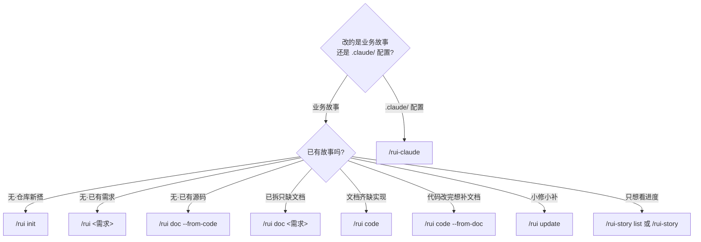
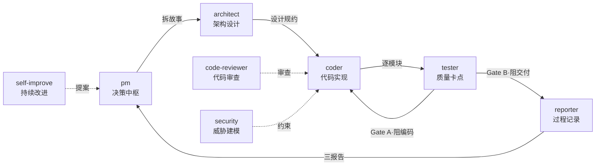
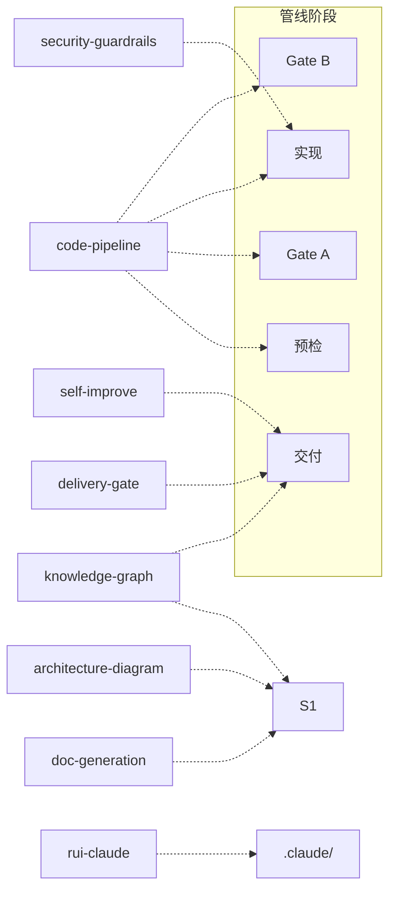

# YrY <sub>v4.1.1</sub>

> 故事驱动的 SDLC 编排系统 — 需求 → 文档 → 代码 → 交付。YrY 用自身管线管理自身演进。共享 `lib/` 消除 491 行跨文件重复。

[系统全景](#系统全景) · [管线](#管线) · [快速开始](#快速开始) · [命令](#命令) · [/rui](#rui) · [/rui-story](#rui-story) · [/rui-claude](#rui-claude) · [/rui-npm](#rui-npm) · [Agent 角色](#agent-角色) · [规则](#规则) · [技能](#技能) · [目录结构](#目录结构) · [领域语言](#领域语言) · [技术趋势](#技术趋势)

## 系统全景



## 管线


每阶段产出对应编号文档（01–09），交付时三步 hook 按序执行。详见 [rules/code-pipeline.md](./rules/code-pipeline.md)、[rules/delivery-gate.md](./rules/delivery-gate.md)。

## 快速开始

```bash
# 1. 建立项目基线（首次必做）
/rui init

# 2. 从源码反推文档（存量项目）
/rui doc --from-code

# 3. 端到端交付（新需求）
/rui 用户登录功能支持手机号+验证码

# 4. 查看进度
/rui-story list
```

> init 生成 CLAUDE.md 项目约束 + README 领域语言 + 故事面板目录。存量项目用 `doc --from-code` 反推文档基线。

## 命令

只读命令不触发末端 hook，写入命令末端自动执行交付三步。



<a id="rui"></a>

### /rui — 业务故事 SDLC

| 命令 | 类型 | 作用 |
|------|------|------|
| `/rui` | 只读 | 5 层管线评分排序，推荐下一步任务 |
| `/rui init` | 写入 | 建立基线：detect → explore → generate → setup → verify → trigger |
| `/rui <需求>` | 写入 | 端到端：doc + code 自动串联，逐故事串行 |
| `/rui doc <需求>` | 写入 | 拆需求出文档：生成 01/02/03/04，不改源码 |
| `/rui code <name>` | 写入 | 实现故事：Gate A → 逐模块 → Gate B → 复盘 → 交付 |
| `/rui update <name> [ctx]` | 写入 | 增量更新：T1/T2/T3 自动裁剪 |
| `/rui yry [--depth N]` | 写入 | 自改进闭环：全自主扫描→诊断→实现→验证→版本升级，循环至无改进空间或达到深度上限（默认 3） |
| `/rui version --up` | 写入 | 版本升级：自主判定 → 更新文件 → git commit → 合并 main → 推送 + tag |
| `/rui version --rollback <name>` | 写入 | 版本回退：基于 git 版本链回退故事文档到历史版本（需确认） |
| `/rui doc --from-code 需求` | 写入 | 从源码反推完整 5 文档基线到故事目录（源码只读） |
| `/rui code --from-doc <name>` | 只读 | 从文档反推码：禁止改源码 |

<a id="rui-story"></a>

### /rui-story — 故事任务面板管理

| 命令 | 类型 | 数据源 | 作用 |
|------|------|--------|------|
| `/rui-story` | 只读 | 远端 API | 状态概览：按 6 种状态统计 + 最近活动 |
| `/rui-story list` | 只读 | 远端 API | 进度全景：所有故事详情表格（状态/文件数/类型/分支） |
| `/rui-story health` | 只读 | 远端 API + 本地 | 健康检查：凭据/API 可达性/配置/数据完整性 |
| `/rui-story sync [<name>]` | 写入 | 远端 API | 委托 rui-import 从远端拉取文档覆盖本地 |
| `/rui-story remove <name>` | 写入 | 本地文件系统 | 删除指定故事整个本地目录（需确认） |
| `/rui-story --help` | 只读 | 本地 | 完整命令用法 + 场景示例 |

<a id="rui-claude"></a>

### /rui-claude — .claude/ 配置管理

| 命令 | 类型 | 作用 |
|------|------|------|
| `/rui-claude` | 只读 | 按 5 层管线评分推荐 5~10 条任务 |
| `/rui-claude history [list\|stats]` | 只读 | 操作历史：list 列出最近操作，stats 统计摘要 |
| `/rui-claude retro` | 写入 | 健康度分析：分析 .claude/ 结构产出复盘报告 |
| `/rui-claude sync` | 写入 | 远端同步：API pull 覆盖本地 `.claude/`（需确认意图） |
| `/rui-claude <需求>` | 写入 | 需求管线：仅限 `.claude/` 内的 doc+code→交付 |

<a id="rui-npm"></a>

### /rui-npm — 个人 npm 包管理

| 命令 | 类型 | 作用 |
|------|------|------|
| `/rui-npm search <keyword>` | 只读 | 按关键词搜索 npm registry，结构化展示结果 |
| `/rui-npm install <pkg>[@version]` | 写入 | 安装包到当前项目 |
| `/rui-npm update <pkg>` | 写入 | 更新指定包到兼容最新版本 |
| `/rui-npm list [--depth N]` | 只读 | 列出当前项目已安装的依赖 |
| `/rui-npm info <pkg>` | 只读 | 查看包的完整元数据（版本/许可证/维护者） |
| `/rui-npm uninstall <pkg>` | 写入 | 从当前项目卸载包 |
| `/rui-npm publish <path>` | 写入 | 发布本地文件或目录为 npm 包，即刻可用 |
| `/rui-npm npx <pkg>[@version]` | 执行 | 通过 npx 直接运行包，无需安装 |
| `/rui-npm audit` | 只读 | 审计已安装依赖的安全漏洞 |
| `/rui-npm --help` | 只读 | 完整命令用法 + 场景示例 |

## Agent 角色



- **pm** — 决策中枢：决定做/不做/延期，串起全部 Agent
- **planner** — 实施规划：从设计出实施计划，拆任务、排顺序、审查交接 coder
- **architect** — 系统架构设计：设计系统级架构、评估权衡、创建 ADR
- **coder** — 代码实现：逐模块编码，P0 清零方进下一模块
- **code-reviewer** — 代码审查：审查代码正确性、模式、反模式、简化机会（只读）
- **tester** — 质量卡点：Gate A 阻编码、Gate B 阻交付
- **reporter** — 过程记录：三报告交叉闭合
- **security** — 威胁建模：§3 安全约束注入，P0 卡发布
- **self-improve** — 持续改进：采集执行数据，生成改进提案

共用契约见 [agents/AGENT.md](./agents/AGENT.md)，专项规约见 `agents/<role>.md`。

## 规则



- **code-pipeline** — 源码改动：分支隔离 · Gate A/B · 逐模块清零，支撑技术含根因追溯/纵深防御/反馈回路/深度模块/垂直切片
- **delivery-gate** — 交付收口：日志 → 同步 → 通知，手动触发
- **doc-generation** — 文档产出：目录命名 · 骨架模板 · 附属数据存放
- **architecture-diagram** — 架构图约束：故事文档中 HTML 架构图的生成与规范
- **knowledge-graph** — 知识图谱：故事文档中 JSON 知识图谱的结构与查询
- **security-guardrails** — 安全护栏：代码文件的安全约束检查与注入防护
- **self-improve** — 复盘改进：数据采集 → 诊断 → 提案，`no-metrics` 降级不阻断
- **rui-claude** — .claude/ 管理：仅限 `.claude/` · 禁自动 commit/push

详见 [`rules/`](./rules/)。

## 技能

- **rui** (`/rui init · doc · code · update · yry · version --up · --rollback · --from-code`) — 故事驱动 SDLC 主线，含诊断纪律、架构深化、交接纪律、版本管理
- **rui-story** (`/rui-story list · health · sync · remove`) — 故事面板远端查询、进度管理、文档同步、本地删除
- **rui-claude** (`/rui-claude sync · retro · history`) — .claude/ 配置远端同步与复盘
- **rui-import** — 手动触发：批量同步故事文档到远端 API
- **rui-bot** — 手动触发：企微机器人推送管线状态通知
- **rui-trends** — 按需：查询 GitHub Trending / OSS Insight / TrendShift / Top-Starred，输出结构化趋势报告。自改进 D5 诊断集成
- **rui-npm** (`/rui-npm search · install · update · list · info · uninstall · publish · npx · audit`) — 个人 npm 包管理：搜索、增删改查、本地发布即发即用

详见 [`skills/`](./skills/)。所有脚本通过 [`lib/`](./lib/) 共享 TTY 格式化、项目工具函数和常量定义。

## 目录结构

```
YrY/
├── agents/                  # 9 个 Agent 角色契约
│   ├── AGENT.md             #   角色拓扑与共用底线
│   ├── pm.md / planner.md / architect.md / coder.md
│   ├── code-reviewer.md / tester.md
│   ├── reporter.md / security.md
│   └── self-improve.md
├── rules/                   # 10 组约束规则
│   ├── code-pipeline.md     #   分支隔离 · Gate A/B
│   ├── delivery-gate.md     #   三步 hook
│   ├── doc-generation.md    #   文档生成规范
│   ├── architecture-diagram.md # 架构图约束
│   ├── knowledge-graph.md   #   知识图谱约束
│   ├── security-guardrails.md  # 安全护栏
│   ├── self-improve.md      #   自改进流程
│   ├── rui-claude.md        #   .claude/ 管理约束
│   ├── mermaid-theme.md     #   Mermaid 统一主题配置
│   └── plan-execution.md    #   计划执行与验证管线
├── skills/                  # 7 项技能规约
│   ├── rui/                 #   SDLC 编排
│   │   ├── formulas.md      #     故事文档公式
│   │   ├── coder.md         #     工作手册·数据契约
│   │   └── ranking.md       #     推荐评分框架
│   ├── rui-story/           #   故事面板管理
│   ├── rui-claude/          #   .claude/ 配置管理
│   ├── rui-import/         #   文档远端同步
│   ├── rui-bot/          #   企微通知
│   ├── rui-trends/          #   技术趋势发现
│   └── rui-npm/             #   个人 npm 包管理
├── docs/
│   ├── index.html           #   文档中心着陆页
│   └── 故事任务面板/        #   故事产出目录
│       └── <name>/
│           ├── 故事任务.md  #     故事定义与 AC
│           ├── plan.html         #   计划总览
│           └── 场景-<N>-<slug>/
│               ├── 计划清单.html  # 实施清单
│               ├── 架构图.html    # SVG 架构图
│               ├── 知识图谱.html  # 知识图谱可视化
│               ├── 测试面板.html  # 测试仪表盘
│               └── 演示.html      # 交互演示
├── demos/                   # 技能演示页面
├── templates/               # 管线模板（与 docs/tests 结构镜像）
│   ├── docs/
│   ├── tests/
│   └── demos/
├── lib/                     # 项目级共享库（消除跨文件重复）
│   ├── tty.mjs              #   TTY/ANSI 格式化函数
│   ├── fs.mjs               #   文件系统与项目工具
│   ├── constants.mjs        #   共享常量（超时/并发/阈值/路径）
│   └── help-layout.mjs      #   help 文件布局函数
├── tests/                   # 自检测试套件
│   ├── run.mjs              #   测试运行器
│   ├── skills/ agents/ rules/ integration/
│   └── lib/                 #   测试工具（harness + helpers）
├── .claude/                 # Claude Code 本地配置
├── .claude-plugin/          # 插件清单与市场元数据
├── CLAUDE.md
└── README.md
```

## 领域语言

> 理解术语再动手。每术语含 _Avoid_ 别名防止漂移。


| 术语 | 含义 | Avoid |
|------|------|-------|
| **管线** | 端到端 SDLC 流程，需求→交付，每阶段有进入/退出条件。区别于"交付三步"（仅末端收口动作）。 | workflow, process, 流程 |
| **故事** | 管线中单一、独立、可完成的作业单元。一个需求可拆为多个故事串行通过管线，各产出一组 01–09 文档。故事内 §4 的工作拆分称"任务"，非管线单元。 | task, ticket, issue |
| **故事任务面板** | `docs/故事任务面板/<name>/` 目录。每个故事的所有产物内聚在此。 | output directory, doc folder |
| **Gate A** | 编码前的强制性阻断点。`测试设计.md` 不存在或未就绪→编码不得开始。单行 CSS/文案为唯一例外。 | test gate, pre-code check |
| **Gate B** | 编码后的闭合验证。五步检查（环境快照→静态预检→设计对齐→单次执行→三报告）。修复 > 2 轮→阻断。 | verification gate, post-code check |
| **P0 / P1 / P2** | P0 = 阻塞发布必修项；P1 = 当轮修复项；P2 = 记录不阻断项。P0 不清零不进下一模块。 | critical / major / minor |
| **阻断** | 管线在当前阶段停止，状态写入 `.memory/rui-state.json`。阻断≠失败，重跑同命令从中断点续。区别于"降级"（记录标记但不停止前进）。 | stop, halt, fail |
| **铁律** | 四条不可妥协的规则：验先于称、溯先于修、清先于进、表达优先（图→文本→表）。 | rule, constraint |
| **影响链** | 变更点的完整传递依赖图。五步闭合：列变更→选搜索词→全项目搜索→二级传递→标注处置。未闭合 = `chain-broken` 阻断。 | dependency graph, impact analysis |
| **分支隔离** | **强制门禁**。任何 Edit/Write 前须验证 `git branch --show-current` 为 `feat/<name>`。未通过 = `no-branch-isolation` 阻断。 | feature branch |
| **反推** | 只读模式。`--from-code` 从源码反推文档；`--from-doc` 从文档反推源码补充。 | reverse engineering, backfill |
| **证据等级** | A=已验证(附路径) B=可推导(附推导链) C=未验证(标"待补充") D=幻觉(视为错误)。 | confidence level |
| **Agent** | 六大协作角色：pm coder tester reporter security self-improve。每角色有交接信号和验证方式。 | bot, worker, role |
| **公式** | 结构化文档产出规范。分为通用元素 (F.meta/F.nav/F.evidence)、故事主线 (F.story.*)、补充文档 (F.supp.*)。区别于"模板"——公式是规约 (what)，模板是文件 (how)；本系统只用公式。 | template, format |
| **交付收口** | rui-import + rui-bot 手动触发。 | delivery pipeline, post-steps |
| **自改进** | D0–D7 诊断循环。采集执行数据→六维评估→生成改进提案→提案闭合。 | retrospective, post-mortem |
| **执行记忆** | `.memory/execution-memory.jsonl`（追加）+ `.memory/rui-state.json`（覆盖写）。 | state, log |
| **项目类型** | frontend / backend / fullstack / meta / unknown。决定技术评审章节裁剪（纯前端跳过 API/数据/后端性能，纯后端跳过组件/状态/交互/样式/DOM）。 | stack type |
| **需求** | `/rui` 的输入：纯文本、`@` 文件引用、或 URL。pm 解析后拆为一组故事。 | input, spec, feature request |
| **插件** | YrY 本身是 Claude Code 插件，用自身管线管理自身演进。 | extension, addon |

> 项目约束见 [CLAUDE.md](./CLAUDE.md#项目约束)。

## 技术趋势

> 技术趋势通过 `/rui-trends` 实时查询；架构模式与方法论内联于各技能规约（自包含原则）。
