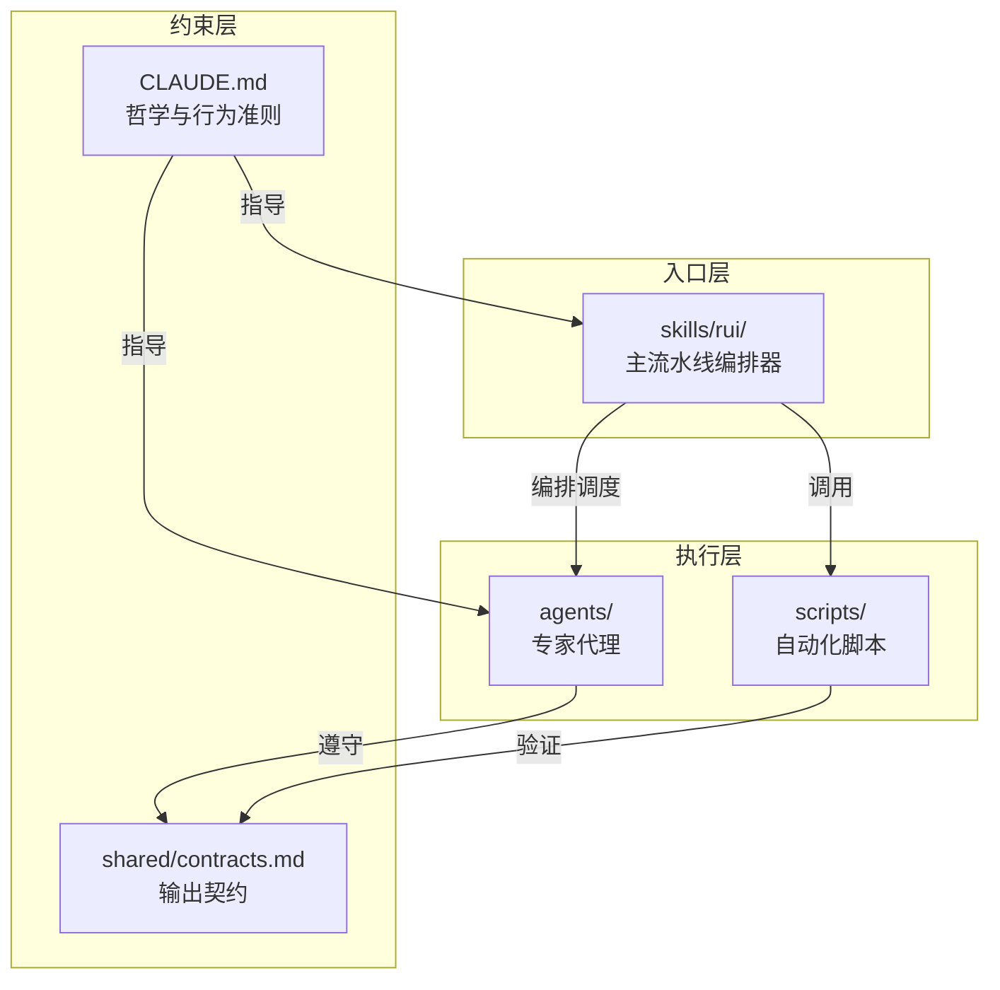
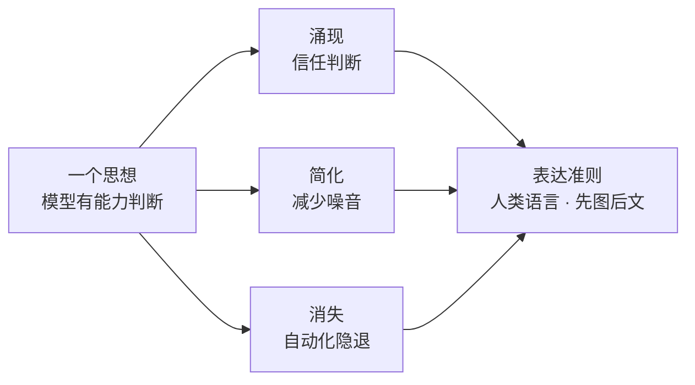

# YrY

Claude / Cursor 协作层：技能、代理与共享契约。



## 核心原则



## 目录结构

| 目录 | 作用 |
|------|------|
| `skills/` | 可调用技能，`SKILL.md` 为入口 |
| `agents/` | 专家代理，`AGENT.md` 为入口 |
| `shared/` | 输出契约、证据标准、影响分析 |
| `scripts/` | 编译、验证、自动化工具 |

## 入口

1. [`CLAUDE.md`](CLAUDE.md) — 哲学与行为准则
2. [`shared/contracts.md`](shared/contracts.md) — Agent/skill 共享约束
3. [`skills/rui/SKILL.md`](skills/rui/SKILL.md) — 主流水线编排器

## 验证

```bash
node scripts/compile-manifests.js --validate --check-gates
```

## 后期规划与改进

- 参考行业标准（如 LangChain Agent Protocol、OpenAI Agents SDK），持续简化代理与技能的协作模型
- 考虑将重复的编排逻辑标准化为可复用流程，减少 `SKILL.md` 中的样板代码
- 避免过度依赖复杂方法论，保持"一个思想"哲学在实践中的纯粹性
- 以需求为导向持续演进系统架构，构建专业深度
- 多维思考：在自动化与人工审查之间寻找最优平衡点

### 附加用户故事

- 作为开发者，我想要一键验证所有代理契约，以便快速发现配置漂移
- 作为新成员，我想要通过 mermaid 图在 30 秒内理解项目结构，以便快速上手
- 作为维护者，我想要代理输出自动符合契约标准，以便减少人工审查成本
