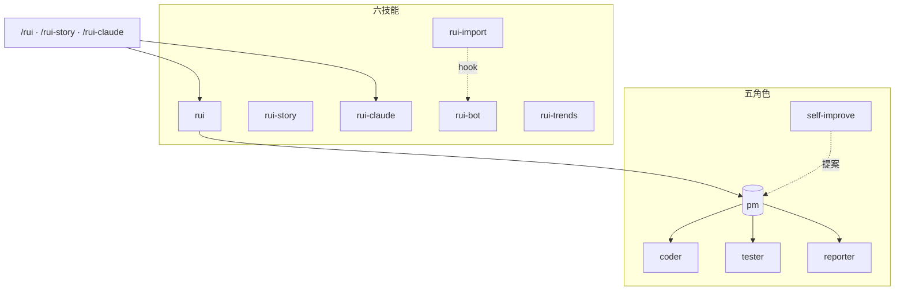
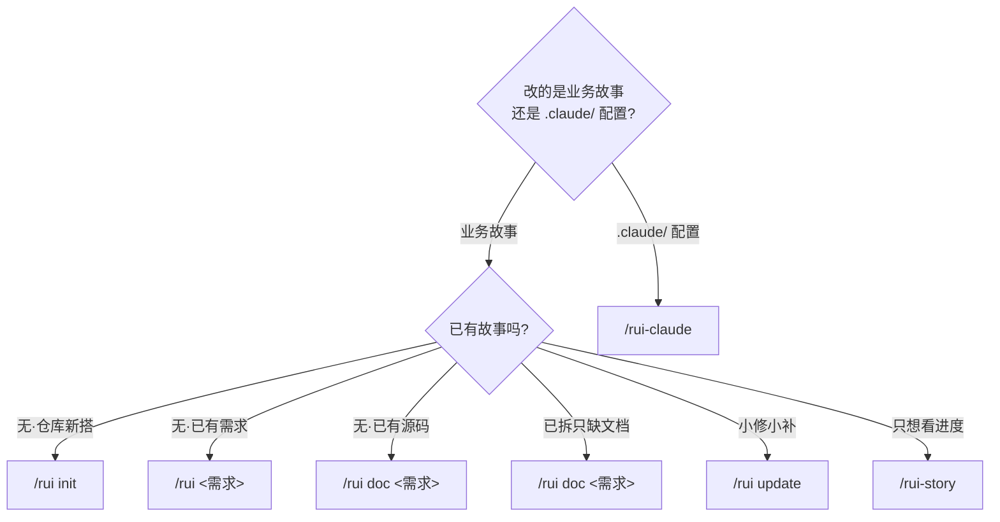
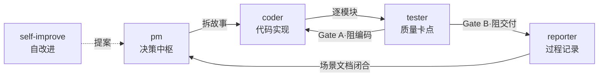

# YrY <sub>v2.7.0</sub>

> 故事驱动的 SDLC 编排系统 — 场景基线 → 文档 → 代码 → 交付。YrY 用自身管线管理自身演进。

[系统全景](#系统全景) · [管线](#管线) · [快速开始](#快速开始) · [命令](#命令) · [/rui](#rui---业务故事-sdlc) · [/rui-story](#rui-story---故事任务面板管理) · [/rui-claude](#rui-claude---claude-配置管理) · [Agent 角色](#agent-角色) · [规则](#规则) · [技能](#技能) · [目录结构](#目录结构) · [故事任务](#故事任务) · [领域语言](#领域语言) · [技术趋势](#技术趋势)

## 系统全景



## 管线


每阶段产出写入场景文档对应节（§0–§4），交付时三步 hook 按序执行。详见 [rules/code-pipeline.md](./rules/code-pipeline.md)、[rules/delivery-gate.md](./rules/delivery-gate.md)。

## 快速开始

```bash
# 1. 建立项目基线（首次必做）
/rui init

# 2. 从源码反推文档（存量项目）
/rui doc <需求>

# 3. 端到端交付（新需求）
/rui 用户登录功能支持手机号+验证码

# 4. 查看进度
/rui-story
```

> init 生成 CLAUDE.md 项目约束 + README 领域语言 + 故事面板目录（技术架构故事 + 自测试套件）。存量项目用 `/rui doc <需求>` 只读源码反推文档基线。

## 命令

只读命令不触发末端 hook，写入命令末端自动执行交付三步。



### /rui — 业务故事 SDLC

| 命令 | 类型 | 作用 |
|------|------|------|
| `/rui` | 只读 | 5 层管线评分排序，推荐下一步任务 |
| `/rui init` | 写入 | 建立基线：detect → explore → generate → setup → verify → trigger |
| `/rui <需求>` | 写入 | 端到端：doc + code 自动串联，逐故事串行 |
| `/rui doc <需求>` | 写入 | 文档生成：拆需求为故事 + 场景文档基线（只读源码，不改动） |
| `/rui update [ctx]` | 写入 | 增量更新：T1/T2/T3 自动裁剪 |

### /rui-story — 故事任务面板管理

| 命令 | 类型 | 数据源 | 作用 |
|------|------|--------|------|
| `/rui-story` | 只读 | 远端 API | 状态概览：按状态统计 + 最近活动 |
| `/rui-story sync [<name>]` | 写入 | 远端 API | 委托 rui-import 从远端拉取文档覆盖本地 |

### /rui-claude — .claude/ 配置管理

| 命令 | 类型 | 作用 |
|------|------|------|
| `/rui-claude` | 只读 | 按 5 层管线评分推荐 5~10 条任务 |
| `/rui-claude sync` | 写入 | 远端同步：API pull 覆盖本地 `.claude/`（需确认意图） |

## Agent 角色



## 规则

| 规则 | 作用域 | 核心 |
|------|--------|------|
| [code-pipeline.md](./rules/code-pipeline.md) | `**/*.{js,ts,py,...}` + `.claude/**` | 管线全流程：分支隔离 · Gate A/B · 逐模块 P0 清零 · 自改进 · .claude/ 变更 |
| [delivery-gate.md](./rules/delivery-gate.md) | `docs/故事任务面板/**/*.md` | 交付收口：三步 hook 按序执行 |
| [doc-generation.md](./rules/doc-generation.md) | `docs/**/*.md` | 文档生成约束：表达优先 · 双图层知识图谱 · 场景文档逐节填充 |

## 技能

| 技能 | 入口 | 职责 |
|------|------|------|
| rui | `/rui` | SDLC 编排中枢：需求 → 文档 → 代码 → 交付 |
| rui-story | `/rui-story` | 故事任务面板管理 + 远端同步 |
| rui-claude | `/rui-claude` | .claude/ 配置全周期管理 |
| rui-import | hook | 文档同步至远端 API；每文档即时导入 + 批量安全网 |
| rui-bot | hook | 企微通知：rui 完成/阻塞/门禁失败时强制发送 |
| rui-trends | `/rui-trends` | 技术趋势探测：GitHub Trending · OSS Insight · TrendShift |

## 目录结构

```
YrY/
├── agents/          # 5 角色定义（pm · coder · tester · reporter · self-improve）
├── docs/            # 故事任务面板 + 知识图谱数据文件
├── rules/           # 3 规则（管线 · 交付 · 文档）
├── skills/          # 6 技能（rui · rui-story · rui-claude · rui-import · rui-bot · rui-trends）
├── templates/       # 文档模板（aicr-story）
├── CLAUDE.md        # 项目指令 + 铁律 + 约束
└── README.md        # 项目说明（本文件）
```

## 故事任务

<!-- rui:story-list-start -->
| 故事 | 版本 | 描述 | 状态 |
|------|------|------|------|
| [yry-arch](./docs/故事任务面板/yry-arch/故事任务.md) | v1.0.0 | 系统架构知识固化：模块地图 · 拓扑模型 · 数据流 · 信任边界 · ADR | 📄 基线 |
| [yry-self-test](./docs/故事任务面板/yry-self-test/故事任务.md) | v1.0.0 | 自动化测试套件：脚本测试 · 规约验证 · 配置检查 | 📄 基线 |
<!-- rui:story-list-end -->

### 知识图谱

故事目录按双图层模型组织，支撑 Story → 场景 → 源码 → 内容四层下钻。JSON 数据文件采用知识图谱模式（typed node + edge）。

| 图层 | 数据文件 | 节点类型 | 说明 |
|------|---------|---------|------|
| 面板层 | `故事任务面板/story-deps.json` | `story` | 跨故事依赖：nodes（故事节点）+ edges（blocks/informs/integrates 边） |
| 故事层 | `<name>/knowledge-graph.json` | `function` `class` `file` `concept` | 场景→代码映射：scenes + graph（nodes/edges），id 格式 `type:path:name` |
| 领域层 | `<name>/故事任务.md` | `story` `scene` | 场景功能点表（知识图谱 hub），`contains` 边连接故事与场景 |
| 结构层 | `<name>/场景-N-xxx.md §2` | `src` `test` | 开发/测试源码清单，`maps_to` 边连接场景与文件 |
| 内容层 | Read/Grep 获取 | `code` | 源码内容，`Read` 边连接文件与内容 |

**图数据文件**（JSON，rui-import 自动同步远端）：

| 文件 | 位置 | 核心字段 |
|------|------|---------|
| `story-deps.json` | `故事任务面板/` | `nodes` `edges` `dependencyEdgeTypes`（blocks/informs/integrates） |
| `knowledge-graph.json` | `故事任务面板/<name>/` | `scenes` `graph.nodes`（id/type/layer/code） `graph.edges`（source/target/type） |

```
故事任务面板/
├── story-deps.json      ← 跨故事依赖关系图（nodes + edges）
└── <name>/
    ├── 故事任务.md           ← 场景功能点表（知识图谱 hub）
    ├── knowledge-graph.json     ← 场景→代码映射（U-A 知识图谱模式）
    ├── 场景-N-<slug>.md      ← §0 技术评审 · §1 测试设计 · §2 实施报告 · §3 测试报告 · §4 自改进
    └── ...
```

## 领域语言

| 术语 | 含义 | 禁用别名 |
|------|------|---------|
| 故事 | 业务需求单元，对应 docs/故事任务面板/ 下一个目录 | 需求 / requirement |
| 场景 | 故事的独立功能切片，一个故事含 N 个场景，每个场景对应一个 场景-N-xxx.md | use case / 用例 |
| 场景功能点表 | 故事任务.md §1 的核心表格，每行映射场景→场景文档→开发源码→测试源码 | — |
| 管线 | SDLC 全流程：需求解析 → 自适应规划 → ... → 交付 | 流水线 |
| 门禁 | 质量卡点，Gate A（场景 §1 测试设计就绪）· Gate B（场景 §3 测试报告通过）方可进入下一阶段 | 关卡 / checkpoint |
| 模块 | 故事实现的最小交付单元，逐模块推进并 P0 清零 | 组件 |
| P0 | 阻塞性最高优先级问题，不清理不进下一模块 | blocker / critical |
| 铁律 | 4 条不可妥协规则：验先于称 · 溯先于修 · 清先于进 · 表达优先 | — |
| 退化 | 信息质量随时间下降：外部不可达 · 渐进漂移 · 人机偏差 | 熵增 / decay |
| 基线 | 文档基线：故事任务（场景功能点表）+ N 个场景文档（§0–§4），作为增量更新锚点 | baseline |
| 自改进 | AI 自主诊断 → 提案 → 实现 → 验证闭环，持续提升项目质量 | self-improve |
| 双图层 | 知识图谱的组织模型：领域层（业务语义）+ 结构层（源码文件），两层间通过 maps_to 边连接 | — |

## 技术趋势

通过 `/rui-trends` 自动探测技术趋势辅助架构决策。

| 数据源 | 作用 |
|--------|------|
| GitHub Trending | 日/周热门仓库，语言过滤 |
| OSS Insight | 中国区/全球仓库热度、生态位分析 |
| TrendShift | 技术关键词升降趋势 |
| Top-Starred | 全时段高星仓库参考 |
