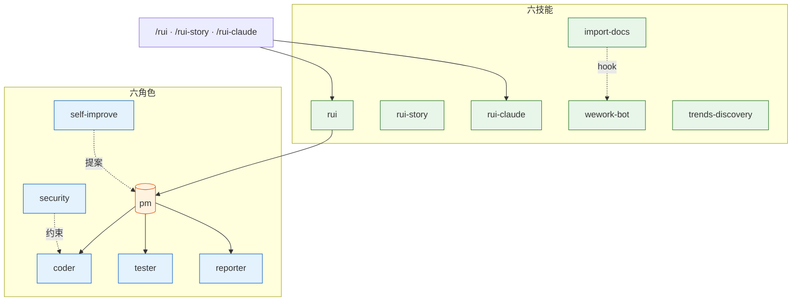
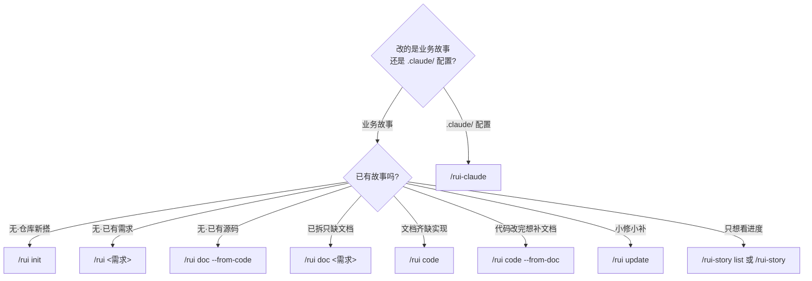
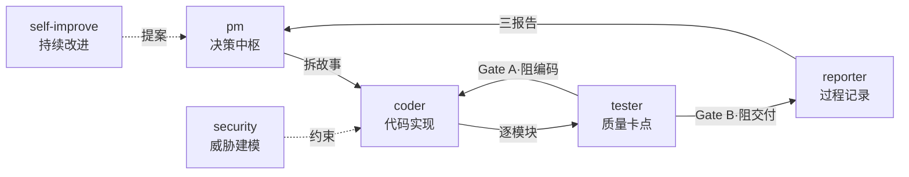
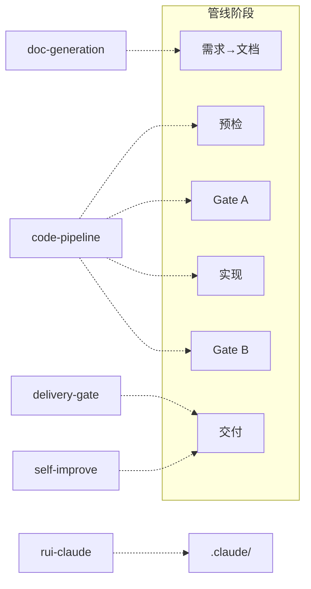
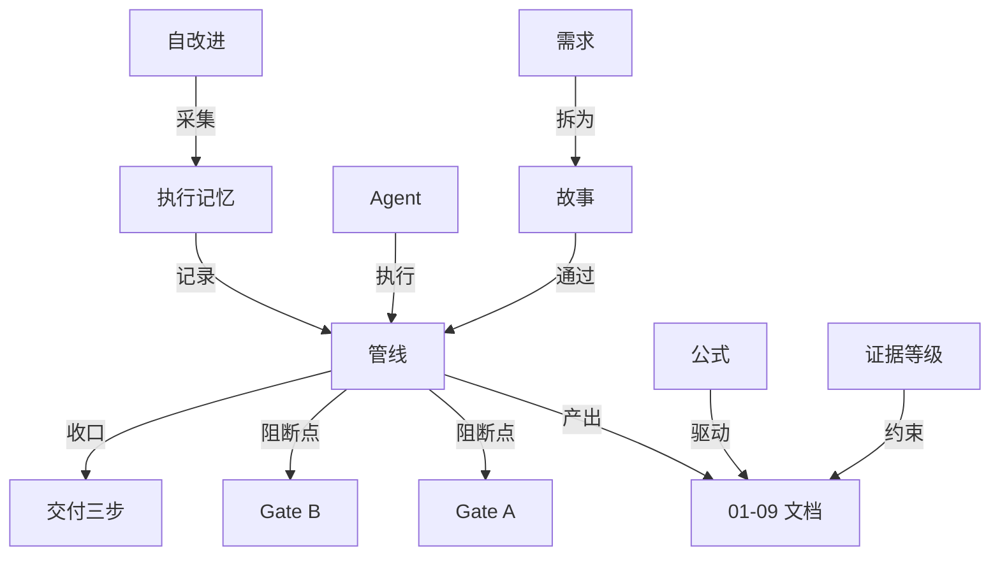

# YrY

> 故事驱动的 SDLC 编排系统 — 需求 → 文档 → 代码 → 交付。YrY 用自身管线管理自身演进。

## 系统全景



## 管线


每阶段产出对应编号文档（01–09），交付时三步 hook 按序执行。详见 [rules/code-pipeline.md](./rules/code-pipeline.md)、[rules/delivery-gate.md](./rules/delivery-gate.md)。

## 快速开始

```bash
# 1. 建立项目基线（首次必做）
/rui init

# 2. 从源码反推文档（存量项目）
/rui doc --from-code

# 3. 端到端交付（新需求）
/rui 用户登录功能支持手机号+验证码

# 4. 查看进度
/rui-story list
```

> init 生成 CLAUDE.md 项目约束 + README 领域语言 + 故事面板目录。存量项目用 `doc --from-code` 反推文档基线。

## 命令

只读命令不触发末端 hook，写入命令末端自动执行交付三步。



### /rui — 业务故事 SDLC

| 命令 | 类型 | 作用 |
|------|------|------|
| `/rui` | 只读 | 5 层管线评分排序，推荐下一步任务 |
| `/rui init` | 写入 | 建立基线：detect → explore → generate → setup → verify → trigger |
| `/rui <需求>` | 写入 | 端到端：doc + code 自动串联，逐故事串行 |
| `/rui doc <需求>` | 写入 | 拆需求出文档：生成 01/02/03/04，不改源码 |
| `/rui code <name>` | 写入 | 实现故事：Gate A → 逐模块 → Gate B → 复盘 → 交付 |
| `/rui update <name> [ctx]` | 写入 | 增量更新：T1/T2/T3 自动裁剪 |
| `/rui doc --from-code 需求` | 只读 | 从源码反推文档：补缺失不覆盖 |
| `/rui code --from-doc <name>` | 只读 | 从文档反推码：禁止改源码 |

### /rui-story — 故事任务面板管理

| 命令 | 类型 | 作用 |
|------|------|------|
| `/rui-story` | 只读 | 状态概览：按状态统计 + 最近活动 |
| `/rui-story list` | 只读 | 进度全景：所有故事详细表格（从 `/rui` 迁移） |
| `/rui-story show <name>` | 只读 | 单故事详情：文件清单/状态/元数据 |
| `/rui-story delete <name>` | 写入 | 删除故事目录（需确认） |
| `/rui-story sync [<name>]` | 写入 | 触发文档同步（委托 import-docs） |
| `/rui-story rename <old> <new>` | 写入 | 重命名故事目录 |

### /rui-claude — .claude/ 配置管理

| 命令 | 类型 | 作用 |
|------|------|------|
| `/rui-claude` | 只读 | 任务推荐 |
| `/rui-claude history [--limit N]` | 只读 | 操作历史 |
| `/rui-claude retro [--name <story>]` | 写入 | 健康复盘 |
| `/rui-claude sync` | 写入 | 远端同步：API pull 覆盖本地 `.claude/` |
| `/rui-claude 需求` | 写入 | 需求管线 |

> ⚠️ `sync` 执行前必须确认意图。详见 [rules/rui-claude.md](./rules/rui-claude.md)。

## Agent 角色



- **pm** — 决策中枢：决定做/不做/延期，串起全部 Agent
- **coder** — 代码实现：逐模块编码，P0 清零方进下一模块
- **tester** — 质量卡点：Gate A 阻编码、Gate B 阻交付
- **reporter** — 过程记录：三报告交叉闭合
- **security** — 威胁建模：§3 安全约束注入，P0 卡发布
- **self-improve** — 持续改进：采集执行数据，生成改进提案

共用契约见 [agents/AGENT.md](./agents/AGENT.md)，专项规约见 `agents/<role>.md`。

## 规则



- **code-pipeline** — 源码改动：分支隔离 · Gate A/B · 逐模块清零，支撑技术含根因追溯/纵深防御/反馈回路/深度模块/垂直切片
- **delivery-gate** — 交付收口：三步按序（日志 → 同步 → 通知），缺一不可
- **doc-generation** — 文档产出：目录命名 · 骨架模板 · 附属数据存放
- **self-improve** — 复盘改进：数据采集 → 诊断 → 提案，`no-metrics` 降级不阻断
- **rui-claude** — .claude/ 管理：仅限 `.claude/` · 禁自动 commit/push

详见 [`rules/`](./rules/)。

## 技能

- **rui** (`/rui init · doc · code · update · --from-code`) — 故事驱动 SDLC 主线，含诊断纪律、架构深化、交接纪律
- **rui-story** (`/rui-story list · show · create · delete · sync · rename`) — 故事面板 CRUD 管理、进度查询、文档同步
- **rui-claude** (`/rui-claude sync · retro · history`) — .claude/ 配置远端同步与复盘
- **import-docs** — 自动（hook 触发）：批量同步故事文档到远端 API
- **wework-bot** — 自动（hook 触发）：企微机器人推送管线状态通知
- **trends-discovery** — 按需：查询 GitHub Trending / OSS Insight / TrendShift / Top-Starred，输出结构化趋势报告。自改进 D5 诊断集成

详见 [`skills/`](./skills/)。

## 目录结构

```
YrY/
├── agents/                  # 6 个 Agent 角色契约
│   ├── AGENT.md             #   角色拓扑与共用底线
│   ├── pm.md / coder.md / tester.md
│   ├── reporter.md / security.md
│   └── self-improve.md
├── rules/                   # 5 组约束规则
│   ├── code-pipeline.md     #   分支隔离 · Gate A/B
│   ├── delivery-gate.md     #   三步 hook
│   ├── doc-generation.md    #   文档生成规范
│   ├── self-improve.md      #   自改进流程
│   └── rui-claude.md        #   .claude/ 管理约束
├── skills/                  # 6 项技能规约
│   ├── rui/                 #   SDLC 编排
│   │   ├── formulas.md      #     故事文档公式
│   │   ├── coder.md         #     工作手册·数据契约
│   │   └── ranking.md       #     推荐评分框架
│   ├── rui-story/           #   故事面板管理
│   ├── rui-claude/          #   .claude/ 配置管理
│   ├── import-docs/         #   文档远端同步
│   ├── wework-bot/          #   企微通知
│   └── trends-discovery/    #   技术趋势发现
├── libs/                    # 外部参考知识库
│   ├── _sources.json        #   下载源清单
│   ├── story-patterns.md    #   故事描述·模式与方法论
│   ├── architecture-patterns.md # 实现与架构·执行模式
│   ├── tools.md             #   工具与平台
│   ├── trends.md            #   趋势与发现
│   ├── repos/               #   下载的 GitHub 仓库文档
│   └── docs/                #   下载的 Web 文档
├── docs/
│   └── 故事任务面板/        #   故事产出目录
│       └── <name>/
│           ├── 01-09.md     #     管线文档
│           ├── .memory/     #     执行记忆（跨会话持久化）
│           └── .improvement/ #    改进提案
├── CLAUDE.md
└── README.md
```

## 领域语言

> 理解术语再动手。每术语含 _Avoid_ 别名防止漂移。



| 术语 | 含义 | Avoid |
|------|------|-------|
| **管线** | 端到端 SDLC 流程，需求→交付，每阶段有进入/退出条件。区别于"交付三步"（仅末端收口动作）。 | workflow, process, 流程 |
| **故事** | 管线中单一、独立、可完成的作业单元。一个需求可拆为多个故事串行通过管线，各产出一组 01–09 文档。故事内 §4 的工作拆分称"任务"，非管线单元。 | task, ticket, issue |
| **故事任务面板** | `docs/故事任务面板/<name>/` 目录。每个故事的所有产物内聚在此。 | output directory, doc folder |
| **Gate A** | 编码前的强制性阻断点。`{project}-测试设计.md` 不存在或未就绪→编码不得开始。单行 CSS/文案为唯一例外。 | test gate, pre-code check |
| **Gate B** | 编码后的闭合验证。五步检查（环境快照→静态预检→设计对齐→单次执行→三报告）。修复 > 2 轮→阻断。 | verification gate, post-code check |
| **P0 / P1 / P2** | P0 = 阻塞发布必修项；P1 = 当轮修复项；P2 = 记录不阻断项。P0 不清零不进下一模块。 | critical / major / minor |
| **阻断** | 管线在当前阶段停止，状态写入 `.memory/rui-state.json`。阻断≠失败，重跑同命令从中断点续。区别于"降级"（记录标记但不停止前进）。 | stop, halt, fail |
| **铁律** | 三条不可妥协的规则：验先于称、溯先于修、清先于进。 | rule, constraint |
| **影响链** | 变更点的完整传递依赖图。五步闭合：列变更→选搜索词→全项目搜索→二级传递→标注处置。未闭合 = `chain-broken` 阻断。 | dependency graph, impact analysis |
| **分支隔离** | **强制门禁**。任何 Edit/Write 前须验证 `git branch --show-current` 为 `feat/<name>`。未通过 = `no-branch-isolation` 阻断。 | feature branch |
| **反推** | 只读模式。`--from-code` 从源码反推文档；`--from-doc` 从文档反推源码补充。 | reverse engineering, backfill |
| **证据等级** | A=已验证(附路径) B=可推导(附推导链) C=未验证(标"待补充") D=幻觉(视为错误)。 | confidence level |
| **Agent** | 六大协作角色：pm coder tester reporter security self-improve。每角色有交接信号和验证方式。 | bot, worker, role |
| **公式** | 结构化文档产出规范。分为通用元素 (F.meta/F.nav/F.evidence)、故事主线 (F.story.*)、补充文档 (F.supp.*)。区别于"模板"——公式是规约 (what)，模板是文件 (how)；本系统只用公式。 | template, format |
| **交付三步** | 管线末端强制序列：hook-log → import-docs → wework-bot。任一缺失 = 管线未闭合。 | delivery pipeline, post-steps |
| **自改进** | D0–D7 诊断循环。采集执行数据→六维评估→生成改进提案→提案闭合。 | retrospective, post-mortem |
| **执行记忆** | `.memory/execution-memory.jsonl`（追加）+ `.memory/rui-state.json`（覆盖写）。 | state, log |
| **项目类型** | frontend / backend / fullstack / meta / unknown。决定文档生成矩阵（前端补 03/06，后端补 02/05，全栈全部补）。 | stack type |
| **需求** | `/rui` 的输入：纯文本、`@` 文件引用、或 URL。pm 解析后拆为一组故事。 | input, spec, feature request |
| **插件** | YrY 本身是 Claude Code 插件，用自身管线管理自身演进。 | extension, addon |

> 项目约束见 [CLAUDE.md](./CLAUDE.md#项目约束)。

## 外部参考

> pm 拆故事、架构设计、自改进时，应主动查阅外部资源汲取模式与理念。
> 详细分类与映射见 [`libs/`](./libs/) — 按管线阶段组织，每参考有明确应用场景。外链失效时，技能规约仍独立可执行（自包含原则）。

| 分类 | 管线阶段 | 文件 |
|------|---------|------|
| 故事描述 — 模式与方法论 | 需求→文档 | [libs/story-patterns.md](./libs/story-patterns.md) |
| 实现与架构 — 执行模式 | 预检→实现 + 验证→自改进 | [libs/architecture-patterns.md](./libs/architecture-patterns.md) |
| 工具与平台 | 预检→实现 + 验证→自改进 | [libs/tools.md](./libs/tools.md) |
| 趋势与发现 | 交付 | [libs/trends.md](./libs/trends.md) |

> 完整索引与阶段映射图见 [libs/README.md](./libs/README.md)。
