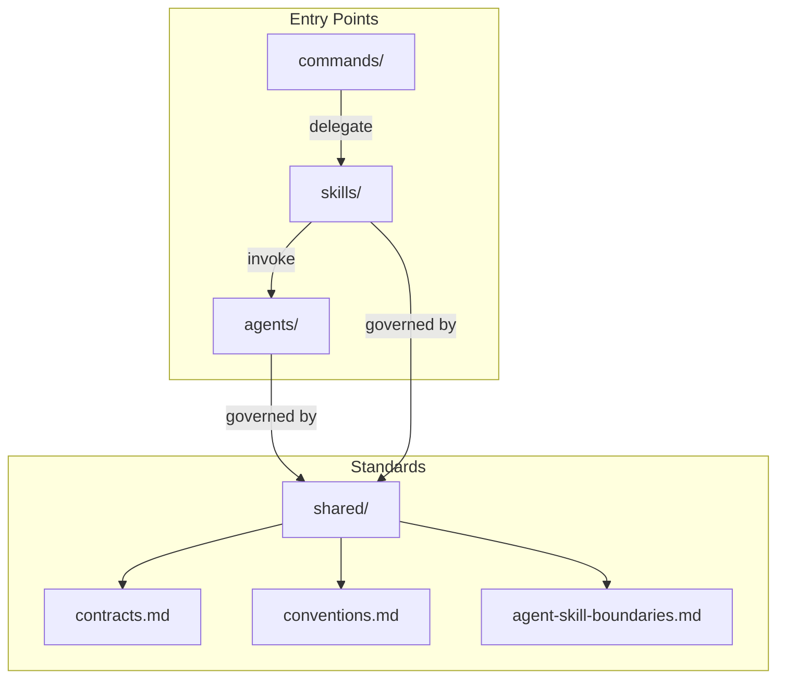

# `.claude` 目录概览

`.claude` 目录承载本仓库的 Claude / Cursor 协作层：命令入口、技能定义、专家代理及共享标准。

## 目录职责

| 目录 | 用途 | 稳定入口？ |
|-----------|---------|---------------|
| `commands/` | Slash Command 封装；仅委托到技能 | 是 |
| `skills/` | 可直接调用的技能定义；`SKILL.md` 为真源 | 是 |
| `agents/` | 专家代理定义；拥有独立角色、I/O 和必答问题 | 是 |

| `eval/` | 评估示例：`eval/skills/`、`eval/agents/`（第一阶段：wework-bot + message-pusher）；非真源 | 否 |
| `shared/` | 共享说明文档，统一约定、路径和边界定义 | 否 |

## 真源规则

1. `commands/*.md` 仅保留一行入口描述；不携带领域规则。
2. `skills/<name>/SKILL.md` 为该技能的行为真源。
3. `skills/<name>/README.md` 仅用于快速开始、导航和索引；不重复完整规则。
4. `skills/<name>/rules/*.md` 定义结构性合约（部分技能提供，非必须）。
5. `skills/<name>/templates/*.md` 仅提供可选骨架；不得覆盖 `rules/`（部分技能提供，非必须）。
6. `skills/<name>/checklists/*.md` 定义验收项；`checklist.md` 仅作为入口索引（部分技能提供，非必须）。
7. `agents/*.md` 仅描述代理角色；不复制技能的完整流程。

## 建议阅读顺序

### 文档与实现流程

1. `skills/build-feature/SKILL.md`
2. `skills/build-feature/README.md`
3. `shared/conventions.md`
4. `shared/contracts.md`（build-feature 共享：反幻觉、可采纳性、自我改进及可验证的后续步骤）
5. `shared/agent-skill-boundaries.md`

完成阶段固定顺序：先调用 `skills/import-docs/SKILL.md` 同步 `docs`，再调用 `skills/wework-bot/SKILL.md` 以真实同步数据发送完成通知。

### 文档导入流程

1. `skills/import-docs/SKILL.md`
2. `skills/import-docs/README.md`
3. `skills/import-docs/rules/import-contract.md`
4. `skills/import-docs/scripts/import-docs.js`

### 通知与观测流程

1. `skills/wework-bot/SKILL.md`
2. `skills/wework-bot/README.md`
3. `skills/wework-bot/rules/message-contract.md`
4. `skills/wework-bot/config.example.json`（路由和 webhook 结构示例；本地从此复制 `config.json` 并填入真实地址）
5. `skills/wework-bot/scripts/send-message.js`
6. 长流程推送文案策略与反幻觉检查：`agents/reporter.md`（先 Plan，后草稿，再调 `send-message.js`）

本仓库的 `skills/wework-bot/config.json` 仅保留占位 webhook；本地开发时从 `config.example.json` 复制为 `config.json` 并填入真实地址，或将 `WEWORK_BOT_CONFIG` 环境变量指向私有路径。`API_X_TOKEN` **仅**从环境变量获取（不从配置文件读取）。

### 技能与代理分工

1. `shared/agent-skill-boundaries.md`

## 维护约定

- 不要更改 `.claude/skills/`、`.claude/agents/`、`.claude/commands/` 的顶层命名约定；按 `.claude/eval/skills/<skill>.md`、`eval/agents/<agent>.md` 添加评估示例（参见第一阶段 `eval/skills/wework-bot.md`）。
- 添加共享标准时优先使用 `shared/`，避免说明性内容散落于多个技能/代理中。
- 更新路径约定时，同步检查 `README.md`、`rules/`、`templates/`、`checklists/` 中的链接。
