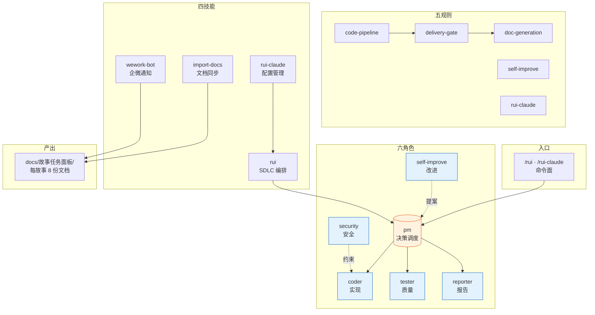
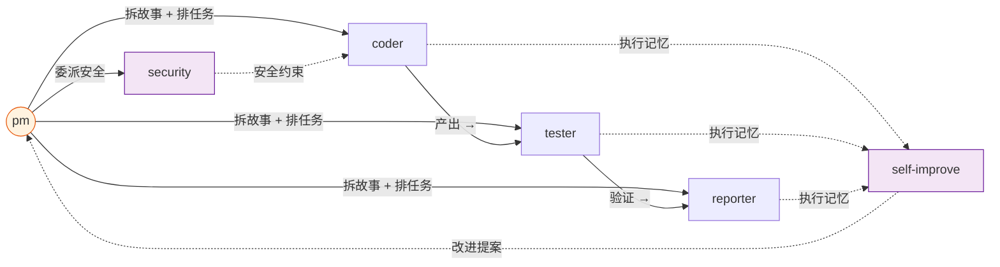
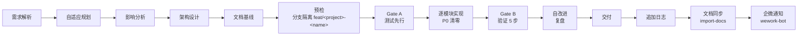
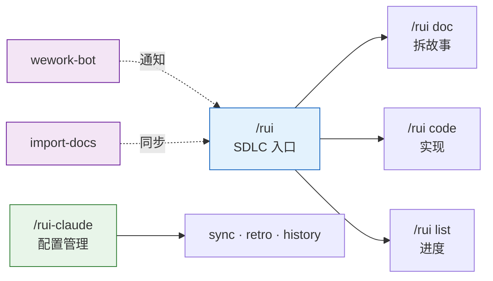

# YrY

> 故事驱动的 SDLC 编排系统 — 需求拆分 → 文档管线 → 代码管线 → 交付。

## 系统全景



**YrY** 是 Claude Code 的元插件项目，将软件交付流程固化为 6 个 Agent 协同、5 组规则约束、4 项技能支撑的自动化管线。

## Agent 角色



| Agent | 职责 | 一句话 |
|-------|------|--------|
| `pm` | 决策中枢 | 决定做/不做/延期，串起全部 Agent |
| `coder` | 代码实现 | 逐模块编码，P0 清零方进下一模块 |
| `tester` | 质量卡点 | Gate A 阻编码、Gate B 阻交付 |
| `reporter` | 过程记录 | 三报告（实施 ×2 + 测试）交叉闭合 |
| `security` | 威胁建模 | 安全审查写入 §3，P0 卡发布 |
| `self-improve` | 持续改进 | 采集执行数据，生成改进提案 |

## SDLC 管线



每阶段产出对应编号文件（01–08），交付时三步 hook 按序执行。

## 规则约束

| 规则 | 适用场景 | 核心约束 |
|------|---------|---------|
| `code-pipeline` | 源码改动 | 分支隔离 · Gate A 先行 · 逐模块清零 · Gate B 收口 · 修复 ≤ 2 轮 |
| `delivery-gate` | 交付阶段 | 三步按序：日志 → 同步 → 通知，缺一不可 |
| `doc-generation` | 文档产出 | 目录命名 · 骨架模板 · 附属数据存放 |
| `self-improve` | 复盘改进 | 数据采集 → 诊断 → 提案，`no-metrics` 降级不阻断 |
| `rui-claude` | .claude/ 管理 | 仅限 `.claude/` 目录 · 禁自动 commit/push |

## 技能



| 技能 | 命令 | 用途 |
|------|------|------|
| `rui` | `/rui init` · `/rui doc` · `/rui code` · `/rui list` · `/rui update` | 故事驱动 SDLC 主线 |
| `rui-claude` | `/rui-claude sync` · `retro` · `history` | .claude/ 配置远端同步与复盘 |
| `import-docs` | 自动（hook 触发） | 批量同步故事文档到远端 API |
| `wework-bot` | 自动（hook 触发） | 企微机器人推送管线状态通知 |

## 目录结构

```
YrY/
├── agents/                     # 6 个 Agent 角色契约（各含行为准则 + 阻断标识）
│   ├── AGENT.md                #   角色拓扑总览
│   ├── pm.md                   #   决策中枢
│   ├── coder.md                #   代码实现
│   ├── tester.md               #   质量卡点
│   ├── reporter.md             #   过程记录
│   ├── security.md             #   威胁建模
│   └── self-improve.md         #   持续改进
├── rules/                      # 5 组跨场景约束规则
│   ├── code-pipeline.md        #   编码管线（分支隔离 · Gate A/B）
│   ├── delivery-gate.md        #   交付门（三步 hook）
│   ├── doc-generation.md       #   文档生成规范
│   ├── self-improve.md         #   自改进流程
│   └── rui-claude.md           #   .claude/ 管理约束
├── skills/
│   ├── rui/                    # SDLC 编排技能
│   │   ├── SKILL.md            #   命令面定义
│   │   ├── formulas.md         #   故事文档公式
│   │   ├── coder.md            #   目录 + 数据契约
│   │   └── scripts/            #   init · list · recommend · state · loop …
│   ├── rui-claude/             # .claude/ 配置管理技能
│   │   ├── SKILL.md
│   │   └── scripts/            #   sync · retro · history · fix
│   ├── import-docs/            # 文档远端同步技能
│   │   ├── SKILL.md
│   │   └── scripts/            #   hook-sync · import-docs
│   └── wework-bot/             # 企微通知技能
│       ├── SKILL.md
│       ├── config.json         #   机器人 + webhook 配置
│       └── scripts/            #   hook-log · hook-notify · send-message
├── docs/故事任务面板/           # 故事产出目录（每故事独立子目录）
│   └── <Project>/<name>/
│       ├── 01-故事任务.md       #   唯一真相源
│       ├── 02-后端技术评审.md
│       ├── 03-前端技术评审.md
│       ├── 04-测试用例评审.md   #   Gate A 前置
│       ├── 05-后端实施报告.md
│       ├── 06-前端实施报告.md
│       ├── 07-测试用例报告.md
│       ├── 08-自改进复盘.md
│       ├── 00-消息通知列表.md   #   hook 自动追加
│       ├── .memory/             #   管线状态 + 执行记忆
│       └── .improvement/        #   自改进提案
├── .claude-plugin/             # 插件注册信息
│   ├── plugin.json
│   └── marketplace.json
├── settings.json               # 权限 + Stop hooks 配置
├── CLAUDE.md                   # AI 协作指令
└── README.md                   # 本文件
```

## 命令速览

| 场景 | 命令 |
|------|------|
| 建立基线 | `/rui init` |
| 拆需求 | `/rui doc <需求>` |
| 实现故事 | `/rui code <name>` |
| 端到端 | `/rui <需求>` |
| 增量更新 | `/rui update <name>` |
| 从源码反推 | `/rui doc --from-code` |
| 进度全景 | `/rui list` |
| 任务推荐 | `/rui` |
| 同步 .claude/ | `/rui-claude sync` |
| 配置复盘 | `/rui-claude retro` |

## 不可妥协底线

| 底线 | 触发条件 |
|------|---------|
| 认证不可绕过 | 涉及 auth/token/session — P0 |
| 密钥不落盘 | Token/密钥/凭据禁止出现在源码或配置 |
| 输入必校验 | 用户输入必须验证/转义，XSS/注入为 P0 |
