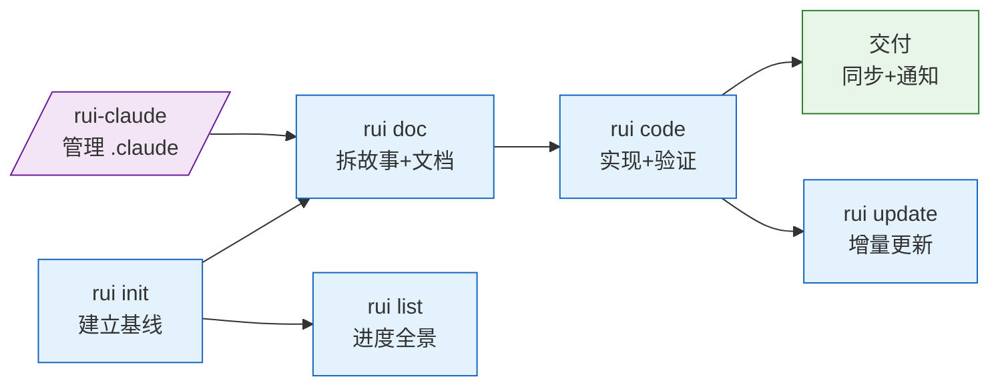
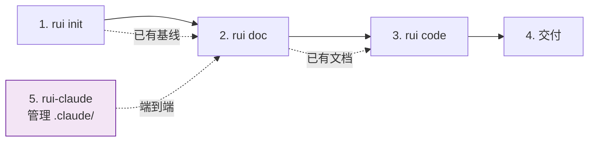
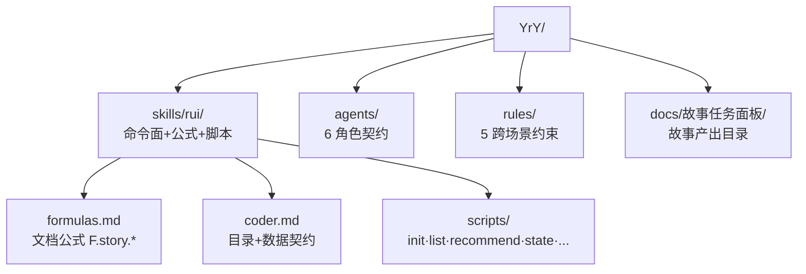

# YrY

> 插件/配置系统开发，规则完整性与集成契约。



**YrY** 是一个 元项目(插件/配置) 项目（single 架构），基于 未识别 生态构建。安全面涉及 认证授权 · 第三方调用 · 用户输入。

| 维度 | 值 |
|------|-----|
| 项目类型 | 元项目(插件/配置) |
| 架构 | single |
| 管线 | 需求解析 → 文档生成 → Gate A 测试先行 → 实现 → Gate B 验证 → 自改进 → 交付 |
| Coder 公式 | 模块 → 接口 → 数据流 |
| 安全面 | 认证授权 · 第三方调用 · 用户输入 |
| 不可妥协底线 | 认证不可绕过 · 密钥不落盘 · 输入必校验 |

## 快速开始



### 1. 建立基线

```bash
/rui init
```

扫描项目五类信号（类型 · 清单 · 安全面 · 测试框架 · 架构），按 profile 全量生成 CLAUDE.md 项目约束段、README.md、`.claude/`（agents/rules/skills）、故事面板目录及骨架文档。可重复运行。

```bash
### 2. 拆需求为故事

```bash
/rui doc "用户登录页面需要支持手机号+验证码登录"
/rui doc @requirements.md    # 从文件读取
/rui doc https://...         # 从 URL 读取
```

pm agent 解析需求 → 自适应规划 → 影响分析 → 架构设计，生成故事文档基线（01-故事任务 · 04-测试用例评审）。随后指派 coder 按项目类型补齐设计文档：前端项目仅补 03-前端技术评审，后端项目仅补 02-后端技术评审，全栈项目两者均补。自动创建 `feat/<Project>-<name>` 分支隔离。

```bash
/rui doc --from-code [name]   # 从源码反推文档（推荐存量项目首选）
```

### 3. 实现故事

```bash
/rui code YiWeb-user-login
```

Gate A 测试先行 → 逐模块编码（P0 清零方进下一模块）→ Gate B 验证（修复 ≤2 轮）→ 自改进复盘。三步交付管线按序触发文档同步 + 通知。

```bash
/rui code --from-doc YiWeb-user-login  # 从已有文档补全缺失文档（只读源码）
/rui update YiWeb-user-login           # 增量更新（T1/T2/T3 裁剪）
/rui update YiWeb-user-login --no-code # 仅文档，不改源码
```

### 4. 查看与推荐

```bash
/rui list                    # 进度全景，按文件存在性判定状态
/rui                         # 5 层链式管线评分排序，推荐下一步任务
```

### 5. 管理 .claude/ 配置

```bash
/rui-claude sync              # 从远端同步 .claude/（覆盖式更新）
/rui-claude retro             # 复盘分析本地 .claude/ 结构
/rui-claude history           # 查看同步历史
/rui-claude <需求>            # 修改 .claude/，走全管线端到端（doc → code → 交付）
```

`/rui-claude` 操作仅限 `.claude/` 目录，禁止自动 commit/push，git 操作由开发者手动执行。`<需求>` 走完整 SDLC：pm 拆故事 → coder 补齐设计文档 → Gate A 测试先行 → 实现 → Gate B 验证 → 自改进 → 交付。

### 常用组合

| 场景 | 命令 |
|------|------|
| 全新项目起步 | `/rui init` → `/rui doc <需求>` → `/rui code <name>` |
| 已有基线，新需求 | `/rui <需求>`（端到端 doc + code 全自动串联） |
| 补文档（推荐） | `/rui doc --from-code` → 选 → 生；或 `/rui doc --from-code <name>` 直推 |
| 补代码 | `/rui code --from-doc <name>` |
| 小改动了 | `/rui update <name> "修改描述"` |
| 同步 .claude/ | `/rui-claude sync` |
| 复盘 .claude/ | `/rui-claude retro` |
| 看进度 | `/rui list` |
| 不知道做什么 | `/rui` |

## 项目结构



| 目录 | 内容 |
|------|------|
| `skills/rui/` | 命令面定义、文档公式、目录/数据契约、执行脚本 |
| `agents/` | pm · coder · tester · reporter · security · self-improve 角色契约 |
| `rules/` | code-pipeline · delivery-gate · doc-generation · self-improve · rui-claude |
| `docs/故事任务面板/` | 故事产出目录，每个故事独立子目录，含主线文档 + 附属数据 |

### 故事目录骨架

```
docs/故事任务面板/<Project>/<name>/
├── 01-故事任务.md              ← 唯一真相源（pm）
├── 02-后端技术评审.md          ← coder + security
├── 04-测试用例评审.md          ← tester
├── 05-后端实施报告.md          ← 验证阶段
├── 07-测试用例报告.md          ← tester
├── 08-自改进复盘.md            ← pm + reporter
├── 00-消息通知列表.md          ← 自动（hook）
├── .memory/                    ← 管线状态 + 执行记忆
└── .improvement/               ← 自改进提案
```

## 管线一览


每阶段产出对应编号文件（01–08），完成后三步交付管线按序触发 import-docs 文档同步 + wework-bot 通知。
