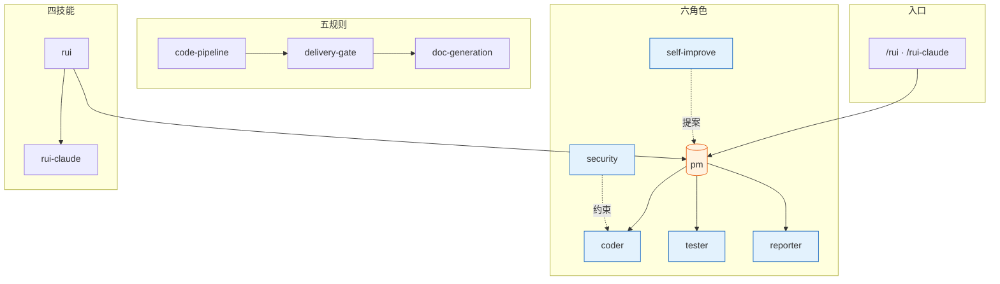
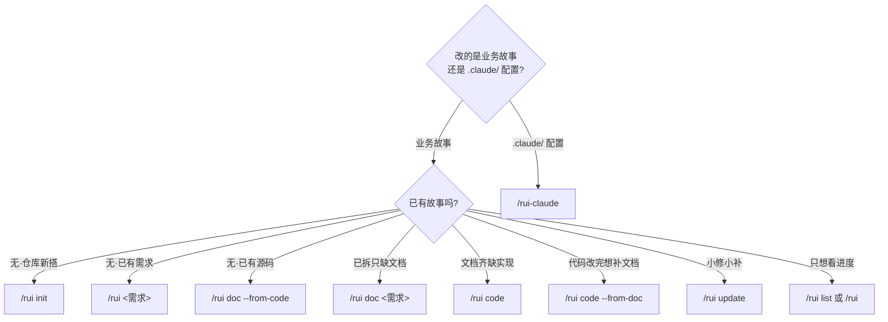

# YrY

> 故事驱动的 SDLC 编排系统 — 需求拆分 → 文档管线 → 代码管线 → 交付。

**YrY** 是 Claude Code 的元插件项目，将软件交付流程固化为 6 个 Agent 协同、6 组规则约束、4 项技能支撑的自动化管线。项目自身的协作指令见 [CLAUDE.md](./CLAUDE.md)。

## 系统全景



## Agent 角色

| Agent | 职责 | 一句话 |
|-------|------|--------|
| `pm` | 决策中枢 | 决定做/不做/延期，串起全部 Agent |
| `coder` | 代码实现 | 逐模块编码，P0 清零方进下一模块 |
| `tester` | 质量卡点 | Gate A 阻编码、Gate B 阻交付 |
| `reporter` | 过程记录 | 三报告交叉闭合 |
| `security` | 威胁建模 | §3 安全约束注入，P0 卡发布 |
| `self-improve` | 持续改进 | 采集执行数据，生成改进提案 |

角色拓扑、证据等级、影响分析、交接信号等共用契约见 [agents/AGENT.md](./agents/AGENT.md)，各角色专项规约见 `agents/<role>.md`。

## SDLC 管线


每阶段产出对应编号文件（01–08），交付时三步 hook 按序执行。管线全貌见 [rules/code-pipeline.md](./rules/code-pipeline.md)，交付闭合见 [rules/delivery-gate.md](./rules/delivery-gate.md)。

## 规则约束

| 规则 | 适用场景 | 核心约束 |
|------|---------|---------|
| `code-pipeline` | 源码改动 | 分支隔离 · Gate A 先行 · 逐模块清零 · Gate B 收口 · 修复 ≤ 2 轮 |
| `delivery-gate` | 交付阶段 | 三步按序：日志 → 同步 → 通知，缺一不可 |
| `doc-generation` | 文档产出 | 目录命名 · 骨架模板 · 附属数据存放 |
| `self-improve` | 复盘改进 | 数据采集 → 诊断 → 提案，`no-metrics` 降级不阻断 |
| `rui-claude` | .claude/ 管理 | 仅限 `.claude/` · 禁自动 commit/push |
| `supporting-techniques` | 技术支撑 | 根因追溯 · 纵深防御 · 条件等待 · 验证门禁 · 反馈回路 · 深度模块 · 垂直切片 |

详见 [`rules/`](./rules/)。

## 技能

| 技能 | 命令 | 用途 |
|------|------|------|
| `rui` | `/rui init` · `doc` · `code` · `list` · `update` | 故事驱动 SDLC 主线 |
| `rui-claude` | `/rui-claude sync` · `retro` · `history` | .claude/ 配置远端同步与复盘 |
| `import-docs` | 自动（hook 触发） | 批量同步故事文档到远端 API |
| `wework-bot` | 自动（hook 触发） | 企微机器人推送管线状态通知 |
| `diagnose` | `/diagnose` | 结构化调试：反馈回路→复现→假设→instrument→修复→复盘 |
| `improve-codebase-architecture` | `/improve-codebase-architecture` | 发现深模块机会，消除浅模块，改善 AI 可导航性 |
| `handoff` | `/handoff` | 压缩会话为交接文档，供下游 Agent 继续 |

详见 [`skills/`](./skills/)。


## 目录结构

```
YrY/
├── agents/                     # 6 个 Agent 角色契约
│   ├── AGENT.md                #   角色拓扑与共用底线
│   ├── pm.md                   #   决策中枢
│   ├── coder.md                #   代码实现
│   ├── tester.md               #   质量卡点
│   ├── reporter.md             #   过程记录
│   ├── security.md             #   威胁建模
│   └── self-improve.md         #   持续改进
├── rules/                      # 6 组跨场景约束规则
│   ├── code-pipeline.md        #   分支隔离 · Gate A/B
│   ├── delivery-gate.md        #   三步 hook
│   ├── doc-generation.md       #   文档生成规范
│   ├── self-improve.md         #   自改进流程
│   ├── rui-claude.md           #   .claude/ 管理约束
│   └── supporting-techniques.md #   根因追溯 · 纵深防御 · 条件等待 · 验证门禁 · 反馈回路 · 深度模块 · 垂直切片
├── skills/                     # 7 项技能规约
│   ├── engineering/            #   工程技能
│   │   ├── diagnose/           #     结构化调试
│   │   └── improve-codebase-architecture/  # 架构深化
│   ├── productivity/           #   生产力工具
│   │   └── handoff/            #     会话交接
│   ├── rui/                    #   SDLC 编排（SKILL.md · formulas.md · coder.md）
│   ├── rui-claude/             #   .claude/ 配置管理
│   ├── import-docs/            #   文档远端同步
│   └── wework-bot/             #   企微通知
├── docs/
│   ├── adr/                    #   架构决策记录
│   │   └── 0001-story-driven-pipeline-with-file-numbered-docs.md
│   └── 故事任务面板/           #   故事产出目录
│       └── <Project>/<name>/    #   每故事独立子目录 · 00–08 编号文档
├── CONTEXT.md                  # 领域语言词汇表
├── .claude-plugin/             # 插件注册信息
├── CLAUDE.md                   # AI 协作指令
└── README.md                   # 本文件
```

故事面板的目录骨架、文件矩阵、完整度状态机、数据契约见 [skills/rui/coder.md](./skills/rui/coder.md)。文档公式见 [skills/rui/formulas.md](./skills/rui/formulas.md)。

## 命令速览

两条命令族：`/rui` 管业务故事的 SDLC 主线，`/rui-claude` 管 `.claude/` 配置自身的演进。只读命令（`list`、推荐）不触发末端 hook，其余写入命令末端自动执行三步交付。

### 选哪条命令



### /rui — 业务故事 SDLC

| 场景 | 命令 | 末端 Hook | 说明 |
|------|------|:---:|------|
| 任务推荐 | `/rui` | ✗ | 只读，5 层管线评分排序 |
| 进度全景 | `/rui list` | ✗ | 只读，按文件存在性判定状态 |
| 建立基线 | `/rui init` | ✓ | detect → explore → generate → setup → verify → trigger |
| 端到端 | `/rui <req>` | ✓ | doc + code 自动串联，逐故事串行 |
| 拆需求出文档 | `/rui doc <req>` | ✓ | 拆故事 + 生成 01/02/03/04，不改源码 |
| 实现故事 | `/rui code <name>` | ✓ | Gate A → 逐模块 → Gate B → 复盘 → 交付 |
| 增量更新 | `/rui update <name> [ctx]` | ✓ | T1/T2/T3 自动裁剪 |
| 从源码反推文档 | `/rui doc --from-code [req]` | ✓ | 只读源码，补缺失不覆盖 |
| 从文档反推码 | `/rui code --from-doc <name>` | ✓ | 只读源码补文档，禁止改源码 |

### /rui-claude — .claude/ 配置管理

| 场景 | 命令 | 末端 Hook |
|------|------|:---:|
| 任务推荐 | `/rui-claude` | ✗ |
| 操作历史 | `/rui-claude history [--limit N]` | ✗ |
| 健康复盘 | `/rui-claude retro [--name <story>]` | ✓ |
| 远端同步 | `/rui-claude sync` | ✓ |
| 需求管线 | `/rui-claude <req>` | ✓ |

> ⚠️ `sync` 先 `rm -rf .claude/` 再 rsync，执行前必须确认意图。详见 [rules/rui-claude.md](./rules/rui-claude.md)。

## 不可妥协底线

| 底线 | 触发条件 |
|------|---------|
| 认证不可绕过 | 涉及 auth/token/session — P0 |
| 密钥不落盘 | Token/密钥/凭据禁止出现在源码或配置 |
| 输入必校验 | 用户输入必须验证/转义，XSS/注入为 P0 |

> 完整项目约束见 [CLAUDE.md](./CLAUDE.md)。
