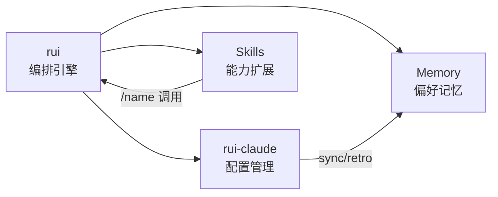

# YrY

基于 Claude Code 的 SDLC 编排系统。哲学基础见 [CLAUDE.md](./CLAUDE.md)——三条公理推导全部行为准则。

## 系统能力



**rui 编排器：** `/rui` 命令体系驱动故事 SDLC 全流程——需求拆分 → 文档管线 → 代码管线 → 交付。6 Agent（pm/coder/tester/reporter/security/self-improve）协同，Gate A/B 强制验证，每故事 8 份文档。

**rui-claude 配置管理：** `/rui-claude` 管理 `.claude/` 目录——sync 远端同步、retro 健康复盘、history 操作历史、`<requirement>` 端到端配置变更交付。

**Memory：** 偏好、上下文、反馈存于 `~/.claude/projects/`。启动时读 MEMORY.md 索引。记忆是指针，非内容——引用前验证时效。

**Skills：** `/<name>` 或任务匹配时调用。项目内置 `rui`、`rui-claude`、`wework-bot`、`import-docs`。系统内置见 `<skills>` 块。

| 能力 | 入口 | 核心机制 | 产出 |
|------|------|----------|------|
| rui 编排 | `/rui` | 6 Agent + Gate A/B | 8 文档/故事 |
| rui-claude | `/rui-claude` | sync / retro / history | .claude/ 变更 |
| Memory | 自动 | MEMORY.md 索引 | 跨会话偏好 |
| Skills | `/<name>` | 关键词匹配 | 能力扩展 |

## 项目结构

```
static/
├── CLAUDE.md              # 哲学：公理 → 推导 → 推论
├── README.md              # 本文件：系统能力 + 项目结构 + 快速开始
├── agents/                # Agent 身份与决策边界（7 个角色）
│   ├── AGENT.md           # 总览 + 证据标准 + 影响分析规范
│   ├── pm.md              # 产品决策：做什么/不做什么
│   ├── coder.md           # 编码实现：逐模块审查，P0 清零
│   ├── tester.md          # 测试验证：测试先行，Gate A/B
│   ├── reporter.md        # 报告交付：过程报告 + 知识策展
│   ├── security.md        # 安全审查：威胁建模 + 约束注入
│   └── self-improve.md    # 自改进：数据驱动 + 效果评估
├── rules/                 # 规则库（6 条共享约束）
│   ├── code-pipeline.md   # 代码管线：分支隔离、逐模块审查等
│   ├── doc-generation.md  # 文档生成：版本信息、证据标准、增量裁剪等
│   ├── gate-rules.md      # 门禁：Gate A/B + P0 审查标准
│   ├── import-docs.md     # 文档同步：多检查点强制同步
│   ├── rui-claude.md      # rui-claude：操作范围、分支隔离等
│   └── self-improve.md    # 自改进：数据驱动、H11 降级等
└── skills/                # 技能定义（4 个 skill）
    ├── rui/               # SDLC 编排器：SKILL.md + data.md + docs.md
    │   ├── templates/     # 8 份模板（01-08 基线文档）
    │   └── scripts/       # 6 个脚本
    ├── rui-claude/        # .claude 配置管理：SKILL.md + scripts/
    ├── wework-bot/        # 企业微信通知：SKILL.md + config.json + scripts/
    └── import-docs/       # 文档远程同步：SKILL.md + scripts/
```

## 安装

```bash
/plugin marketplace add effiy/YrY
/plugin install YrY@effiy/YrY
```

## 快速开始

```bash
/rui init                  # 建立项目基线（CLAUDE.md + README.md + .claude/）
/rui doc "需求描述"         # 拆分需求为故事，走文档管线
/rui doc --from-code <req>  # 从现有代码逆向推导需求，生成 01-08 全文档
/rui code <story-name>     # 实现故事，走代码管线
/rui code --from-doc <name> # 从已有 01 文档补全缺失的 02-08 文档
/rui <requirement>         # 端到端（文档 + 代码全自动）
/rui                       # 无参数获取任务推荐

/rui-claude sync           # .claude/ 远端同步
/rui-claude retro          # .claude/ 配置健康复盘
/rui-claude <requirement>  # .claude/ 配置变更端到端
/rui-claude                # 无参数获取 .claude/ 任务推荐
```
