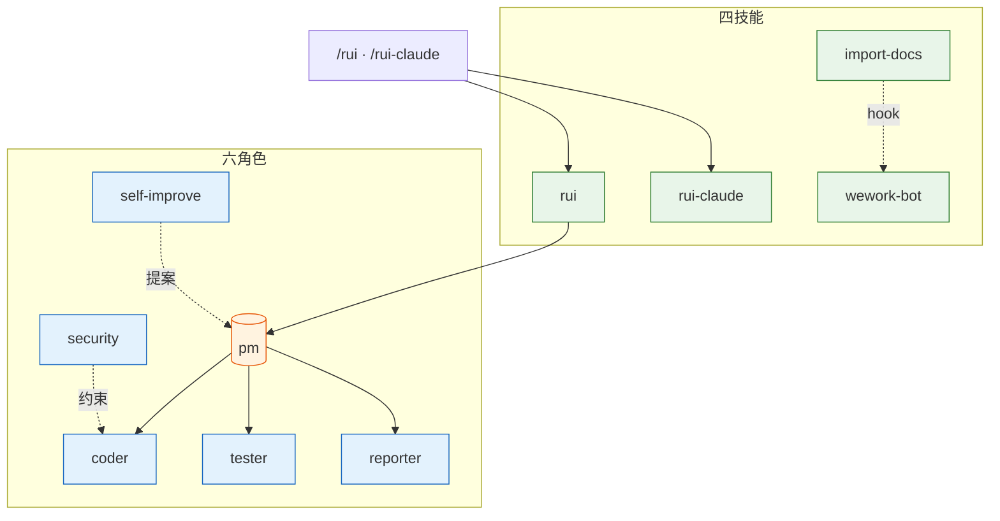
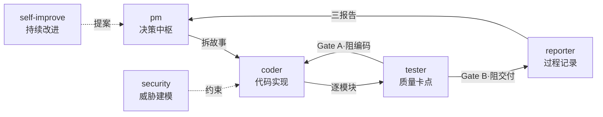
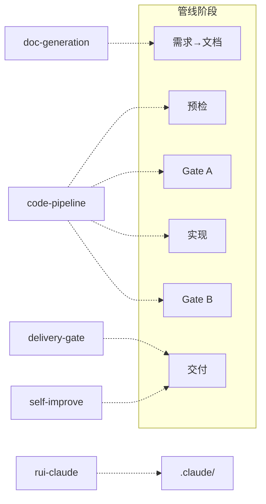
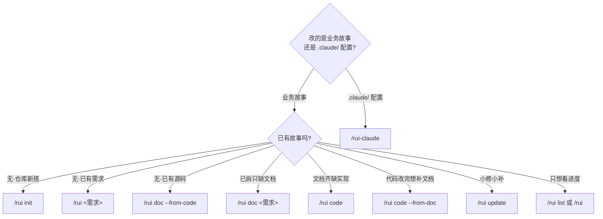

# YrY

> 故事驱动的 SDLC 编排系统 — 需求拆分 → 文档管线 → 代码管线 → 交付。

## 系统全景



## 管线


每阶段产出对应编号文档（01–08），交付时三步 hook 按序执行。
详见 [rules/code-pipeline.md](./rules/code-pipeline.md)、[rules/delivery-gate.md](./rules/delivery-gate.md)。

## Agent 角色



- **pm** — 决策中枢：决定做/不做/延期，串起全部 Agent
- **coder** — 代码实现：逐模块编码，P0 清零方进下一模块
- **tester** — 质量卡点：Gate A 阻编码、Gate B 阻交付
- **reporter** — 过程记录：三报告交叉闭合
- **security** — 威胁建模：§3 安全约束注入，P0 卡发布
- **self-improve** — 持续改进：采集执行数据，生成改进提案

共用契约见 [agents/AGENT.md](./agents/AGENT.md)，专项规约见 `agents/<role>.md`。

## 规则



- **code-pipeline** — 源码改动：分支隔离 · Gate A/B · 逐模块清零，支撑技术含根因追溯/纵深防御/反馈回路/深度模块/垂直切片
- **delivery-gate** — 交付收口：三步按序（日志 → 同步 → 通知），缺一不可
- **doc-generation** — 文档产出：目录命名 · 骨架模板 · 附属数据存放
- **self-improve** — 复盘改进：数据采集 → 诊断 → 提案，`no-metrics` 降级不阻断
- **rui-claude** — .claude/ 管理：仅限 `.claude/` · 禁自动 commit/push

详见 [`rules/`](./rules/)。

## 技能

- **rui** (`/rui init · doc · code · list · update`) — 故事驱动 SDLC 主线，含诊断纪律、架构深化、交接纪律
- **rui-claude** (`/rui-claude sync · retro · history`) — .claude/ 配置远端同步与复盘
- **import-docs** — 自动（hook 触发）：批量同步故事文档到远端 API
- **wework-bot** — 自动（hook 触发）：企微机器人推送管线状态通知

详见 [`skills/`](./skills/)。

## 命令

只读命令（`list`、推荐）不触发末端 hook，其余写入命令末端自动执行交付三步。



### /rui — 业务故事 SDLC

**只读**
- `/rui` — 任务推荐：5 层管线评分排序
- `/rui list` — 进度全景：按文件存在性判定状态

**写入**（末端自动交付三步）
- `/rui init` — 建立基线：detect → explore → generate → setup → verify → trigger
- `/rui <需求>` — 端到端：doc + code 自动串联，逐故事串行
- `/rui doc <需求>` — 拆需求出文档：拆故事 + 生成 01/02/03/04，不改源码
- `/rui code <name>` — 实现故事：Gate A → 逐模块 → Gate B → 复盘 → 交付
- `/rui update <name> [ctx]` — 增量更新：T1/T2/T3 自动裁剪
- `/rui doc --from-code [req]` — 从源码反推文档：只读，补缺失不覆盖
- `/rui code --from-doc <name>` — 从文档反推码：只读，禁止改源码

### /rui-claude — .claude/ 配置管理

**只读**
- `/rui-claude` — 任务推荐
- `/rui-claude history [--limit N]` — 操作历史

**写入**
- `/rui-claude retro [--name <story>]` — 健康复盘
- `/rui-claude sync` — 远端同步 ⚠️ 先 `rm -rf .claude/` 再 rsync
- `/rui-claude <req>` — 需求管线

> ⚠️ `sync` 执行前必须确认意图。详见 [rules/rui-claude.md](./rules/rui-claude.md)。

## 目录结构

```
YrY/
├── agents/                  # 6 个 Agent 角色契约
│   ├── AGENT.md             #   角色拓扑与共用底线
│   ├── pm.md / coder.md / tester.md
│   ├── reporter.md / security.md
│   └── self-improve.md
├── rules/                   # 5 组约束规则
│   ├── code-pipeline.md     #   分支隔离 · Gate A/B
│   ├── delivery-gate.md     #   三步 hook
│   ├── doc-generation.md    #   文档生成规范
│   ├── self-improve.md      #   自改进流程
│   └── rui-claude.md        #   .claude/ 管理约束
├── skills/                  # 4 项技能规约
│   ├── rui/                 #   SDLC 编排
│   ├── rui-claude/          #   .claude/ 配置管理
│   ├── import-docs/         #   文档远端同步
│   └── wework-bot/          #   企微通知
├── docs/
│   ├── adr/                 #   架构决策记录
│   ├── 故事任务面板/        #   故事产出目录
│   │   └── <Project>/<name>/
│   └── .claude-plugin/      #   插件注册信息
├── CLAUDE.md
└── README.md
```

## 领域语言

> 理解术语再动手。每术语含 _Avoid_ 别名防止漂移。


**管线** — 端到端 SDLC 流程，从需求解析到交付，每阶段有明确的进入/退出条件。 _Avoid_: workflow, process, 流程

**故事** — 管线中单一、独立、可完成的作业单元。一个需求可拆为多个故事串行通过管线，各产出一组编号文档 (01–08)。 _Avoid_: task, ticket, issue

**故事任务面板** — `docs/故事任务面板/<Project>/<name>/` 目录。每个故事的所有产物内聚在此。 _Avoid_: output directory, doc folder

**Gate A** — 编码前的强制性阻断点。`05-测试用例评审.md` 不存在或未就绪→编码不得开始。单行 CSS/文案为唯一例外。 _Avoid_: test gate, pre-code check

**Gate B** — 编码后的闭合验证。五步检查（环境快照→静态预检→设计对齐→单次执行→三报告）。修复 > 2 轮→阻断。 _Avoid_: verification gate, post-code check

**P0 / P1 / P2** — P0 = 阻塞发布必修项；P1 = 当轮修复项；P2 = 记录不阻断项。P0 不清零不进下一模块。 _Avoid_: critical / major / minor

**阻断** — 管线在当前阶段停止，状态写入 `.memory/rui-state.json`。阻断≠失败，重跑同命令从中断点续。 _Avoid_: stop, halt, fail

**铁律** — 三条不可妥协的规则：(1) 验先于称 (2) 溯先于修 (3) 清先于进。 _Avoid_: rule, constraint

**影响链** — 变更点的完整传递依赖图。五步闭合：列变更→选搜索词→全项目搜索→二级传递→标注处置。未闭合 = `chain-broken` 阻断。 _Avoid_: dependency graph, impact analysis

**分支隔离** — 功能分支 `feat/<Project>-<name>` 从 main 创建。源码改动唯一入口为 `/rui code`。 _Avoid_: feature branch

**反推** — 只读模式。`--from-code` 从源码反推文档；`--from-doc` 从文档反推源码补充。 _Avoid_: reverse engineering, backfill

**证据等级** — A=已验证(附路径) B=可推导(附推导链) C=未验证(标「待补充」) D=幻觉(视为错误)。 _Avoid_: confidence level

**Agent** — 六大协作角色：pm coder tester reporter security self-improve。每角色有交接信号和验证方式。 _Avoid_: bot, worker, role

**公式** — 结构化文档产出规范。分为通用元素 (F.meta/F.nav/F.evidence)、故事主线 (F.story.*)、补充文档 (F.supp.*)。 _Avoid_: template, format

**交付三步** — 管线末端强制序列：hook-log → import-docs → wework-bot。任一缺失 = 管线未闭合。 _Avoid_: delivery pipeline, post-steps

**自改进** — D0–D7 诊断循环。采集执行数据→六维评估→生成改进提案→提案闭合。 _Avoid_: retrospective, post-mortem

**执行记忆** — `.memory/execution-memory.jsonl`（追加）+ `.memory/rui-state.json`（覆盖写）。 _Avoid_: state, log

**项目类型** — frontend / backend / fullstack / meta / unknown。决定文档生成矩阵（前端补 03/06，后端补 02/05，全栈全部补）。 _Avoid_: stack type

**需求** — `/rui` 的输入：纯文本、`@` 文件引用、或 URL。pm 解析后拆为一组故事。 _Avoid_: input, spec, feature request

**插件** — YrY 本身是 Claude Code 插件，用自身管线管理自身演进。 _Avoid_: extension, addon

### 已知歧义

- "流程" 曾被同时用于指**管线**(机制)和**交付三步**(收口动作)——管线是全过程，交付三步是末端收口
- "阻断" 与"降级"易混淆——阻断 = 管线停止需修复重跑；降级 = 记录标记但不停止前进
- "故事" 与"任务"曾混用——故事是管线单元，任务是故事内部 §4 的工作拆分
- "公式" 与"模板" 不同——公式是规约(描述 what)，模板是具体文件(描述 how)。本系统只用公式，不依赖模板文件

> 项目约束见 [CLAUDE.md](./CLAUDE.md#项目约束)。

## 外部参考

> pm 拆故事与描述故事时，应主动查阅以下生态资源汲取模式与理念，提升故事描述质量。
> 自改进与架构深化时同样适用。每项标注适用阶段。

### 故事描述 — 模式与方法论

- **[obra/superpowers](https://github.com/obra/superpowers)** — AI agent 软件开发方法论：可组合 skills、spec-driven 开发、验证门禁、行为纪律。**适用：故事拆分模式、AC 设计、验证策略。** 本项目行为纪律和验证门禁受其启发。
- **[gsd-build/get-shit-done](https://github.com/gsd-build/get-shit-done/tree/main)** — 元提示与上下文工程系统，专注"上下文退化"问题。**适用：故事描述粒度控制、上下文边界设计。** spec-driven 模式与本项目文档管线互补。
- **[mattpocock/skills](https://github.com/mattpocock/skills)** — 真实工程场景 Agent skills 集合，强调"不是 vibe coding"。**适用：skill 职责边界设计、故事内任务拆分模式。**
- **[nextlevelbuilder/ui-ux-pro-max-skill](https://github.com/nextlevelbuilder/ui-ux-pro-max-skill)** — 跨平台 UI/UX 设计 skill，含 161 条推理规则和 67 种 UI 风格。**适用：前端故事用户场景描述、交互设计参考。**

### 实现与架构 — 执行模式

- **[thedotmack/claude-mem](https://github.com/thedotmack/claude-mem)** — 跨会话持久化记忆引擎，AI 压缩 + 相似检索自动注入。**适用：执行记忆体系设计、跨故事知识沉淀。**
- **[affaan-m/everything-claude-code](https://github.com/affaan-m/everything-claude-code/blob/main/README.zh-CN.md)** — Agent harness 性能优化全集，含 skills、记忆、安全、研究优先开发。**适用：技能组织方式、安全约束思路。**

### 设计参考 — UI/UX

> 前端故事的用户场景详述与页面设计补充文档，以 nextlevelbuilder/ui-ux-pro-max-skill 为权威参考（见上方故事描述）。
