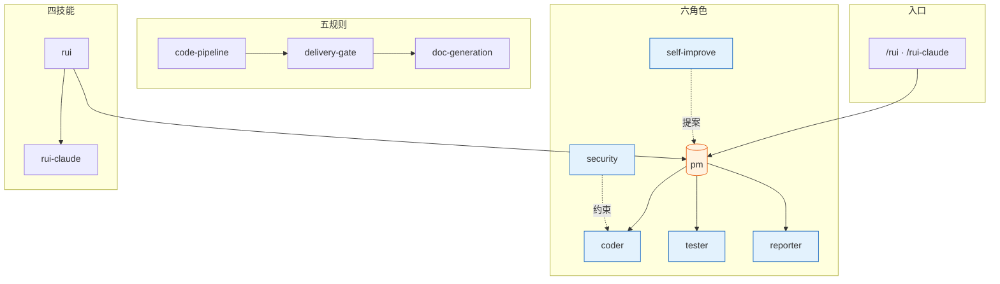
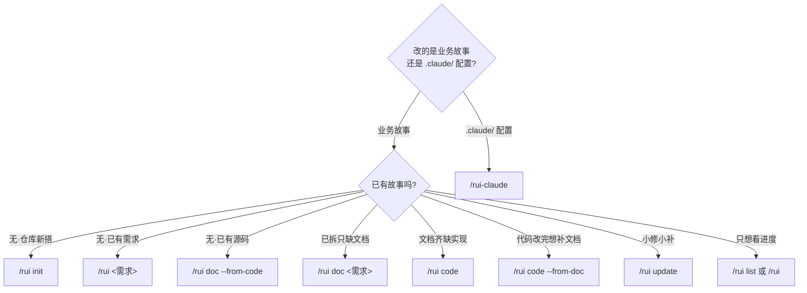

# YrY

> 故事驱动的 SDLC 编排系统 — 需求拆分 → 文档管线 → 代码管线 → 交付。

**YrY** 是 Claude Code 的元插件项目，将软件交付流程固化为 6 个 Agent 协同、5 组规则约束、4 项技能支撑的自动化管线。

## 领域语言

> 理解术语再动手。每术语含 _Avoid_ 别名防止漂移。

**管线 (Pipeline)**:
端到端 SDLC 流程：需求解析→自适应规划→影响分析→架构设计→文档生成→预检→Gate A→实现→Gate B→自改进→交付。每阶段有明确的进入/退出条件。
_Avoid_: workflow, process, 流程

**故事 (Story)**:
管线中单一、独立、可完成的作业单元。一个需求可拆为多个故事，逐个串行通过管线。产出一组编号文档 (01–08)。
_Avoid_: task, ticket, issue

**故事任务面板 (Story Board)**:
`docs/故事任务面板/<Project>/<name>/` 目录。每个故事的所有产物（01–08 文档、附属文档、记忆）内聚在此。
_Avoid_: output directory, doc folder

**Gate A (测试先行门禁)**:
编码前的强制性阻断点。`04-测试用例评审.md` 不存在或未就绪→编码不得开始。单行 CSS/文案为唯一例外。
_Avoid_: test gate, pre-code check

**Gate B (验证收口门禁)**:
编码后的闭合验证。五步检查（环境快照→静态预检→设计对齐→单次执行→三报告）。修复 > 2 轮→阻断。
_Avoid_: verification gate, post-code check

**P0 / P1 / P2 (优先级)**:
P0 = 阻塞发布必修项；P1 = 当轮修复项；P2 = 记录不阻断项。P0 不清零不进下一模块。
_Avoid_: critical / major / minor

**阻断 (Block)**:
管线在当前阶段停止，状态写入 `.memory/rui-state.json`。12 种阻断标识（`skip-gate-a`, `gate-b-limit`, `chain-broken` 等）。阻断≠失败——重跑同命令从中断点续。
_Avoid_: stop, halt, fail

**铁律 (Iron Law)**:
三条不可妥协的规则。违反字母即是违反精神：(1) 验先于称 (2) 溯先于修 (3) 清先于进。
_Avoid_: rule, constraint

**影响链 (Impact Chain)**:
变更点的完整传递依赖图。五步闭合：列变更→选搜索词→全项目搜索→二级传递→标注处置。未闭合 = `chain-broken` 阻断。
_Avoid_: dependency graph, impact analysis

**分支隔离 (Branch Isolation)**:
功能分支 `feat/<Project>-<name>` 从 main 创建。源码改动唯一入口为 `/rui code`。禁止自动合并、派生分支、main 上直接改码。
_Avoid_: feature branch

**反推 (Reverse Inference)**:
只读模式。`--from-code` 从源码反推文档；`--from-doc` 从文档反推源码补充。禁止改源码。
_Avoid_: reverse engineering, backfill

**证据等级 (Evidence Level)**:
A=已验证(附路径) B=可推导(附推导链) C=未验证(标「待补充」) D=幻觉(视为错误)。所有 docs/ 产出必须标注。
_Avoid_: confidence level

**Agent (角色)**:
六大协作角色：pm(决策) coder(实现) tester(质量) reporter(记录) security(安全) self-improve(改进)。每角色有交接信号和验证方式。
_Avoid_: bot, worker, role

**公式 (Formula)**:
结构化文档产出规范。定义章节、表头、字段、约束。分为通用元素 (F.meta/F.nav/F.evidence)、故事主线 (F.story.*)、补充文档 (F.supp.*)。
_Avoid_: template, format

**交付三步 (Delivery Triad)**:
管线末端强制序列：(1) hook-log 追加日志→(2) import-docs 同步文档→(3) wework-bot 发送通知。任一缺失 = 管线未闭合。
_Avoid_: delivery pipeline, post-steps

**自改进 (Self-Improve)**:
D0–D7 诊断循环。采集执行数据→六维评估→生成改进提案→提案闭环保案。`no-metrics` 降级不阻断。
_Avoid_: retrospective, post-mortem

**执行记忆 (Execution Memory)**:
`.memory/execution-memory.jsonl`（追加）+ `.memory/rui-state.json`（覆盖写）。持久化管线状态与执行历史。
_Avoid_: state, log

**项目类型 (Project Type)**:
frontend / backend / fullstack / meta / unknown。决定文档生成矩阵（前端补 03/06，后端补 02/05，全栈全部补）。
_Avoid_: stack type

**需求 (Requirement)**:
`/rui` 的输入：纯文本、`@` 文件引用、或 URL。pm 解析后拆为一组故事。
_Avoid_: input, spec, feature request

**插件 (Plugin)**:
YrY 本身是 Claude Code 插件。元项目——用自身管线管理自身演进。
_Avoid_: extension, addon

### 关系

- 一个 **需求** 拆为一组 **故事**
- 每个 **故事** 顺序通过 **管线** 所有阶段
- **Gate A** 在实现前阻断，**Gate B** 在实现后阻断
- 每个 **Agent** 定义交接信号，下游可验证
- **公式** 驱动文档产出，**证据等级** 约束内容质量
- **交付三步** 是管线收口，三步缺一不可
- **自改进** 从执行记忆采集数据，输出改进提案反馈 pm

### 示例对话

> **PM:** 这个需求涉及前后端变更，应拆为几个**故事**？
> **Coder:** 按**项目类型** fullstack，需补 02-后端评审和 03-前端评审。建议拆为 2 个故事串行。
>
> **Tester:** **Gate A** 测试方案已就绪，04-测试用例评审覆盖了全部 AC。可以放行进入实现。
> **Coder:** 模块 1 审查完成，P0 已清零。模块 2 有一个 P1 需要当轮修复。继续前进？
> **Tester:** P0 清零即可进下一模块，P1 不阻断。继续。
>
> **Reporter:** **Gate B** 五步全部通过。修复 1 轮，在 2 轮限额内。三报告交叉引用闭合。放行交付。
> **PM:** 收到。**交付三步**已执行：日志→同步→通知。管线闭合。

### 已知歧义

- "流程" 曾被同时用于指**管线**(机制)和**交付三步**(收口动作)——已解析：管线是全过程，交付三步是末端收口
- "阻断" 与"降级"易混淆——已解析：阻断 = 管线停止需修复重跑；降级 = 记录标记但不停止前进
- "故事" 与"任务"曾混用——已解析：故事是管线单元，任务是故事内部 §4 的工作拆分
- "公式" 与"模板" 不同——公式是规约(描述 what)，模板是具体文件(描述 how)。本系统只用公式，不依赖模板文件

## 系统全景



## Agent 角色

| Agent | 职责 | 一句话 |
|-------|------|--------|
| `pm` | 决策中枢 | 决定做/不做/延期，串起全部 Agent |
| `coder` | 代码实现 | 逐模块编码，P0 清零方进下一模块 |
| `tester` | 质量卡点 | Gate A 阻编码、Gate B 阻交付 |
| `reporter` | 过程记录 | 三报告交叉闭合 |
| `security` | 威胁建模 | §3 安全约束注入，P0 卡发布 |
| `self-improve` | 持续改进 | 采集执行数据，生成改进提案 |

角色拓扑、证据等级、影响分析、交接信号等共用契约见 [agents/AGENT.md](./agents/AGENT.md)，各角色专项规约见 `agents/<role>.md`。

## SDLC 管线


每阶段产出对应编号文件（01–08），交付时三步 hook 按序执行。管线全貌见 [rules/code-pipeline.md](./rules/code-pipeline.md)，交付闭合见 [rules/delivery-gate.md](./rules/delivery-gate.md)。

## 规则约束

| 规则 | 适用场景 | 核心约束 |
|------|---------|---------|
| `code-pipeline` | 源码改动 | 分支隔离 · Gate A/B · 逐模块清零 · 支撑技术（根因追溯/纵深防御/条件等待/验证门禁/反馈回路/深度模块/垂直切片） |
| `delivery-gate` | 交付阶段 | 三步按序：日志 → 同步 → 通知，缺一不可 |
| `doc-generation` | 文档产出 | 目录命名 · 骨架模板 · 附属数据存放 |
| `self-improve` | 复盘改进 | 数据采集 → 诊断 → 提案，`no-metrics` 降级不阻断 |
| `rui-claude` | .claude/ 管理 | 仅限 `.claude/` · 禁自动 commit/push |

详见 [`rules/`](./rules/)。

## 技能

| 技能 | 命令 | 用途 |
|------|------|------|
| `rui` | `/rui init` · `doc` · `code` · `list` · `update` | 故事驱动 SDLC 主线，含诊断纪律、架构深化、交接纪律 |
| `rui-claude` | `/rui-claude sync` · `retro` · `history` | .claude/ 配置远端同步与复盘 |
| `import-docs` | 自动（hook 触发） | 批量同步故事文档到远端 API |
| `wework-bot` | 自动（hook 触发） | 企微机器人推送管线状态通知 |

详见 [`skills/`](./skills/)。


## 目录结构

```
YrY/
├── agents/                     # 6 个 Agent 角色契约
│   ├── AGENT.md                #   角色拓扑与共用底线
│   ├── pm.md                   #   决策中枢
│   ├── coder.md                #   代码实现
│   ├── tester.md               #   质量卡点
│   ├── reporter.md             #   过程记录
│   ├── security.md             #   威胁建模
│   └── self-improve.md         #   持续改进
├── rules/                      # 5 组跨场景约束规则
│   ├── code-pipeline.md        #   分支隔离 · Gate A/B
│   ├── delivery-gate.md        #   三步 hook
│   ├── doc-generation.md       #   文档生成规范
│   ├── self-improve.md         #   自改进流程
│   └── rui-claude.md           #   .claude/ 管理约束
├── skills/                     # 4 项技能规约
│   ├── rui/                    #   SDLC 编排（SKILL.md · formulas.md · coder.md）
│   ├── rui-claude/             #   .claude/ 配置管理
│   ├── import-docs/            #   文档远端同步
│   └── wework-bot/             #   企微通知
├── docs/
│   ├── adr/                    #   架构决策记录
│   └── 故事任务面板/           #   故事产出目录
│       └── <Project>/<name>/    #   每故事独立子目录 · 00–08 编号文档
│   ├── .claude-plugin/             # 插件注册信息
├── CLAUDE.md                   # AI 协作指令
└── README.md                   # 本文件
```

故事面板的目录骨架、文件矩阵、完整度状态机、数据契约见 [skills/rui/coder.md](./skills/rui/coder.md)。文档公式见 [skills/rui/formulas.md](./skills/rui/formulas.md)。

## 命令速览

两条命令族：`/rui` 管业务故事的 SDLC 主线，`/rui-claude` 管 `.claude/` 配置自身的演进。只读命令（`list`、推荐）不触发末端 hook，其余写入命令末端自动执行三步交付。

### 选哪条命令



### /rui — 业务故事 SDLC

| 场景 | 命令 | 末端 Hook | 说明 |
|------|------|:---:|------|
| 任务推荐 | `/rui` | ✗ | 只读，5 层管线评分排序 |
| 进度全景 | `/rui list` | ✗ | 只读，按文件存在性判定状态 |
| 建立基线 | `/rui init` | ✓ | detect → explore → generate → setup → verify → trigger |
| 端到端 | `/rui <req>` | ✓ | doc + code 自动串联，逐故事串行 |
| 拆需求出文档 | `/rui doc <req>` | ✓ | 拆故事 + 生成 01/02/03/04，不改源码 |
| 实现故事 | `/rui code <name>` | ✓ | Gate A → 逐模块 → Gate B → 复盘 → 交付 |
| 增量更新 | `/rui update <name> [ctx]` | ✓ | T1/T2/T3 自动裁剪 |
| 从源码反推文档 | `/rui doc --from-code [req]` | ✓ | 只读源码，补缺失不覆盖 |
| 从文档反推码 | `/rui code --from-doc <name>` | ✓ | 只读源码补文档，禁止改源码 |

### /rui-claude — .claude/ 配置管理

| 场景 | 命令 | 末端 Hook |
|------|------|:---:|
| 任务推荐 | `/rui-claude` | ✗ |
| 操作历史 | `/rui-claude history [--limit N]` | ✗ |
| 健康复盘 | `/rui-claude retro [--name <story>]` | ✓ |
| 远端同步 | `/rui-claude sync` | ✓ |
| 需求管线 | `/rui-claude <req>` | ✓ |

> ⚠️ `sync` 先 `rm -rf .claude/` 再 rsync，执行前必须确认意图。详见 [rules/rui-claude.md](./rules/rui-claude.md)。

## 不可妥协底线

| 底线 | 触发条件 |
|------|---------|
| 认证不可绕过 | 涉及 auth/token/session — P0 |
| 密钥不落盘 | Token/密钥/凭据禁止出现在源码或配置 |
| 输入必校验 | 用户输入必须验证/转义，XSS/注入为 P0 |

> 完整项目约束见 [CLAUDE.md](./CLAUDE.md)。
