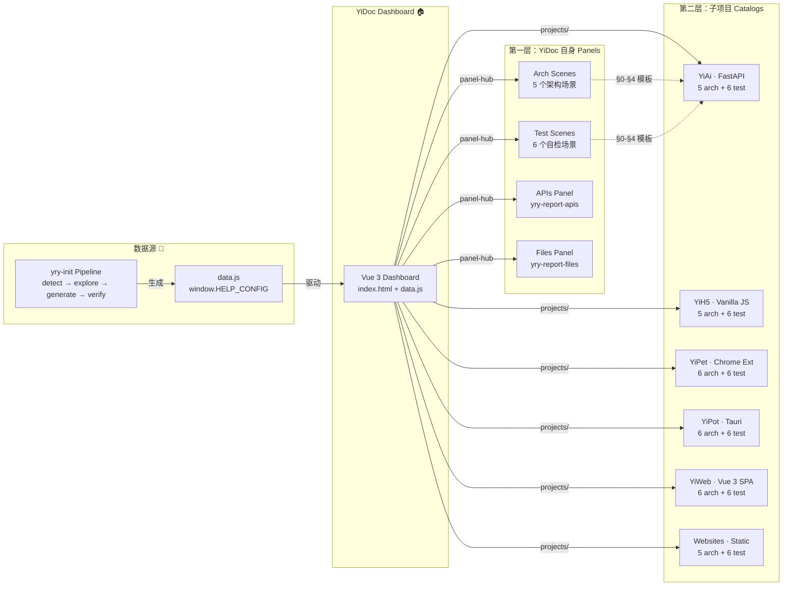
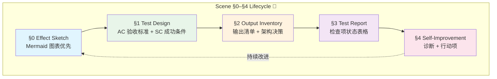

# CLAUDE.md — YiDoc

## Foundational Beliefs

- **Trust the Model** — YiDoc is a pure documentation cascading catalog; every generated artifact is traceable to the yry-init pipeline for its sub-project.
- **Value Attention** — The dashboard visualizes attention through KPI cards, reading progress, and cross-panel navigation to help focus on the highest-impact area first.
- **Verify Reality** — Every arch and test scene links to its source (pipeline output, sub-project data.js), not to a stale copy.
- **Think Before Coding** — State assumptions explicitly; if multiple interpretations exist, present them; if a simpler approach exists, say so.

## Iron Laws

- **Simplicity First** — No features beyond what the dashboard contract requires; no abstractions for single-use components; self-contained Vue 3 inline components avoid CDN fragmentation.
- **Surgical Changes** — When updating a scene's `index.md`, touch only that scene; the dashboard data model (`data.js`) is the single source of truth and must reflect the actual filesystem.
- **Goal-Driven Execution** — Every dashboard interaction (panel switch, scene deep-link, keyboard shortcut) maps to a verifiable goal: find information faster than raw navigation.

## Project Profile

- **Name**: YiDoc
- **Type**: meta / documentation-catalog
- **Version**: 2026-07-21 (continuously regenerated)
- **Architecture**: single — cascading documentation hub
- **Ecosystem**: zero-dependency static site (HTML + CSS + Vue 3 CDN + vanilla JS)
- **Self-hosted**: yes — served directly from the YrY monorepo

## Project Constraints

1. **Dashboard must run without a build step** — all scripts are loaded via `<script>` tags; Vue 3 is the only external CDN dependency.
2. **Every scene** (`arch/` and `test/`) follows the `§0–§4` lifecycle (effect sketch → test design → output inventory → test report → self-improvement).
3. **Sub-project catalogs** (`projects/YiAi/`, `projects/YiH5/`, etc.) are linked, not embedded; their `data.js` and scenes live under their own directories.
4. **Degradation countermeasure**: if a sub-project's `data.js` is missing or malformed, the dashboard renders a "missing report" placeholder card instead of crashing.
5. **Self-constraint**: the YiDoc dashboard data model (`data.js`) is regenerated by the `yry-init` pipeline; manual edits are overwritten on the next `yry-init` run.

## Architecture Pattern — Cascading Documentation Catalog

## Guidance

The YiDoc dashboard is a cascading catalog: every sub-panel (arch, test, apis, files, projects) and every sub-project catalog re-exports a `data.js` model that the Vue 3 dashboard consumes. To navigate:

| Artifact | Path | Machine-readable counterpart |
|----------|------|------------------------------|
| Dashboard data model | `data.js` (root) | `window.HELP_CONFIG` |
| Arch scenes (YiDoc itself) | `arch/scene-*/index.md` | `arch/` flat directory |
| Test scenes (YiDoc itself) | `test/scene-*/index.md` | `test/` flat directory |
| API analysis panel | `apis/data.js` | `window.REPORT_CONFIG` |
| Code health panel | `files/data.js` | `window.REPORT_CONFIG` |
| Sub-project catalogs | `projects/<Project>/data.js` | `window.HELP_CONFIG` per project |
