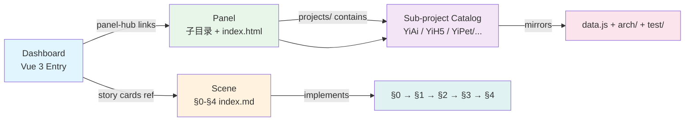

# YiDoc — YrY 项目文档中枢

## System View

```mermaid
graph TB
    subgraph "YrY 生态系统 🌐"
        YIAI[YiAi · Python/FastAPI<br/>AI + RSS + OSS 后端]
        YIH5[YiH5 · Vanilla JS<br/>AI Chat 前端]
        YIPET[YiPet · Chrome Extension<br/>AI 指挥面板]
        YIPOT[YiPot · Tauri Desktop<br/>翻译 + 效率工具]
        YIWEB[YiWeb · Vue 3 SPA<br/>AI 问答界面]
        WEB[Websites · Static HTML<br/>模板集合]
    end

    subgraph "YiDoc 文档中枢 📚"
        DASH[Vue 3 Dashboard<br/>index.html + data.js]
        PANELS[Panels: Arch | Test | APIs | Files | Projects]
        SCENES[85+ Scenes<br/>arch/ + test/ 目录]
    end

    PIPELINE[yry-init Pipeline<br/>detect → explore → generate<br/>→ arch → verify]

    PIPELINE -->|自动生成| YIAI
    PIPELINE -->|自动生成| YIH5
    PIPELINE -->|自动生成| YIPET
    PIPELINE -->|自动生成| YIPOT
    PIPELINE -->|自动生成| YIWEB
    PIPELINE -->|自动生成| WEB

    YIAI -->|data.js| DASH
    YIH5 -->|data.js| DASH
    YIPET -->|data.js| DASH
    YIPOT -->|data.js| DASH
    YIWEB -->|data.js| DASH
    WEB -->|data.js| DASH

    DASH --> PANELS
    PANELS --> SCENES
```

YiDoc is the documentation central hub of the YrY ecosystem, integrating yry-init pipeline reports across 6 sub-projects (YiAi, YiH5, YiPet, YiPot, YiWeb, Websites). Each sub-project contains full detect → explore → generate → arch → verify pipeline outputs, presented through a unified Vue 3 dashboard with cross-panel navigation.

## Command Flow

No build step required. YiDoc is a zero-dependency static site:

```bash
# Start a local server from the YrY monorepo root
cd /Users/yi/YrY
python3 -m http.server 8080
# Open http://localhost:8080/YiDoc/
```

## Quick Start

1. Clone or navigate to the YrY monorepo: `cd /Users/yi/YrY`
2. Start a local HTTP server (see Command Flow above)
3. Open `/YiDoc/` in a browser
4. Use the panel hub toolbar to navigate between Arch, Apis, Files, Test, and Projects panels
5. Keyboard shortcuts: `j`/`k` for section navigation, `/` or `Cmd+K` for command palette

## Project Structure

```
YiDoc/
├── index.html              # Vue 3 dashboard shell
├── index.js                # Vue 3 mount + inline components
├── index.css               # Dashboard chrome + token bridge
├── data.js                 # Dashboard data model (window.HELP_CONFIG)
├── arch/                   # Architecture reference scenes (5)
│   ├── scene-1-module-location/
│   ├── scene-2-asset-flow-tracing/
│   ├── scene-3-newcomer-onboarding/
│   ├── scene-4-dependency-change-impact/
│   └── scene-5-trust-boundary-security-surface/
├── test/                   # Self-check scenes (6)
│   ├── scene-1-post-init-full-self-check/
│   ├── scene-2-pre-commit-incremental-self-check/
│   ├── scene-3-doc-code-consistency/
│   ├── scene-4-security-surface-regression/
│   ├── scene-5-cross-story-integration-regression/
│   └── scene-6-third-party-framework-service/
├── apis/                   # API analysis report panel
│   ├── index.html / index.js / index.css / data.js
│   └── app/ (actions.js, lifecycle.js, mount.js, state.js)
├── files/                  # Code health report panel
│   ├── index.html / index.js / index.css / data.js
│   ├── app/ (actions.js, lifecycle.js, mount.js, state.js)
│   └── references/ (methodology.md, scoring.md)
└── projects/               # 6 sub-project documentation catalogs
    ├── YiAi/               # Python FastAPI backend
    ├── YiH5/               # Vanilla JS H5 SPA
    ├── YiPet/              # Chrome Extension
    ├── YiPot/              # Tauri desktop app
    ├── YiWeb/              # Vue 3 SPA
    └── Websites/           # Static HTML template collection
```

## Domain Language

YiDoc domain terms describe the cascading documentation catalog structure:

- **Dashboard** — the Vue 3 entry page (`index.html`) that renders `data.js` through inline Vue components. It owns the panel hub, section grid, and reading-progress bar.
- **Scene** — a self-contained documentation page following the §0–§4 lifecycle (effect sketch → test design → output inventory → test report → self-improvement). Scenes live under `arch/` or `test/`.
- **Panel** — a sibling sub-directory with its own `index.html`/`data.js` that serves as a specialized report (APIs, Files) or catalog (Projects). Panels are navigated via the `<yry-panel-hub>` toolbar.
- **Story directory** — the collection of scenes under `arch/` (system architecture knowledge) or `test/` (self-check strategy).
- **Sub-project catalog** — a directory under `projects/` (e.g., `YiAi/`, `YiWeb/`) that mirrors the YiDoc structure: its own `data.js`, `arch/`, and `test/`.
- **Cascading catalog** — the property that navigating from the root dashboard → panel → sub-project catalog maintains the same data-model shape (`window.HELP_CONFIG`) at each level.

### Relationships



- Dashboard **links to** Panel (via panel-hub toolbar)
- Dashboard **references** Scene (via section story cards)
- Panel (projects) **contains** Sub-project catalogs (one per YrY project)
- Scene **implements** §0–§4 lifecycle (every `index.md` in arch/ or test/)
- Sub-project catalog **mirrors** YiDoc structure (data.js + arch/ + test/)

### Example Dialogue

> **User**: "I want to understand how YiAi handles API authentication."
> **System**: Navigate to the YiDoc Dashboard → Panel Hub → Projects → select YiAi. The YiAi sub-project catalog shows its arch scenes. Open "Scene 5: Trust Boundary & Security Surface" — it documents YiAi's JWT-based authentication flow, including token issuance, refresh rotation, and middleware enforcement.

### Disambiguation Markers

- **Scene** ≠ 场景 (Chinese translation; "Scene" is the formal English identifier used in the pipeline)
- **Dashboard** ≠ a business analytics tool; it refers specifically to the Vue 3 entry page at `YiDoc/index.html`
- **Panel** ≠ HTML `<panel>` element; it refers to a sub-directory with its own `index.html`
- **Project** ≠ a git repository; in YiDoc, "project" refers to a sub-project catalog under `projects/`
